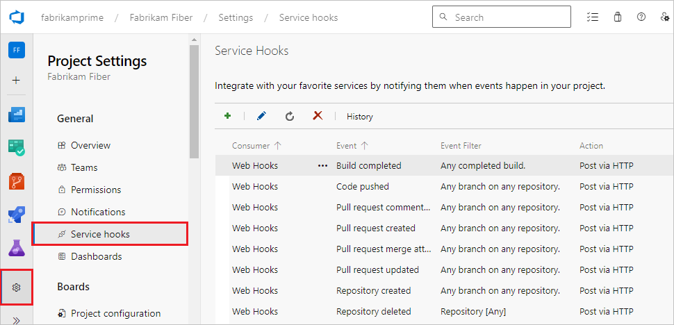
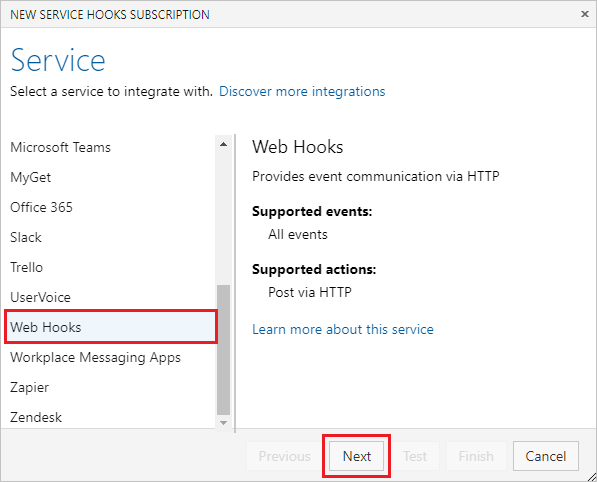

# Webhooks

[!INCLUDE [version-lt-eq-azure-devops](../../includes/version-lt-eq-azure-devops.md)]

This article describes webhooks and how to set them up for your Azure DevOps project. Webhooks provide a way to send a JSON representation of an Azure DevOps event to any service that has a public endpoint.

>[!NOTE]
>Azure DevOps doesn't charge for setting up service hooks or integrating with external services. Refer to the specific service's site for pricing related to their services.

## Prerequisites

You need the following prerequisites to manage webhooks for an Azure DevOps organization:

- **Owner** or **Project Collection Administrator** role in the organization.
- A project in the organization, and a service with a public HTTP or HTTPS endpoint that you want to send Azure DevOps events to.

  >[!IMPORTANT]
  >It's recommended to use only HTTPS endpoints. HTTP has the potential to send private data, including authentication headers, unencrypted in the event payload. You must use HTTPS for basic authentication on a webhook.
- If connecting to a service behind a virtual private network, ensure that Azure DevOps IP addresses are allowed for inbound connections. See [Inbound Connections](../../organizations/security/allow-list-ip-url.md).
  
## Send JSON representation to a service

1. In your Azure DevOps project, go to **Project settings** > **Service hooks** at `https://<organization-name>/<project-name>/_settings/serviceHooks`.

   

1. On the **Service Hooks** page, select the **+** icon or **Create subscription**.

   

1. On the **Service** screen, select **Web Hooks** and then select **Next**.

   

1. On the **Trigger** screen, select and configure the Azure DevOps event you want to trigger the webhook on, and then select **Next**. For more information about the JSON payloads posted by the Azure DevOps consumer, see [Service hooks events](../events.md).

   

1. On the **Action** screen, configure the target **URL** and what to do when the event occurs. For more information about what to enter in **Resource details to send**, **Messages to send**, and **Detailed messages to send**, see [Resource details to send](#resource-details-to-send).

   >[!NOTE]
   >Webhooks can't target localhost (loopback) or special range [IPv4](https://www.iana.org/assignments/iana-ipv4-special-registry/iana-ipv4-special-registry.xhtml)/[IPv6](https://www.iana.org/assignments/iana-ipv6-special-registry/iana-ipv6-special-registry.xhtml) addresses. 

1. Select **Test** to test the service hook subscription.

   

1. When the test completes successfully, close the notification screen, and then select **Finish** on the **Action** screen.

   

1. Now the webhook is set up. Go to the target service to view the JSON representation.

   

>[!TIP]
>You can also create a webhook programmatically. For more information, see [Create a service hook subscription programmatically](../create-subscription.md).

### Resource details to send

The **Resource details to send**, **Messages to send**, and **Detailed messages to send** settings in the **Action** pane control the size of the JSON payload to send. **Resource details to send** controls how much of the resource to send. The default is **All**, but you can also choose to send **Minimal**, which sends only key fields like URL and ID, or **None**.

**None** and **Minimal** are useful in scenarios where the caller doesn't need much or any information about the resource, because it relies on the message or detailed message itself. **None** and **Minimal** are also useful for security reasons. The caller must call back into Azure DevOps Services and go through normal security and permission checks to get more details about the resource.

The following sample JSON shows minimal details about the resource:

```json
   {
       "eventType": "git.push",
       ...
       "messages": {
           "text": "...",
           "html": "...",
           "markdown": "..."
       },
       "detailedMessage": {
           "text": "...",
           "html": "...",
           "markdown": "..."
       },
       "resource": {
           "id": "...",
           "url": "https://...",
           "name": "...",
           "field1:": "..."
       }
   }   
```

## Related content

- [Integrate with service hooks](../overview.md)
- [Service hooks events](../events.md)
- [Create a service hook subscription programmatically](../create-subscription.md)
