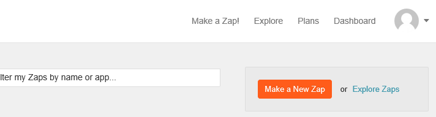
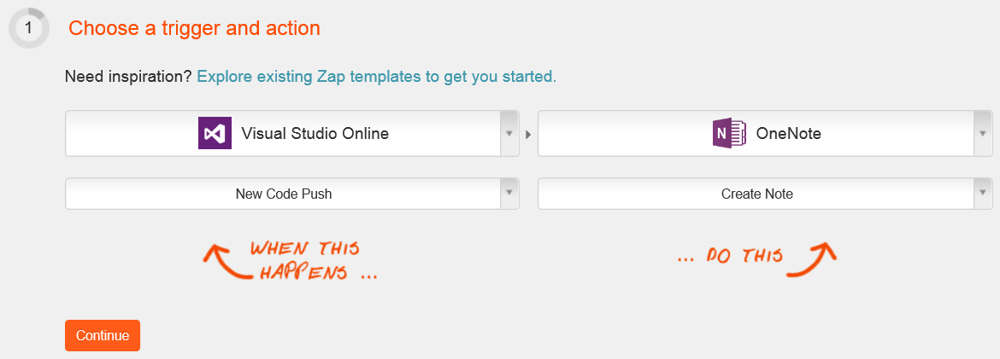
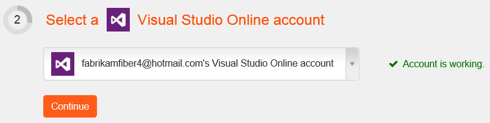
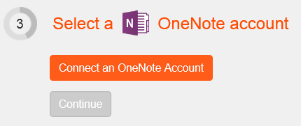
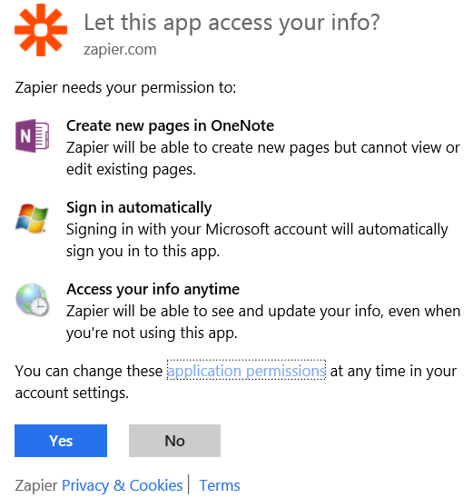
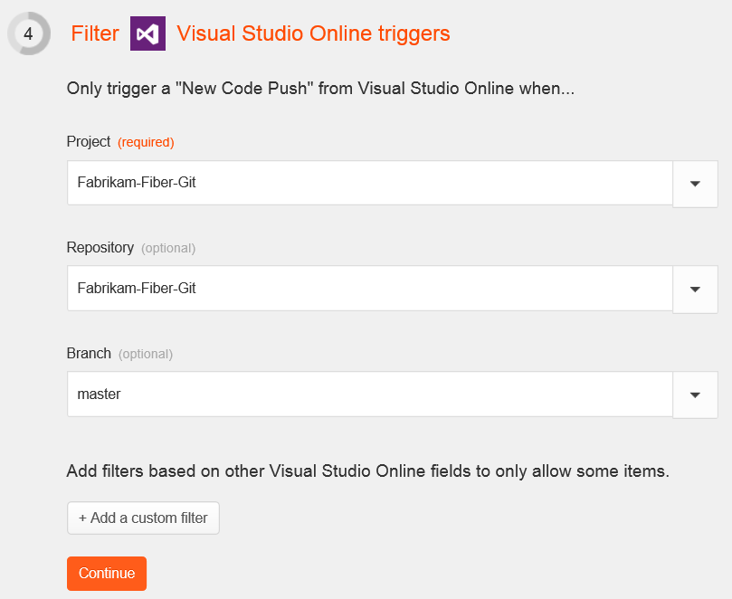
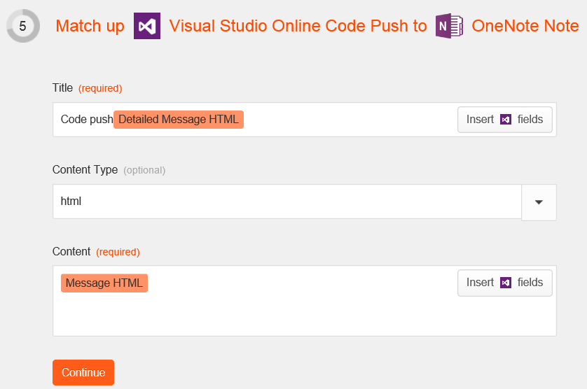
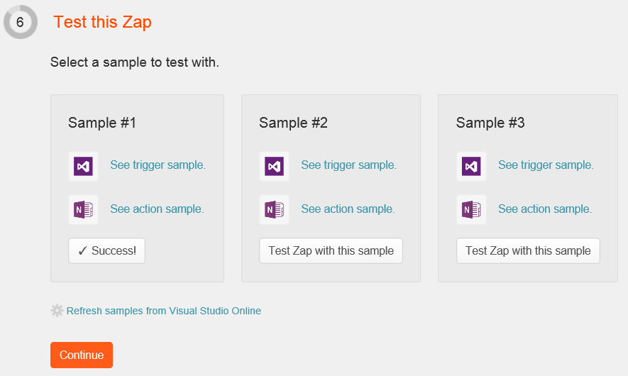

# Zapier with Azure DevOps Services

Use Zapier to connect Azure DevOps Services to other apps for development,
operations, customer connection, sales, marketing and more.
Once you have your Zapier account, just create a zap to send messages
between Azure DevOps Services and those other apps.

## Create a note when code is pushed

Create a zap that responds to an [event](../events.md)
from Visual Studio and triggers an action in another app.
In this case, we create a note in OneNote when code is pushed
to a Git repository in our Azure DevOps Services organization to show how that works.

1. If you don't already have one, [sign up](https://zapier.com/zapbook/visual-studio-online/) for a Zapier account.

2. Create a zap.

   

3. Pick the event in Visual Studio that you want to respond to, and then choose the app that you want to trigger and the action you want that app to take.

   

4. Connect to your organization.

   

5. Connect to the app that will respond to the event.

   

6. Authorize Zapier to access your account's resources.

   

7. You can filter the events coming from Azure DevOps Services for this zap. For example, this zap will only act on code pushes in the master branch of the default repository for this project. Pushes in other projects, other repositories, or other branches of this repository will be ignored by this zap.

   

8. Configure the response to the event in the other app.

   

9. Verify that the zap works.

   

10. Name the zap and turn it on.

   

   Now the zap is set up, you'll get new notes in OneNote each time code is pushed in Azure DevOps Services.

   

## Pricing
Azure DevOps Services doesn't charge for the framework for integrating with external services. Check out the specific service's site
for pricing related to their services. 

## Q & A

<!-- BEGINSECTION class="m-qanda" -->

#### Q: Can Azure DevOps Services take actions based on events from other apps, too.

A: Yes, you can create a zap to post a message to a team room, queue a build, or add a link to a work item in Azure DevOps Services. Just choose Azure DevOps Services as the app that's taking the action instead of raising the event. 

#### Q: Why can't I create a zap?

A: If you are not able to create a zap, make sure that:

- Service hooks are enabled on the organization you are trying to create the zap in.
- You are a project administrator (or have the appropriate service hook management permissions) on the project.

#### Q: Why can't I connect to the Azure DevOps Services service?

A: Verify that you are a project administrator for the Azure DevOps Services project you are attempting to create zaps against.

#### Q: Can I programmatically create subscriptions?

A: Yes, see details [here](../create-subscription.md).

#### Q: Where can I get more information about Zapier?

A: At [Zapier for Azure DevOps Services](https://zapier.com/zapbook/visual-studio-online/).

<!-- ENDSECTION -->