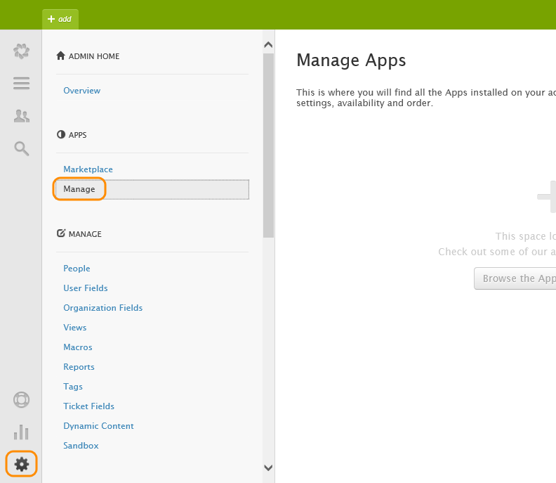
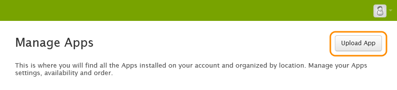
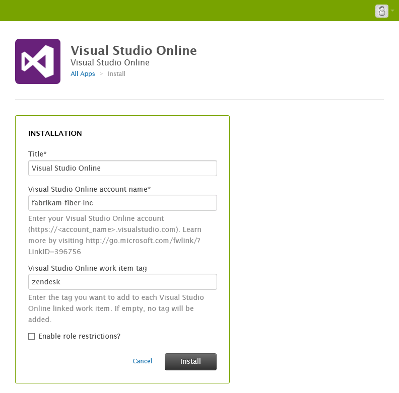
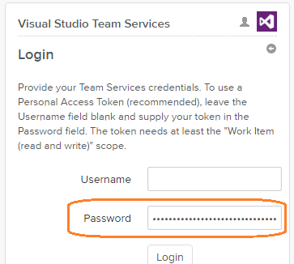
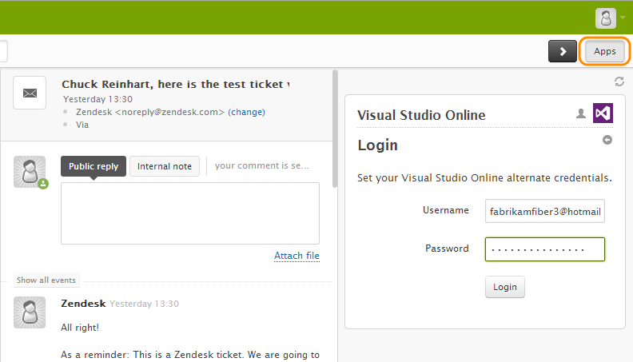
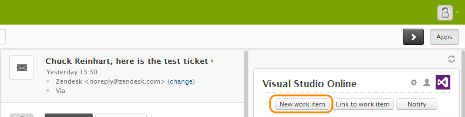
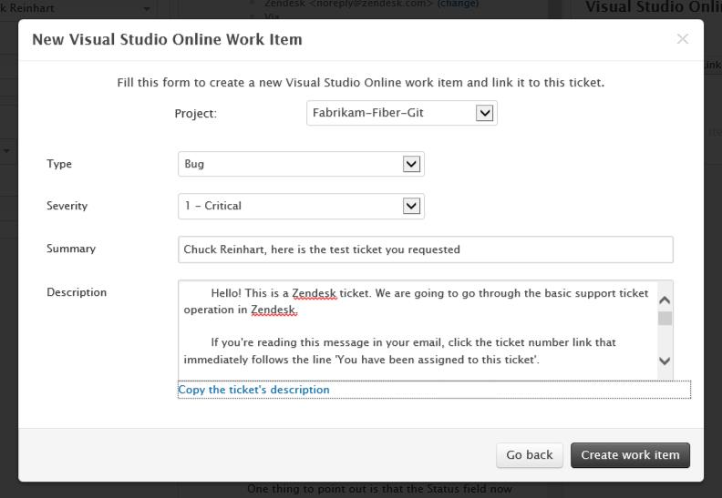
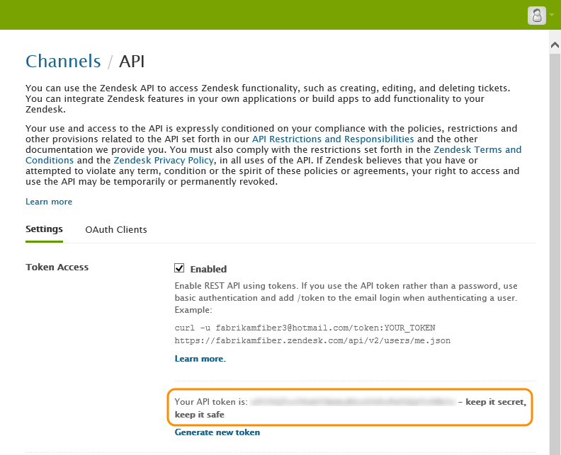
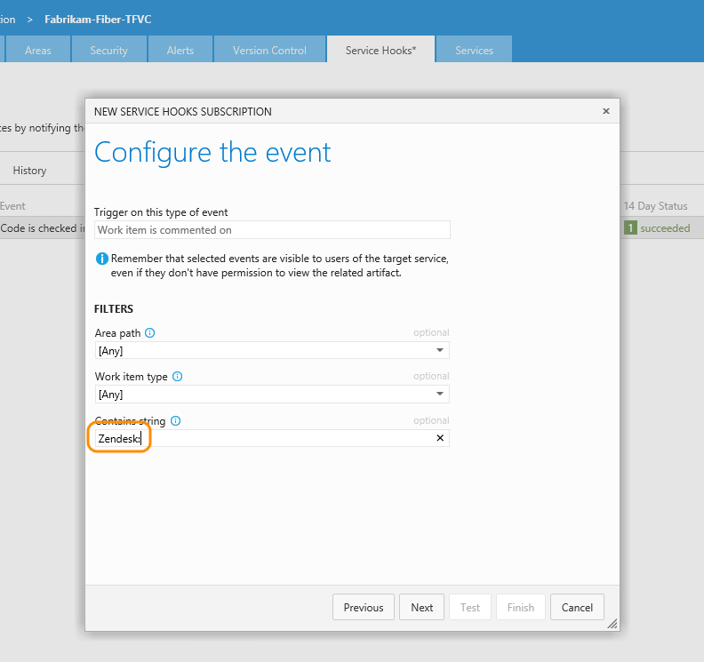
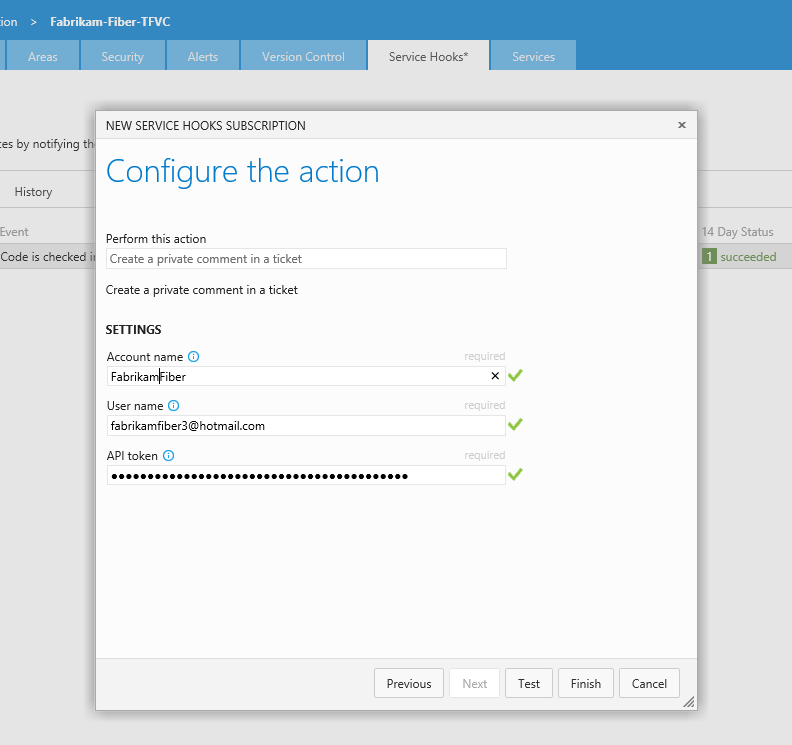

# Zendesk with Azure DevOps Services
   
If you use Zendesk to support your customers, 
you can create work items in Azure DevOps Services directly from your Zendesk tickets.
Then you can configure Azure DevOps Services to update the Zendesk ticket when the work item is updated.

## Install the Azure DevOps Services app for Zendesk

1. Download the .zip file that contains the Azure DevOps Services for Zendesk app from [GitHub](https://github.com/Microsoft/vsts-zendesk-app).

2. If you don't have a Zendesk account, [get one](http://zendesk.com/).

3. Go to your Zendesk administration page to mange your apps.

   

4. Upload the Azure DevOps Services for Zendesk app .zip file

   

5. Install and configure the app

   

   If you use a work item tag, work items you create from Zendesk will have that tag. Later, you can use it to find items that were created from Zendesk.

## Authenticating

Each user of the app must provide credentials so that the Azure DevOps Services app can create and query work items as that user. Creating a personal access token is recommended.

1. Navigate to the Azure DevOps Services organization you associated with your Zendesk account (from step 5 above)

2. Open the profile menu and select Security

    

3. Create a personal access token
   
    

   Suggestions:

   * Give the token a recognizable name so you can find it later if you need to revoke it or check its expiration date
   * Scope the token to the organization associated with Zendesk
   * Limit to at least **Work item (read and write)**

4. Copy the token and paste it into the **Password** field of the Azure DevOps Services app in Zendesk

   

   * If you are running version 0.5.0 or higher of the app, you do not need to specify a Username. Otherwise, supply any value into the Username field (for example "**me**").

## Create a work item from Zendesk

1. Go to a ticket in Zendesk and log in to the Azure DevOps Services for Zendesk app.

   

2. Add a work item to Azure DevOps Services based on this ticket.

   

3. Create the work item.

   

4. Open the work item in Azure DevOps Services directly from Zendesk.

   

   In Azure DevOps Services, the work item is tagged with the tag you set up , and it's linked back to the ticket in Zendesk.

   

## Configure Azure DevOps Services to update Zendesk tickets

Close the loop by configuring Azure DevOps Services to update the Zendesk tickets whenever there's a change in the work items that were created from Zendesk.

1. Go to the your Zendesk API administration page.

   

2. Enable token access and copy your token.

   

0. Go to your Azure DevOps Services project service hooks page: `https://dev.azure.com/{orgName}/{project_name}/_apps/hub/ms.vss-servicehooks-web.manageServiceHooks-project`

	

	Click **Create Subscription**.

5. Start configuring Zendesk.

   

6. Use the **Work item is commented on** event.
You can filter for comments, too.
For example, you can only act on comments that contain the string "Zendesk:"
and only those comments will be reflected back to Zendesk.

   

7. Configure the action that Zendesk will take in response to that event. This is where you provide the Zendesk access token.

   

> [!NOTE]    
	The Zendesk documentation states to append the User name with "/token". Do NOT include this on the User name as the integration already accounts for this.

Now when you comment on the work item, a private comment will be added to the Zendesk ticket.

## Pricing
Azure DevOps Services doesn't charge for the framework for integrating with external services. Check out the specific service's site
for pricing related to their services. 

## Q & A

<!-- BEGINSECTION class="m-qanda" -->

#### Q:  Why do I keep getting prompted for a user name and password?

A: If you supplied a Personal Access Token (recommended) in the login panel of the app, make sure the token is scoped either to "all accessible organizations" or to the specific organization configured in the app's settings. To open the app settings from Zendesk go to Settings > Apps > Manage.

Also make sure the token has not expired and that it has the **Work items (read and write)** scope.

For more details, see the Authenticating section above or the [Authenticate access with personal access tokens](../../organizations/accounts/use-personal-access-tokens-to-authenticate.md?toc=/azure/devops/organizations/accounts/toc.json&bc=/azure/devops/organizations/accounts/breadcrumb/toc.json) topic.

#### Q: Can I programmatically create subscriptions?

A: Yes, use the [REST APIs](../create-subscription.md).

<!-- ENDSECTION -->
