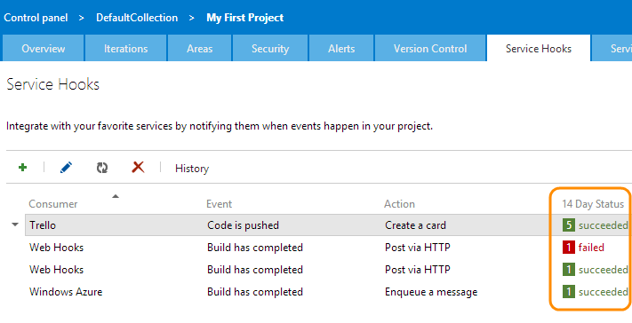

# Troubleshoot a service hooks issue

## View activity and debug problems

The **Service Hooks** page in the web access admin shows your recent activity (last 14 days)
for each subscription, and whether a subscription is enabled, disabled, or restricted.

Detailed history about a subscription can be accessed,
as well as detailed request/response data
(useful for debugging a problematic service or subscription).

::: moniker range=">= azure-devops-2019"

1. To view the activity and status of your subscriptions,
go to the Service Hooks page. 

   
   
2. To view detailed activity for a subscription, including full request, response,
and event payload data, select a subscription in the table and click **History**.

   

::: moniker-end

::: moniker range=">= tfs-2017 < azure-devops-2019"

1. To view the activity and status of your subscriptions,
go to the Service Hooks page. 

   

2. To view detailed activity for a subscription, including full request, response,
and event payload data, select a subscription in the table and click **History**.

   

::: moniker-end

## Subscription failures and probation (restricted)

### Failure types
Failures from a Service Hooks notification can be grouped into three categories:

* Terminal Failures
* Transient Failures
* Enduring Failures.

#### Terminal Failures
The only Terminal Failure is HTTP Status Code 410 (Gone). When a subscription sees a Terminal Failure, it's automatically disabled no matter its prior status.

#### Transient Failures
When a subscription sees a Transient Failure, it will attempt to resend the notification up to eight times, with an increasing delay between each attempt.

#### Transient Failures include

* 408 (Request Timeout)
* 502 (Bad Gateway)
* 503 (Service Unavailable)
* 504 (Gateway Timeout)

#### Sequence of retries for transient failures
Before retry 1: wait ~1 second <br>
Before retry 2: wait ~2 seconds (total delay of 3 seconds)<br>
Before retry 3: wait ~4 seconds (total delay of 7 seconds)<br>
Before retry 4: wait ~8 seconds (total delay of 15 seconds)<br>
Before retry 5: wait ~16 seconds (total delay of 31 seconds)<br>
Before retry 6: wait ~32 seconds (total delay of 63 seconds)<br>
Before retry 7: wait ~60 seconds (max backoff time, total delay of 123 seconds)<br>
Before retry 8: wait ~60 seconds (max backoff time, total delay of 183 seconds)

If the notification exhausts all of its retries, and continues to see a Transient Failure for each attempt, the subscription will stop trying to send the notification, and will treat the notification as if it saw an Enduring Failure.

#### Enduring Failures
Enduring Failures include all other HTTP failure codes (for example: 404 (Not Found), 500 (Internal Server Error), and so on).

When a subscription sees an Enduring Failure, it's placed on probation.*

### Probation
While on probation, a subscription will be limited in the number of notifications it can send. If the subscription continues to hit Enduring Failures, then it will be increasingly limited, and eventually disabled. If the subscription receives a successful response while on probation, it will be restored to a fully enabled state.

#### Sequence of 7 maximum retries while subscription is on probation
Before retry 1: wait ~20 minutes <br>
Before retry 2: wait ~40 minutes (total probation time of 1 hour)<br>
Before retry 3: wait ~1 hour 20 minutes (total probation time of 2.33 hours)<br>
Before retry 4: wait ~2 hours 40 minutes (total probation time of 5 hours)<br>
Before retry 5: wait ~5 hours 20 minutes (total probation time of 10.33 hours)<br>
Before retry 6: wait ~10 hours 40 minutes (total probation time of 21 hours)<br>
Before retry 7: wait ~15 hours (max backoff time, total probation time of 36 hours)<br>

After 7 retries, the subscription status will be set to _DisabledBySystem_ if notifying the consumer fails.

## FAQs

<!-- BEGINSECTION class="m-qanda" -->

#### Q: What does the status Enabled (restricted) mean? 

A: A subscription becomes restricted if too many failures occur. Enabled (restricted) is the same as being on probation.

#### Q: What does the status Disabled (due to failures) mean?

A: A subscription is automatically disabled after a series of consecutive failures over a prolonged period or a _terminal failure_ is encountered.  _Transient failures_ types are retried several times before being declared a failure.  _Enduring failure_ types aren't retried.  The following are examples of each type of failure.
* Transient: 408 (Request Timeout), 502 (Bad Gateway), 503 (Service Unavailable), 504 (Gateway Timeout)
* Terminal: 410 (Gone)
* Enduring: All failures that are not transient or terminal

#### Q: What does the status Disabled (user left project) mean?

A: The user who created the subscription is no longer a member of the team.


#### Q: What should I try if a service hook isn't working? 

A: Check these things:

- Confirm the subscription is enabled.

- Confirm the subscription settings are correct (both event filters and actions).

- Look at the History, especially if there are failures.

#### Q: Can I grant a regular project user the ability to view and manage service hook subscriptions for a project? 

A: Use tfssecurity.exe from the command line, for example:

```
    tfssecurity /a+ /collection: https://dev.azure.com/fabrikam-fiber-inc/DefaultCollection ServiceHooks PublisherSecurity/abcdef00-abcd-0000-0000-abcdef000000 EditSubscriptions n:fabrikamfiber4@hotmail.com ALLOW
```

**Note:** The GUID represents the project ID, which can be retrieved using the [Projects](/azure/devops/integrate/previous-apis/tfs/projects) REST API.

#### Q: Can I programmatically create subscriptions? 

A: Yes, use [REST APIs](./create-subscription.md).

<!-- ENDSECTION -->