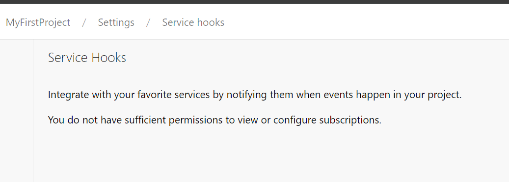
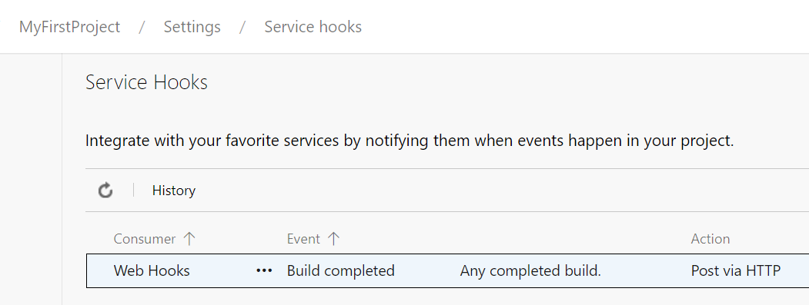

# Set View permission for a group in Service Hooks
[!INCLUDE [version-lt-eq-azure-devops](../includes/version-lt-eq-azure-devops.md)]

By default, only Project Administrators have _View_ or _Edit_ permissions. To grant these permissions to other users directly, you can use the [command line tool](../organizations/security/manage-tokens-namespaces.md) or the [Security](/rest/api/azure/devops/security/) REST API. 



The `ServiceHooks` security namespace ID is defined under [List Security Namespaces](../organizations/security/manage-tokens-namespaces.md#list-security-namespaces) as `cb594ebe-87dd-4fc9-ac2c-6a10a4c92046`

## Prerequisites
1. Install Azure CLI to run `az devops` command. [How to install the Azure CLI](/cli/azure/install-azure-cli)
2. [Create a personal access token (PAT)](../organizations/accounts/use-personal-access-tokens-to-authenticate.md) for your Azure DevOps profile. Ensure you're a member of **Project Collection Administrator (PCA)** group. 
    - Identity (Read)
    - Graph (Read)
    - Security (Manage) 
3. Sign in to Azure DevOps with `az devops login`. If you don't have the `az devops` extension, install it.
    ```
    > az devops login
    The command requires the extension azure-devops. Do you want to install it now? The command will continue to run after the extension is installed. (Y/n): Y
    ```

4. You can define your organization as default organization. Otherwise, define `--org "https://dev.azure.com/{organization}"` for each command.
    ```
    az devops configure --defaults organization="https://dev.azure.com/{organization}"
    ```

5. Check if you can see list of permissions for your organization.
    ```
    az devops security permission namespace list --org "https://dev.azure.com/{organization}"
    ```

## Read group identity and permission token

1. Find your group identity descriptor.
    ```
    > az devops security group list --project ac515e82-560c-4af8-845b-9f7f968d8e7b --output table

    Name                                             Descriptor
    -----------------------------------------------  --------------------------------------------------------------------------------------------------------------------------------------------------
    [TEAM FOUNDATION]\EntraServiceHooksRead          aadgp.Uy0xLTktMTU1MTM3NDI0NS0xMjA0NDAwOTY5LTI0MDI5ODY0MTMtMjE3OTQwODYxNi0zLTM5NTQxNzM3ODYtMTUyMTA4MTkyNS0yNTQwNTA4MjYzLTMzNDgxNjQxNjg
    ```
    If you want to filter by group name, you can use `findstr` or `grep` command depends on your command prompt.

2. Get permission token.
    ```
    > az devops security permission list --id cb594ebe-87dd-4fc9-ac2c-6a10a4c92046 --subject <Group or user descriptor> --output table

    Token                                                   Effective Allow    Effective Deny
    ------------------------------------------------------  -----------------  ----------------
    PublisherSecurity                                       0                  0
    PublisherSecurity/ac515e82-560c-4af8-845b-9f7f968d8e7b  0                  0
    ```

## Update read permission for service hooks

1. List of possible permissions that you can define for `--allow-bit`.
    - View Subscriptions
    - Edit Subscription
    - Delete Subscriptions
    - Publish Events

    ```
    > az devops security permission namespace show --id cb594ebe-87dd-4fc9-ac2c-6a10a4c92046

    [
      {
        "actions": [
          {
            "bit": 1,
            "displayName": "View Subscriptions",
            "name": "ViewSubscriptions",
            "namespaceId": "cb594ebe-87dd-4fc9-ac2c-6a10a4c92046"
          },
          {
            "bit": 2,
            "displayName": "Edit Subscription",
            "name": "EditSubscriptions",
            "namespaceId": "cb594ebe-87dd-4fc9-ac2c-6a10a4c92046"
          },
          {
            "bit": 4,
            "displayName": "Delete Subscriptions",
            "name": "DeleteSubscriptions",
            "namespaceId": "cb594ebe-87dd-4fc9-ac2c-6a10a4c92046"
          },
          {
            "bit": 8,
            "displayName": "Publish Events",
            "name": "PublishEvents",
            "namespaceId": "cb594ebe-87dd-4fc9-ac2c-6a10a4c92046"
          }
        ],
        "dataspaceCategory": "Default",
        "displayName": "ServiceHooks",
        "elementLength": -1,
        "extensionType": null,
        "isRemotable": true,
        "name": "ServiceHooks",
        "namespaceId": "cb594ebe-87dd-4fc9-ac2c-6a10a4c92046",
        "readPermission": 1,
        "separatorValue": "/",
        "structureValue": 1,
        "systemBitMask": 0,
        "useTokenTranslator": true,
        "writePermission": 7
      }
    ```

2. Set _View_ access for the group. View ServiceHooks Subscriptions equals 1 for `--allow-bit`.
    ```
    > az devops security permission update --namespace-id cb594ebe-87dd-4fc9-ac2c-6a10a4c92046 --subject <Group or user descriptor> --token PublisherSecurity/ac515e82-560c-4af8-845b-9f7f968d8e7b --allow-bit 1

    [
      {
        "acesDictionary": {
          "Microsoft.TeamFoundation.Identity;S-1-9-1551374245-1204400969-2402986413-2179408616-3-3954173786-1521081925-2540508263-3348164168": {
            "allow": 1,
            "deny": 0,
            "descriptor": "Microsoft.TeamFoundation.Identity;S-1-9-1551374245-1204400969-2402986413-2179408616-3-3954173786-1521081925-2540508263-3348164168",
            "extendedInfo": {
              "effectiveAllow": 1
            },
            "resolvedPermissions": [
              {
                "bit": 1,
                "displayName": "View Subscriptions",
                "effectivePermission": "Allow",
                "name": "ViewSubscriptions"
              }
            ]
          }
        },
        "includeExtendedInfo": true,
        "inheritPermissions": true,
        "token": "PublisherSecurity/ac515e82-560c-4af8-845b-9f7f968d8e7b"
      }
    ]
    ```

3. Get permission token to see your changes.
    ```
    > az devops security permission list --id cb594ebe-87dd-4fc9-ac2c-6a10a4c92046 --subject <Group or user descriptor> --output table

    Token                                                   Effective Allow    Effective Deny
    ------------------------------------------------------  -----------------  ----------------
    PublisherSecurity                                       0                  0
    PublisherSecurity/ac515e82-560c-4af8-845b-9f7f968d8e7b  1                  0
    ```

The following example shows that the user can see the service hooks subscriptions.



## Reset all Service Hooks permissions of a group

- If you need to reset all Service Hooks permissions of a group or user, you can call `reset-all`.

    ```
    > az devops security permission reset-all --id cb594ebe-87dd-4fc9-ac2c-6a10a4c92046 --subject <Group or user descriptor> --token PublisherSecurity/ac515e82-560c-4af8-845b-9f7f968d8e7b

    Are you sure you want to reset all explicit permissions for this user/group and token? (y/n): Y
    true

    > az devops security permission list --id cb594ebe-87dd-4fc9-ac2c-6a10a4c92046 --subject <Group or user descriptor> --output table
    Token                                                   Effective Allow    Effective Deny
    ------------------------------------------------------  -----------------  ----------------
    PublisherSecurity                                       0                  0
    PublisherSecurity/ac515e82-560c-4af8-845b-9f7f968d8e7b  0                  0
    ```

- The following example shows that the user can't view to service hooks subscriptions after the permission gets reset.

    

