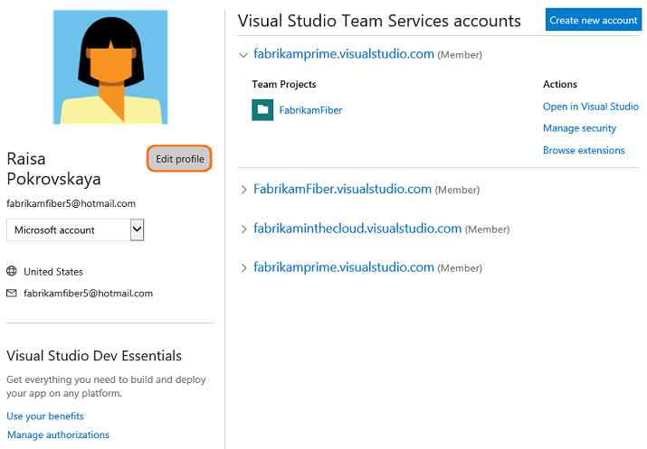

#Set your account preferences

**Team Services | TFS 2015**

From your profile page, you can change your picture or other account preferences. Specifically, you can set the following:  

Profile

<ul style="padding-left:20px">
<li style="margin-bottom:2px">Your picture</li>
<li style="margin-bottom:2px">Your display name</li>
<li style="margin-bottom:2px">Your preferred email</li>
<li style="margin-bottom:2px">Locale settings: Language, date and time pattern, time zone, and user interface theme</li>
</ul>

Security

<ul style="padding-left:30px">
<li style="margin-bottom:2px">[Personal access tokens](../setup-admin/team-services/use-personal-access-tokens-to-authenticate.md)</li>
<li style="margin-bottom:2px">[Alternate authentication credentials](../git/auth-overview.md#alternate-credentials)</li>
<li style="margin-bottom:2px">[OAuth authorizations](../integrate/get-started/Authentication/oauth.md)</li>
<li style="margin-bottom:2px">[SSH public keys](../git/use-ssh-keys-to-authenticate.md)</li>

</ul>
 

Personal alerts and notifications

<ul style="padding-left:30px">
<li style="margin-bottom:1px">[Manage personal notifications](../collaborate/manage-personal-notifications.md) (Team Services, TFS 2017.1)</li>
<li style="margin-bottom:2px">[Set personal alerts](#alerts) (TFS 2015, TFS 2017)</li>
</ul>

New navigation

<ul style="padding-left:30px">
<li style="margin-bottom:2px">[Enable or disable Account Landing pages](../connect/work-web-portal.md#admin-context) (TFS 2017.1)</li>
</ul>

Use personal alerts and notifications to receive email notifications when changes are made to the following objects: 

<ul style="padding-left:30px">
<li style="margin-bottom:2px">Changes to work items</li>
<li style="margin-bottom:2px">Code check ins</li>
<li style="margin-bottom:2px">Build completions</li>
<li style="margin-bottom:2px">Commits</li>
<li style="margin-bottom:2px">Pull requests</li>
</ul>

## Set preferences (Team Services)   

To change your your account information, open your account menu.  

  

From the Profile/Information page, click Edit to change the picture, display name, or preferred email. Open the Preferences page to change a locale preference.  

<!---

-->
  

## Set preferences (TFS)    

  

Click edit to change a setting. Choose the Locale tab to change a locale preference.  

