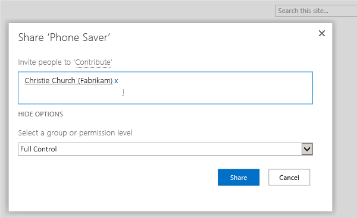

# Add administrators to Team Services and TFS

<b>Team Services | TFS 2017 | TFS 2015 | TFS 2013</b>

Administrators in Team Services and TFS exist at three levels:
the team, the team project, and the team project collection.
In TFS, there are also server-level administrators.

Here's what you need to do to make someone an administrator at each of those levels.

## Server

> This section does not apply to Team Services.

To perform system maintenance, schedule backups, add functionality, and do other tasks,
TFS server administrators must be able to configure and control all aspects of TFS.
As a result, TFS server administrators require administrative permissions
in the software that TFS interoperates with,
in addition to TFS itself.

You can quickly grant these permissions to administrators by adding them to the **Team Foundation Administrators**
group in Team Foundation Server (TFS).

1.  On the application-tier server, add the user to the local Administrators group.

    

2.  In the TFS administration console and add the user to the set of users who can run the administration console.

    

    If you're running a standard single-server deployment,
	or a multi-server deployment without SharePoint or reporting, that's it!
	However, if you have multiple application tiers,
	you'll need to repeat these two steps on every application tier server.
	And if you have SharePoint or reporting on other servers,
	you might need to manually add administrative users to those products separately.

	### SharePoint

	1.  On the server that's running SharePoint Products, open SharePoint Central Administration.

	2.  Grant permissions that are appropriate for this user at the farm or the Web application level,
		depending on your security needs.

		For optimum interoperability, consider adding users of the **Team Foundation Administrators** group
		to the following groups in SharePoint Products:

		-   **Farm Administrators**

		-   **Site Collection Administrators** group for all site collections that the deployment of Team Foundation Server uses

		

	### Reporting Services

	2.  Go to `http://{ReportServer}/Reports/Pages/Folder.aspx`, where {ReportServer} is the name of the server
		that's running Reporting Services.

		> If you are using a named instance, include its name in the path of the reports, like this:
		> `http://{ReportServer}/Reports_{InstanceName}/Pages/Folder.aspx`

	3.  Choose **Folder Settings**, and then choose **New Role Assignment**.

	4.  Add the account name of the user or group to whom you want grant administrative permissions
		and grant them membership in the Team Foundation Content Manager role.

		

### Q & A

#### Q: Who should I add to the administrator role in TFS?

**A:** Administrators maintain at least one server that is running Team Foundation Server, and they administer permissions and security for other roles at the server level and at the level of team project collections. You'll need at least one administrator for your deployment. Depending on your availability needs, you might need to add more administrators to help ensure that there is someone available to perform administrator-level tasks on short notice.

For example, you need to add someone as an administrator if that person is expected to perform one or more of the following tasks:

-   Create or delete team project collections  
-   Back up TFS  
-   Change access levels
-   Administer the reporting warehouse  
-   Change SharePoint Web applications used by TFS  
-   View and edit server-level permissions  
-   Trigger alert events

#### Q: What are the optimal permissions needed to administer TFS across all its components and dependencies?

**A:** Optimally, an administrator for TFS must be a member of the following groups or have the following permissions:

-   Team Foundation Server: **Team Foundation Administrators** or have the appropriate [server-level permissions](permissions.md#server) set to **Allow**.  
-   Windows: the local **Administrators** group on the server that is running the administration console for Team Foundation. The administration console requires administrative permissions to operate correctly.  
-   SharePoint Products: the appropriate groups or permissions in SharePoint Central Administration. Depending on your deployment configuration and security requirements, you might not need to add the user to any groups in SharePoint Products. For optimum interoperability, consider adding them to the following SharePoint Products groups:  
    -   **Farm Administrators**  
    -   **Site Collection Administrators** group for all site collections that are used by the deployment of Team Foundation Server.  
-   Reporting Services: **Team Foundation Content Manager** and either **sysadmin** or the **db\_owner** group membership for the configuration database, the reporting and analysis databases, and the databases for team project collections.  
-   SQL Server: **sysadmin** and **serveradmin** for all databases that TFS uses.

#### Q: Is there more than one way of granting administrator permissions in TFS?

**A:** Yes. You can grant administrative permissions for Team Foundation Server in two ways: from the administrative console or directly through each program for which you want to grant permissions. Granting permissions through the administrative console is simpler but has some requirements. Consider using the administrative console when all of the following conditions are true:

-   Your deployment of Team Foundation Server is in a trusted environment where the service account for Team Foundation Server has permissions in SharePoint Products and SQL Server Reporting Services.  
-   All programs are running on the same computer (a single-server deployment).  
-   The security requirements for your deployment do not restrict granting one or more of the permissions in the next bulleted list.

By default, adding users from the administration console grants them membership in the following groups in a single-server deployment of Team Foundation Server:

-   **Team Foundation Administrators** group in Team Foundation Server  
-   The **IIS\_IUSRS** and **TFS\_APPTIER\_SERVICE\_WPG** groups in Internet Information Services (IIS)  
-   The **Content Manager** role in SQL Server Reporting Services, if reporting is configured  
-   The **Farm Administrators** group in SharePoint Products, if the deployment is configured to use SharePoint Products  
-   The **DBO** role and **TFSExecRole** for all databases that Team Foundation Server uses, including collection databases

>**Important:**  
>You cannot add a user to the local **Administrators** group by adding that user's account as a console user. You must manually add the user to that group before that user will have all the permissions that are required to open and use the console. In addition, if you want the user to have sufficient permissions to create a database as part of creating a team project collection, you must grant that user membership in the **sysadmin** role in SQL Server.

Granting permissions directly in each program in your deployment of Team Foundation Server is more time-consuming, but you can precisely configure the exact permissions that you want to grant to a user. Consider granting permissions directly in each program when any of the following conditions are true:

-   Your deployment of Team Foundation Server is a multiple-server deployment.  
-   Your deployment is in an environment that has security restrictions between Team Foundation Server and the servers that are running SQL Server and SharePoint Products.  
-   You want to configure different group memberships and permissions levels in SharePoint Products, SQL Server Reporting Services, and Team Foundation Server than those that are automatically granted from the administrative console. 

#### Q: I'm an admin, but I don't seem to have all the permissions I need to add a TFS administrator. What else might I need?

**A:** These are the required permissions:

-   **Team Foundation Administrators **group or have the **View instance-level information** and **Edit instance-level information** permissions set to **Allow**.  
-   If you want to add permissions for SQL Server Reporting Services, the **Team Foundation Content Managers** group or the **System Administrators** group.  
-   If you want to add permissions for SharePoint Products, the **Farm Administrators** group, the administrators group for the Web application that supports Team Foundation Server, or the **SharePoint Administration** group. Group membership will depend on the security architecture of your deployment and the group or groups to which you want to add the user.  
-   The **sysadmin** role in SQL Server on each server that hosts databases for Team Foundation Server.

>**Important:**  
>To perform administrative tasks that involve database changes, such as creating team project collections, your user account requires administrative permissions, and the service account that the Team Foundation Background Job Agent uses also must have certain permissions granted to it. For more information, see [Service accounts and dependencies](tfs/admin/service-accounts-dependencies-tfs.md).

#### Q: What are the minimum permissions required for TFS to connect to SQL Server?

**A:** To install, upgrade, and configure TFS, the user running the Team Foundation Administration console requires the following permissions and role memberships.

-   Membership in the **serveradmin** server role  
-   **ALTER ANY LOGIN**, **CREATE ANY DATABASE**, and **VIEW ANY DEFINITION** server scoped permissions  
-   **CONTROL** permission on the **master** database.

If the user  doesn't have these permissions and role memberships, TFS configuration operations will be blocked. When you add a user to the Administration Console Users group through the Team Foundation Server Administration Console, TFS attempts to grant these permissions and role memberships. 

#### Q: Why are SQL Server permissions and memberships required?

**A:** Installing, upgrading, and configuring TFS involves a complex set of operations that require a high degree of privilege. These operations may include creating databases, provisioning logins for service accounts, and more. To ensure successful install, upgrade, and configuration, TFS checks that permissions are correctly assigned to ensure that the various operations can be done successfully. Even performing these checks requires a high degree of privilege. As such, these permissions and role memberships are required and cannot be bypassed.

#### Q: Can SQL Server permissions and role memberships be revoked after TFS is installed or upgraded?

**A:** Yes, as long as TFS service accounts are allocated the required permissions and role memberships as described in [Service accounts and dependencies](tfs/admin/service-accounts-dependencies-tfs.md). Administrators only require permissions and role memberships described above when they need to install, upgrade, or configure TFS.

#### Q: Where can I find more information about each individual TFS permission?

**A:** See [Permissions and groups reference](./permissions.md).

## Project collection

In TFS and Team Services, each team project collection is its own grouping
of projects that can share reports, work items, and other items, all stored in a single database.
Project collection administrators maintain the collection and administer permissions and security
for other roles at the collection level.

1.  Open the web portal and switch to administration mode by choosing the gear icon .

2.  Navigate to security at the collection level, and add a member to **Project Collection Administrators**.

    

### SharePoint

If your deployment is integrated with SharePoint Products,
add team project collection administrators to the site collection administrators group in SharePoint Products.

1.  Open SharePoint Central Administration.

2.  Grant permissions that are appropriate for this user at the farm or the Web application level, depending on your security needs.

    For optimum interoperability, consider adding users of the **Project Collection Administrators** group to the **Site Collection Administrators** group in SharePoint Products.

    

### Reporting Services

If your deployment is integrated with Reporting Services,
add team project collection administrators to the Team Foundation Content Manager group
in SQL Server Reporting Services.

1.  Open Internet Explorer running as an administrator.

2.  In the Address bar, specify the following URL, where *ReportServer* is the name of the server that is running Reporting Services: **http://***ReportServer***/Reports/Pages/Folder.aspx**

    >**Important:**
    >  If you are using a named instance, you must include its name in the path of the reports. You use the following syntax, where *ReportServer* is the name of the report server for Team Foundation and *InstanceName* is the name of the instance of SQL Server: **http://***ReportServer***/Reports_***InstanceName***/Pages/Folder.aspx**

3.  On the **Home** page, choose **Folder Settings**, and add the user by granting them the Team Foundation Content Manager role as a new role assignment.

    

### Q & A

#### Q: When do I need to add someone to the team project collection administrator role in TFS?

**A:** It varies. For most organizations that use TFS, project collection administrators manage the collections that members of the Team Foundation Administrators group create, but members of the **Project Collection Administrators** group do not create the collections themselves. Project collection administrators also perform any operations that are required to maintain the collection, such as creating team projects, adding users to groups, or modifying the settings for the collection.

#### Q: What are the optimal permissions needed to administer a team project collection across all its components and dependencies?

**A:** A team project collection administrator for TFS must be a member of the following groups or have the following permissions:

-   Team Foundation Server: **Project Collection Administrators** or the appropriate [collection-level permissions](permissions.md#collection) set to **Allow**.

-   SharePoint Products: If the collection is configured with a site collection resource, **Site Collection Administrators**.

-   Reporting Services: If the collection is configured with reporting resources, **Team Foundation Content Manager**

#### Q: I'm an admin, but I don't seem to have all the permissions I need to add a team project collection administrator. What might I need?

**A: These are the required permissions:**

-   In TFS, you must belong to the **Project Collection Administrators **group, or your **View Server-Level Information** and **Edit Server-Level Information** permissions must be set to **Allow**.

-   To add permissions for SharePoint Products, you must be a member of the **Site Collection Administrators** group or the **Farm Administrators** group for SharePoint Products.

-   To add permissions for Reporting Services, you must be a member of the **Content Managers** group or the **Team Foundation Content Managers** group for Reporting Services.

>**Important:**
>  To perform administrative tasks such as creating team project collections, your user account requires administrative permissions, and the service account that the Team Foundation Background Job Agent uses also must have certain permissions granted to it. For more information, see [Service accounts and dependencies in Team Foundation Server](tfs/admin/service-accounts-dependencies-tfs.md) and [Team Foundation Background Job Agent](tfs/architecture/background-job-agent.md).

#### Q: Where can I find information about each individual permission? 

**A:** You can find detailed information about individual permissions and their relationship to default groups in TFS in the [Permission reference for Team Foundation Server](./permissions.md).

## Team project

0. From the team page, click the  to go to the team administraton page.

0. Add the user to the **Project Administrators** group.

0. If you use SharePoint with TFS, go to the team project portal and choose **Share** to give the user **Full Control**.

    

## Team

0. From the team page, click the  to go to the team administraton page.

0. Add an administrator.

	
