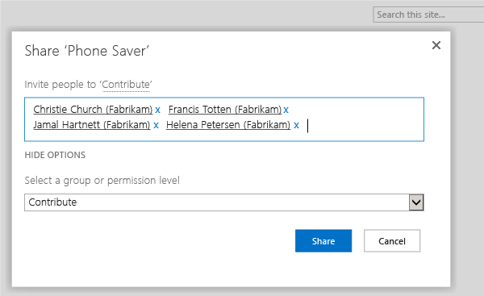

# Add users to a team project, sharepoint and reporting services, and groups

**Team Services** | **TFS 2015** | **TFS 2013**

As roles and responsibilities change,
you might need to change the membership or permission levels for individual members of a team project.
This is particularly true if your project depends on resources
that use SQL Server Reporting Services or SharePoint Products
because permissions for those resources are managed separately.

If all you want to do is add a user to an existing team in TFS,
and you don't have to worry about specific permissions for other resources,
skip this topic and [simply add them to a team](../work/scale/multiple-teams.md).

 > [!NOTE] 
 > Permissions are different than access levels.
 > Access levels control what features are visible to users in the web portal,
 > and are dependent on user licenses; permissions control a user's ability to use features across TFS.
 > If you're just trying to give someone access to a team room or to Agile portfolio management
 > and test case management features,
 > you'll want to [change access levels](../work/connect/change-access-levels.md), not permissions.

## Verify your permissions

Before you change permission levels for others, make sure that you have the right level of permissions.

1.  Open the administrative context for your team project. 

2.  In the **Security** tab, under users, find your own name,
and look at what groups you belong to and what permissions you have.

3.  If you aren't a project administrator, you need to be. Find someone who is, and have them add you:

    

4.  If you need to make changes at the team level, change your context to the team overview.
If you aren't a team administrator, you can add yourself if you're already a project administrator. Otherwise, have someone add you.

    

5.  Similarly, if you need to add users to SharePoint Products or SQL Server Reporting Services,
make sure that you have the required permissions.
For reporting, you must be either a member of the local Administrators group on the report server
or [be a member of a group specifically created to add users](https://technet.microsoft.com/library/ms156034.aspx).
The requirements for SharePoint Products are more complex.
For more information about SharePoint 2013, [go here](https://technet.microsoft.com/library/jj219771.aspx).

## Add users to a team project

1.  Open the web portal and navigate to the project where you want to add users or groups.

    

    Tip: Managing user access to TFS is much easier [using groups](./permissions.md), not individual users.

    Choose the gear icon  to open the administration context for the project,
	and then navigate to the Security tab.

2.  In **Groups**, choose one of the following:

    -   To add users who will require minimal access to the project, choose **Readers**.

    -   To add users who will contribute fully to this project, choose **Contributors**.
	By default, the team group created when you created the project is included as a member of the Contributors group, 
	so you could choose to add the new user as a member of the team instead, and the user would automatically inherit Contributor permissions. 
	For more information, see [Add team members to a team](../work/scale/multiple-teams.md).

    -   To add users who will act as project leads, choose **Project Administrators**.

    After you have chosen one of those groups, add a user or a user group.

    

3.  In **Identities**, specify the name of the user or group you want to add.

   	> The first time you add a user or group to Team Foundation Server,
	> you can't browse to it or check the friendly name.
	> After the identity has been added once in Team Foundation Server, you can just type the friendly name.

4.  Depending on the user, you might want to customize their permissions for other functionality in the project,
such as [areas and iterations](../work/customize/set-area-paths.md)
or [shared queries](../work/customize/set-area-paths.md).
You can also control access to projects, version control, build, and work items;
learn how in [Restrict access in TFS](restrict-access-tfs.md).

If your TFS deployment is integrated with SharePoint Foundation,
you'll need to manage membership in the SharePoint groups to grant permissions to the team project portal
for your TFS users.

## Add users to SharePoint

1.  Open your project portal.

2.  Choose **Share**, and add users or user groups to the appropriate SharePoint groups.

    

    -   To add users who will require minimal access to the project, choose **Readers**.

    -   To add users who will contribute fully to this project, choose **Contributors**.

    -   To add users who will act as project leads, choose **Full Control**.

For more information about users and groups in SharePoint Products,
[go here](https://technet.microsoft.com/library/cc262690.aspx).

If your TFS deployment is integrated with SQL Server Reporting Services,
you'll need to manage users in the appropriate SQL Server Reporting Services groups,
or they won't be able to view or edit those reports.

## Add users to Reporting Services

1.  Open Internet Explorer or another browser compatible with Reporting Services administration,
and navigate to the following address,
where *ReportServer* represents the name of the server that is running SQL Server Reporting Services:

    **http://** *ReportServer* **/Reports/Pages/Folder.aspx**

2.  On the **Home** page, choose **Folder Settings**, and in Security, choose **New Role Assignment** and add users.

    -   To add users who can act as readers of or contributors to the project, select the **Browsers** check box.

        

    -   To add users who will act as project leads, select the **Team Foundation Content Manager** check box.

        

If you're a member of [Team Foundation Administrators](add-administrator-tfs.md),
you can verify what features are available for your users by default,
and see whether any users are members of groups that have access outside of the default level.

## Verify

1.  Open the web portal in administration mode and choose **Control Panel**
to navigate to the top-level administration context.

2.  Choose the **Access levels** tab.

3.  Choose the name of each license group in turn, and review the following information:

    -   Which licensing group is set as the default group for the deployment.
	That group name will be followed by **(Default)**.
	This is the group that all users of your deployment of Team Foundation Server will be assigned to by default.

    -   Whether the user for whom you are determining licensing levels is a member
	of a different licensing group than the default group.
	If so, review the description of the features of that licensing group to better understand
	what features are and are not available to that user.

4.  To review the licensing group membership of all users in the deployment at once, choose **Export Audit Log**.
The membership information will be exported to a comma-delimited file.
Save or open the file.

## Q & A

<!-- BEGINSECTION class="md-qanda" -->

#### Q: Where can I learn more about permissions and built-in groups, like the Contributors group?

A: The following picture shows the default permission assignments made to the Contributors group.

To learn more about other groups and their permission assignments,
see [Permission reference for Team Foundation Server](./permissions.md).

#### Q: How do I add someone as an administrator?

A: You'll need to add that user to groups
at the [project-collection level](add-administrator-tfs.md#project-collection)
or at the [server-level](add-administrator-tfs.md).

#### Q: Can I restrict access to a team project or to functional areas within a team project?

A: Yes. Learn how in [Restrict access in TFS](restrict-access-tfs.md).

[!INCLUDE [user-delay](../_shared/qa-user-delay.md)]

<!-- ENDSECTION --> 
