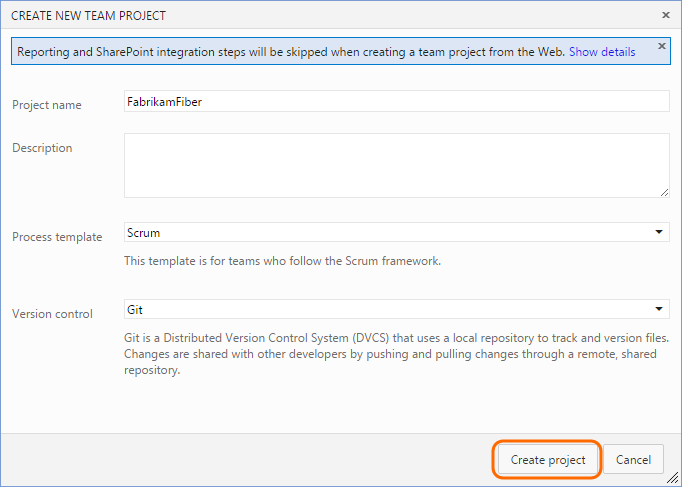
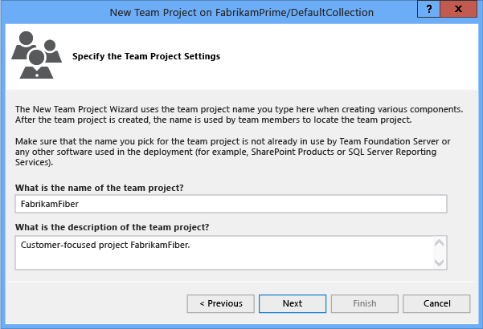
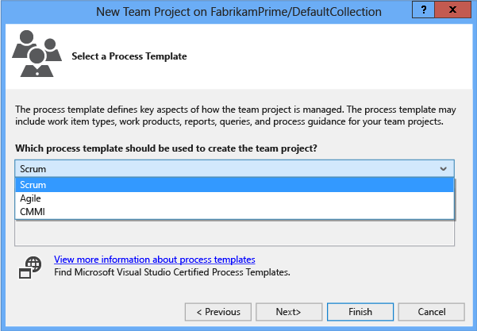

# Create a team project

**TFS 2017 | TFS 2015 | [Previous versions](https://msdn.microsoft.com/library/ms181477%28v=vs.120%29.aspx)**  

>[!NOTE]  
>If you don’t want to manage an on-premises server, you can 
[Sign up for Visual Studio Team Services and create a team project](team-services/sign-up-for-visual-studio-team-services.md). This topic applies to creating a team project when you have an on-premises Team Foundation Server (TFS) deployed.

You create a team project to establish a repository for source code and a place for a group of developers and teams to plan, track progress, and collaborate on building software solutions. Team projects differ from [software application projects or solutions](https://msdn.microsoft.com/library/zfzh36t7.aspx). 

If you have a team project already, and want to start coding an application project, then see one of the following topics:  [Set up Git on your dev machine](../git/get-started.md) or [Develop your app in Team Foundation version control](../tfvc/share-your-code-in-tfvc-vs.md).

>[!IMPORTANT]  
>When you create a team project from the web portal, several process template files are ignored. Specifically, the files that would create a Report Manager site and a SharePoint project portal aren't supported. These features aren't supported for Team Services. 
>
>If you want these features to be to be available on your on-premises TFS, then create your team project from Visual Studio or Team Explorer. For details, see [Process template and plug-in files, Client support for project creation](../work/reference/process-templates/overview-process-template-files.md#client-support).  

### From the web

If you're using TFS 2015 Update 2 or later then you can create a team project from the web as well. It's important to note that for team projects created from the web, Reporting and SharePoint integration steps will be skipped when creating the team project. You can still set up [Reporting](../report/admin/add-reports-to-a-team-project.md) and [SharePoint](tfs/admin/add-sharepoint-to-tfs.md) manually after team project creation. 

1.  If you're not a member of the Project Collection Administrators Group, [get added as one](add-administrator-tfs.md). To create team projects you must have the Create new projects permission set to **Allow**.

2. Navigate to the administation overview page by choosing the  gear icon in the top right.

3. Open the collection administration page for the collection you want to create the team project in. 

    
    
4. Click New team project.

    

5. Provide a name for your new Team project, select it's initial source control type, and select a process to create a team project.

    

### From Team Explorer

You can create a team project from Team Explorer after you have connected to an on-premises server. 

1.  If you're not a member of the Project Collection Administrators Group, [get added as one](add-administrator-tfs.md). To create team projects you must have the Create new projects permission set to **Allow**.

2.  Ask your TFS administrator about the following resources and get additional permissions as needed:

    -   Which team project collection you should connect to when you create your team project? If you installed TFS using the Basic Server Configuration Wizard, you have only one project collection named **DefaultCollection**. Unless you work in an enterprise organization and will be supporting hundreds of team projects, you should add all your team projects to a single project collection. If you need to create additional collections, see [Manage team project collections](tfs/admin/manage-team-project-collections.md).

    -   Has SQL Server Analysis Services and SQL Server Reporting Services been configured for the deployment? If so, ask your administrator to [add you as a member of the Team Foundation Content Managers group](../report/admin/grant-permissions-to-reports.md) on the server that hosts SQL Server Reporting Services. Without these permissions, you’ll be unable to create a team project.

    -   Has a SharePoint Web application been configured for your deployment? If you want to configure a SharePoint portal when you create your team project, ask the SharePoint administrator to give you Full Control permissions on the server that hosts SharePoint Products. Otherwise, you can skip this step and configure a portal at a later time.

3.  Open the same Visual Studio of visual studio as the version of TFS that you're connecting to. If you don’t see the Team Explorer pane, open **View\>Team Explorer** from the menu.

    As needed, [Download and install Visual Studio Community](https://www.visualstudio.com/products/visual-studio-community-vs.aspx) to get a free copy of the latest version.

4.  Connect to the server and team project collection where you want to create your team project.

    

    You can access Team Explorer for free by installing [Visual Studio Community](https://www.visualstudio.com/downloads/download-visual-studio-vs) or any other Visual Studio version.

    You must connect from a client that is at the same version level as TFS. That is, you must connect to TFS 2015 from a version of Visual Studio 2015.

    

    >**Tip:**  If you are running Team Explorer from a server that hosts SharePoint Products and SQL Server Reporting Services, you might need to run Visual Studio as an administrator.

5.  If it’s your first time connecting to TFS, you’ll need to add TFS to the list of recognized servers.

    

6.  Open the New Team Project Wizard.

    

7.  Name the team project. Don’t specify more than 64 characters.

    

    And, note that after you’ve created a team project, you can’t change its name.

8.  Choose a process template. For a comparison of the default process templates, see [Choose a process](../work/guidance/choose-process.md).

    

9.  Choose your version control, either Git distributed repositories or TFVC, one centralized repo.

    

    Not sure which system to use? Learn more about 
	[Git](../git/overview.md) or [TFVC](../tfvc/overview.md). 

	After you've created your team project, you can[add repositories](#git-and-tfvs-repos). 

10. Unless your team project collection is configured to support a SharePoint project portal, you’re done.

    

    If the Next button is active, you can configure your project portal.

    If the wizard encounters a problem, you’ll receive an error message and a link to the project creation log. Review the [log file](#log-file) for specific errors and exceptions. 

11. When you’re finished, you can see your team project in Team Explorer. You can also choose the **Web Access** link to connect to your team project from the web portal.

	<tbody valign="top">
	</tbody>
	
	<table>
	<tbody valign="top">
	<tr>
	<td></td>
	<td></td>
	</tr>
	</tbody>
	</table>

## Try this next

[Add team members](../work/scale/multiple-teams.md#add-team-members) to enable other users to connect to your team project.

Also, with the team project created, you can start [developing your app in Team Foundation version control](https://msdn.microsoft.com/library/ms181382.aspx) or [use Git](../git/overview.md).

To start planning work and collaborating as a team, see [Agile tools](../work/overview.md).

##Add repositories
From the admin context of the web portal, you can add additional repositories to a team project, either Git (distributed) or TFVC (centralized). While you can create many Git repositories, you can only create a single TFVC repository for a team project.  

 

<blockquote style="font-size: 13px"><b>Feature availability: </b>The ability to work from both Git and TFVC repositories from the same team project is only supported when you connect to Team Services or an on-premises application server that you've upgraded to TFS 2015 Update 1. Additional steps to address permissions may be required. See [Git team projects](../git/team-projects.md) or [TFVC team projects](../tfvc/team-projects.md).</blockquote>  

##Resolve errors

###To resolve permission related errors
If you receive an error message that states you don’t have permission, go get those permissions: become a member of the [Project Collection Administrators group](https://msdn.microsoft.com/library/dd547204.aspx), [Team Foundation Content Managers group](../report/admin/grant-permissions-to-reports.md) become a member of the, and [Full Control permissions](https://msdn.microsoft.com/library/dd547204.aspx) on the server that hosts SharePoint Products.  

###To resolve Error TF30169

**Error TF30169: The New Team Project Wizard was unable to download the process template {0}.**  indicates that SharePoint site process templates are not available on the server that hosts SharePoint Products.

Contact the system administrator for the server that hosts SharePoint Products and request the required process templates be added to the server. See [Requirements and compatibility](./requirements.md).

###To resolve Error TF30321 

**Error TF30321: The name you typed is already used for another team project on the Team Foundation Server** indicates that you should use a different name for your team project. The name you entered is either in active use or has undergone partial deletion, but not full deletion.  

Even when you've deleted a team project, you may get the same name error. If a team project create or delete operation doesn’t successfully finish, some components could be created or deleted even though others are not. In this event, you can’t reuse the name associated with the team project.

To verify project deletion or remove remaining components associated with a partially deleted team project, use the [Delete a team project [TFSDeleteProject]](https://msdn.microsoft.com/library/ms181482). Then try again to create the team project with the same name.

Even with troubleshooting, you might not be able to use the same name. Some components of the deleted team project could be scheduled for deletion but not yet deleted.

###To resolve an error message related to a plug-in 

The process template used to create the team project contains several XML plug-in files. If one of these files contains a format or other error, an error message appears.

Review the project creation log to determine the plug-in that caused the error. After you discover the problem, you can either contact the developer or vendor that provided the plug-in, or attempt to fix the problem yourself. For more information, see [Customize a Process Template](https://msdn.microsoft.com/library/ms243782.aspx).

###To resolve a problem connecting to a server

If you receive an error message about a problem connecting to a server, retrieving information from a server, or checking permissions to create projects, it could be caused by an incorrectly configured server in the deployment. This problem is especially common after a server move, failover, or other maintenance activity.

Contact the TFS system administrator and request that they verify the server configuration.

## Q & A  

<!-- BEGINSECTION class="md-qanda" -->

###Q: How do I add my custom process template to the list?

**A:** You’ll need to first [upload your template](../work/guidance/manage-process-templates.md) using the Process Template Manager. To learn more about customizing a process template, go [here](https://msdn.microsoft.com/library/ms243782.aspx).

###Q: Where is the log file located?

**A:** The log file is stored in $:\\Users\\*user name*\\AppData\\Local\\Temp and labeled vso\_TeamProjectCreation\_*yyyy\_mm\_dd\_hh\_mm\_ss*.log.

The log shows each action taken by the wizard at the time of the failure and may include additional details about the error. You can review the log entries to find network or file related issues by searching for **Exception** or **Error**.

###Q: How do I delete a team project?

**A:** You can delete a team project you no longer use, which helps simplify the navigation to team projects that are in use. See [Delete a team project](delete-team-project.md).

###Q: How do I add reporting or SharePoint portal resources?

**A:** See one of these topics:

-   To add reporting: [Add reports to a team project](../report/admin/add-reports-to-a-team-project.md).

-   To add a SharePoint web application: [Add SharePoint products to your deployment](tfs/admin/add-sharepoint-to-tfs.md).

-   To configure a team project portal to use an existing website or SharePoint site: [Configure a project portal](https://msdn.microsoft.com/library/ms242865.aspx).

###Q: Where can I go if I have more questions?

**A:** You can post a question or search for answers in the [Team Foundation Server – Project Management & Work Item](http://social.msdn.microsoft.com/Forums/tfsworkitemtracking/threads) forum.

<!-- ENDSECTION -->