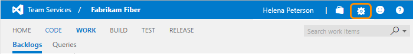

# Delete a team project

**Team Services** | **TFS 2017** | **TFS 2015** | **TFS 2013** | **[Previous Versions](https://msdn.microsoft.com//library/ff357756(v=vs.110).aspx)**

If you find that you have a team project you no longer use, you can delete it. Deleting a team project helps simplify the navigation to team projects that are in use.

>**Caution:**  Deleting a team project permanently removes data associated with that project from the database. You cannot recover it later. Therefore, you should [save team project data](#save) that you might want to access later.

You can delete a team project from Visual Studio Team Services or from an on-premises deployment of Team Foundation Server (TFS).

## Delete a team project from Visual Studio Team Services

1.  Open the administration context for the team project collection by choosing the  gear icon.  

	  
  
2.  Open the  menu for the team project that you want to delete.

	  

    If you don’t see the actions icon , either you’re not accessing Team Services or you’re not a member of the Project Collection Administrators group. For on-premises team projects, [go to the next section](#tfs). Otherwise, go [here](add-administrator-tfs.md) to learn how to get added to the Project Collection Administrators group.

3.  You must type the name of the team project in order to initiate the delete operation. 

	  

## Delete a team project from Team Foundation Server (on-premises)

Using the administration console, you can delete a team project from a team project collection. Afterwards, you'll need to manually delete any associated reports and SharePoint project portal. Or, you can use the [TFSDeleteProject command line tool](tfs/command-line/tfsdeleteproject-cmd.md) to delete all artifacts.

1.  If you're not a member of one or more of the following administrator groups, [get those permissions now](add-administrator-tfs.md):

    -   Team Foundation Administrators group (required).

    -   SQL Server System Administrators group (required).

    -   Farm Administrators group for SharePoint Products (required when your deployment uses SharePoint Products).

2.  Open the administration console for TFS and delete the team project from its team project collection.

    

3.  Choose whether to delete external data associated with the team project and then initiate the delete action.

    

4.  (Optional) To review the status of the delete action, open the **Status** tab.

    To review the details of the delete action, you can open the log file from either the **Status** tab or **Logs** tab.

## Save team project data

Make sure that any project and its data are not needed before you delete it. If you have any concerns, save data when there is a possibility that you will need later.

### Save data stored on Visual Studio Team Services

You can use the following procedures to save data that users most care about, such as source code, build data, and work items.

-   **Source code and custom build templates:** You can download your files as a zip file.

    

    This process doesn’t save any change history or links to other artifacts.

    If you use Git, [clone your repositories](../git/get-started.md) to retain the full project history and all the branches.

-   **Build data**: To save logs and data in your drop build folders, see [View build results](https://msdn.microsoft.com/library/ms181733.aspx).

-   **Work item tracking data:** Create a work item query and open it [using Excel](../work/office/bulk-add-modify-work-items-excel.md). Save the Excel spreadsheet.

    This process doesn’t save any attachments, change history, or links to other artifacts.

### Save data stored on Team Foundation Server

You can easily save data stored for a team project collection by [making a backup of the database](tfs/admin/backup/config-backup-sched-plan.md). Or, you can use the same operations described earlier in [Save data stored on Visual Studio Team Services](#saveservice).

## Q & A (for on-premises deployments only)

### Q: How do I manually delete reports that remain after the project is deleted?

**A:** If your on-premises team project used reporting, and you didn’t choose to delete external artifacts, you can delete the reports using SQL Server Report Manager. From the team project collection page, delete the folder that corresponds to the deleted team project.

### Q: How do I remove the team project portal?

**A:** If your on-premises team project had a team project portal, all links to that portal will be removed from TWA and Team Explorer, but the SharePoint site or website that acted as the portal will not be deleted. If you want to delete the portal, you must do so manually after the project has been deleted. See [How to: Create, Edit, and Delete Windows SharePoint Services Sites](http://go.microsoft.com/fwlink/?LinkId=131660).

### What should I do if the delete action doesn’t finish?

**A:** For on-premises deployments, review the status and log files for the delete action. Open the **Status** tab and for **Deleted**, review the additional information in parentheses, and take the indicated action.

-   (**Processing**) means that the process has started and is in progress.

-   (**Pending**) means that the deletion process has started from a client application. The deletion might be in progress or might have failed. Because the process was started from a client application, the server cannot accurately report the status of the deletion.

    If a project deletion remains pending for a long time, try to delete the project again from the administration console.

-   (**Failed**) means that the deletion process started but did not successfully finish. The log file will contain specific information about the failure.

    Review the information about the failure, and then try to delete the project again.

    If partial data remains, you can also use the [TFSDeleteProject](tfs/command-line/tfsdeleteproject-cmd.md) command line tool.
