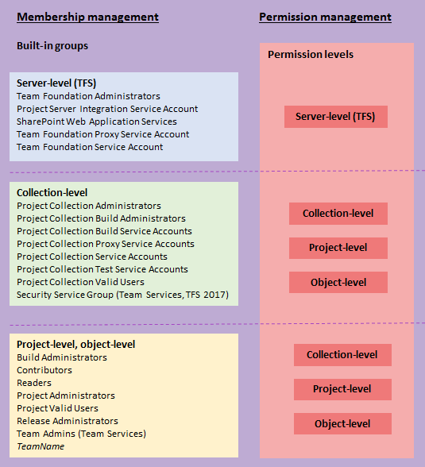

# Permissions and groups defined for Team Services and TFS

<b>Team Services | TFS 2017 | TFS 2015 | TFS 2013</b>  

To access the resources you manage in Team Services or TFS&mdash;like your code, builds, and work&mdash;you need to have permissions to those specific resources.
Permissions may apply to an entire TFS instance, to a collection in that instance, to a team project, or to specific objects in a team project&mdash;builds, areas, iterations, work item queries, tagging, tfvc, git, lab and release management.

Each functional area uses groups to simplify management across the deployment. You add users and groups through the web portal administration context. Permissions are automatically set based on the group that you add users to, or based on the object, project, collection, or server level to which you add groups.

This topic provides descriptions for each built-in group and permission. To learn how to add users to a group or set a specific permission that you can manage through the web portal, see the following resources:  

Users and groups

<ul style="padding-left:30px;font-size:90%">
<li style="margin-bottom:2px">[Add users to an administrator role](add-administrator-tfs.md)</li>
<li style="margin-bottom:2px">[Add users to a team project](./team-services/add-team-members-vs.md) (Team Services)</li>
<li style="margin-bottom:2px">[Add users to a team project](./add-users.md) (TFS)</li>
<li style="margin-bottom:2px">[Make a user a team admin](../work/scale/manage-team-assets.md)</li>
</ul>

DevOps permissions

<ul style="padding-left:30px;font-size:90%">
<li style="margin-bottom:2px">[Git branch](../git/branch-permissions.md)</li>
<li style="margin-bottom:2px">[TFVC](restrict-access-tfs.md)</li>
<li style="margin-bottom:2px">[Builds](../build/concepts/policies/permissions.md#build-permissions)</li>
<li style="margin-bottom:2px">[Release definition security](../build/concepts/policies/permissions.md#release-permissions)</li>
<li style="margin-bottom:2px">[Approvals and approvers](../build/concepts/definitions/release/environments.md#approvals)</li>

</ul>

Work tracking permissions

<ul style="padding-left:30px;font-size:90%">
<li style="margin-bottom:2px">[Area and iteration paths](../work/how-to/set-permissions-access-work-tracking.md)</li>
<li style="margin-bottom:2px">[Work item query and folder](../work/track/set-query-permissions.md)</li>
<li style="margin-bottom:2px">[Dashboard permissions](../report/dashboards.md#set-permissions)</li>
<li style="margin-bottom:2px">[Plan permissions](../work/scale/review-team-plans.md#plan-permissions) (Team Services)</li>
</ul>

<!---
On the other hand, access level management controls access for all users and groups at the server level.  -->

<table valign="top">
<tr valign="top">
<td> </td>
<td>
**Permission states**

User or group has permissions to perform a task:

<ul>
<li>**Allow**</li>
<li>**Inherited allow**</li>
</ul>

User or group doesn't have permission to perform a task:

<ul>
<li>**Deny**</li>
<li>**Inherited deny**</li>
<li>**Not set**</li>
</ul>

To learn more about inheritance, go [here](#inheritance).
</td>
</tr>
</table>

>[!NOTE]  
>Certain features are only available to users who have the appropriate licensing level for those features. Access to those features is not controlled by permissions
but by membership in an access level. To learn more, see [Manage users and access (Team Services)](./team-services/add-account-users-assign-access-levels-team-services.md) or [Change access levels (TFS)](../work/connect/change-access-levels.md).  

## Groups  

Permissions can be granted directly to an individual, or to a group.
Using groups can make things a lot simpler,
and TFS sets up some built-in groups for that purpose.
These groups and the permissions they're assigned to exist at several different levels:
server (TFS deployment), team project collection, team project, and specific objects.
You can also create your own groups and grant them the specific set of permissions
that are appropriate for certain roles in your organization.

<!---
Team Foundation Administrators
Team Foundation Proxy Service Accounts
Team Foundation Service Accounts
Team Foundation Valid Users
Project Server Integration Service Accounts
SharePoint Web Application Services
-->

## Server-level groups (TFS)
Server groups apply to TFS only. When you install TFS, the system creates default groups that have [deployment-wide, server-level permissions](#server-permissions). You can neither remove nor delete the built-in server-level groups.

<ul style="padding-left:20px;font-size:90%">

<li style="margin-bottom:2px"><a data-toggle="collapse" href="#tf-admin">Team Foundation Administrators  &#x25BC;</a>

**Permission:** Has permissions to perform all operations for TFS.

**Membership:** <strong>Local Administrators</strong> group (BUILTIN\Administrators)
				for any server that hosts Team Foundation application services.
			

			

				<em>Server</em> <strong>\Team Foundation Service Accounts</strong> group
				and the members of the <strong>\Project Server Integration Service Accounts</strong> group.
			

			

				This group should be restricted to the smallest possible number of users
				who need total administrative control over TFS.
			

			<blockquote>
				If your deployment uses SharePoint or Reporting,
				consider [adding the members of this group](add-administrator-tfs.md)
				to the Farm Administrators and Site Collection Administrators groups in SharePoint
				and the Team Foundation Content Managers groups in Reporting Services.
			</blockquote>

</li>

<li style="margin-bottom:2px"><a data-toggle="collapse" href="#tf-proxy">Team Foundation Proxy Service Accounts  &#x25BC;</a>

**Permission:** Has service level permissions for Team Foundation Server Proxy,
			and some TFS service level permissions.

<blockquote>
Created when you install the TFS proxy service.
</blockquote>

**Membership:** 

This group should contain only service accounts and not user accounts or groups
that contain user accounts. 

</li>

<li style="margin-bottom:2px"><a data-toggle="collapse" href="#tf-service-accounts">Team Foundation Service Accounts  &#x25BC;</a>

**Permission:** Has service level permissions for TFS.

**Membership:** Contains the service account that was supplied during installation.

	This group should contain only service accounts
	and not user accounts or groupsthat contain user accounts.
	By default, this group is a member of <strong>Team Foundation Administrators</strong>.

</li>

<li style="margin-bottom:2px"><a data-toggle="collapse" href="#tf-valid-users">Team Foundation Valid Users  &#x25BC;</a>

**Permission:** Has permission to view instance level information.

			<blockquote>
				If you set the <strong>View instance-level information</strong>
				permission to <strong>Deny</strong> or <strong>Not set</strong> for this group, no users will be able to access the deployment.
			</blockquote>

**Membership:** Contains all users known to exist in the Team Services account or TFS instance.
			You can't modify the membership of this group.

</li>

<li style="margin-bottom:2px"><a data-toggle="collapse" href="#tf-ps-integrate">Project Server Integration Service Accounts  &#x25BC;</a>

<blockquote>
Native support for TFS-Project Server integration is deprecated for TFS 2017. Go here to learn more.  
</blockquote>

**Permission:** Has service level permissions for the Project Server deployments
			that are configured for interoperation with TFS
			and some TFS service level permissions.

			<blockquote>
				Created when you install Project Service integration.
			</blockquote>

**Membership:** This group should contain only service accounts
			and not user accounts or groups that contain user accounts.
			By default, this group is a member of <strong>Team Foundation Administrators</strong>.

</li>

<li style="margin-bottom:2px"><a data-toggle="collapse" href="#tf-sharepoint">SharePoint Web Application Services  &#x25BC;</a>

**Permission:** Has service level permissions for the SharePoint Web applications
			that are configured for use with TFS
			and some service level permissions for TFS.

**Membership:** This group should contain only service accounts
			and not user accounts or groups that contain user accounts.
			Unlike the Service Accounts group, this group is not a member
			of <strong>Team Foundation Administrators</strong>.

</li>

</ul>

The full name of each of these groups is **[Team Foundation]/{group name}**.
 So the full name of the server-level administrators group is
 **[Team Foundation]/Team Foundation Administrators**.

### Collection-level groups
When you create a Team Services account or TFS collection, the system creates collection-level groups that have [permissions in that collection](#collection-level). You can neither remove nor delete the built-in collection-level groups.

<!---
Project Collection Administrators
Project Collection Build Administrators
Project Collection Build Service Accounts
Project Collection Proxy Service Accounts
Project Collection Service Accounts
Project Collection Test Service Accounts
Project Collection Valid Users
-->
<ul style="padding-left:20px;font-size:90%">
<li style="margin-bottom:2px"><a data-toggle="collapse" href="#pc-admin">Project Collection Administrators  &#x25BC;</a>

**Permission:** Has permissions to perform all operations for the account or collection.

**Membership:** Contains the <strong>Local Administrators</strong> group (BUILTIN\Administrators)
				for the server where the application-tier services for TFS have been installed.
				Also, contains the members of the
				<em>CollectionName</em><strong>\Service Accounts</strong> group.

			

				This group should be restricted to the smallest possible number of users
				who need total administrative control over the collection.
			

			<blockquote>
				If your deployment uses SharePoint or Reporting (TFS),
				consider [adding the members of this group](add-administrator-tfs.md) to the Farm Administrators and Site Collection Administrators groups in SharePoint
				and the Team Foundation Content Managers groups in Reporting Services.
			</blockquote>

</li>

<li style="margin-bottom:2px"><a data-toggle="collapse" href="#pc-build">Project Collection Build Administrators  &#x25BC;</a>

**Permission:** Has service level permissions for Team Foundation Server Proxy,
			and some TFS service level permissions.

<blockquote>
Created when you install the TFS proxy service.
</blockquote>

**Membership:** 

This group should contain only service accounts and not user accounts or groups
that contain user accounts.

</li>

<li style="margin-bottom:2px"><a data-toggle="collapse" href="#pc-build-service-accounts">Project Collection Build Service Accounts  &#x25BC;</a>

**Permission:** Has service level permissions for TFS.

**Membership:** Contains the service account that was supplied during installation.

	This group should contain only service accounts
	and not user accounts or groupsthat contain user accounts.
	By default, this group is a member of <strong>Team Foundation Administrators</strong>.

</li>

<li style="margin-bottom:2px"><a data-toggle="collapse" href="#pc-proxy">Project Collection Proxy Service Accounts  &#x25BC;</a>

**Permission:** Has service level permissions for Team Foundation Server Proxy,
			and some TFS service level permissions.

<blockquote>
Created when you install the TFS proxy service.
</blockquote>

**Membership:** 

This group should contain only service accounts and not user accounts or groups
that contain user accounts.

</li>

<li style="margin-bottom:2px"><a data-toggle="collapse" href="#pc-service-accounts">Project Collection Service Accounts  &#x25BC;</a>

**Permission:** Has service level permissions for the SharePoint Web applications
			that are configured for use with TFS
			and some service level permissions for TFS.

**Membership:** This group should contain only service accounts
			and not user accounts or groups that contain user accounts.
			Unlike the Service Accounts group, this group is not a member
			of <strong>Team Foundation Administrators</strong>.

</li>

<li style="margin-bottom:2px"><a data-toggle="collapse" href="#pc-test-service-accounts">Project Collection Test Service Accounts  &#x25BC;</a>

<blockquote>
Native support for TFS-Project Server integration is deprecated for TFS 2017. Go [here](../work/office/sync-ps-tfs.md) to learn more.  
</blockquote>

**Permission:** Has service level permissions for the Project Server deployments
			that are configured for interoperation with TFS
			and some TFS service level permissions.

			<blockquote>
				Created when you install Project Service integration.
			</blockquote>

**Membership:** This group should contain only service accounts
			and not user accounts or groups that contain user accounts.
			By default, this group is a member of <strong>Team Foundation Administrators</strong>.

</li>

<li style="margin-bottom:2px"><a data-toggle="collapse" href="#pc-valid-users">Project Collection Valid Users  &#x25BC;</a>

**Permission:** Has permission to view collection-level information.

			<blockquote>
				If you set the <strong>View instance-level information</strong>
				permission to <strong>Deny</strong> or <strong>Not set</strong> for this group, no users will be able to access the deployment.
			</blockquote>

**Membership:** Contains all users known to exist in the TFS instance.
			You can't modify the membership of this group.

</li>

<li style="margin-bottom:2px"><a data-toggle="collapse" href="#pc-security-service-group">Security Service Group  &#x25BC;</a> (Team Services, TFS 2017)

**Permission:** Has limited permissions to view collection-level information.

**Membership:** Contains account identities that have been granted explicit permission to a resource. These identities are automatically added to this group if they were not previously a member of any other group. This is an internal group used by the system. Don't use this group to manage users or permissions. 

</li>

</ul>

The full name of each of these groups is **[{collection name}]/{group name}**.
 So the full name  of the adminstrators group for the default collection is
 **[Default Collection]/Project Collection Administrators**.

<!---
Build Administrators
Contributors
Readers
Project Administrators
Project Valid Users
Readers
Release Administrators (TFS 2017, Team Services)
[team name]
-->

### Project-level groups
For each team project that you create, the system creates the followings team project-level groups. These groups are assigned [project-level permissions](#team-project-level-permissions).

<ul style="padding-left:20px;font-size:90%">
<li style="margin-bottom:2px"><a data-toggle="collapse" href="#build-admin">Build Administrators  &#x25BC;</a>

**Permission:** Has permissions to administer build resources and build permissions for the team project. Members can manage test environments, create test runs, and manage builds.

**Membership:** Add members of the team that will define and manage builds to this group. 

</li>

<li style="margin-bottom:2px"><a data-toggle="collapse" href="#contributors">Contributors  &#x25BC;</a>

**Permission:** Has permissions to contribute fully to the team project code base and work item tacking.

**Membership:** By default, the team group created when you create a team project is added to this group, and any user you add to the team will be a member of this group. In addition, any team you create for a team project will be added to this group by default, unless you choose a different group from the list.

</li>

<li style="margin-bottom:2px"><a data-toggle="collapse" href="#readers">Readers  &#x25BC;</a>

**Permission:** 	Has permissions to view the team project but not modify it.

**Membership:** Assign to stakeholders who want to be able to view work in progress.

</li>

<li style="margin-bottom:2px"><a data-toggle="collapse" href="#project-admin">Project Administrators  &#x25BC;</a>

**Permission:** Has permissions to administer all aspects of the team project, although they can't create team projects.

**Membership:** Assign to users who will manage user permissions, create teams, define area an iteration paths, or customize work item tracking.

</li>

<li style="margin-bottom:2px"><a data-toggle="collapse" href="#project-valid-users">Project Valid Users  &#x25BC;</a>

**Permission:** Has permissions to access the team project.

			<blockquote>
				If you set the <strong>View project-level information</strong>
				permission to <strong>Deny</strong> or <strong>Not set</strong> for this group, no users will be able to access the team project.
			</blockquote>

**Membership:** Contains all users and groups that have been added anywhere within the team project. You cannot modify the membership of this group.

</li>

<li style="margin-bottom:2px"><a data-toggle="collapse" href="#release-administrators">Release Administrators  &#x25BC;</a>

**Permission:** Has permissions to [manage all aspects of release management](#release_management).

			<blockquote>
				This group is defined for Team Services and TFS 2017.  
			</blockquote>

**Membership:** Add users to this group who will have responsibility for overseeing and managing releases and release permissions.  

</li>

<li style="margin-bottom:2px"><a data-toggle="collapse" href="#team-group"><i>Team name</i>  &#x25BC;</a>

**Permission:** Has permissions to contribute fully to the team project code base and work item tacking. The default Team group is created when you create a team project, and by default is added to the Contributors group for the team project. [Any new teams you create](../work/scale/multiple-teams.md) will also have a group created for them and added to the Contributors group.

			<blockquote>
				You can grant permissions to administer team assets by adding members to the team administrator role.
			</blockquote>

**Membership:** Add members of a team to this group.

</li>

</ul>

  
The full name of each of these groups is **[{team project name}]/{group name}**.
For example, the contributors group for a team project called "My Project" is 
 **[My Project]/Contributors**.

<!---
Create and manage team alerts
Create and manage team rooms
Configure team backlogs
Customize the Kanban board (Add columns, Swimlanes, Customize Cards, Definition of Done ...
Manage team dashboards
Select team area paths
Select team sprints
Set working days off
Show bugs on backlogs and boards
-->

<h3>Team administrator role</h3>

For each team that you add, you can assign one or more team members as administrators. The team admin role isn't a group with a set of defined permissions. Instead, the team admin role is tasked with managing the following team assets.  

<ul style="padding-left:20px;font-size:90%">

<li style="margin-bottom:2px"><a data-toggle="collapse" href="#team-alerts">Create and manage team alerts  &#x25BC;</a>

Can add and modify alerts so that the team can receive email notifications as changes occur to work items, code reviews, source control files, and builds. For details, see [Manage team alerts](../work/track/alerts-and-notifications.md).

<blockquote>[!NOTE]  
There is no UI associated with managing alert permissions. Instead, you can use **TFSSecurity** to manage alerts in TFS.  

</li>

<li style="margin-bottom:2px"><a data-toggle="collapse" href="#team-rooms">Create and manage team rooms  &#x25BC;</a>

Can add users and events to team rooms, and add team rooms. Team rooms are chat rooms limited to team members. For details, see [Collaborate in a team room](../collaborate/collaborate-in-a-team-room.md) and [Administer team room permissions](../work/scale/manage-team-assets.md#teamroom).

</li>

<li style="margin-bottom:2px"><a data-toggle="collapse" href="#select-team-area-paths">Select team area paths  &#x25BC;</a>

Can select the default area path(s) associated with the team. These settings affect a number of Agile tools available to the team. For details, see [Set team defaults](../work/scale/set-team-defaults.md).
		

</li>

<li style="margin-bottom:2px"><a data-toggle="collapse" href="#select-team-sprints">Select team sprints  &#x25BC;</a>

Can select the default area path(s) associated with the team. These settings affect a number of Agile tools available to the team. For details, see [Set team defaults](../work/scale/set-team-defaults.md).

</li>

<li style="margin-bottom:2px"><a data-toggle="collapse" href="#team-backlogs">Configure team backlogs  &#x25BC;</a>

Can choose which backlog levels are active for a team. For example, a feature team may choose to show only the product backlog and a management team may choose to show only the feature and epic backlogs. For details, see [Select backlog levels for your team](../work/customize/select-backlog-navigation-levels.md).

</li>

<li style="margin-bottom:2px"><a data-toggle="collapse" href="#team-kanban-board">Customize the Kanban board  &#x25BC;</a>

Can fully customize the team's Kanban boards associate with the product and portfolio backlogs. This includes the following elements:
<ul style="padding-left:30px">
<li style="margin-bottom:0px">[Cards: Fields](../work/customize/customize-cards.md#kanban-board) </li>
<li style="margin-bottom:0px">[Cards: Styles](../work/customize/customize-cards.md#style-rule) </li>
<li style="margin-bottom:0px">[Cards: Tag colors](../work/customize/customize-cards.md#color-tags) </li>
<li style="margin-bottom:0px">[Cards: Annotations](../work/customize/customize-cards.md#annotations) </li>
<li style="margin-bottom:0px">[Cards: Tests](../work/customize/customize-cards.md#tests) </li>
<li style="margin-bottom:0px">[Board: Columns](../work/kanban/add-columns.md) </li>
<li style="margin-bottom:0px">[Board: WIP limits](../work/kanban/wip-limits.md)   </li>
<li style="margin-bottom:0px">[Board: Split columns](../work/kanban/split-columns.md)  </li>
<li style="margin-bottom:0px">[Board: Swimlanes](../work/kanban/expedite-work.md)</li>
<li style="margin-bottom:0px">[Board: Card reordering](../work/kanban/kanban-basics.md#card-reorder-setting)</li> 
<li style="margin-bottom:0px">[Board: Definition of Done](../work/kanban/definition-of-done.md)</li>
<li style="margin-bottom:0px">[Charts: Cumulative flow](../report/guidance/cumulative-flow.md#configure) </li>
</ul>

</li>

<li style="margin-bottom:2px"><a data-toggle="collapse" href="#team-dashboards">Manage team dashboards  &#x25BC;</a>

Can add, configure, and manage permissions (Team Services and TFS 2017) for team dashboards. For details, see [Add and manage dashboards](../report/dashboards.md#set-permissions).

</li>

<li style="margin-bottom:2px"><a data-toggle="collapse" href="#set-working-days-off">Set working days off  &#x25BC;</a>

Sprint planning and tracking tools automatically consider days off when calculating capacity and sprint burndown. Team admins can choose which days are non-working days through the team's Settings dialog. For details, see [Set working days](../work/customize/set-working-days.md).

</li>

<li style="margin-bottom:2px"><a data-toggle="collapse" href="#show-bugs">Show bugs on backlogs and boards  &#x25BC;</a>

Team admins can choose whether bugs are treated similar to user stories and requirements or as tasks. For details, see [Set your team's preferences for tracking bugs](../work/customize/show-bugs-on-backlog.md).

</li>
</ul>

>[!NOTE]   
>Project Administrators can manage all team admin areas for all teams.

## Permissions   

The system manages permissions at different levels&mdash;server, collection, project, or object&mdash;and by default assigns them to one or more built-in groups. You manage most permissions through the web portal.

### Server-level permissions (TFS)
You manage server-level permissions through the [Team Foundation Administration Console](add-administrator-tfs.md) or [TFSSecurity command-line tool](tfs/command-line/tfssecurity-cmd.md#permissions). Team Foundation Administrators are granted all server-level permissions. Other server-level groups have select permission assignments.

<ul style="padding-left:20px;font-size:90%">
<li style="margin-bottom:2px"><a data-toggle="collapse" href="#administer-warehouse-permission">Administer warehouse  &#x25BC;</a>

Can process or change settings for the data warehouse or SQL Server Analysis cube by using the Warehouse Control Web Service. 

Additional permissions may be required to fully process or rebuild the data warehouse and Analysis cube.
		

</li>

<li style="margin-bottom:2px"><a data-toggle="collapse" href="#create-team-project-collection-permission">Create team project collection  &#x25BC;</a>

Can create and administer collections.

</li>

<li style="margin-bottom:2px"><a data-toggle="collapse" href="#delete-team-project-collection-permission">Delete team project collection  &#x25BC;</a>

Can delete a collection from the deployment. See [Manage team project collections](./tfs/admin/manage-team-project-collections.md).

<blockquote>Deleting a collection will not delete the collection database from SQL Server (TFS). For Team Services, you would delete your account as described in [Delete or recover your account](./team-services/delete-or-recover-your-account-vs.md).
</blockquote>

</li>

<li style="margin-bottom:2px"><a data-toggle="collapse" href="#edit-instance-level-information-permission">Edit instance-level information  &#x25BC;</a>

Can edit server-level permissions for TFS users and groups, and add or remove server-level groups from the collection.

		<blockquote>
				

					**Edit instance-level information** includes the ability to perform these tasks
					for all team projects defined in all collections defined for the instance:
				

				<ul>
					<li>Add and administer teams and all team-related features</li>
					<li>Create and modify areas and iterations</li>
					<li>Edit check-in policies</li>
					<li>Edit shared work item queries</li>
					<li>Edit team project level and collection- level permission ACLs</li>
					<li>Create and modify global lists</li>
					<li>Edit [event subscriptions](#alerts) (email or SOAP).</li>
				</ul>
				

					When set through the menus, the **Edit instance-level information** permission
					also implicitly allows the user to modify version control permissions.
					To grant all these permissions at a command prompt,
					you must use the `tf.exe Permission` command
					to grant the **AdminConfiguration** and **AdminConnections** permissions
					in addition to GENERIC\_WRITE.
				

			</blockquote>

</li>

<li style="margin-bottom:2px"><a data-toggle="collapse" href="#make-requests-on-behalf-of-others-permission">Make requests on behalf of others  &#x25BC;</a>

Can perform operations on behalf of other users or services. Only assign to service accounts.

</li>

<li style="margin-bottom:2px"><a data-toggle="collapse" href="#trigger-events-permission">Trigger events  &#x25BC;</a>

Can trigger TFS alert events. Only assign to service accounts and members of the Team Foundation Administrators group.

</li>

<li style="margin-bottom:2px"><a data-toggle="collapse" href="#use-full-web-access-features-permission">Use full Web Access features  &#x25BC;</a>

Can use all web portal features.

<blockquote>
				If the Use full Web Access features permission is set to Deny, the user will only see
				those features permitted for the **Stakeholder** group
				(see [Change access levels](../work/connect/change-access-levels.md)).
				A Deny will override any implicit Allow,
				even for accounts that are members of administrative groups
				such as Team Foundation Administrators.
			</blockquote>

</li>

<li style="margin-bottom:2px"><a data-toggle="collapse" href="#view-instance-level-information-permission">View instance-level information  &#x25BC;</a>

Can view server-level group membership and the permissions of those users.

		<blockquote>
				The **View instance-level information** permission is also assigned to the Team Foundation Valid Users group.
			</blockquote>

</li>

</ul>

### Collection-level permissions  

You manage collection-level permissions through the [web portal admin context](../connect/work-web-portal.md#admin-context) or [TFSSecurity command-line tool](tfs/command-line/tfssecurity-cmd.md#collection-level-permissions). Project Collection Administrators are granted all collection-level permissions. Other collection-level groups have select permission assignments.

<ul style="padding-left:20px;font-size:90%">

<li style="margin-bottom:2px"><a data-toggle="collapse" href="#administer-build-resource-permissions-permission">Administer build resource permissions  &#x25BC;</a>

Can modify permissions for build resources.

</li>

<li style="margin-bottom:2px"><a data-toggle="collapse" href="#administer-process-permissions-permission">Administer process permissions  &#x25BC;</a> (Team Services)

Can modify permissions for processes. For information about processes, see [Manage processes](../work/process/manage-process.md). 

<blockquote>An inherited process is derived from a system default process, such as Agile, Scrum, or CMMI. To learn more about these processes, see [Choose a process](../work/guidance/choose-process.md).
</blockquote>

</li>

<li style="margin-bottom:2px"><a data-toggle="collapse" href="#administer-Project-Server-integration-permission">Administer Project Server integration  &#x25BC;</a> (TFS 2015, TFS 2013)

Can [configure the integration of TFS and Project Server](../work/tfs-ps-sync/synchronize-tfs-project-server.md) to enable data synchronization
between the two server products.

<blockquote>TFS 2017 and later versions no longer support native integration with Microsoft Project Server. To learn about third party support, see [Synchronize TFS with Project Server](../work/office/sync-ps-tfs.md).    

</li>

<li style="margin-bottom:2px"><a data-toggle="collapse" href="#administer-shelved-changes-permission">Administer shelved changes  &#x25BC;</a>

Can delete shelvesets created by other users.

</li>

<li style="margin-bottom:2px"><a data-toggle="collapse" href="#administer-workspaces-permission">Administer workspaces  &#x25BC;</a>

Can create workspaces for other users and delete workspaces created by other users.

</li>

<li style="margin-bottom:2px"><a data-toggle="collapse" href="#alter-trace-settings-permission">Alter trace settings  &#x25BC;</a>

Can change the trace settings for gathering more detailed diagnostic information about TFS Web services.

</li>

<li style="margin-bottom:2px"><a data-toggle="collapse" href="#create-a-workspace-permission">Create a workspace  &#x25BC;</a>

Can create a version control workspace.

			<blockquote>
				The **Create a workspace** permission is granted to all users
				as part of their membership within the Project Collection Valid Users group.
			</blockquote>

</li>

<li style="margin-bottom:2px"><a data-toggle="collapse" href="#create-new-team-projects-permission">Create new projects  &#x25BC;</a>

Can create team projects within an account or collection.

<blockquote>
	Additional permissions may be required depending on your deployment. See [Create a team project](create-team-project.md).
</blockquote>

</li>

<li style="margin-bottom:2px"><a data-toggle="collapse" href="#create-process-permission">Create process  &#x25BC;</a> (Team Services)

Can [create an inherited process](../work/process/manage-process.md). 

<blockquote>An inherited process is derived from a system default process, such as Agile, Scrum, or CMMI. To learn more about these processes, see [Choose a process](../work/guidance/choose-process.md).
</blockquote>

</li>

<li style="margin-bottom:2px"><a data-toggle="collapse" href="#delete-process-permission">Delete process  &#x25BC;</a> (Team Services)

Can [delete an inherited process](../work/process/manage-process.md).

</li>

<li style="margin-bottom:2px"><a data-toggle="collapse" href="#delete-team-projects-permission">Delete team projects  &#x25BC;</a>

Can [delete team projects](delete-team-project.md) in the account or collection.

<blockquote>
Deleting a team project will delete all data that is associated with the team project. You cannot undo the deletion of a team project except by restoring the collection to a point before the team project was deleted.
</blockquote>

</li>

<li style="margin-bottom:2px">
<a data-toggle="collapse" href="#edit-collection-level-information-permission">Edit collection-level information  &#x25BC;</a>

Can add users and groups, and edit collection-level permissions for users and groups.

<blockquote>
Edit collection-level information includes the ability to perform these tasks for all team projects defined in a collection:
<ul>
	<li>Add and administer teams and all team-related features</li>
	<li>Edit check-in policies</li>
	<li>Create and modify work item types, link types, categories, and process configuration</li>
	<li>Create and modify global lists</li>
	<li>Create and modify areas and iterations</li>
	<li>Edit shared work item queries</li>
	<li>Edit team project level and collection-level permission ACLs</li>
	<li>Edit [event subscriptions](#alerts) (email or SOAP) on team project or collection-level events.</li>
</ul>

When you set **Edit collection-level information** to **Allow**,
		users can add or remove collection-level groups and implicitly
		allows these users to modify version control permissions.
		To grant all these permissions at a command prompt,
		you must use the `tf.exe Permission` command to grant
		the **AdminConfiguration** and **AdminConnections** permissions,
		in addition to GENERIC\_WRITE.

</blockquote>

</li>

<li style="margin-bottom:2px"><a data-toggle="collapse" href="#edit-process-permission">Edit process  &#x25BC;</a> (Team Services)

Can edit a [custom inherited process](../work/process/customize-process.md).

</li>

<li style="margin-bottom:2px"><a data-toggle="collapse" href="#make-requests-on-behalf-of-others-permission-2">Make requests on behalf of others  &#x25BC;</a>

Can perform operations on behalf of other users or services. Assign only to service accounts.

</li>

<li style="margin-bottom:2px"><a data-toggle="collapse" href="#manage-build-resources-permission">Manage build resources  &#x25BC;</a>

Can manage build computers, build agents, and build controllers.

</li>

<li style="margin-bottom:2px"><a data-toggle="collapse" href="#manage-process-template-permission">Manage process template  &#x25BC;</a> (TFS)

Can [download, create, edit, and upload process templates](../work/guidance/manage-process-templates.md).

<blockquote>From Team Services, you can Export a process by opening  the Process page from the account settings admin context, and choose the Export option from the actions menu of a default process. To learn more, see [Manage processes](../work/process/manage-process.md).  </blockquote>

</li>

<li style="margin-bottom:2px"><a data-toggle="collapse" href="#manage-test-controllers-permission">Manage test controllers  &#x25BC;</a>

Can register and de-register test controllers.

</li>

<li style="margin-bottom:2px"><a data-toggle="collapse" href="#trigger-events-permission-2">Trigger events  &#x25BC;</a>

Can trigger team project alert events within the collection. Assign only to service accounts.

</li>

<li style="margin-bottom:2px"><a data-toggle="collapse" href="#use-build-resources-permission">Use build resources  &#x25BC;</a>

Can reserve and allocate build agents. Assign only to service accounts for build services.

</li>

<li style="margin-bottom:2px"><a data-toggle="collapse" href="#view-build-resources-permission">View build resources   &#x25BC;</a>

Can view, but not use, build controllers and build agents that are configured for the collection.

</li>

<li style="margin-bottom:2px"><a data-toggle="collapse" href="#view-collection-level-information-permission">View collection-level information  &#x25BC;</a>

Can view collection-level group membership and permissions.

</li>

<li style="margin-bottom:2px"><a data-toggle="collapse" href="#view-system-synchronization-information-permission">View system synchronization information  &#x25BC;</a>

Can call the synchronization application programming interfaces. Assign only to service accounts.

</li>

</ul>

### Project-level permissions  

You manage project-level permissions from the [web portal admin context](../connect/work-web-portal.md#admin-context) or using the [TFSSecurity command-line tool](tfs/command-line/tfssecurity-cmd.md#team-project-level-permissions). Project Administrators are assigned all project-level permissions. Other project-level groups are assigned a subset of these permissions.

<ul style="padding-left:20px;font-size:90%">

<li style="margin-bottom:2px"><a data-toggle="collapse" href="#create-tag-definition-permission">Create tag definition  &#x25BC;</a>

Can [add tags through a work item form](../work/track/add-tags-to-work-items.md).

</li>

<li style="margin-bottom:2px"><a data-toggle="collapse" href="#create-test-runs-permission">Create test runs  &#x25BC;</a>

Can add and remove test results and add or modify test runs.

</li>

<li style="margin-bottom:2px"><a data-toggle="collapse" href="#delete-team-project-permission">Delete team project  &#x25BC;</a>

Can [delete the team project](delete-team-project.md) from the account or collection.

</li>

<li style="margin-bottom:2px"><a data-toggle="collapse" href="#delete-test-runs-permission">Delete test runs  &#x25BC;</a>

Can delete a scheduled test.

</li>

<li style="margin-bottom:2px"><a data-toggle="collapse" href="#delete-work-items-in-this-project-permission">Delete work items in this project  &#x25BC;</a>

Can [mark work items in this project as deleted](../work/backlogs/remove-delete-work-items.md).

</li>

<li style="margin-bottom:2px"><a data-toggle="collapse" href="#edit-team-project-level-information-permission">Edit team project-level information  &#x25BC;</a>

Can edit team project level permissions for users and groups.

<blockquote>**Edit project-level information** includes the ability to perform these tasks for the team project:
<ul>
	<li>Add and administer teams and all team-related features</li>
	<li>Edit check-in policies</li>
	<li>Create and modify work item types, link types, categories, and process configuration</li>
	<li>Create and modify areas and iterations</li>
	<li>Edit shared work item queries</li>
	<li>Edit team project level permission ACLs</li>
	<li>Edit [event subscriptions](#alerts) (email or SOAP) on team project level events.</li>
</ul>
</blockquote>

</li>

<li style="margin-bottom:2px"><a data-toggle="collapse" href="#manage-test-configurations-permission">Manage test configurations  &#x25BC;</a>

Can create and delete test configurations.

</li>

<li style="margin-bottom:2px"><a data-toggle="collapse" href="#manage-test-environments-permission">Manage test environments  &#x25BC;</a>

Users who have this permission can create and delete test environments.

</li>

<li style="margin-bottom:2px"><a data-toggle="collapse" href="#move-work-items-out-of-this-project-permission">Move work items out of this project  &#x25BC;</a> (Team Services)

Can [move a work item from one team project to another team project](../work/backlogs/remove-delete-work-items.md) within the collection.

</li>

<li style="margin-bottom:2px"><a data-toggle="collapse" href="#permanently-delete-work-items-in-this-project-permission">Permanently delete work items in this project?</a>

Can [permanently delete work items and test artifacts](../work/backlogs/remove-delete-work-items.md) from the team project.

</li>

<li style="margin-bottom:2px"><a data-toggle="collapse" href="#rename-team-project-permission">Rename team project  &#x25BC;</a>

Can [change the name of the team project](rename-team-project.md).

</li>

<li style="margin-bottom:2px"><a data-toggle="collapse" href="#view-analytics-permission">View analytics  &#x25BC;</a>

Can access data available from the Analytics service. For details, see [Permissions required to access the Analytics service](../report/analytics/analytics-security.md).

</blockquote>
<b>Feature availability</b>: The Analytics Service is in private preview and only available to select customers of Visual Studio Team Services at this time. 
</blockquote>

</li>

<li style="margin-bottom:2px"><a data-toggle="collapse" href="#view-team-project-level-information-permission">View team project-level information  &#x25BC;</a>

Can view team project level group membership and permissions.

</li>

<li style="margin-bottom:2px"><a data-toggle="collapse" href="#view-test-runs-permission">View test runs  &#x25BC;</a>

Can view test plans under the team project area path.

</li>
</ul>

### Build permissions (object-level)  

You manage build permissions [for each build defined in the web portal](../build/concepts/policies/permissions.md#build-permissions) or using the [TFSSecurity command-line tool](tfs/command-line/tfssecurity-cmd.md#build-permissions). Project Administrators are granted all build permissions and Build Administrators are assigned most of these permissions. You can set build permissions for each build definition.

<ul style="padding-left:20px;font-size:90%">
<li style="margin-bottom:2px"><a data-toggle="collapse" href="#administer-build-permissions-permission">Administer build permissions  &#x25BC;</a>

Can administer the build permissions for other users.

</li>

<li style="margin-bottom:2px"><a data-toggle="collapse" href="#delete-build-definition-permission">Delete build definition  &#x25BC;</a>

Can delete build definitions for this team project.

</li>

<li style="margin-bottom:2px"><a data-toggle="collapse" href="#delete-builds-permission">Delete builds  &#x25BC;</a>

Can delete a completed build.

</li>

<li style="margin-bottom:2px"><a data-toggle="collapse" href="#destroy-builds-permission">Destroy builds  &#x25BC;</a>

Can permanently delete a completed build.

</li>

<li style="margin-bottom:2px"><a data-toggle="collapse" href="#edit-build-definition-permission">Edit build definition  &#x25BC;</a>

Can create and modify build definitions for this team project.

<blockquote>You turn Inheritance Off for a build definition
					when you want to control permissions for specific build definitions.
				

					When inheritance is On, the build definition respects the build permissions
					defined at the team project level or a group or user.
					For example, a custom Build Managers group has permissions set to manually queue a build for team project Fabrikam.
					Any build definition with inheritance On for team project Fabrikam would allow a member of the Build Managers group
					the ability to manually queue a build.
				

				

					However, by turning Inheritance Off for team project Fabrikam,
					you can set permissions that only allow Project Administrators
					to manually queue a build for a specific build definition.
					This would then allow me to set permissions for that build definition specifically.
				

</blockquote>

</li>

<li style="margin-bottom:2px"><a data-toggle="collapse" href="#edit-build-quality-permission">Edit build quality  &#x25BC;</a>

Can add information about the quality of the build through Team Explorer or the web portal.

</li>

<li style="margin-bottom:2px"><a data-toggle="collapse" href="#manage-build-qualities-permission">Manage build qualities  &#x25BC;</a>

Can add or remove build qualities.

</li>

<li style="margin-bottom:2px"><a data-toggle="collapse" href="#manage-build-queue-permission">Manage build queue  &#x25BC;</a>

Can cancel, re-prioritize, or postpone queued builds.

</li>

<li style="margin-bottom:2px"><a data-toggle="collapse" href="#override-check-in-validation-by-build-permission">Override check-in validation by build  &#x25BC;</a>

Can commit a TFVC changeset that affects a gated build definition
			without triggering the system to shelve and build their changes first.

<blockquote>
				Assign the Override check-in validation by build permission
				only to service accounts for build services
				and to build administrators who are responsible for the quality of the code.
				For more information, see
				[Check in to a folder that is controlled by a gated check-in build process](../tfvc/check-folder-controlled-by-gated-check-build-process.md).
			</blockquote>

</li>

<li style="margin-bottom:2px"><a data-toggle="collapse" href="#queue-builds-permission">Queue builds  &#x25BC;</a>

Can put a build in the queue through the interface for Team Foundation Build or at a command prompt. They can also stop the builds that they have queued.

</li>

<li style="margin-bottom:2px"><a data-toggle="collapse" href="#retain-indefinitely-permission">Retain indefinitely  &#x25BC;</a>

Can mark a build so that it will not be automatically deleted by any applicable retention policy.

</li>

<li style="margin-bottom:2px"><a data-toggle="collapse" href="#stop-builds-permission">Stop builds  &#x25BC;</a>

Can stop any build that is in progress, including builds queued and started by another user.

</li>

<li style="margin-bottom:2px"><a data-toggle="collapse" href="#update-build-information-permission">Update build information  &#x25BC;</a>

Can add build information nodes to the system, and can also add information about the quality of a build. Assign only to service accounts.

</li>

<li style="margin-bottom:2px"><a data-toggle="collapse" href="#view-build-definition-permission">View build definition  &#x25BC;</a>

Can view the build definitions that have been created for the team project.

</li>

<li style="margin-bottom:2px"><a data-toggle="collapse" href="#view-builds-permission">View builds  &#x25BC;</a>

Can view the queued and completed builds for this team project.

</li>
</ul>

To manage build security, see [build permissions](../build/concepts/policies/permissions.md#build-permissions).

### Git repository permissions (object-level)  

>[!NOTE] 
>These permissions have changed in TFS 2017 Update 1 and VSTS.
>If you are using an earlier version of TFS, see the [previous list of permissions](git-permissions-before-2017.md).

You manage the security of each Git repository or branch from the [web portal](../git/branch-permissions.md) or using the [TFSSecurity command-line tool](tfs/command-line/tfssecurity-cmd.md#git-repo-permissions). Project Administrators are granted most of these permissions (which appear only for a team project that's been configured with a Git repository). You can manage these permissions for each Git repository.

<ul style="padding-left:20px;font-size:90%">

<li style="margin-bottom:2px"><a data-toggle="collapse" href="#git-contribute-permission">Contribute  &#x25BC;</a>

At the repository level, can push their changes to existing branches in the repository.
Users who lack this permission but who have [create branch](#git-create-branch-permission) may push changes to new branches.
Does not override restrictions in place from [branch policies](../git/branch-policies.md).  
At the branch level, can push their changes to the branch and lock the branch.

</li> 
		
<li style="margin-bottom:2px"><a data-toggle="collapse" href="#git-create-branch-permission">Create Branch  &#x25BC;</a>

Can create and publish branches in the repository. 
Lack of this permission does not limit users from creating branches in their local repository; it merely prevents them from publishing local branches to the server.
When a user creates a new branch on the server, they have Contribute, Edit Policies, Force Push, Manage Permissions, and Remove Others' Locks permissions for that branch by default.

</li> 
			
<li style="margin-bottom:2px"><a data-toggle="collapse" href="#git-create-repository-permission">Create Repository  &#x25BC;</a>

Can create new repositories.

</li> 

<li style="margin-bottom:2px"><a data-toggle="collapse" href="#git-create-tag-permission">Create Tag  &#x25BC;</a>

Can push tags to the repository.

</li> 

<li style="margin-bottom:2px"><a data-toggle="collapse" href="#git-delete-repository-permission">Delete Repository  &#x25BC;</a>

Can delete the repository. At the top-level **Git repositories** level, can delete any repository.

</li> 

<li style="margin-bottom:2px"><a data-toggle="collapse" href="#git-edit-policies-permission">Edit Policies  &#x25BC;</a>

Can edit policies for the repository and its branches.

</li> 

<li style="margin-bottom:2px"><a data-toggle="collapse" href="#git-exempt-from-policy-enforcement-permission">Exempt From Policy Enforcement  &#x25BC;</a>

Can bypass branch policies.

</li> 

<li style="margin-bottom:2px"><a data-toggle="collapse" href="#git-force-push-permission">Force Push (Rewrite History and Delete Branches)  &#x25BC;</a>

Can force an update to a branch, delete a branch, and modify the commit history of a branch. Can delete tags and notes.

</li> 
		 
<li style="margin-bottom:2px"><a data-toggle="collapse" href="#git-manage-notes-permission">Manage Notes  &#x25BC;</a>

Can push and edit Git notes. See <a href="http://git-scm.com/2010/08/25/notes.html">this topic</a> for more details on notes.

</li> 
		
<li style="margin-bottom:2px"><a data-toggle="collapse" href="#git-manage-permissions-permission">Manage Permissions  &#x25BC;</a>

Can set permissions for the repository.

</li>

<li style="margin-bottom:2px"><a data-toggle="collapse" href="#git-read-permission">Read  &#x25BC;</a>

Can clone, fetch, pull, and explore the contents of the repository.

</li> 

<li style="margin-bottom:2px"><a data-toggle="collapse" href="#git-remove-others-locks-permission">Remove Others' Locks  &#x25BC;</a>

Can remove [branch locks](../git/lock-branches.md) set by other users.

</li> 

<li style="margin-bottom:2px"><a data-toggle="collapse" href="#git-rename-repository-permission">Rename Repository  &#x25BC;</a>

Can change the name of the repository. When set at the top-level **Git repositories** entry, can change the name of any repository.

</li>

</ul>

>[!NOTE]  
> Set permissions across all Git repositories by making changes to the top-level **Git repositories** entry. Individual repositories inherit permissions from  the top-level **Git repositories** entry. Branches inherit permissions from assignments made at the repository level. By default, the team project level and collection-level Readers groups only have Read permissions.

To manage Git repo and branch permissions, see [Set branch permissions](../git/branch-permissions.md).

### TFVC permissions (object-level)

You manage the security of each TFVC branch from the [web portal](restrict-access-tfs.md) or using the [TFSSecurity command-line tool](tfs/command-line/tfssecurity-cmd.md#tfvc-permissions). Project Administrators are granted most of these permissions which appear only for a team project that's been configured to use Team Foundation Version Control as the source control system. In version control permissions, explicit deny takes precedence over administrator group permissions.

<ul style="padding-left:20px;font-size:90%">

<li style="margin-bottom:2px"><a data-toggle="collapse" href="#administer-labels-permission">Administer labels  &#x25BC;</a>

Can edit or delete labels created by another user.

</li>

<li style="margin-bottom:2px"><a data-toggle="collapse" href="#check-in-permission">Check in  &#x25BC;</a>

Can check in items and revise any committed changeset comments.
			Pending changes are committed at check-in.

			<blockquote>
				Consider adding these permissions to any manually added users or groups
				that contributes to the development of the team project;
				any users who should be able to check in and check out changes,
				make a pending change to items in a folder,
				or revise any committed changeset comments.
			</blockquote>

</li>

<li style="margin-bottom:2px"><a data-toggle="collapse" href="#check-in-other-users-changes-permission">Check in other users' changes  &#x25BC;</a>

Can check in changes that were made by other users. Pending changes are committed at check-in. 

</li>

<li style="margin-bottom:2px"><a data-toggle="collapse" href="#check-out-permission">Check out  &#x25BC;</a>

Can check out and make a pending change to items in a folder.
			Examples of pending changes include adding, editing, renaming, deleting,
			undeleting, branching, and merging a file.
			Pending changes must be checked in,
			so users will also need the Check in permission
			to share their changes with the team.

			<blockquote>
				Consider adding these permissions to any manually added users or groups
				that contributes to the development of the team project;
				any users who should be able to check in and check out changes,
				make a pending change to items in a folder,
				or revise any committed changeset comments.
			</blockquote>

</li>

<li style="margin-bottom:2px"><a data-toggle="collapse" href="#label-permission">Label  &#x25BC;</a>

Can label items.

</li>

<li style="margin-bottom:2px"><a data-toggle="collapse" href="#lock-permission">Lock  &#x25BC;</a>

Can lock and unlock folders or files. 

</li>

<li style="margin-bottom:2px"><a data-toggle="collapse" href="#manage-branch-permission">Manage branch  &#x25BC;</a>

Can convert any folder under that path into a branch,
			and also take the following actions on a branch:
			edit its properties, re-parent it, and convert it to a folder.
			Users who have this permission can branch this branch
			only if they also have the **Merge** permission for the target path.
			Users cannot create branches from a branch
			for which they do not have the Manage Branch permission.

</li>

<li style="margin-bottom:2px"><a data-toggle="collapse" href="#manage-permissions-permission">Manage permissions  &#x25BC;</a>

Can manage other users' permissions for folders and files in version control.

			<blockquote>
				Consider adding this permission to any manually added users or groups
				that contributes to the development of the team project
				and that must be able to create private branches,
				unless the team project is under more restrictive development practices.
			</blockquote>

</li>

<li style="margin-bottom:2px"><a data-toggle="collapse" href="#merge-permission">Merge  &#x25BC;</a>

Can merge changes into this path.

			<blockquote>
				Consider adding this permission to any manually added users or groups
				that contribute to the development of the team project
				and that must be able to merge source files,
				unless the team project is under more restrictive development practices.
			</blockquote>

</li>

<li style="margin-bottom:2px"><a data-toggle="collapse" href="#read-permission">Read  &#x25BC;</a>

Can read the contents of a file or folder. If a user has Read permissions for a folder, the user can see the contents of the folder and the properties of the files in it, even if the user does not have permission to open the files.

</li>

<li style="margin-bottom:2px"><a data-toggle="collapse" href="#revise-other-users-changes-permission">Revise other users' changes  &#x25BC;</a>

Can edit the comments on checked-in files, even if another user checked in the file. 

			<blockquote>
				Consider adding this permission to any manually added users or groups
				that are responsible for supervising or monitoring the team project
				and that might or must change the comments on checked-in files,
				even if another user checked in the file.
			</blockquote>

</li>

<li style="margin-bottom:2px"><a data-toggle="collapse" href="#undo-other-users-changes-merge-permission">Undo other users' changes  &#x25BC;</a>

	Can undo a pending change made by another user.

			<blockquote>
				Consider adding this permission to any manually added users or groups
				that are responsible for supervising or monitoring the team project
				and that might or must change the comments on checked-in files,
				even if another user checked in the file.
			</blockquote>

</li>

<li style="margin-bottom:2px"><a data-toggle="collapse" href="#unlock-other-users-changes-permission">Unlock other users' changes  &#x25BC;</a>

Can unlock files locked by other users.

			<blockquote>
				Consider adding this permission to any manually added users or groups
				that are responsible for supervising or monitoring the team project
				and that might or must change the comments on checked-in files,
				even if another user checked in the file.
			</blockquote>

</li>

</ul>

To learn more, see [Restrict access](restrict-access-tfs.md).

### Area path permissions (object-level)   

You manage the security of each area path from the [web portal](../work/how-to/set-permissions-access-work-tracking.md) or using the [TFSSecurity command-line tool](tfs/command-line/tfssecurity-cmd.md#area-permissions). Area permissions grant or restrict access to create and manage area paths as well as create and modify work items defined under area paths.

Members of the Project Administrators group are automatically granted permissions to manage area paths for a team project. Consider granting team administrators or team leads permissions to create, edit, or delete area nodes.

<ul style="padding-left:20px;font-size:90%">

<li style="margin-bottom:2px"><a data-toggle="collapse" href="#area-create-child-nodes-permission">Create child nodes  &#x25BC;</a>

Can create area nodes.
			Users who have both this permission and the <strong>Edit this node</strong> permission
			can move or re-order any child area nodes.

<blockquote>
				Consider adding this permission to any manually added users or groups
				that may need to delete, add, or rename area nodes.
			</blockquote>

</li>

<li style="margin-bottom:2px"><a data-toggle="collapse" href="#area-delete-this-node-permission">Delete this node  &#x25BC;</a>

Users who have both this permission and the <strong>Edit this node</strong> permission for another node
			can delete area nodes and reclassify existing work items from the deleted node.
			If the deleted node has child nodes, those nodes are also deleted.

<blockquote>
				Consider adding this permission to any manually added users or groups
				that may need to delete, add, or rename area nodes.
			</blockquote>

</li>

<li style="margin-bottom:2px"><a data-toggle="collapse" href="#area-edit-this-node-permission">Edit this node  &#x25BC;</a>

Can set permissions for this node and rename area nodes.

			<blockquote>
				Consider adding this permission to any manually added users or groups
				that may need to delete, add, or rename area nodes.
			</blockquote>

</li>

<li style="margin-bottom:2px"><a data-toggle="collapse" href="#area-edit-work-items-in-this-node-permission">Edit work items in this node  &#x25BC;</a>

Can edit work items in this area node.

			<blockquote>
				Consider adding this permission to any manually added users or groups
				that may need to edit work items under the area node.
			</blockquote>

</li>

<li style="margin-bottom:2px"><a data-toggle="collapse" href="#area-manage-test-plans-permission">Manage test plans  &#x25BC;</a>

Can modify test plan properties such as build and test settings.

			<blockquote>
				Consider adding Manage test suites permissions to any manually added users or groups
				that may need to manage test plans or test suites under this area node.
			</blockquote>

</li>

<li style="margin-bottom:2px"><a data-toggle="collapse" href="#area-manage-test-suites-permission">Manage test suites  &#x25BC;</a>

Can create and delete test suites,
			add and remove test cases from test suites,
			change test configurations associated with test suites,
			and modify suite hierarchy (move a test suite).

<blockquote>
				Consider adding Manage test suites permissions to any manually added users or groups
				that may need to manage test plans or test suites under this area node.
			</blockquote>

</li>

<li style="margin-bottom:2px"><a data-toggle="collapse" href="#area-view-permissions-for-this-node-permission">View permissions for this node  &#x25BC;</a>

Can view the security settings for this node.

</li>

<li style="margin-bottom:2px"><a data-toggle="collapse" href="#area-view-work-items-in-this-node-permission">View work items in this node  &#x25BC;</a>

Can view, but not change, work items in this area node.

			<blockquote>
				If you set the View work items in this node to Deny,
				the user will not be able to see any work items in this area node.
				A Deny will override any implicit allow, even for accounts
				that are members of administrative groups such as Team Foundation Administrators.
			</blockquote>

</li>
</ul>

### Iterations permissions (object-level) 

<blockquote>Multiple teams may contribute to a team project. 
When that's the case, you can set up teams that are associated with an area. 
Permissions for the team's work items are assigned by assigning permissions to the area. 
There are other [team settings](../work/scale/manage-team-assets.md) 
that configure the team's agile planning tools.</blockquote>

To learn more, see [Set permissions to restrict access to work items](../work/how-to/set-permissions-access-work-tracking.md).

You manage the security of each iteration path from the [web portal](../work/how-to/set-permissions-access-work-tracking.md) or using the [TFSSecurity command-line tool](tfs/command-line/tfssecurity-cmd.md#iteration-permissions). 
Members of the Project Administrators group are automatically granted these permissions for each iteration defined for a team project. Consider granting team administrators, scrum masters, or team leads permissions to create, edit, or delete iteration nodes.

<ul style="padding-left:20px;font-size:90%">

<li style="margin-bottom:2px"><a data-toggle="collapse" href="#iteration-create-child-nodes-permission">Create child nodes  &#x25BC;</a>

Can create iteration nodes.
			Users who have both this permission and the <strong>Edit this node</strong> permission
			can move or re-order any child iteration nodes.

			<blockquote>
				Consider adding this permission to any manually added users or groups that might need to
				delete, add, or rename iteration nodes.
			</blockquote>

</li>

<li style="margin-bottom:2px"><a data-toggle="collapse" href="#iteration-delete-this-node-permission">Delete this node  &#x25BC;</a>

Users who have both this permission and the <strong>Edit this node</strong> permission for another node
			can delete iteration nodes and reclassify existing work items from the deleted node.
			If the deleted node has child nodes, those nodes are also deleted.

			<blockquote>
				Consider adding this permission to any manually added users or groups that might need to
				delete, add, or rename iteration nodes.
			</blockquote>

</li>

<li style="margin-bottom:2px"><a data-toggle="collapse" href="#iteration-edit-this-node-permission">Edit this node  &#x25BC;</a>

Can set permissions for this node and rename iteration nodes.

			<blockquote>
				Consider adding this permission to any manually added users or groups that might need to
				delete, add, or rename iteration nodes.
			</blockquote>

</li>

<li style="margin-bottom:2px"><a data-toggle="collapse" href="#iteration-view-permissions-for-this-node-permission">View permissions for this node  &#x25BC;</a>

Can view the security settings for this node.

			<blockquote>
				Members of the Project Collection Valid Users, Project Valid Users, or any user or group
				that has **View collection-level information** or **View project-level information**
				can view permissions of any iteration node.
			</blockquote>

</li>

</ul>

### Work item query and folder permissions (object-level)

You manage query and query folder permissions through the [web portal](../work/track/set-query-permissions.md). Project Administors are granted all of these permissions. Contributors are granted Read permissions only. Consider granting the Contribute permissions to users or groups that require the ability to create and share work item queries for the team project.

<ul style="padding-left:20px;font-size:90%">

<li style="margin-bottom:2px"><a data-toggle="collapse" href="#workitemqueryfolders-contribute-permission">Contribute  &#x25BC;</a>

Can view and modify this query or query folder.

</li>

<li style="margin-bottom:2px"><a data-toggle="collapse" href="#workitemqueryfolders-delete-permission">Delete  &#x25BC;</a>

Can delete a query or query folder and its contents.

</li>

<li style="margin-bottom:2px"><a data-toggle="collapse" href="#workitemqueryfolders-manage-permissions-permission">Manage permissions  &#x25BC;</a>

Can manage the permissions for this query or query folder.

</li>

<li style="margin-bottom:2px"><a data-toggle="collapse" href="#workitemqueryfolders-read-permission">Read  &#x25BC;</a>

Can view and use the query or the queries in a folder,
but cannot modify the query or query folder contents.

</li>

</ul>

To learn more, see [Set permissions on queries](../work/track/set-query-permissions.md).

### Plan permissions (object-level) (Team Services)  

You manage plan permissions through the [web portal](../work/scale/review-team-plans.md#plan-permissions). You manage permissions for each plan through it's Security dialog. Project Administors are granted all permissions to create, edit, and manage plans. Valid users are granted View (read-only) permissions. 

> [!NOTE]  
> **Feature availability**: Plans is in preview and available only on Team Services. You access plans by installing the Plans Marketplace [extension](https://marketplace.visualstudio.com/items?itemName=ms.vss-plans).

<ul style="padding-left:20px;font-size:90%">

<li style="margin-bottom:2px"><a data-toggle="collapse" href="#delete-plan-permission">Delete  &#x25BC;</a>

Can delete the selected plan.

</li> 
		
<li style="margin-bottom:2px"><a data-toggle="collapse" href="#edit-plan-permission">Edit  &#x25BC;</a>

Can edit the configuration and settings defined for the selected plan.

</li> 
		
<li style="margin-bottom:2px"><a data-toggle="collapse" href="#manage-plan-permission">Manage  &#x25BC;</a>

Can manage the permissions for the selected plan.

</li> 
		
<li style="margin-bottom:2px"><a data-toggle="collapse" href="#view-plan-permission">View  &#x25BC;</a>

Can view the lists of plans, open and interact with a plan, 
but cannot modify the plan configuration or settings.

</li> 

</ul>

To learn more, see [Set permissions on queries](../work/track/set-query-permissions.md).

### Work item tags

You manage tagging permissions mostly from the [TFSSecurity command-line tool](tfs/command-line/tfssecurity-cmd.md#tagging-permissions). Contributors can add tags to work items and use them to quickly filter a backlog, board, or query results view.

<ul style="padding-left:20px;font-size:90%">
<li style="margin-bottom:2px"><a data-toggle="collapse" href="#create-tag-permission">Create tag definition  &#x25BC;</a>

Can create new tags and apply them to work items. Users who don't have this permission can only select from the existing set of tags for the team project.

<blockquote>Readers and Contributors inherit the **Create tag definition** permission as it is set explicitly to Allow for the Project Valid Users group. Although the **Create tag definition** permission appears
in the security settings at the team project level,
tagging permissions are actually collection-level permissions that are scoped at the team project level when they appear in the user interface.
To scope tagging permissions to a single team project when using the TFSSecurity command, you must provide the GUID for the team project as part of the command syntax. Otherwise, your change will apply to the entire collection. Keep this in mind when changing or setting these permissions.
</blockquote>

</li>

<li style="margin-bottom:2px"><a data-toggle="collapse" href="#delete-tag-definition-permission">Delete tag definition  &#x25BC;</a>

Can remove a tag from the list of available tags for that team project.

<blockquote>This permissions does not appear in the UI. It can only be set by using the [TFSSecurity](tfs/command-line/tfssecurity-cmd.md) command.

					There is also no UI to explicitly delete a tag.
					Instead, when a tag has not been in use for 3 days,
					the system automatically deletes it.

</blockquote>

</li>

<li style="margin-bottom:2px"><a data-toggle="collapse" href="#enumerate-tag-definition-permission">Enumerate tag definition  &#x25BC;</a>

Can view a list of tags available for the work item within the team project.
			Users without this permission will not have a list of available tags
			from which to choose in the work item form or in the query editor.

<blockquote>
				

					This permissions does not appear in the UI.
					It can only be set by using the [TFSSecurity](tfs/command-line/tfssecurity-cmd.md) command.
				

				

					The **View project-level information**
					implicitly allows users to view existing tags.
				

			</blockquote>

</li>

<li style="margin-bottom:2px"><a data-toggle="collapse" href="#update-tag-definition-permission">Update tag definition  &#x25BC;</a>

Can rename a tag by using the REST API.

			<blockquote>
				This permissions does not appear in the UI.
				It can only be set by using the [TFSSecurity](tfs/command-line/tfssecurity-cmd.md) command.
			</blockquote>

</li>
</ul>

To learn more about tags, see [Add tags to work items to categorize and filter lists](../work/track/add-tags-to-work-items.md).

<!---
Administer release permissions
Create releases
Delete release definition
Delete release environment
Delete releases
Edit release definition
Edit release environment
Manage deployments
Manage release approvers
Manage releases
View release definition
View releases
-->

### Release management permissions (object-level) (Team Services, TFS 2017)

Project Administrators and Release Administrators are granted all release management permissions. These permissions can be granted or denied in a hierarchical model at the team project level, for a specific release definition, or for a specific environment in a release definition. Within this hierarchy, permissions can be inherited from the parent or overridden.

In addition, you can assign approvers to specific steps within a release definition to ensure that the applications being deployed meet quality standards.

>[!NOTE]  
>If you are working with the Release Management client and server supported for TFS 2015, see [Automate deployments with Release Management](../release/previous-version/release-management-overview.md).

<ul style="padding-left:20px;font-size:90%">

<li style="margin-bottom:2px"><a data-toggle="collapse" href="#administer-release-permissions-permission">Administer release permissions  &#x25BC;</a>

Can administer the release permissions for other users.

</li>

<li style="margin-bottom:2px"><a data-toggle="collapse" href="#create-releases-permission">Create releases  &#x25BC;</a>

Can create new releases.

</li>

<li style="margin-bottom:2px"><a data-toggle="collapse" href="#delete-release-definition-permission">Delete release definition  &#x25BC;</a>

Can delete release definitions defined for the team project.

</li>

<li style="margin-bottom:2px"><a data-toggle="collapse" href="#delete-release-environment-permission">Delete release environment  &#x25BC;</a>

Can delete environment(s) defined for release definition(s).

</li>

<li style="margin-bottom:2px"><a data-toggle="collapse" href="#delete-releases-permission">Delete releases  &#x25BC;</a>

Can delete releases for a release definition.

</li>

<li style="margin-bottom:2px"><a data-toggle="collapse" href="#edit-release-definition-permission">Edit release definition  &#x25BC;</a>

Can save any changes to a release definition, including configuration variables, triggers, artifacts, and retention policy as well as configuration within an environment of the release definition. To make changes to a specific environment in a release definition, the user also needs the **Edit release environment** permission.

</li>

<li style="margin-bottom:2px"><a data-toggle="collapse" href="#edit-release-environment-permission">Edit release environment  &#x25BC;</a>

Can add information about the quality of the release through Team Explorer or the web portal.

</li>

<li style="margin-bottom:2px"><a data-toggle="collapse" href="#manage-deployments-permission">Manage deployments  &#x25BC;</a>

Can initiate a direct deployment of a release to an environment. This permission is only for direct deployments that are manually initiated by selecting the **Deploy** action in a release. If the condition on an environment is set to any type of automatic deployment, the system automatically initiates deployment without checking the permission of the user that created the release.

</li>

<li style="margin-bottom:2px"><a data-toggle="collapse" href="#manage-release-approvers-permission">Manage release approvers  &#x25BC;</a>

Can add or edit approvers for environment(s) in release definition(s). This permissions also controls whether a user can edit the approvers inside the environment of a specific release instance.

</li>

<li style="margin-bottom:2px"><a data-toggle="collapse" href="#manage-releases-permission">Manage releases  &#x25BC;</a>

Can edit the configuration in releases. To edit the configuration of a specific environment in a release instance, the user also needs **Edit release environment** permission.

</li>

<li style="margin-bottom:2px"><a data-toggle="collapse" href="#view-release-definition-permission">View release definition  &#x25BC;</a>

Can view the release definitions that have been created for the team project.

</li>

<li style="margin-bottom:2px"><a data-toggle="collapse" href="#view-releases-permission">View releases  &#x25BC;</a>

Can view releases belonging to release definition(s) defined for the team project.

</li>

</ul>

To learn more, see [Release definition security](../build/concepts/policies/permissions.md#release-permissions),
[Environment security](../build/concepts/policies/permissions.md#release-permissions) and
[Approvals and approvers](../build/concepts/definitions/release/environments.md#approvals).

### Alert permissions

There are no UI permissions associated with [managing email notifications or alerts](../work/track/alerts-and-notifications.md). Instead, they can be managed using the [TFSSecurity command line tool](tfs/command-line/tfssecurity-cmd.md#collection-level-permissions).

By default:

<ul>
<li>Members of the team project level **Contributors** group can subscribe to alerts for themselves.</li>
<li>Members of the **Project Collection Administrators** group,
  or users who have the **Edit collection-level information**
  can set alerts in that collection for others or for a team.</li>
<li>Members of the **Project Administrators** group,
  or users who have the **Edit project-level information**
  can set alerts in that team project for others or for a team.</li>
</ul>

<ul style="padding-left:20px;font-size:90%">
<li style="margin-bottom:2px"><a data-toggle="collapse" href="#alert-soap-subscription-permission">CREATE_SOAP_SUBSCRIPTION  &#x25BC;</a>

Can create a SOAP-based web service subscription.

</li>

<li style="margin-bottom:2px"><a data-toggle="collapse" href="#alert-generic-read-permission">GENERIC_READ  &#x25BC;</a>

Can view subscription events defined for a team project.

</li>
<li style="margin-bottom:2px"><a data-toggle="collapse" href="#alert-generic-write-permission">GENERIC_WRITE  &#x25BC;</a>

Can create alerts for other users or for a team.

</li>

<li style="margin-bottom:2px"><a data-toggle="collapse" href="#alert-unsubscribe-permission">UNSUBSCRIBE  &#x25BC;</a>

Can unsubscribe from an event subscription.

</li>

</ul>

### Lab Management permissions (TFS 2015, TFS 2013)

Visual Studio Lab Management permissions are specific to virtual machines, environments, and other resources. In addition, the creator of an object in Lab Management is automatically granted all permissions on that object.
You can set these permissions by using the [TFSLabConfig permissions command-line tool](tfs/command-line/tfslabconfig-cmd.md#permissions).

By default, the team project level and collection-level Readers groups have only View lab resources (Read) permissions.

>[!NOTE]  
>Lab Management is deprecated for TFS 2017. We recommend that you [use Build and Release Management instead of Lab Management for automated testing](https://docs.microsoft.com/visualstudio/test/lab-management/use-build-or-rm-instead-of-lab-management).

<ul style="padding-left:20px;font-size:90%">

<li style="margin-bottom:2px"><a data-toggle="collapse" href="#lm-delete-environment-vm-permissions">Delete Environment and Virtual Machines  &#x25BC;</a>

Can delete environments and templates. The permission is checked for the object that is being deleted.

</li>

<li style="margin-bottom:2px"><a data-toggle="collapse" href="#lm-delete-lab-locations-permissions">Delete Lab Locations  &#x25BC;</a>

Can delete the locations for Lab Management resources, which include collection host groups, collection library shares, project host groups, and project library shares. To delete a location, you must have the **Delete Lab Location** permission for that location.

</li>

<li style="margin-bottom:2px"><a data-toggle="collapse" href="#lm-edit-env-vm-permissions">Edit Environment and Virtual Machines  &#x25BC;</a>

Can edit environments and templates. The permission is checked for the object that is being edited.

</li>

<li style="margin-bottom:2px"><a data-toggle="collapse" href="#lm-environment-ops-permissions">Environment Operations  &#x25BC;</a>

Can start, stop, pause, and manage snapshots, in addition to performing other operations on an environment.

</li>

<li style="margin-bottom:2px"><a data-toggle="collapse" href="#lm-import-vm-permissions">Import Virtual Machine  &#x25BC;</a>

Can import a virtual machine from a VMM library share.This permission differs from Write because it only creates an object in Lab Management and does not write anything to the Virtual Machine Manager host group or library share. 

</li>

<li style="margin-bottom:2px"><a data-toggle="collapse" href="#lm-manage-child-permissions-permission">Manage Child Permissions  &#x25BC;</a>

Can change the permissions of all the child Lab Management objects. For example, if a user has **Manage Child Permission** for a team project host group, the user can change permissions for all the environments under that team project host group.

</li>

<li style="margin-bottom:2px"><a data-toggle="collapse" href="#lm-manage-lab-locations-permissions">Manage Lab Locations  &#x25BC;</a>

Can edit the locations of Lab Management resources, which include collection host groups, collection library shares, project host groups, and project library shares. To edit a specific location, you must have the **Manage Lab Location** permission for that location. This permission for collection-level locations (collection host groups and collection library shares) also allows you to create team project level locations (project host group and project library share).

</li>

<li style="margin-bottom:2px"><a data-toggle="collapse" href="#lm-manage-permissions">Manage Permissions  &#x25BC;</a>

Can modify the permissions for a Lab Management object. This permission is checked for the object whose permissions are being modified.

</li>

<li style="margin-bottom:2px"><a data-toggle="collapse" href="#lm-manage-snapshots-permissions">Manage Snapshots  &#x25BC;</a>

Can perform all snapshot management tasks for an environment, which include taking a snapshot, reverting to a snapshot, renaming a snapshot, deleting a snapshot, and reading a snapshot.

</li>

<li style="margin-bottom:2px"><a data-toggle="collapse" href="#lm-pause-permissions">Pause Environment  &#x25BC;</a>

Can pause an environment.

</li>

<li style="margin-bottom:2px"><a data-toggle="collapse" href="#lm-start-permissions">Start  &#x25BC;</a>

Can start an environment.

</li>

<li style="margin-bottom:2px"><a data-toggle="collapse" href="#lm-stop-permissions">Stop  &#x25BC;</a>

Can stop an environment.

</li>

<li style="margin-bottom:2px"><a data-toggle="collapse" href="#lm-view-lab-resources-permissions">View Lab Resources  &#x25BC;</a>

Can view information for the various Lab Management resources, which include collection host groups, project host groups, and environment. To view information about a specific lab resource, you must have the **View Lab Resources** permission for that resource.

</li>

<li style="margin-bottom:2px"><a data-toggle="collapse" href="#lm-write-environment-vm-permissions">Write Environment and Virtual Machines  &#x25BC;</a>

Can create environments for a project host group. Users who have this permission for a project library share can store environments and templates.

</li>

</ul>

##Related notes

- [Change groups and permissions with TFSSecurity](tfs/command-line/tfssecurity-cmd.md)
- [Configure initial groups, teams, members, and permissions (process templates)](../work/reference/process-templates/configure-initial-groups-teams-members-permissions.md)
- [Add users to an administrator role](add-administrator-tfs.md)  
- [Add users to a team project](./team-services/add-team-members-vs.md) (Team Services)  
- [Add users to a team project](./add-users.md) (TFS) 
- [Make a user a team admin](../work/scale/manage-team-assets.md) 

### Large numbers of users

If you need to set permissions for large numbers of users,
create a group in Windows, Active Directory, or Azure Active Directory,
add these groups to Team Services or TFS through the collection-level or project-level security page, and add the same groups to grant access to additional resources.

Of course, you don't need to grant permissions for reports or the project portal if your team project doesn't use SQL Server Reporting Services or a SharePoint site.

### Tools used to set permissions

You can use the tools listed in the following table to set permissions.
Different tools are used depending on whether you are setting permissions at a server, collection, or team project level.
You use the [web portal administration context](../connect/work-web-portal.md) to set most permissions.  

|Permission level|Web portal security pages |Team Foundation Administration Console|TFSSecurity command-line tool|Tf command-line tool|TFSLabConfig command-line tool|
|---|:---:|:---:|:---:|:---:|:---:|
|[Server-level](#server)||||||
|[Collection-level](#collection)||||||
|[Team project and test level](#project_test)||||||
|[Build level](#build)||||||
|[Git repository](#git-repo)||||||
|[Team Foundation Version Control](#tfvc)||||||
|[Area level for work item tracking](#area-permissions)||||||
|[Iteration level for work item tracking](#iteration-path-permissions)||||||
|[Work item query](#query)||||||
|[Work item tags](#tags)||||||
|[Alerts](#alerts)||||||
|[Release Management](#release_management) |||||| |
|[Lab Management](#lab)||||||

### Inheritance

If a permission isn't directly allowed or denied for a user, then it may be inherited in two ways.
- Users inherit permissions from the groups to which they belong.
When a permission is allowed for a user directly or through membership in a group that has that permission,
and it is denied, either directly or through group membership,
the permission is denied.

	>[!NOTE]  
	>Members of **Project Collection Administrators** or **Team Foundation Administrators**
	> retain any allowed permissions, even if they belong to other groups that deny those permissions.

- Object-level permissions that are assigned for nodes of a hierarchy -
areas, iterations, version control folders, work item query folders -
are inherited down the hierarchy.
That is, a user's permissions that are set at `area-1` are inherited by `area-1/sub-area-1`,
if the same permission is not explicitly allowed or denied for `area-1/sub-area-1`.
If a permission is set explicitly for an object, like `area-1/sub-area-1`,
then the parent node is not inheritied, regardless of whether it is denied or allowed.
If it's not set, then the permissions for that node are inheritied from the closest ancestor
that has the permission explicitly set.

To understand why a permission is inherited, you can pause over the permission setting, and then choose **Why?**.
A new window will open. It displays the inheritance information for that permission.

Some object level Security dialog boxes provide an Inheritance on/off option.
Use this option to disable inheritance for folders, shared queries, and other objects.

**When assigning permissions**

**Do:**  
- Use Windows groups when managing lots of users.  
- Consider granting the [work item quyery folders **Contribute**](#workitemqueryfolders-contiribute-permission) permission to users or groups that require the ability to create and share work item queries for the team project.  
- When adding many teams, consider creating a **Team Administrators** group to TFS where you allocate a subset of the permissions available to **Project Administrators**.  
- When adding teams, consider what permissions you want to assign to team leads, scrum masters, and other team members who may need to create and modify area paths, iteration paths, and queries.  

**Don't:**  
- Don't add accounts to the team project **Readers** group that you've added to the **Project Administrators** group. Because the Readers group denies several permissions that the Project Administrators group allows, and deny takes precedence.  
- Don't change the default assignments made to the valid users groups. If you remove or set the **View instance-level information** permission to Deny for one of the Valid Users groups, no users in the group will be able to access the team project, collection, or deployment, depending on the group you set.  
- Don't assign permissions that are noted as ‘Assign only to service accounts' to user accounts.

###Valid user groups

When you add accounts of users directly to a built-in group or through a Windows group, they are automatically added to one of the valid user groups.

-   *Server*\\Team Foundation Valid Users: All members added to server-level groups.

-   *ProjectCollectionName*\\Project Collection Valid Users: All members added to collection-level groups.

-   *TeamProjectName*\\Project Valid Users: All members added to team project-level groups.

The default permissions assigned to these groups are primarily limited to read access, such as **View build resources**, **View project-level information**, and **View collection-level information**.

This means that all users that you add to one team project can view the objects in other team projects within a collection.
If you need to restrict view access, then you can [set restrictions through the area path node](../work/how-to/set-permissions-access-work-tracking.md).
For additional methods, see [Restrict access in TFS](restrict-access-tfs.md).

If you remove or deny the **View instance-level information** permission for one of the Valid Users groups,
no users in the group will be able to access the team project, collection, or deployment, depending on the group you set.

In addition, the `VALIDUSER` element can be used [to allow or restrict access for work item tracking](restrict-access-tfs.md#work-items).

### SQL Server reports and the project portal (TFS 2015)  

For information about how to set permissions in Reporting Services and SharePoint Products for users in TFS,
see [Add administrators to TFS](add-administrator-tfs.md).
