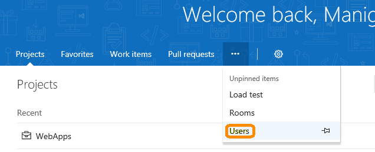
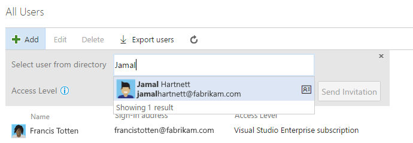
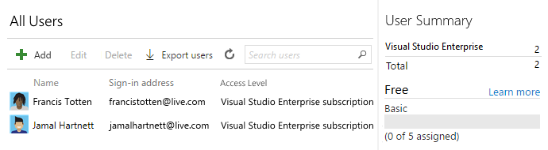

#	Manage users and access in Visual Studio Team Services

**Team Services**

Add users to your Team Services account so you can specify 
the level of features that they can use: Basic or Stakeholder. 
These users can join your Team Services account for free:

*	5 users who get [Basic features](https://www.visualstudio.com/team-services/compare-features/), 
like version control, tools for Agile, Java, build, release management, and more
*	Unlimited users who get [Stakeholder features](https://www.visualstudio.com/team-services/compare-features/) 
like working with your backlog, work items, and queries
*	Unlimited [Visual Studio subscribers](https://www.visualstudio.com/team-services/compare-features/) 
who also get Basic features, and in some cases, additional features with specific extensions, like 
[Test Manager](https://marketplace.visualstudio.com/items?itemName=ms.vss-testmanager-web) 

<p><a data-toggle="collapse" href="#expando-need-more-basic-users">Need more users with Basic features or Visual Studio subscriptions? &#x25BC;</a></p>
<div class="collapse" id="expando-need-more-basic-users">
<p>When your account stays within the free limits, 
you don't have to pay for users to join your account.
You only have to pay if you have more than 5 users 
who need Basic features, and they don't have Visual Studio subscriptions.
You can [pay for additional users in the Visual Studio Marketplace](buy-basic-access-add-team-services-users.md), 
return to your Team Services account, add these users, and assign them Basic access. 
This lets you pay monthly for their access, and you can cancel anytime.
<p>Visual Studio subscriptions give you flexible ways to access Team Services 
and to license the Visual Studio IDE and other Microsoft software for dev and test. 
Learn [how to buy Visual Studio subscriptions](../../marketplace/vs-subscriptions/buy-vs-subscriptions.md) 
from the [Visual Studio Marketplace](https://marketplace.visualstudio.com/subscriptions). 
<p>Or learn [how to manage purchased Visual Studio subscriptions](../../marketplace/vs-subscriptions/buy-vs-subscriptions.md#manage-subscriptions) 
in the [Visual Studio Subscriptions Administration portal](https://manage.visualstudio.com/_apis/Home/redirect?RedirectSource=Commerce). 
Make sure to sign in with the ID that you used to purchase your subscriptions.
</div>

> You can add people to team projects, 
> rather than to your account. Team Services automatically assigns them 
> [Basic features](https://www.visualstudio.com/team-services/compare-features/), 
> if your account has seats available, 
> or [Stakeholder features](https://www.visualstudio.com/team-services/compare-features/), 
> if not. Learn [how to add members to team projects](add-team-members-vs.md).

> <p><a data-toggle="collapse" href="#expando-access-vs-perms">How does access differ from permissions? &#x25BC;</a></p>
> <div class="collapse" id="expando-access-vs-perms">
> <p> Access levels control which features are available to users, 
> while permissions control their access to account resources. 
> [Can't access some features?](#feature-access) 
> For TFS, learn [how to change access levels](../../work/connect/change-access-levels.md) 
> or [buy more access to TFS or the Test hub](../buy-access-tfs-test-hub.md). 
>
> To control access to account resources instead, 
> learn [how to add permissions](../add-users.md) or 
> [restrict permissions](../restrict-access-tfs.md).
> To change how many users can access 
> paid extensions in your Team Services account, 
> learn [how to change paid extension users](../../marketplace/get-vsts-extensions.md#change-extension-quantity).
> </div>

When people don't need access to your Team Services account anymore,
[delete them](#delete-user) from your account. 

## Before you get started

You'll need [Team Services project collection administrator or account owner permissions](#find-owner). 

##	Add users to your Visual Studio Team Services account

0.	Sign in to your Team Services account 
(```https://{youraccount}.visualstudio.com```). 

	[Why am I asked to choose between my "work or school account" and my "personal account"?](#ChooseOrgAcctMSAcct)

0.  Go to **Users** where you can view and assign access levels for all account users.

	Why can't I access the Users hub?  You must have [Team Services project collection administrator permissions or account owner permissions](#find-owner) to access the Users hub.

 > [!NOTE]
 > If have an Azure Active Directory (Azure AD) backed Team Services account, and you need to add users who are 
 > external to your Azure AD, first 
 > [add those users as foreign principals](https://docs.microsoft.com/en-us/azure/active-directory/active-directory-create-users#add-a-user) to 
 > your Azure AD.  Be sure on the **Tell us about this user page**, under **Type of user**, to choose **User with an 
 > existing Microsoft account**.  After completing those steps, follow the steps below to add the foreign Azure AD 
 > user to Team Services.

    
	
    

0.	Add the user's email address. 
Select their access level, based on the features they need. 

	<p><a data-toggle="collapse" href="#expando-what-sign-in-address">Which email addresses can I add? &#x25BC;</a></p>
	<div class="collapse" id="expando-what-sign-in-address">
	<p>You must add email addresses for 
	["personal" Microsoft accounts](https://www.microsoft.com/account) 
	unless your Team Services account 
	authenticates users and control account access through 
	[Azure Active Directory (Azure AD)](https://azure.microsoft.com/en-us/documentation/articles/active-directory-whatis/). 
	[Learn if your Team Services account uses your organization's directory](#ConnectedDirectory). 
	If your users don't have Microsoft accounts, 
	have them [sign up](https://signup.live.com/).

 	<p>If your Team Services account is connected to your organization's directory, 
	all users must be members in that directory. If they're not members, 
	have a directory administrator add them to that directory. 
	You can then find them in that directory when you add them to your 
	account by searching for their email addresses or display names.
	<p>
	
	<p>
	</div>

	<p><a data-toggle="collapse" href="#expando-what-access-level">Can I get more info about access levels? &#x25BC;</a></p>
	<div class="collapse" id="expando-what-access-level">
	<p>You can add these users for free:
	<ul>
	<li>**[Basic](https://www.visualstudio.com/team-services/compare-features/)**: 5 users who get Basic features
	<p>
	<p>If you have more users who need Basic features, 
	and they don't have Visual Studio subscriptions, 
	you can [pay for these users](buy-basic-access-add-team-services-users.md), 
	return to your Team Services account, add these users, and assign them Basic access.
	<p>
	<li>**[Stakeholder](https://www.visualstudio.com/team-services/compare-features/)**: Unlimited users who get Stakeholder features 
	<p>
	<p>For users who just need features like working with your backlog, work items, and queries. 
	Learn about [working as a stakeholder](../../quickstart/get-started-stakeholder.md). 
	<p>
	<li>**[Visual Studio/MSDN Subscriber](https://www.visualstudio.com/team-services/compare-features/)**: 
	Unlimited users whose [Visual Studio subscriptions include Team Services as a benefit](https://azure.microsoft.com/en-us/pricing/details/visual-studio-team-services/). 
	See [full benefits](https://www.visualstudio.com/subscriptions/). 
	<p>	
	</ul>
	</div>

	For example, to add another Visual Studio subscriber:

	
          
	Team Services automatically recognizes and validates Visual Studio subscribers, 
	and assigns access levels that match their subscriptions, no matter which access levels you give them.
	   
	

	[Why won't my subscription validate when I sign in?](#ValidateMSDNSubscription)

	And here's what a team might look like after 
	adding Visual Studio subscribers, some free users who get Basic features, 
	a Stakeholder, and paying for more users with get Basic features:

	

	Your user summary shows only the number of users with access levels assigned to them.

0.	To finish inviting and adding a user to your account, 
click **Send Invitation**.

	Each user gets an invitation email that 
	has a link to your Team Services account. 

	> To sign in to your account, they can use the invitation link, 
	> or go directly to your account at ```https://{youraccount}.visualstudio.com```.
	>
	> First-time users  might be asked for extra details when they sign in to personalize their experience.
	
0.	After adding users to your account, 
you can [add them to team projects](add-team-members-vs.md).

    [Why don't users appear or disappear promptly in Team Services after I add or delete them in the Users hub?](#users-delay)

####	Next

*	Add code to Git or Team Foundation version control

	*	Git with [Eclipse](connect-to-visual-studio-team-services.md#eclipse), 
	[Xcode](../../git/share-your-code-in-git-xcode.md), 
	[Visual Studio](connect-to-visual-studio-team-services.md#vs), 
	[Android Studio](http://java.visualstudio.com/Docs/tools/androidstudio), 
	[IntelliJ](http://java.visualstudio.com/Docs/tools/intelliJ), 
	or [Visual Studio Code](https://code.visualstudio.com/docs/editor/versioncontrol)

	*	TFVC using [Eclipse](connect-to-visual-studio-team-services.md#eclipse), 
	[Xcode](../../tfvc/share-your-code-in-tfvc-xcode.md), 
	[Visual Studio](connect-to-visual-studio-team-services.md#vs), or 
	[Visual Studio Code](https://code.visualstudio.com/docs/editor/versioncontrol)

*	[Create a backlog](../../work/backlogs/create-your-backlog.md) 
to plan, organize, and track your work, 
[manage your process](../../work/process/manage-process.md), 
or [customize your process](../../work/process/customize-process.md)

*	[Grow and scale your teams](../../work/scale/multiple-teams.md)

<a name="delete-user"></a>
##  Delete users from your Visual Studio Team Services account

Before you start, you'll need 
[Team Services project collection administrator or account owner permissions](#find-owner).

0.  Sign in to your Visual Studio Team Services account 
(```https://{youraccount}.visualstudio.com```).

	[Why am I asked to choose between my "work or school account" and my "personal account"?](#ChooseOrgAcctMSAcct)

0.  Go to **Users**. 
Select the user, 
then choose **Delete**.

    

    

0.	To make sure that you've removed the user completely, 
check your [security groups and permissions](../add-users.md). 

	[Why don't users appear or disappear promptly in Team Services after I add or delete them in the Users hub?](#users-delay)

0.  If you deleted paid users who had Basic features, 
and you don't want to pay for these users, you must also 
[reduce these users in the Visual Studio Marketplace](buy-basic-access-add-team-services-users.md), 
so you're not charged in your next Azure billing cycle.

	> To reduce or cancel these users for the next month, 
	> you must make updates before the last day of the current month. 
	> Your bill won't show these change until the next 
	> month because paid users are monthly purchases. 

## Q&A

### Permissions 

<!-- BEGINSECTION class="md-qanda" -->

<a name="no-permissions-access"></a>
####Q:  Why can't I manage users?

A:  To access the Users hub and manage users, you must have 
[Team Services project collection administrator or account owner permissions](#find-owner).

<a name="find-owner"></a>

[!INCLUDE [find-project-collection-administrator](../../_shared/qa-find-project-collection-administrator.md)]

[!INCLUDE [find-account-owner](../../_shared/qa-find-account-owner.md)]

<a name="users-delay"></a>

[!INCLUDE [user-delay](../../_shared/qa-user-delay.md)]

<!-- ENDSECTION -->

### Visual Studio subscriptions

<!-- BEGINSECTION class="md-qanda" -->

<a name="MSDNSubscriber"></a>

####Q:  When do I select "Visual Studio/MSDN Subscriber"?

A:  Assign this access level to users who have active and valid 
[Visual Studio subscriptions](#EligibleMSDNSubscriptions). 
You'll need the email address that's associated with this subscription.
Team Services automatically recognizes and validates Visual Studio 
subscribers who have Team Services as a benefit.

For example, if you select "Visual Studio/MSDN Subscriber", 
but you don't have a valid and active Visual Studio subscription, you can only 
[work as a stakeholder](../../quickstart/get-started-stakeholder.md).

<a name="EligibleMSDNSubscriptions"></a>

####Q:  Which Visual Studio subscriptions can I use with Team Services?

A:  These subscriptions include Team Services at no extra charge 
([check here for the current list](https://azure.microsoft.com/en-us/pricing/details/visual-studio-team-services/)):

*	Visual Studio Enterprise - monthly
*	Visual Studio Enterprise - annual
*	Visual Studio Enterprise with MSDN, 
including subscriptions offered through BizSpark and Microsoft Partner Network (MPN)
*	Visual Studio Professional - monthly
*	Visual Studio Professional - annual
*	Visual Studio Professional with MSDN
*	Visual Studio Test Professional with MSDN
*	MSDN Platforms

Not eligible:

*	MSDN Operating Systems
*	MSDN Essentials
*	Visual Studio Professional (MPN)

Learn more about [Visual Studio subscriptions](https://www.visualstudio.com/vs/pricing/).

<a name="enterprise-professional"></a>

####Q: Which specific subscriptions do "Visual Studio Enterprise subscription" and "Visual Studio Professional subscription" include? 

A:  "Visual Studio Enterprise subscription" can describe:

*	Visual Studio Enterprise - monthly
*	Visual Studio Enterprise - annual
*   Visual Studio Enterprise with MSDN

"Visual Studio Professional subscription" can describe:

*	Visual Studio Professional - monthly
*	Visual Studio Professional - annual
*   Visual Studio Professional with MSDN

<a name="ValidateMSDNSubscription"></a>

####Q:  Why won't my Visual Studio subscription validate?

A:  This might happen for different reasons: 

*	Make sure that you have an active, valid, and 
[eligible Visual Studio subscription](#EligibleMSDNSubscriptions) 
that you can use with Team Services. 

*	You might experience a delay if your subscription is new.

*	If you used a Microsoft account to activate your Visual Studio subscription, 
and you're using an Azure "work or school account" with Team Services, 
learn [how to add your "work or school account" to your subscription](link-msdn-subscription-to-organizational-account-vs.md).

Still having problems? Try these 
[troubleshooting tips](http://blogs.msdn.com/b/visualstudioalm/archive/2014/03/19/visual-studio-online-best-practices-troubleshooting-issues-with-the-quot-eligible-msdn-subscriber-license-type.aspx). 
If you need more help, contact [Support](https://www.visualstudio.com/support/support-overview-vs).

<a name="why-access-changed"></a>
####Q:  Why do Visual Studio subscribers' access levels change after they sign in?

A:	Team Services recognizes Visual Studio subscribers 
and will automatically assign them access based on their subscription, 
no matter the current access level that's assigned to them.

<a name="subscription-expired"></a>

####Q:  What happens if a user's subscription expires?

A:  If no other access levels are available, they'll 
[work as stakeholders](../../quickstart/get-started-stakeholder.md). 
To restore access, they must renew their subscription.

<a name="extension-transition"></a>

####Q: What happened to Visual Studio Online Professional?

A:	On December 1, 2015, we replaced Visual Studio Online Professional with the 
[Visual Studio Professional monthly subscription](https://marketplace.visualstudio.com/items/ms.vs-professional-monthly). While  Visual Studio Online Professional purchases now appear as Visual Studio Professional monthly subscriptions on your monthly invoice, 
we haven't determined when users will be transitioned systematically. This transition provides an upgrade by offering access to  unlimited Team Services accounts, not just one account, like Visual Studio Online Professional.  The rest stays the 
same - monthly access to the Visual Studio Professional IDE, and pricing remains at $45 per user, per month.  Learn more 
about [Visual Studio subscriptions](https://www.visualstudio.com/products/how-to-buy-vs).

If you're buying Professional users for a specific Team Services account,
which is possible only if you bought before November 2015,
and want to upgrade, do this:
	
0.	Before the last day of the calendar month, 
sign in to the [Azure portal](https://manage.windowsazure.com), 
and reduce the number of paid Visual Studio Online Professional 
users to 0. 

	This change will take effect on the 1st day of next month. 
	This means that in the next calendar month, 
	you won't be billed for Visual Studio Online Professional users at all.

0.	On the 1st day of the next calendar month, 
[go to the Marketplace](https://marketplace.visualstudio.com/items/ms.vs-professional-monthly) 
and buy Visual Studio Professional monthly subscriptions for the same users. 
Learn [how to buy Visual Studio subscriptions](../../marketplace/vs-subscriptions/buy-vs-subscriptions.md).

	**Note** If you want to use your monthly Azure credits as a Visual Studio subscriber to pay for users, 
	make sure to remove your subscription's default spending limit indefinitely. 
	[Learn more](set-up-billing-for-your-account-vs.md#AzureMSDNSubscription).

<!-- ENDSECTION -->

### User access

<!-- BEGINSECTION class="md-qanda" -->

<a name="paid-basic-access-join-other-accounts"></a>

[!INCLUDE [can-paid-Basic-users-join-other-accounts](../../_shared/qa-can-paid-Basic-users-join-other-accounts.md)]

<a name="feature-access"></a>

[!INCLUDE [no-access-existing-features](../../_shared/qa-no-access-existing-features.md)]

<a name="stopped-features"></a>

####Q:  Why did I or my team member lose access to certain features?

A:  This might happen for different reasons, 
but meanwhile, you or your team member can continue 
[working as a stakeholder](../../quickstart/get-started-stakeholder.md):

*	Your or your team member's Visual Studio subscription has expired. 
Meanwhile, they'll [work as stakeholders](../../quickstart/get-started-stakeholder.md), 
or you can give them Basic access until they renew their subscriptions.
After they sign in, Team Services will restore their access automatically.

*	The Azure subscription used for billing is no longer active. 
This affects all purchases made with this subscription, 
including Visual Studio subscriptions. 
To fix this problem, visit the [Azure account portal](https://account.windowsazure.com/subscriptions).

*	The Azure subscription used for billing was 
unlinked from your Team Services account. 
Learn more about [linking your account](set-up-billing-for-your-account-vs.md).

*	Your Team Services account has more users with Basic access 
than the number of users that you're paying for in Azure. 
Your account includes 5 free users with Basic access, 
but if you need to add more users with Basic access, 
you can [pay for these users](buy-basic-access-add-team-services-users.md). 
Otherwise, on the 1st day of the calendar month, users who haven't 
signed into your account the longest will lose access first. 
If your account has users who don't need access anymore, 
[remove them from your account](#delete-user).

*	You no longer have access to 
[features that are available only as extensions](https://www.visualstudio.com/team-services/compare-features/). 
This might happen for different reasons.

	*	Your access level no longer meets your extension's requirements. 
	Most extensions require at least Basic access, not Stakeholder. 
	For more details, see the extension's description 
	in the [Visual Studio Marketplace](https://marketplace.visualstudio.com).

	*	The extension was uninstalled. You can reinstall the extension by 
	visiting the extension page in the [Visual Studio Marketplace](https://marketplace.visualstudio.com).

	*	If you're using a paid extension, 
	the Azure subscription used for billing might 
	be unlinked from your Team Services account 
	or might no longer be active. Learn more about 
	[linking your Team Services account](set-up-billing-for-your-account-vs.md), 
	or visit the [Azure account portal](https://account.windowsazure.com/subscriptions) 
	to check your payment details.

<!-- ENDSECTION -->

###	Azure Active Directory (Azure AD) and your account

<!-- BEGINSECTION class="md-qanda" -->

<a name="AddUserDirectory"></a>

####Q:  Why do I have to add users to a directory?

A:  Your Team Services account authenticates users and controls access 
through Azure Active Directory (Azure AD). All users must be directory members to get access.

If you're a directory administrator, you can 
[add users to the directory](https://msdn.microsoft.com/library/azure/hh967632.aspx). 
If you're not, work with your directory administrator to add users. 
Learn more about [controlling access with a directory](manage-organization-access-for-your-account-vs.md).

<a name="ConnectedDirectory"></a>

[!INCLUDE [does-account-use-azuread](../../_shared/qa-does-account-use-azuread.md)]

<a name="DeleteFromDirectory"></a>

####Q:  My account controls access with Azure Active Directory (Azure AD). Can I just delete users from the directory?

A:  Yes, but this removes their access 
to all Team Services accounts and other 
assets associated with that directory. 
You must have Azure AD global administrator permissions to  
[delete a user from your Azure AD](manage-organization-access-for-your-account-vs.md#delete-directory-members).

<a name="ChooseOrgAcctMSAcct"></a>

[!INCLUDE [choose-msa-azuread-account](../../_shared/qa-choose-msa-azuread-account.md)]

[!INCLUDE [choose-msa-azuread-account2](../../_shared/qa-choose-msa-azuread-account2.md)]

[!INCLUDE [why-cant-sign-in-msa-azuread-account](../../_shared/qa-why-cant-sign-in-msa-azuread-account.md)]

<!-- ENDSECTION -->

<a name="get-support"></a>
###	More support

<!-- BEGINSECTION class="md-qanda" -->

[!INCLUDE [get-team-services-support](../../_shared/qa-get-team-services-support.md)]

<!-- ENDSECTION -->