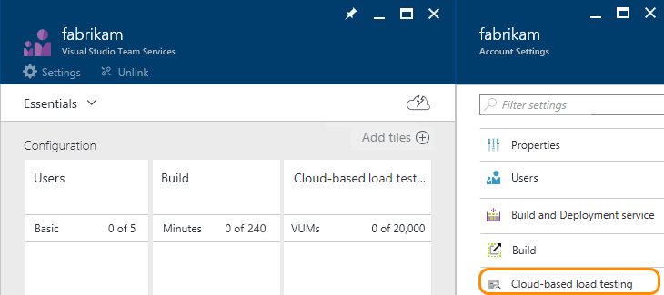
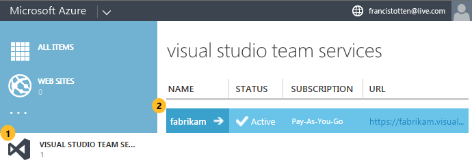

#  How to buy cloud-based load testing in Visual Studio Team Services

**Team Services**

You can purchase additional minutes to support [load testing your apps](../../test/performance-testing/index.md). You can create load tests using Visual Studio Ultimate 2013, Visual Studio Enterprise 2015, or later versions. You can then run these tests in Team Services.

Load tests are measured and billed in virtual user minutes (VUM) as described in  this Q&A: [What are virtual user minutes (VUMs)? How many minutes will my load test use?](../../test/performance-testing/getting-started/get-started-simple-cloud-load-test.md#VUM). 

Your Visual Studio Team Services account includes **free**
20,000 virtual user minutes per month for cloud-based load testing.
If you need more than this amount, you must first
[set up billing for your Team Services account](set-up-billing-for-your-account-vs.md).
You can then [buy more Cloud-based Load Testing](#buy-load-testing) in the
[Azure classic portal](https://manage.windowsazure.com/) or the [Azure portal](https://portal.azure.com).

## Pre-requisites

Before you start:

*  You'll need Team Services
[project collection administrator or account owner permissions](#FindOwnerPCA)
to purchase for your Team Services account.

*  You must first
[set up billing for your Team Services account](set-up-billing-for-your-account-vs.md),
if you haven't already. You'll need an [Azure subscription](#AzureMSDNSubscription)
that you can link to your Team Services account for billing.

*  If you're going through the Azure portal, you'll also need at least
[Co-administrator permissions](set-up-billing-for-your-account-vs.md#AddAzureAdmin)
for the Azure subscription that's linked to your Team Services account for billing.

You can follow the steps below for the Azure classic portal
or the Azure portal. Both portals will give you the same results.

<ul class="nav nav-pills" style="padding-right:15px;padding-left:15px;padding-bottom:5px;vertical-align:top;font-size:18px;">
<li style="float:left;" data-toggle="collapse" data-target="#buy-load-testing"></li>
<li style="float: right;"><a style="max-width: 374px;min-width: 120px;vertical-align: top;background-color:#AEAEAE;margin: 0px 0px 0px 8px;min-width:90px;color: #fff;border: solid 2px #AEAEAE;border-radius: 0;padding: 2px 6px 0px 6px;outline-style:none;height:32px;font-size:14px;font-weight:400" data-toggle="pill" href="#azure-classic-portal-0">Azure classic portal</a></li>
<li class="active" style="float: right"><a style="max-width: 374px;min-width: 120px;vertical-align: top;background-color:#007acc;margin: 0px 0px 0px 0px;min-width:90px;color: #fff;border: solid 2px #007acc;border-radius: 0;padding: 2px 6px 0px 6px;outline-style:none;height:32px;font-size:14px;font-weight:400" data-toggle="pill" href="#azure-portal-0">Azure portal</a></li>
</ul>

**Azure portal**

<ol>
<li>[Sign in to the Azure portal](https://portal.azure.com/).

If you experience browser problems with Azure,
make sure that you use a [supported browser](https://azure.microsoft.com/en-us/documentation/articles/azure-preview-portal-supported-browsers-devices/).
<li>Go to **More services** > **Developer tools** > **Team Services accounts**.
Select your Team Services account.

[Why don't I see my Team Services account?](#WhyNoVSOAccount)

<li>Select **Cloud-based load testing**.

<li>Turn on paid load testing.

If you want, set a monthly limit on the virtual user minutes that you use.
When you're done, save your changes.

</ol>

**Azure classic portal**

<ol>
<li>[Sign in to the Azure classic portal](https://manage.windowsazure.com/)
as your Azure subscription Co-administrator.

If you experience browser problems with Azure,
make sure that you use a [supported browser](https://azure.microsoft.com/en-us/documentation/articles/azure-preview-portal-supported-browsers-devices/).

<li>Select your Team Services account.

[Why don't I see my Team Services account?](#WhyNoVSOAccount)

<li>Go to **Scale**.

<li>Turn on paid Load Testing.
You can also set monthly limits on the amounts that your account uses.

You're not charged until your account goes above the free monthly amounts.

<li>When you're done, save your changes.

To check the amounts used by your account,
you can come back to the Azure classic portal.

</ol>

## Related notes  

- [Build your app](../../build/apps/index.md)
- [Load test your app](../../test/performance-testing/getting-started/get-started-simple-cloud-load-test.md)  
- [How to buy more pipeline capacity for builds and releases in Team Services](buy-more-build-vs.md)  
- [Visual Studio Marketplace and billing Q&A](../../marketplace/marketplace-billing-qa.md)  

## Q&A
<!-- BEGINSECTION class="md-qanda" -->

#### Q: Are there any limits on load testing?

A: Yes, there's a limit on the duration for each test run.

For Cloud-based Load Testing, the limit depends on where you're running your test.
For details, see [this Q&A](../../test/performance-testing/getting-started/get-started-simple-cloud-load-test.md#test-limits).

### Q:  When do I get billed?

A:  You're charged only for services used above the free monthly limits.
Your charges are prorated during the 1st month. After that,
you're billed automatically on the 1st day of the calendar month.

*  Free minutes reset on the 1st of the month.

*  For Cloud-based Load Testing, you're charged for each 
   [virtual user minute](../../test/performance-testing/getting-started/get-started-simple-cloud-load-test.md#VUM).

*   Graduated discounts Cloud-based Load Testing
are calculated based on your Azure subscription billing cycle.

Learn more about [pricing here](https://www.visualstudio.com/team-services/pricing).

### Q: Are there other ways to get features for my account?

A: Yes, you can add other features to your Team Services account when you
[download and install extensions from the Visual Studio Marketplace](https://www.visualstudio.com/get-started/marketplace/get-vsts-extensions).

### Q: How do I get help or support for Team Services?

A:	Try the [Team Services forum](https://social.msdn.microsoft.com/Forums/en-us/home?forum=TFService) 
or [Team Services Support](https://www.visualstudio.com/team-services/support). 

<!-- ENDSECTION -->

<!---

[!INCLUDE [no-accounts](../../marketplace/_shared/qa-no-accounts.md)]

[!INCLUDE [azure-why-no-team-services-account](../../_shared/qa-azure-why-no-team-services-account.md)]

[!INCLUDE [find-project-collection-administrator](../../_shared/qa-find-project-collection-administrator.md)]

[!INCLUDE [find-account-owner](../../_shared/qa-find-account-owner.md)]

-->