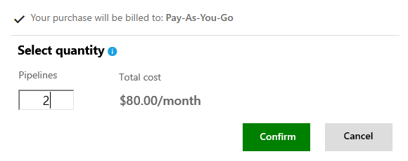

#  How to buy more pipeline capacity for builds and releases in Visual Studio Team Services

**Team Services**

Visual Studio Team Services offers these
[additional team services](https://www.visualstudio.com/team-services/pricing):

Create, queue, and monitor cross-platform builds and releases with these [Build & Release task-based services](../../build/concepts/licensing/concurrent-pipelines-ts.md).
Use Hosted Pipelines to run builds and deploy releases concurrently on Microsoft-managed
agents. Use Private Pipelines to run builds and deploy releases on machines that you manage,
running agent software from Microsoft.

  > To better connect with Release Management, **Build & Deployment** was renamed **Build & Release**.  
  > Unit names are now **Hosted Pipelines** and **Private Pipelines**, rather than Hosted Agents and Private Agents.

  Each pipeline lets you run 1 build or deploy 1 release at a time.
  The maximum number of concurrent builds that you can run and releases
  that you can deploy at the same time is limited only by the number of pipelines that you have.

  Your Team Services account includes these **free** amounts:

  * 1 free Private Pipeline

    With this free Private Pipeline, run unlimited concurrent builds
    or deploy 1 release at a time in Team Foundation Server 2017,
    or run 1 build or deploy 1 release at a time in Team Services on
    agent software from Microsoft.  Private agents are now free and unlimited.
    Each Visual Studio Enterprise subscriber also contributes
    a Private Pipeline that you can use. You can also
    [buy more Private Pipelines](#buy-build-release).

  * 1 free Hosted Pipeline

    With this free Hosted Pipeline, you get 4 hours (240 minutes) per month
    and a maximum duration of 30 minutes per build or deployment in Team Services.
    If you just need more build time for 1 concurrent build or release,
    [buy another Hosted Pipeline](#buy-build-release) without the 4-hour limit
    to increase your maximum duration per build or deployment up to 6 hours.
    For more concurrent builds or releases, [buy more Hosted Pipelines](#buy-build-release).

    Learn about:

    * [Team Services: Build & Release pipelines](../../build/concepts/licensing/concurrent-pipelines-ts.md)
    * [TFS: Build & Release pipelines](../../build/concepts/licensing/concurrent-pipelines-tfs.md)
    * [Pricing for Build & Release pipelines](https://www.visualstudio.com/team-services/pricing)


  *  **Build (XAML)**: The hosted XAML build controller is no longer supported.
  Accounts created on or after April 2016 do not have access to it.
  We plan to remove the hosted XAML build controller from all accounts on July 1 2017.

  > **Important:** If you have an account where you still need to run [XAML builds](https://msdn.microsoft.com/en-us/library/ms181709%28v=vs.120%29.aspx),
  > you should set up an [on-premises build server](https://msdn.microsoft.com/en-us/library/ms252495%28v=vs.120%29.aspx)
  > and switch to an [on-premises build controller](https://msdn.microsoft.com/en-us/library/ee330987%28v=vs.120%29.aspx) now.
  > If you used the hosted XAML build controller, you might have been paying for build minutes, which is a model we no longer support.
  > Please purchase concurrent pipelines. See [Buy pipelines for Build & Release](#buy-build-release).
  > We will soon block the hosted pool from using the per-minute billing model.
  > By making this switch, you can run longer builds (unlimited minutes within reason).


<a name="buy-build-release"></a>
##  Pre-requisites

Before you start:

*  You'll need Team Services
[project collection administrator or account owner permissions](#FindOwnerPCA)
to purchase for your Team Services account.

*  You'll need an Azure subscription that you can
link to your Team Services account for billing,
if your Team Services account isn't linked already.
[Which Azure subscriptions can I use?](#AzureMSDNSubscription)

  To use an existing Azure subscription for billing,
  you'll need at least Co-administrator permissions for that subscription.
  If you don't have permissions, have an Azure Account
  Administrator or Service Administrator
  [add you as Co-administrator to the Azure subscription that you want to use for billing](set-up-billing-for-your-account-vs.md#AddAzureAdmin).

  If you don't have an Azure subscription,
  you can create a subscription when you start your purchase.
  Or [create your Azure subscription here before you start](https://account.windowsazure.com/subscriptions/).
  You'll get the necessary administrator permissions
  with your new subscription.

  Your Team Services account will reuse this Azure subscription
  when you make future purchases for your Team Services account
  from the [Visual Studio Marketplace](https://marketplace.visualstudio.com)
  or from Azure. [More about Azure subscriptions for billing](#billing).

## Buy pipelines

> **Note** If you previously bought agents in the Azure portal, they're now pipelines,
> but don't worry, your monthly purchases and pricing won't change.
> If you need to change the number of pipelines that you're buying each month,
> please go to the Visual Studio Marketplace.
> We plan to retire the experience for buying agents in the Azure portal soon.


0.  As Team Services project collection administrator or account owner,
sign in to either:

  *  [**Visual Studio Marketplace** > **Build and release** > **Hosted pipelines for Build and Release**](https://marketplace.visualstudio.com/items?itemName=ms.build-release-hosted-pipelines)
  *  [**Visual Studio Marketplace** > **Build and release** > **Private pipelines for Build and Release**](https://marketplace.visualstudio.com/items?itemName=ms.build-release-private-pipelines)<p/>

0.  Choose **Buy** for your selected pipeline.

  

0.  Select your Team Services account,
if you have multiple accounts.

  

  <p><a data-toggle="collapse" href="#expando-why-no-ts-account">Don't see your Team Services accounts? &#x25BC;</a></p>
  <div class="collapse" id="expando-why-no-ts-account">
  <p>To select your Team Services account here, you must have have Team Services
  [project collection administrator or account owner permissions](#FindOwnerPCA).
  </div>

0.  Confirm the Azure subscription that you'll use for billing.

  If you have multiple Azure subscriptions,
  select the Azure subscription that you want to use.
  Or if you don't have an Azure subscription,
  create a new subscription now to use for billing.
  [More about Azure subscriptions for billing](#billing)

  

  <p><a data-toggle="collapse" href="#expando-why-no-azure-sub">Don't see the Azure subscription that you expect? &#x25BC;</a></p>
  <div class="collapse" id="expando-why-no-azure-sub">
  <p>To use an existing Azure subscription for billing,
  you'll need at least Co-administrator permissions for that subscription.
  If you don't have permissions,
  have an Azure Account Administrator or Service Administrator
  [add you as a Co-administrator to the linked Azure subscription](set-up-billing-for-your-account-vs.md#AddAzureAdmin).
  </div>

0.  Select the number of pipelines that you want to buy.
Finish your purchase.

  

0.  To view your pipelines, go to your Team Services account.

  

  

  To return to the Build & Release hub in
  your Team Services account at any time,
  go to your Team Services account toolbar,
  then go to **Build and Release**
  (```https://{youraccount}.visualstudio.com/_admin/_buildQueue?_a=resourceLimits```).

<a name="change-paid-pipelines"></a>
## Change your purchased pipelines

When your team's needs for build or release capacity changes,
you can update the number of pipelines that you bought.

0.  Go to your Team Services account toolbar,
then go to **Build and Release**
(```https://{youraccount}.visualstudio.com/_admin/_buildQueue?_a=resourceLimits```).

  

0.  Choose **Change purchased quantity**
for the paid pipeline that you want to update,
so you can go to the Visual Studio Marketplace.

0.  In the Visual Studio Marketplace,
choose **Buy**, select your Team Services account,
then update your number of paid pipelines.


## Related notes  

- [Build your app](../../build/apps/index.md)
- [Concurrent build and release pipelines in Visual Studio Team Services](../../build/concepts/licensing/concurrent-pipelines-ts.md)
- [Concurrent release pipelines in Team Foundation Server](../../build/concepts/licensing/concurrent-pipelines-tfs.md)
- [How to buy cloud-based load testing in Team Services](buy-load-testing-vs.md)  
- [Visual Studio Marketplace and billing Q&A](../../marketplace/marketplace-billing-qa.md)  


## Q & A
<!-- BEGINSECTION class="md-qanda" -->

### Q:  Why pay for pipelines?

A:  When you pay for pipelines, you can run more than one build or release at the same time
in your Team Services account. Learn
[about pipeline pricing](https://www.visualstudio.com/team-services/pricing)
or [how pipelines work](../../build/concepts/licensing/concurrent-pipelines-ts.md).

### Q: Are there any limits on builds and releases?

A: Yes, there's a limit on the duration for each build or deployment.

For Build & Release, your free hosted pipeline includes 4 hours per month
for builds and releases with a maximum duration of 30 minutes per build or deployment.
A paid hosted pipeline increases your maximum duration to 6 hours per build or deployment.


### Q:  When do I get billed?

A:  You're charged only for services used above the free monthly limits.
Your charges are prorated during the 1st month. After that,
you're billed automatically on the 1st day of the calendar month.

*  Free minutes reset on the 1st of the month.

*  Each paid hosted pipeline or private pipeline
includes unlimited minutes per month, within reason.

*  Each connected private XAML controller is counted as one private pipeline,
although a private XAML controller can host more than one agent.

*  For Cloud-based Load Testing, you're charged for each
   [virtual user minute](../../test/performance-testing/getting-started/get-started-simple-cloud-load-test.md#VUM).

*   Graduated discounts Cloud-based Load Testing
are calculated based on your Azure subscription billing cycle.

Learn more about [pricing here](https://www.visualstudio.com/team-services/pricing).

### Q: Are there other ways to get features for my account?

A: Yes, you can add other features to your Team Services account when you
[download and install extensions from the Visual Studio Marketplace](https://www.visualstudio.com/get-started/marketplace/get-vsts-extensions).

### Q: How do I get help or support for Team Services?

A:	Try the [Team Services forum](https://social.msdn.microsoft.com/Forums/en-us/home?forum=TFService)
or [Team Services Support](https://www.visualstudio.com/team-services/support).


<!-- ENDSECTION -->


<!--

<a name="no-accounts"></a>

[!INCLUDE [no-accounts](../../marketplace/_shared/qa-no-accounts.md)]

<a name="WhyNoVSOAccount"></a>

[!INCLUDE [azure-why-no-team-services-account](../../_shared/qa-azure-why-no-team-services-account.md)]

<a name="FindOwnerPCA"></a>

[!INCLUDE [find-project-collection-administrator](../../_shared/qa-find-project-collection-administrator.md)]

[!INCLUDE [find-account-owner](../../_shared/qa-find-account-owner.md)]

<a name="get-support"></a>

[!INCLUDE [azure-account-billing-support](../../_shared/qa-azure-account-billing-support.md)]

[!INCLUDE [get-team-services-support](../../_shared/qa-get-team-services-support.md)]

<a name="AzureMSDNSubscription"></a>

[!INCLUDE [azure-subscriptions-for-billing](../../_shared/qa-azure-subscriptions-for-billing.md)]

<a name="billing"></a>

[!INCLUDE [azure-billing](../../marketplace/_shared/qa-azure-billing.md)]

-->
