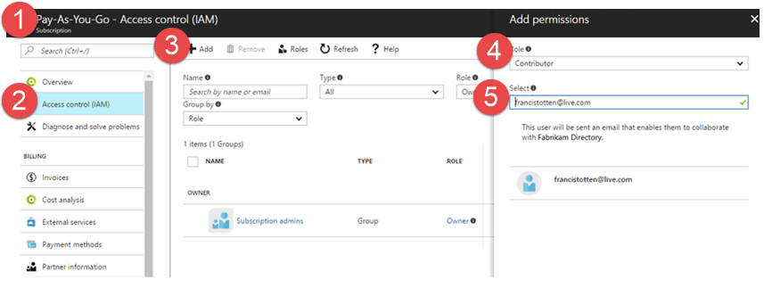

#  Set up billing to pay for users, pipelines, and cloud-based load testing in Visual Studio Team Services

**Team Services**

You have to set up billing when you need more than the free limits in your Team Services account (number of Team 
Services users, pipelines for Build & Release, or virtual user minutes for Cloud-Based Load Testing. Also, when 
you want to buy Team Services extensions from the 
[Visual Studio Marketplace](https://marketplace.visualstudio.com/). Learn [what you get for free in Team Services](https://www.visualstudio.com/team-services/pricing/).

> If this is your first time paying for Team Services users, pipelines, 
> or extensions, you can go directly to the Visual Studio Marketplace and 
> set up billing during your first purchase:
>
> * [Pay for more users](buy-basic-access-add-team-services-users.md)
> * [Buy more capacity for Build & Release](buy-more-build-vs.md)
>
> Otherwise, if you're buying Cloud-Based Load Testing for the first time, 
> or if you want to change the Azure subscription that you use for billing, 
> follow the steps in this topic to go through the Azure portal.
>
> To change the Azure subscription that's linked to your Team Services account, 
> [unlink your Team Services account](#change-azure-subscription), 
> then [relink your account to another Azure subscription](#Link).

## What do I need to set up billing?

Microsoft Azure handles billing for your Team Services account, 
so you'll need:

* [Team Services project collection administrator or account owner permissions](#find-owner)

* An [Azure subscription](#AzureMSDNSubscription) to bill your purchases. 
You must have at least [an **owner** or **contributor** role](#AddAzureAdmin) 
to link this subscription to your Team Services account.

    [Sign up for an Azure subscription](https://account.windowsazure.com/subscriptions/), 
    if you don't have one. Or have an Azure administrator 
    [add you as an **owner** or **contributor** role](#AddAzureAdmin) 
    to an Azure subscription that you can use to bill purchases. 
    Make sure to use the same email address 
    that you sign in to Team Services with for this activity.

    You'll link this Azure subscription to your Team Services 
    account in the [Azure portal](https://portal.azure.com).  Your 
    Azure subscription has all the necessary billing information, 
    so you won't set this up separately for your Team Services account.
    [How does Azure billing work?](#azure-billing)

    If you've lost access to your Azure subscription, 
    contact [Azure Support](http://azure.microsoft.com/en-us/support/options/).

## Link an Azure subscription to your Team Services account for billing

0. [Sign in to the Azure portal](https://portal.azure.com/) 
as Team Services account owner and as Azure subscription Co-administrator or greater.
   
 [Browser problems in Azure?](https://azure.microsoft.com/en-us/documentation/articles/azure-preview-portal-supported-browsers-devices/)

0. Go to **More services** > **Developer tools** > **Team Services accounts**. 
Select your Team Services account.

    

0. Choose the **Link** button.

 

0. Select your Azure subscription. 

 

 After Azure sets up the link, your Team Services account appears linked to your Azure subscription. 

 

#### Next

* [Pay for more users](buy-basic-access-add-team-services-users.md)
* [Buy more pipeline capacity for builds](buy-more-build-vs.md)  
* [Buy more cloud-based testing services](buy-load-testing-vs.md) 

## Add backup billing managers for your Team Services account

To let others manage billing or make purchases through Visual Studio Marketplace for your Team Services account, 
add **owner** or **contributor** roles to users in the Azure subscription that's linked to your Team Services account.

[Sign in to the Azure portal](https://portal.azure.com/) as the Azure subscription administrator, and navigate to access control to add owners or contributors:

Owners and contributors of the Azure subscription linked to your Team Services account can make purchases in the 
Marketplace.  Owners can also add these roles to other users.

Learn more about [viewing access assignments for users](https://docs.microsoft.com/en-us/azure/active-directory/role-based-access-control-manage-assignments#view-access-assignments).

If needed, you can [pay for more users](buy-basic-access-add-team-services-users.md).

Learn more about [adding roles in Azure portal](https://docs.microsoft.com/en-us/azure/active-directory/role-based-access-control-configure#add-access).

## Change the Azure subscription your Team Services account uses for billing

If you want to use another Azure subscription to bill purchases for your Team Services account, 
you can unlink your Team Services account from your current Azure subscription, 
and relink your account to another Azure subscription that's associated with you as the Team Services account owner. 

### What do I need to change my Azure subscription?

* Team Services project collection administrator or account owner permissions ([How do I find the project collection administrator or account owner permissions](#find-owner))

* At least [an **owner** or **contributor** role](#AddAzureAdmin) for both Azure subscriptions

> When you unlink your account, any paid users or pipelines that you've 
> committed for the month will stay unaffected until the 1st of next month, 
> but your account will revert immediately to the free monthly limits 
> for Cloud-based Load Testing. This will also cancel any 
> non-Microsoft paid extensions without refund or credit.
>
> When you relink your account to another Azure subscription, 
> you'll have to add again your paid users, 
> extensions, and pipelines by repurchasing them in the 
> Visual Studio Marketplace, or if applicable, 
> resetting previous quantities in the Azure portal.  If 
> you've paid for any Microsoft resources this month, 
> those resources won't be billed again, 
> but rebuying non-Microsoft extensions 
> will be treated as new purchases and 
> billed immediately to your new Azure subscription.
>
> If you wait until the 1st of next month to relink, 
> your Team Services account will revert back to the free amounts, 
> for example, 5 free users. This means that if you have 
> any paid users, they'll appear expired in your Team Services account. 
> So, make sure to restore any paid users so they don't lose access 
> on the 1st of next month.

0. [Sign in to the Azure portal](https://portal.azure.com/) 
as Team Services account owner and as Azure subscription Co-administrator or greater.
   
    If you experience browser problems with Azure, 
    make sure that you use a [supported browser](https://azure.microsoft.com/en-us/documentation/articles/azure-preview-portal-supported-browsers-devices/).

0. Go to **More services** > **Developer tools** > **Team Services accounts**. 
Select your Team Services account.

 

0. Unlink your account.

 

 Your Team Services account is removed from Azure. 
 You'll now relink your account to a new Azure subscription.

0. Go to **More services** > **Developer tools** > **Team Services accounts**. 
Select your Team Services account.

 

0. Select your Azure subscription. 
Finish relinking your account.

 

 After you finish relinking, 
 your account reappears in the Azure portal with 
 your selected Azure subscription.  For more details, see 
 [how to link your Team Services account to an Azure subscription](#AzurePortal).

0. Follow these steps to restore any 
[paid users](buy-basic-access-add-team-services-users.md) or 
[agents](buy-more-build-vs.md) 
that you had in Azure.

## Q&A

[!INCLUDE [browser-problems-azure](../../_shared/qa-browser-problems-azure.md)]

[!INCLUDE [find project collection administrator](../../_shared/qa-find-project-collection-administrator.md)]

[!INCLUDE [find-account-owner](../../_shared/qa-find-account-owner.md)]

[!INCLUDE [why-no-owned-accounts](../../_shared/qa-why-no-owned-accounts.md)]

[!INCLUDE [azure-subscriptions-for-billing](../../_shared/qa-azure-subscriptions-for-billing.md)]

####Q: Why don't my options look the same?

A: Your options might look different based on the Team Services account that you select 
and how that account is set up:

* **URL**: This list shows only the Team Services accounts that you own. 
[Why don't I see any accounts?](#CannotLinkVSOAccount)

* **Directory**: The name of a directory appears here only when a directory is 
connected to the Team Services account selected in the **URL** box. 
This directory controls access and authenticates users for the 
selected Team Services account. Learn more about 
[why a directory is connected to your account](#WhyDirectory).

* **Subscription**: Appears only when you have more 
than one Azure subscription. These subscriptions are 
also filtered by the directories selected in the Azure 
classic portal's **Subscriptions** list:

    

####Q: Why is a directory connected to my account?

A: Your Team Services account authenticates users through a directory, 
which is managed through [Azure Active Directory (Azure AD)](http://azure.microsoft.com/en-us/documentation/articles/active-directory-whatis/). 
This directory controls who can get access to your account 
by requiring that all users belong to the directory to get access. 
Your Team Services account was connected to a directory when the 
account owner created the account or sometime after that. 

Your directory administrator controls who can 
[join the directory](https://msdn.microsoft.com/library/azure/hh967632.aspx) 
and get access. Otherwise, the Team Services account owner 
is solely responsible for managing access. Learn more about 
[managing work access](manage-organization-access-for-your-account-vs.md) 
for your account.

####Q: Why can't I link my Team Services account?

A:  This might happen because:

* You're not the Team Services account owner.

*   You're not at least Co-administrator 
on the Azure subscription that you want to link.

* If you don't see any Team Services accounts, 
your account might already linked to another Azure subscription. 

*   If your Team Services account uses Azure Active Directory (Azure AD) 
    to authenticate users, you might have a different directory 
    selected in the Azure portal than the directory that's connected 
    to your Team Services account.

    To select the directory that your Team Services account uses, 
    open the Azure portal's **Subscriptions** list:

 

####Q: Are there billing restrictions that might stop me from linking my Team Services account to my Azure subscription?

A:  Yes, you can link accounts in India South 
only to Azure subscriptions with 
billing addresses in the same region.
Otherwise, you'll see this message:

"You need an Azure subscription that is 
valid for Team Services accounts in India South."

####Q: Why is my Team Services account already linked to an Azure subscription?

A: This happens if your Team Services account was already 
set up for billing with an Azure subscription, either manually 
through Azure or while purchasing from the 
[Visual Studio Marketplace](../../marketplace/overview.md)
for your account. The selected Azure subscription is also 
used to bill all later purchases for your account.

####Q:  Can I link an Azure subscription to multiple Team Services accounts?

A:  Yes, you can link an Azure subscription to multiple Team Services accounts. But you can't link a Team 
Services account to multiple Azure subscriptions.

####Q: How does Azure billing work?

A: When you link your Team Services account to an Azure subscription, 
you select an eligible [Azure subscription](#AzureMSDNSubscription) 
where you have Co-administrator permissions or greater. 
If you don't have an Azure subscription, you can either 
[sign up](https://account.windowsazure.com/Subscriptions) for a new one, 
or have an Azure administrator [add you as Co-Administrator](#AddAzureAdmin) 
to an Azure subscription that you can use to bill purchases. 

Payment is set up with a credit card, or by invoice in some cases. 
Charges for your purchases will show up on your monthly Azure bill.

**Note**: You must keep your Azure subscription in good standing 
to use your Team Services purchases. If your Azure subscription 
is canceled or becomes disabled, for example, because the 
[credit card used for payment expires](#cc-expires), then any purchases with this 
Azure subscription will be deactivated on the 1st day of next month.
To avoid losing access to your Team Services purchases, 
please keep your Azure subscription active and updated.

For example, if you paid for users with an Azure subscription that becomes disabled, 
those users will lose access on the 1st of next month.

####Q: When do I get billed?

A: You're charged only after you've paid for users 
or used team services above the free limits. 
Your charges are prorated during the 1st month. 
After that, you're billed automatically on the 
1st day of the calendar month. 
Learn more about [pricing here](https://www.visualstudio.com/products/visual-studio-team-services-pricing-vs).

[!INCLUDE [azure-bill-larger](../../_shared/qa-azure-bill-larger.md)]

####Q: How do I stop billing?

A: Sign in to the [Azure classic portal](https://manage.windowsazure.com/) 
or the [Azure portal](https://portal.azure.com/) 
as the Team Services account owner or at least Azure subscription Co-administrator. 
Select your Team Services account, reduce any paid users to zero, and turn off any 
paid team services. Your Team Services account and bill won't show any changes 
in paid users or team services until next month when these changes take effect. 
You're still charged for team services that you've already used.

####Q: What happens if I cancel my Azure subscription?

A: Your Team Services account goes back to the free monthly limits, 
but you'll keep any paid users or team services until next month. 
Your account stays linked to your Azure subscription until you unlink your account, 
or until your account unlinks automatically when your Azure subscription is disabled.

####Q: What happens if my credit card expires?

A: Your Team Services account goes back to the free monthly limits, 
but you'll keep any paid users or team services until next month. 
Your Azure subscription will eventually become disabled, but 
fixing this issue reactivates your subscription and restores your account's paid settings.

[!INCLUDE [azure-subscription-disabled-team-services](../../_shared/qa-azure-subscription-disabled-team-services.md)]

####Q: What happens if I unlink my Team Services account?

A: Your account will revert to the free number 
of users and pipelines on the 1st of next month, 
but Cloud-based Load Testing **immediately** 
reverts to your free monthly limits. 
Unlinking will cancel paid non-Microsoft 
extensions **without refund or credit**.

You can relink your Team Services account 
to another Azure subscription by going to 
the Visual Studio Marketplace and repurchasing 
Team Services users, pipelines, 
or other extensions that you paid for this month. 
You can also relink by going to the Azure portal.  If
you've paid for any Microsoft resources this month, 
those resources won't be billed again.  Buying non-Microsoft extensions again will be treated as 
new purchases, and the Marketplace will bill immediately to your 
new Azure subscription.

If you wait until the 1st of next month to relink, 
your Team Services account will revert to the free amounts. 
Any paid users will appear expired in your account's 
Users hub. Make sure that you repurchase any paid users 
so they don't lose access on the 1st of next month.

[!INCLUDE [azure-account-billing-support](../../_shared/qa-azure-account-billing-support.md)]

[!INCLUDE [get-team-services-support](../../_shared/qa-get-team-services-support.md)]

<!-- ENDSECTION --> 
