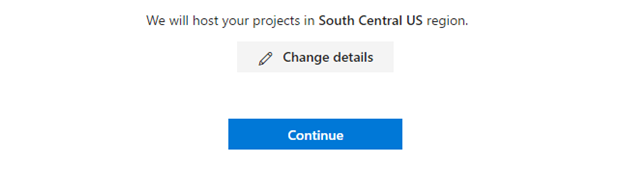
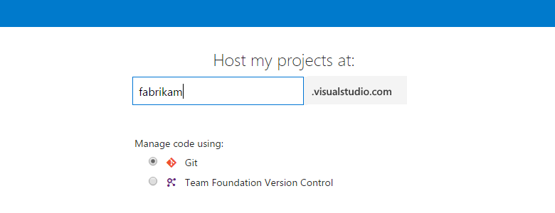
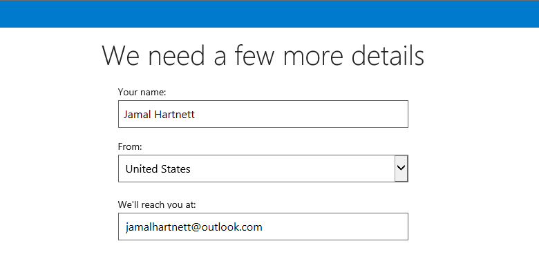

#	Sign up for Visual Studio Team Services: Git and agile, continuous integration, and continuous delivery

**Team Services**

Sign up for a [Visual Studio Team Services](https://www.visualstudio.com/products/visual-studio-team-services-vs) 
account to upload and share code in free unlimited private 
Git repositories or Team Foundation Version Control. 
Then connect your favorite development tool like Eclipse, Xcode, 
Visual Studio, IntelliJ, or Android Studio to work on apps anytime, anywhere. 
Visual Studio Team Services offers integrated, enterprise Agile tools for DevOps, 
so your team can build often, test early, and ship faster.

> Want to set up an on-premises server? 
> [Get Team Foundation Server here](https://www.visualstudio.com/products/tfs-overview-vs), 
> or learn [how to install and set up Team Foundation Server](../tfs/install/get-started.md). 


[What users can join for free?  What do they get in Visual Studio Team Services?](#free-users)


<a name="how-sign-up"></a>
##	What do I need to sign up for a Visual Studio Team Services account?

*	To get started quickly and use only Microsoft accounts 
	with your Team Services account, [sign up with a "personal" Microsoft account](#MicrosoftAccount). 

	Don't have a Microsoft account? 
	You can create a Microsoft account 
	when you sign up for Visual Studio Team Services.

*	To authenticate users and control account access through your 
	organization's directory (tenant) in Azure Active Directory (Azure AD), 
	[sign up with your organization's "work or school account"](#orgaccount). 

Use your Microsoft account if you don't need to authenticate users 
for an organization with [Azure Active Directory (Azure AD)](https://azure.microsoft.com/en-us/documentation/articles/active-directory-whatis/). 
All users must sign in with Microsoft accounts to your Team Services account.

Use your work or school account to **automatically connect** your Team Services account to your organization's directory. 
All users must be members in that directory to get access to your Team Services account.


<a name="MicrosoftAccount"></a>
##	Sign up for Visual Studio Team Services with a personal Microsoft account

0.	Go to [Visual Studio Team Services](https://go.microsoft.com/fwlink/?LinkId=307137&clcid=0x409). 
Enter your email address for your Microsoft account. 

	If you're a Visual Studio subscriber 
	and get Visual Studio Team Services as a benefit, 
	use the Microsoft account associated with your subscription. 

	

	Got [browser problems?](#browser-problems)

0.	On the Microsoft account sign-in page, 
enter your email address for your Microsoft account. 
Then enter your password, and finish signing in.

	

	If you don't have a Microsoft account, 
	you can create a Microsoft account at this time. 

	[Why am I asked to choose between my work or school account and my personal account?](#ChooseOrgAcctMSAcct)

0.	Name your Visual Studio Team Services account. 
To manage your code, choose Git or Team Foundation Version Control.

	

	Learn which version control ([Git](../../git/overview.md) 
	or [Team Foundation Version Control](../../tfvc/overview.md)) 
	works best for you.

0.	Confirm your account's location. 

	
	
	Team Services will create your first team project as "MyFirstProject" 
	and will use Agile as your default work item process to organize your work. 
	Choose **Change details** to 
	[rename your team project, change the account location, or select another process, like Scrum](#account-location).

	> [!IMPORTANT]
	> After you create your account, only members of the directory shown here can get access to your Team Services
	> account. If you belong to multiple directories, check that you want to connect this directory to your Team Services account.
	> Otherwise, change the directory now. This is easier than [changing the directory later](#ChangeDirectory).

0.	After Visual Studio Team Services creates your account and team project, 
add your code, work items, or more users.

	

	Congratulations, you're now a Visual Studio Team Services account owner! 

	To sign in to your Team Services account at any time, go to ```https://{youraccount}.visualstudio.com```.

	> [!NOTE]
	> If you activated your Visual Studio subscription with a Microsoft account, and your subscription includes Team Services
	> as a benefit, learn [how to add your work or school account](link-msdn-subscription-to-organizational-account-vs.md) to your
	> subscription so you can use your subscriber benefits in Team Services.


#### Next steps  

*	[Manage users and access](add-account-users-assign-access-levels-team-services.md)

*	Add code to Git or Team Foundation version control

	*	Git with [Eclipse](connect-to-visual-studio-team-services.md#eclipse), 
	[Xcode](../../git/share-your-code-in-git-xcode.md), 
	[Android Studio](http://java.visualstudio.com/Docs/tools/androidstudio), 
	[IntelliJ](http://java.visualstudio.com/Docs/tools/intelliJ), 
	[Visual Studio](connect-to-visual-studio-team-services.md#vs), or 
	[Visual Studio Code](https://code.visualstudio.com/docs/editor/versioncontrol)

	*	TFVC using [Eclipse](connect-to-visual-studio-team-services.md#eclipse), 
	[Xcode](../../tfvc/share-your-code-in-tfvc-xcode.md), 
	[Visual Studio](connect-to-visual-studio-team-services.md#vs), or 
	[Visual Studio Code](https://code.visualstudio.com/docs/editor/versioncontrol)

*	[Create your backlog](../../work/backlogs/create-your-backlog.md), 
	[manage your process](../../work/process/manage-process.md), 
	or [customize your process](../../work/process/customize-process.md)

<a name="orgaccount"></a>

##	Sign up for Visual Studio Team Services with a work or school account

Want to authenticate users and control access to your Team Services account 
the same way that you can with Microsoft services like Office 365 and Azure? 
When you sign up with a "work or school account" that's managed by your 
organization's directory (tenant) in [Azure Active Directory (Azure AD)](https://azure.microsoft.com/en-us/documentation/articles/active-directory-whatis/), 
your Team Services account is **automatically connected** to your organization's directory. 
You can then sign in to Team Services with the same username and password that you use with 
other Microsoft services. You can also enforce policies for accessing your team's critical 
resources and key assets. 

###  How does Azure AD control access to Visual Studio Team Services?

Visual Studio Team Services authenticates users through your organization's directory 
so that only users who are members in that directory can get access to your Team Services account. 
When users are removed from that directory, for example, because they've moved elsewhere, 
they can't access your account anymore. Only specific 
[Azure AD administrators](https://azure.microsoft.com/en-us/documentation/articles/active-directory-assign-admin-roles/) 
can manage users in your directory, so they control who can get 
access to your Visual Studio Team Services account.

Without Azure AD, you're solely responsible for controlling 
Team Services account access. And all users must sign in with Microsoft accounts. 
[What are other differences?](#SignInAccountDifferences)

###	What do I need to sign up for Visual Studio Team Services with a work or school account?

You'll need a work or school account that's managed by your organization's directory. 
If you use Azure or Office 365, you might have this already. If you don't, learn how to 
[sign up for Azure as an organization](https://azure.microsoft.com/en-us/documentation/articles/sign-up-organization/).

To use existing on-premises identities with Visual Studio Team Services, learn how to 
[use Azure AD Connect for integrating on-premises directories with Azure AD](https://azure.microsoft.com/en-us/documentation/articles/active-directory-aadconnect/).

<a name="SignIn"></a>

0.	Go to [Visual Studio Team Services](https://go.microsoft.com/fwlink/?LinkId=307137).
Enter the email address for your work or school account.

	

	Your sign-in page might look different, 
	based on the work or school account that you used.

	Got [browser problems?](#browser-problems)

0.	Enter your password for your work or school account.

	

	[Why am I asked to choose between my work or school account and my personal account?](#ChooseOrgAcctMSAcct)

0.	Name your Visual Studio Team Services account. 
To manage your code, choose Git or Team Foundation Version Control.

	

	Learn which 
	version control ([Git](../../git/overview.md) 
	or [Team Foundation Version Control](../../tfvc/overview.md)) 
	works best for you.

0.	Confirm your account's location and the **directory** 
that you're connecting to your Team Services account. 

	

	> [!IMPORTANT]
	> Team Services will create your first team project as "MyFirstProject" and will use Agile as the default work item
	> process to organize your work. Choose **Change details** to [rename your team project, change the account location, change the
	> directory, or select another process, like Scrum](#account-location). 
	> After you create your account, only members of
	> the directory shown here can get access to your Team Services account. If you belong to multiple directories, check that you want
	> to connect this directory to your Team Services account. Otherwise, change the directory now. This is easier than [changing the
	> directory later](#ChangeDirectory).

0.	After Visual Studio Team Services creates your account and team project, 
add code, work items, or more users. 

	

	Congratulations, you're now a Visual Studio Team Services account owner! 

	To sign in to your Team Services account at any time, 
	go to ```https://{youraccount}.visualstudio.com```.

	> [!NOTE]
	> If you activated your Visual Studio subscription with a Microsoft account, and your subscription includes Team Services
	> as a benefit, learn [how to add your work or school account](link-msdn-subscription-to-organizational-account-vs.md) to your
	> subscription so you can use your subscriber benefits in Team Services.

#### Next steps 

*	[Manage users and access](add-account-users-assign-access-levels-team-services.md) 

*	Add code to Git or Team Foundation version control

	*	Git with [Eclipse](connect-to-visual-studio-team-services.md#eclipse), 
	[Xcode](../../git/share-your-code-in-git-xcode.md), 
	[Android Studio](http://java.visualstudio.com/Docs/tools/androidstudio), 
	[IntelliJ](http://java.visualstudio.com/Docs/tools/intelliJ), 
	[Visual Studio](connect-to-visual-studio-team-services.md#vs), or 
	[Visual Studio Code](https://code.visualstudio.com/docs/editor/versioncontrol)

	*	TFVC using [Eclipse](connect-to-visual-studio-team-services.md#eclipse), 
	[Xcode](../../tfvc/share-your-code-in-tfvc-xcode.md), 
	[Visual Studio](connect-to-visual-studio-team-services.md#vs), or 
	[Visual Studio Code](https://code.visualstudio.com/docs/editor/versioncontrol)

*	[Create your backlog](../../work/backlogs/create-your-backlog.md), 
	[manage your process](../../work/process/manage-process.md), 
	or [customize your process](../../work/process/customize-process.md) 

*	[Manage access with Azure AD groups](manage-azure-active-directory-groups-visual-studio-team-services.md) 

## Q & A

<a name="free-users"></a>
#### Q: What users can join for free?  What do they get in Visual Studio Team Services?

A: Visual Studio Team Services is free for these users to join:

* 5 users who get [Basic features](https://www.visualstudio.com/team-services/compare-features/) 
like version control, tools for Agile, Java, build, release management, and more 

* Unlimited users who get [Stakeholder features](https://www.visualstudio.com/team-services/compare-features/) 
like working with your backlog, work items, and queries

* Unlimited [Visual Studio subscribers](https://www.visualstudio.com/team-services/compare-features/) 
who also get Basic features, and in some cases, additional features with specific extensions, like 
[Test Manager](https://marketplace.visualstudio.com/items?itemName=ms.vss-testmanager-web)

 Learn what else you get with [Visual Studio Team Services](https://www.visualstudio.com/team-services/pricing/).


<a name="browser-problems"></a>

[!INCLUDE [browser-problems](../../_shared/qa-browser-problems.md)]

####Q:  Which Visual Studio subscriptions can I use with Visual Studio Team Services?

A:	Go here to find 
[Visual Studio subscriptions that include Visual Studio Team Services](https://azure.microsoft.com/pricing/details/visual-studio-team-services/).

####Q:	Why am I asked to provide profile details?

A:	If you're a new user, you can change your profile details. 
You only have to do this step once. 

0.	Confirm your profile details. 

	

0.	Continue creating your Visual Studio Team Services account.

	

<a name="account-location"></a>

[!INCLUDE [account-location-process-template](../../_shared/qa-account-location-process-template.md)]

####Q:	Why are some features not available with my account?

A:	Some features require that you install an extension, 
which are available as free or paid. 

For example, [web-based test case management](https://marketplace.visualstudio.com/items?itemName=ms.vss-testmanager-web)
requires that you install the Test Manager extension, 
but you can [try paid extensions for free](try-additional-features-vs.md), 
if you haven't started the extension trials already. 
Otherwise, you can [pay for user access](https://www.visualstudio.com/get-started/marketplace/get-vsts-extensions) 
to these features.

####Q:	How many Visual Studio Team Services accounts can I create?

A:	You can [create multiple Visual Studio Team Services accounts](#create-another-account). 
But rather than create another account, you might consider 
[creating another team project](#another-team-project). 
Your account can have unlimited private team projects using Git or TFVC. 

There's no limit on how many Visual Studio Team Services accounts where you can be a member.  

<a name="create-another-account"></a>

####Q:	How do I create another Visual Studio Team Services account?

A:	Just sign in to your [Visual Studio profile](https://app.vsaex.visualstudio.com/profile/view).


<a name="another-team-project"></a>

[!INCLUDE [another-team-project](../../_shared/qa-another-team-project.md)]

[!INCLUDE [delete-team-project](../../_shared/qa-delete-team-project.md)]

[!INCLUDE [find-account-name](../../_shared/qa-find-account-name.md)]

[!INCLUDE [recover-password](../../_shared/qa-recover-password.md)]

[!INCLUDE [change-account-name-owner](../../_shared/qa-change-account-name-owner.md)]

[!INCLUDE [delete-account](../../_shared/qa-delete-account.md)]

<a name="SignInAccountDifferences"></a>
####Q:	What's the difference between using a Microsoft account and a work account or school account to sign up?

A:	Your choice affects how you control access and 
authenticate users for your Visual Studio Team Services account.

When you sign up with a Microsoft account:

*	You're solely responsible for managing access 
to your Visual Studio Team Services account.
*	All users must sign in with Microsoft accounts.

When you sign up with a work or school account:

*	Your Visual Studio Team Services account is 
automatically connected to your directory in Azure AD.
*	All users must members in the connected directory 
to get access to your Visual Studio Team Services account.
*	The directory administrator has control over who can join the directory.
*	You sign in with work or school accounts, 
or with Microsoft accounts if your company allows that.

To [add users to the directory](https://docs.microsoft.com/azure/active-directory/active-directory-create-users), 
you must be a directory administrator. If you don't have access, 
work with your directory administrator to add users.
Learn more about 
[work or school accounts for your organization](https://docs.microsoft.com/azure/active-directory/sign-up-organization).

<a name="ChangeDirectory"></a>
####Q:	Can I change the directory after signup?

A:	Yes, see [Change your account's Azure AD](change-azure-active-directory-team-services-account.md).

<a name="ChooseOrgAcctMSAcct"></a>

[!INCLUDE [choose-msa-azuread-account](../../_shared/qa-choose-msa-azuread-account.md)]

*	Choose **Work or school account** if you want to use your organization's directory 
to authenticate Team Services users and to control Team Services account access. 
This limits access to members in your organization's directory. 
All other users must sign in with work or school accounts too. 

*	Choose **Personal account** if you want to use your Microsoft account with Team Services. 
All other users must sign in with Microsoft accounts too.

[!INCLUDE [why-cant-sign-in-msa-azuread-account](../../_shared/qa-why-cant-sign-in-msa-azuread-account.md)]

[!INCLUDE [secure-protect-data](../../_shared/qa-secure-protect-data.md)]

[!INCLUDE [team-services-sla](../../_shared/qa-team-services-sla.md)]

<a name="get-support"></a>

[!INCLUDE [visual-studio-subscription-support](../../_shared/qa-visual-studio-subscription-support.md)]

[!INCLUDE [get-team-services-support](../../_shared/qa-get-team-services-support.md)]
