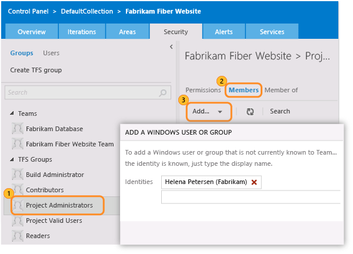
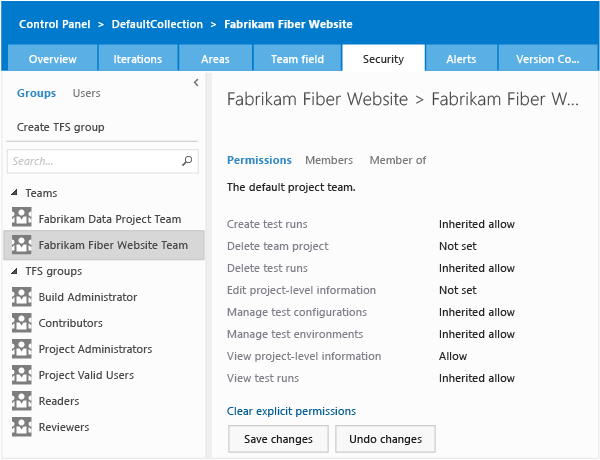
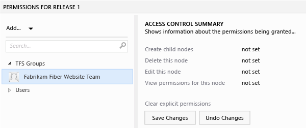

# Change permission levels in TFS

**TFS 2017** | **TFS 2015** | **TFS 2013**

As roles and responsibilities change in your team, you might need to
change the permission levels for individual team members, or for the
team as a whole. Permissions are different than access levels. If you're
just trying to give someone access to a product backlog or the provide
feedback features, you'll want to [change access levels](../../../work/connect/change-access-levels.md), not
permissions.

## A few things to know about permissions in TFS

There's a lot to learn about permissions, but here's some things you
should understand before you change any permissions in TFS:

-   Permissions **allow** or 
    **deny** users the ability to perform specific
    tasks, and are usually inherited from group membership.

-   A permission that is **not set** implicitly
    denies users the ability to perform tasks that require that
    permission, but allows membership in a group that does have that
    permission set to take precedence, also known as 
    **inherited allow** and 
    **inherited deny**.

-   For almost all permissions, **deny** trumps
    **allow**, so if a user belongs to two
    groups, and one of them has a specific permission set to 
    **deny**, that user will not be able to perform
    tasks that require that permission even if they belong to a group
    that has that permission set to **allow**.

-   Changing a permission for a group changes that permission for all
    users who are granted that permission through their membership in
    that group. In other words, depending on the size of the group, you
    might affect the ability of hundreds of users to do their jobs by
    changing just one permission. So make sure you understand the impact
    before you make a change. Two useful tricks for understanding the
    effects of change: The **member of** tab
    shows the groups that an individual user or group belongs to. You
    can also hover over an inherited permission, and a 
    **why?** icon will appear. If you choose it, a
    dialog box will open with more information.

## View your own permissions

The rest of the procedures in this topic require you to be a project
administrator, so first double-check that you are one.

1.  Open the administrative context for your team project.

2.  In the **security** tab, under users, find
    your own name, and look at what groups you belong to and what
    permissions you have.

3.  If you aren't a project administrator, you need to be. Find someone
    who is, and have them add you:

    

## Change permissions for the entire team

When a team is created, the team group is added to the 
**Contributors** group for the team project, by
default. So when you add a team member, that person is also added to the
**Contributors** group by virtue of being a
member of your team. If you want team members to have different
permissions, you can change the permissions for the team group. This
will not change the permissions for all users of the 
**Contributors** group, but just for members of that
one team.

1.  Now that you're a project administrator, go to the security tab and
    choose the team group whose permissions you want to change.

    

2.  Look at the permissions that the team group has by default. You'll
    see that a lot of them are set to **inherited
    allow**. That's because the team group is a member of the 
    **Contributors** group for the team project. To
    give the team group a different set of permissions than that group,
    choose a permission from the list and change it. For example, let's
    say you don't want anyone on this team to have permission to delete
    test runs, so change that permission from 
    **inherited allow** to 
    **deny**.

    

    Tip: It's a good idea to test changes in permissions immediately
    after you make them.

3.  Teams can also have specific permissions for the areas and
    iterations that they work in. Because areas and iterations affect an
    entire project, and not just the individual team, the default value
    is **not set**. Usually, project
    administrators don???t change this, but you can set
    them specifically. To do this, you must first navigate to areas or
    iterations and open the security context.

    

4.  Add the team group to the list of groups if it doesn't already
    appear there (by default, it won't until someone adds it), and then
    set the permissions for the group.

    

## Change permissions for individual users

Alternatively, you might want to manage the permissions of individual
team members. This takes a little more work and is more time-consuming
to manage, but allows you a finer degree of control over who can do
what.

1.  Go to the security tab and change views so that you're looking at
    users, not groups.

2.  Choose the user whose permissions you want to change and change it.
    For example, let's say you want a particular user to have permission
    to delete the team project. Set that permission to 
    **allow**.

    

    That **allow** will override the **not set** that exists for the team.
