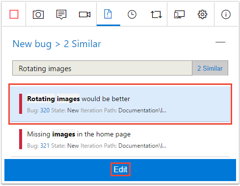
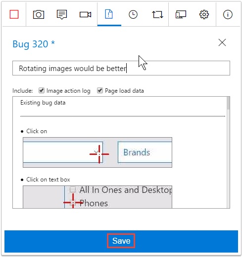
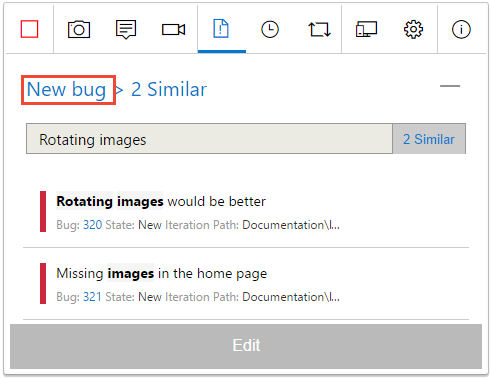

# Add findings to existing bugs with exploratory testing

[!INCLUDE [version-lt-eq-azure-devops](../includes/version-lt-eq-azure-devops.md)] 
 
To help avoid duplication, the Test &amp; Feedback extension automatically 
searches for and displays existing bugs, based on the keywords in the title as you file a new bug. You can choose to continue creating a new bug or add your findings to an existing bug.

## Prerequisites

[!INCLUDE [prerequisites](includes/prerequisites.md)] 

## Add your findings to a bug

1. Enter the title for a bug. 
   
   In the background, the extension searches for similar bugs that might be related to the issue you found and displays a link to the results.

2. Select the link to see the results that have similar title keywords.

   
 
   The form displays **0 Similar** if it doesn't find any matching bugs. In this case, or if you don't see a "similar" link, you can create a new bug that contains your screenshots, notes, and videos, as described in [Connected mode exploratory testing](connected-mode-exploratory-testing.md).
 
3. To update a bug, do the following tasks, rather than create a new one.

   - Choose it from the list and select **Edit**.
 
     

     The extension appends all your screenshots, notes, and videos to 
     the existing bug. 

   - Save the updated bug.

     

4. OR, if you decide not to update an existing bug, ignore the "similar" link and select  **New bug** to return to the bug details form.

     

   - Enter the details for the new bug and save it, as described in [Connected mode exploratory testing](connected-mode-exploratory-testing.md).
   
5. Continue to explore your app, file bugs and tasks, and create test cases. 

## See your exploratory session results 

After you file bugs, create tasks, or create test cases, they show up in the "Recent exploratory sessions" page in Azure Test Plans.

See how you can [view your sessions and get insights](insights-exploratory-testing.md).

## Related articles

* [Use the Test &amp; Feedback extension in Connected mode](connected-mode-exploratory-testing.md)
* [Explore work items with exploratory testing](explore-workitems-exploratory-testing.md)
* [Get insights across your exploratory testing sessions](insights-exploratory-testing.md)
* [Use the Test &amp; Feedback extension in Standalone mode](standalone-mode-exploratory-testing.md)
* [Exploratory testing with Microsoft Test Manager](/previous-versions/azure/devops/test/mtm/exploratory-testing-using-microsoft-test-manager)
* [Overview of manual and exploratory testing](index.yml)
 