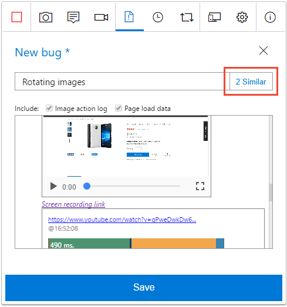
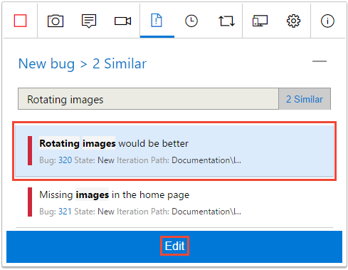
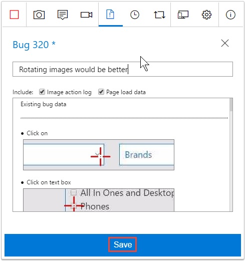
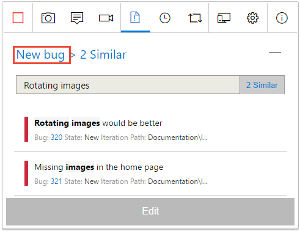

# Add findings to existing bugs with exploratory testing

[!INCLUDE [version-header](_shared/version-header.md)] 
 
To help avoid duplication, the Test &amp; Feedback extension automatically 
searches for and displays existing bugs, based on the keywords in the title,
as you file a new bug. You can choose to continue creating a new bug or add
your findings to an existing bug.

[!INCLUDE [feature-availability](_shared/feature-availability.md)] 

1. As you type the title for a new bug, in the background the extension 
   searches for similar bugs that might be related to the issue you've found
   and displays a link to the results. Choose this link to see the results that have 
   similar title keywords.

   
 
   The form displays **0 Similar** if it does not find any matching bugs.
   In this case, or if you don't see a "similar" link, you can create a
   new bug containing your screenshots, notes, and videos
   as described in [this topic](connected-mode-exploratory-testing.md).
 
1. If you see a bug you want to update, instead of creating a new one:

   - Select it in the list and choose **Edit**.
 
     

   - The extension appends all your screenshots, notes, and videos to 
     the existing bug. 

   - Save the updated bug.

     

1. If, instead, you decide not to update an existing bug, ignore the "similar" link and:

   - Choose the **New bug** link to return to the bug details form.

     

   - Enter the details for the new bug and save it
     as described in [this topic](connected-mode-exploratory-testing.md).

   
1. Continue exploring your app, filing bugs and tasks, and creating test cases. 

## See your exploratory session results 

After you file bugs, create tasks, or create test cases, all these show up in the "Recent exploratory sessions" page in Azure Test Plans or TFS.

* See how you can [view your sessions and get insights](insights-exploratory-testing.md).

## See Also

* [Use the Test &amp; Feedback extension in Connected mode](connected-mode-exploratory-testing.md)
* [Explore work items with exploratory testing](explore-workitems-exploratory-testing.md)
* [Get insights across your exploratory testing sessions](insights-exploratory-testing.md)
* [Use the Test &amp; Feedback extension in Standalone mode](standalone-mode-exploratory-testing.md)
* [Exploratory testing with Microsoft Test Manager](mtm/exploratory-testing-using-microsoft-test-manager.md)
* [Overview of manual and exploratory testing](index.md)

[!INCLUDE [help-and-support-footer](_shared/help-and-support-footer.md)] 
