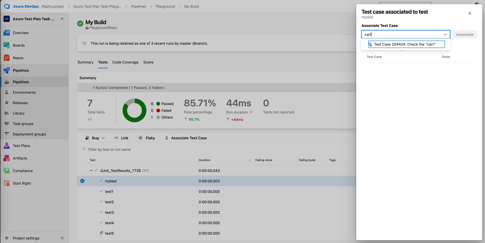

# Associate automated tests with test cases

[!INCLUDE [version-lt-eq-azure-devops](../includes/version-lt-eq-azure-devops.md)]
[!INCLUDE [version-vs-gt-2015](../includes/version-vs-gt-2015.md)]

Associating automated tests with test cases can enhance your testing process by providing better traceability and integration with your CI/CD pipeline. This article guides you through the scenarios where associating automated tests with test cases is beneficial and how to do it effectively.

## Create a test project and build pipeline

Do the following steps to create a test project and build pipeline.

1. Create a test project containing your automated test. For more information, see [what types of tests are supported](#test-types).
1. Check your test project into an Azure DevOps.
2. Create a build pipeline for your project and ensure that it contains the automated test. For more information, see [what the differences are if you're still using a XAML build](#xaml-build).

## Associate your automated test in Visual Studio  

Consider using Visual Studio to associate automated tests with a test case in the following scenarios:

- **Automating manual test cases**: If you created a manual test case that you later decide is a good candidate for automation, but you still want to run it as part of a test plan. You can run these tests in the CI/CD pipeline by selecting the test plan or test suite in the settings of the [Visual Studio Test](/azure/devops/pipelines/tasks/reference/vstest-v2) task. You can also run automated tests from the **Test Plans** web portal. If you're using XAML builds, you can [run these automated tests using Microsoft Test Manager](/previous-versions/azure/devops/test/mtm/run-automated-tests-with-microsoft-test-manager).

- **Enabling end-to-end traceability**: If your test cases are linked to requirements or user stories, you can use the results of the test execution to establish the quality of those requirements.

Do the following steps to associate your automated test with a test case in Visual Studio.

1. Open your solution in Visual Studio Enterprise or Professional 2017 or a later version.
2. If you don't know the identifier of the work item for the test case,
   locate the test case in **Azure Test Plans** , or [query for the work item](../boards/queries/using-queries.md) in the **Work** hub. 
3. When you know the identifier of the work item for the test case:

   **If you're using Visual Studio 2017 or later version**, do the following steps to associate your tests.

   - If the **Test Explorer** window isn't displayed, open it from the **Test | Windows** menu.
   - If your tests aren't displayed in **Test Explorer**, build the solution.
   - In **Test Explorer**, select the test method you want to associate and choose **Associate to Test Case**.
   - In the dialog that opens, type the test case identifier and choose **Add Association**, then choose **Save**.
    > [!div class="mx-imgBorder"]
    > 
    
   The dialog shows a list of test cases currently associated with the selected test method.
   You can't associate more than one test method with a test case, but you can associate a
   test method with more than one test case. 

   If you're using the build and release services in Azure DevOps, not a [XAML build](#xaml-build), you can run associated tests in the build and release pipelines by using the[Visual Studio Test](/azure/devops/pipelines/tasks/reference/vstest-v2) task. You _can't_ run tests on-demand using Microsoft Test Manager unless you're using a XAML build. 

   The parameters in a test case aren't used by any automated test that you associate with a test case. Iterations of a test case that use these parameters are for manual tests only.

For more information, see the following articles:
- [Add files to the server](../repos/tfvc/add-files-server.md)
- [Continuous integration on any platform](../pipelines/get-started/what-is-azure-pipelines.md)
- [Recording and Playing Back Manual Tests](/previous-versions/azure/devops/test/mtm/record-play-back-manual-tests)
- [Use UI Automation To Test Your Code](/visualstudio/test/use-ui-automation-to-test-your-code)

## Associate your automated test in Azure DevOps  
### Associate your test from a build pipeline 

1. Go to **Pipelines** and choose a pipeline where the desired automated test ran. 
2. Select a build where your tests ran.
3. In the **Tests** tab, find the automated test that you want to associate with a test case. 
4. Select the test and then **Associate Test Case**. 
5. Find the test case to which the automated test needs to be associated, and select **Associate**.

   > [!div class="mx-imgBorder"]
   > 

After you associate your automated tests with their corresponding test cases, you can utilize the Azure Test Plan task to execute them as part of a pipeline.

## FAQs about associating automated tests

See the following frequently asked questions (FAQs).

### Q: What types of tests are supported?

**A**: The following capabilities and limitations exist for each test type:

|Framework   |*Association in Visual Studio|Association in Azure DevOps|
|----------|-----------|------------|
|Coded UI tests|Supported       |Supported|
|Selenium|Supported   |Supported|
|MSTest v1/v2|Supported   |Supported|
|NUnit|Supported|Supported|
|xUnit|Supported|Supported|
|Python (PyTest)|Not Supported|Supported|
|Java (Maven and Gradle)|Not Supported|Supported|

\* Supported in Visual Studio 15.9 Preview 2 or later.

Tests that use the .NET core framework **can** be associated with a test case
  work item when using Visual Studio 15.9 Preview 2 or later.
  Run the .NET core tests. The appropriate target framework must be specified
  in a [.runsettings file](/visualstudio/test/configure-unit-tests-by-using-a-dot-runsettings-file?).

### Q: What are the differences if I'm still using a XAML build?

**A**: If you're using a XAML build in Azure Pipelines, you can run tests
that you associated in a Build-Deploy-Test workflow using a
[Lab environment](/visualstudio/test/lab-management/using-a-lab-environment-for-your-application-lifecycle).
You can also run tests using Microsoft Test Manager and a
[Lab environment](/visualstudio/test/lab-management/using-a-lab-environment-for-your-application-lifecycle).

### Q: Can I configure work items to open in Visual Studio?

**A**: Yes. If you want test work items to open inside Visual Studio
instead of the default Azure Pipelines UI in your web browser,
change the **Work Items | General** setting from the **Tools | Options** menu in Visual Studio.

## Related articles

* [Associate automated test results with requirements](../pipelines/test/requirements-traceability.md)
* [Run automated tests from test plans](run-automated-tests-from-test-hub.md)
* [Run automated tests with Microsoft Test Manager](/previous-versions/azure/devops/test/mtm/run-automated-tests-with-microsoft-test-manager)

