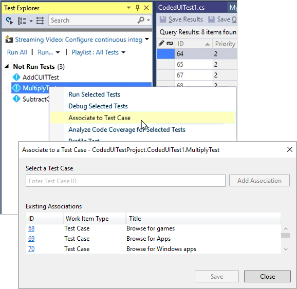
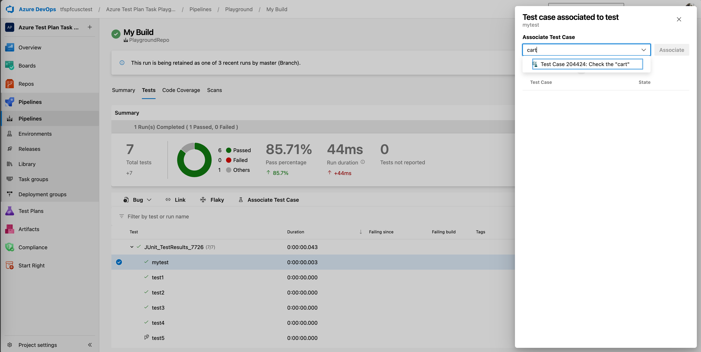
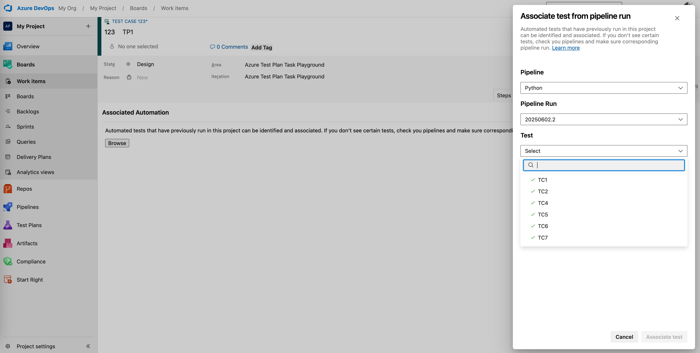
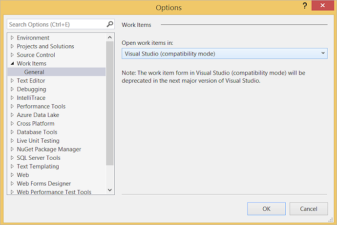

# Associate automated tests with test cases

[!INCLUDE [version-lt-eq-azure-devops](../includes/version-lt-eq-azure-devops.md)]

Associate automated tests with test cases to enable traceability between your test code and requirements. When you link an automated test method to a test case work item, you can:

- **Run automated tests from test plans** — Trigger automated tests on-demand from **Azure Test Plans** or as part of a CI/CD pipeline using the [Visual Studio Test](/azure/devops/pipelines/tasks/reference/vstest-v2) or [Azure Test Plan](/azure/devops/pipelines/tasks/reference/azure-test-plan-v0) task.
- **Track requirement quality** — When test cases are linked to requirements (user stories, PBIs), automated test results flow through to show requirement-level quality. For more information, see [Requirements traceability](../pipelines/test/requirements-traceability.md).
- **View results in Test Plans** — See automated test pass/fail results alongside manual test results in the [Test Run Hub](test-runs.md).

## Prerequisites

[!INCLUDE [prerequisites](includes/prerequisites.md)]

## Supported test frameworks

The following table shows which test frameworks support association in Visual Studio and in Azure DevOps:

| Framework | Association in Visual Studio | Association in Azure DevOps |
|---|---|---|
| MSTest v1/v2 | Supported | Supported |
| NUnit | Supported | Supported |
| xUnit | Supported | Supported |
| Selenium | Supported | Supported |
| Coded UI tests | Supported | Supported |
| Python (PyTest) | Not supported | Supported |
| Java (Maven and Gradle) | Not supported | Supported |

> [!NOTE]
> Tests that use the .NET Core framework can be associated with a test case when using Visual Studio 2017 version 15.9 or later. Specify the appropriate target framework in a [.runsettings file](/visualstudio/test/configure-unit-tests-by-using-a-dot-runsettings-file).

## Create a test project and build pipeline

1. Create a test project containing your automated tests. For more information, see the [supported frameworks table](#supported-test-frameworks).
1. Check your test project into Azure Repos or a connected GitHub repository.
1. Create a build pipeline for your project that includes the automated tests. For more information, see [Create your first pipeline](../pipelines/create-first-pipeline.md).

## Associate your automated test in Visual Studio  

Use Visual Studio to associate automated tests with test cases when you:

- **Automate existing manual test cases** — You created a manual test case and later wrote automated tests for the same scenario. Associating them lets you run the automated version from a test plan or CI/CD pipeline.
- **Enable end-to-end traceability** — When test cases are linked to requirements, automated test results establish quality metrics for those requirements.

1. Open your solution in Visual Studio 2017 or later (Enterprise or Professional edition).
2. Locate the test case work item ID. You can find it in **Azure Test Plans** or by [querying for the work item](../boards/queries/using-queries.md).
3. In **Test Explorer**, select the test method you want to associate and choose **Associate to Test Case**.

   > [!NOTE]
   > If **Test Explorer** isn't visible, open it from the **Test** menu. If your tests aren't displayed, build the solution first.

4. In the dialog, enter the test case ID, select **Add Association**, and then select **Save**.

   > [!div class="mx-imgBorder"]
   > 

> [!IMPORTANT]
> - You can associate a test method with multiple test cases, but you can't associate more than one test method with a single test case.
> - Test case parameters are for manual test iterations only. Automated tests don't use parameters defined on the test case work item.

After you associate your tests, you can run them in build and release pipelines by using the [Visual Studio Test](/azure/devops/pipelines/tasks/reference/vstest-v2) task, or run them on-demand from **Azure Test Plans**. For more information, see [Run automated tests from test plans](run-automated-tests-from-test-hub.md).

## Associate your automated test in Azure DevOps  

You can also associate automated tests directly from the Azure DevOps web portal, without using Visual Studio. This approach supports all [test frameworks](#supported-test-frameworks), including Python and Java tests that can't be associated from Visual Studio.

### Associate from a build pipeline 

1. Go to **Pipelines** and select a pipeline where your automated tests ran. 
2. Select the build run that contains the test results.
3. On the **Tests** tab, find the automated test you want to link with a test case.
4. Select the test and then select **Associate Test Case**. 
5. Find the test case you want to associate and select **Associate**.

   > [!div class="mx-imgBorder"]
   > 

### Associate from a work item 

1. Open a test case work item and go to the **Associated Automation** tab. 
2. Select **Browse**. 
3. From the side panel, select the pipeline and the specific run where the test previously ran.
4. Select the test you want to associate and select **Associate test**.

   > [!div class="mx-imgBorder"]
   > 

After you associate your automated tests, you can run them as part of a pipeline by using the [Azure Test Plan task](/azure/devops/pipelines/tasks/reference/azure-test-plan-v0) or the [Visual Studio Test task](/azure/devops/pipelines/tasks/reference/vstest-v2). For more information, see [Run automated tests from test plans](run-automated-tests-from-test-hub.md).

## Automation Status field

The **Automation Status** field on the test case work item reflects whether the test case is linked to an automated test method:

- **Not Automated** or **Planned** — Shown when the test case has no associated test method.
- **Automated** — Shown when the test case has an associated test method.

If the default values don't match your organization's needs, you can create a custom [pick-list field](../organizations/settings/work/customize-process-field.md#add-a-picklist) on the Test Case work item type.

## FAQs

### Q: Can I use tests from GitHub repositories?

**A:** Yes. As long as you run your automated tests in Azure Pipelines with the [Visual Studio Test task](/azure/devops/pipelines/tasks/reference/vstest-v2) or report the test results with the [Publish Test Results task](/azure/devops/pipelines/tasks/reference/publish-test-results-v2), the automated tests are available for association to test cases. The test must run at least once before it becomes available.

### Q: Can I configure work items to open in Visual Studio?

**A:** Yes. To have test work items open in Visual Studio instead of the web browser, change the **Work Items | General** setting from the **Tools | Options** menu in Visual Studio.

## Related content

- [Set up automated testing with Azure Test Plans](automated-testing-overview.md)
- [Run automated tests from test plans](run-automated-tests-from-test-hub.md)
- [Requirements traceability](../pipelines/test/requirements-traceability.md)
- [Review test results](../pipelines/test/review-continuous-test-results-after-build.md)
- [Test objects and terms](test-objects-overview.md)
- [What is Azure Pipelines?](../pipelines/get-started/what-is-azure-pipelines.md)

