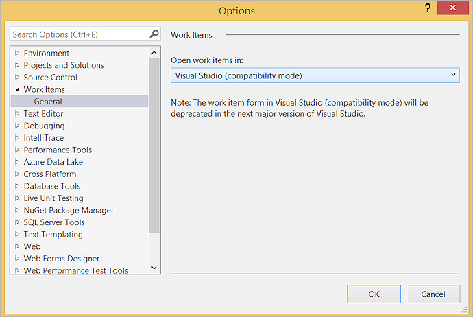

# Associate automated tests with test cases

[!INCLUDE [version-header](_shared/version-vs-only.md)] 

Consider using Visual Studio to associate automated tests with a test case when:

* You created a manual test case that you later decide is a good test
  to automate, but you still want to be able to run that test as part of a test plan.
  Tests can be run in the CI/CD pipeline by choosing the test plan or test suite
  in the settings of the [Visual Studio Test](../pipelines/tasks/test/vstest.md) task.
  Automated tests can also be run from [!INCLUDE [test-hub-include](_shared/test-hub-include.md)].
  If you are using XAML builds you can also
  [run these automated tests by using Microsoft Test Manager](mtm/run-automated-tests-with-microsoft-test-manager.md).

* You want to enable end-to-end traceability of requirements.
  If your test cases are linked to requirements or user stories,
  the results of the test execution can be used to establish the quality of those requirements. 

The process to associate an automated test with a test case is:

1. Create a test project containing your automated test.
   [What types of tests are supported?](#test-types)

1. Check your test project into an Azure DevOps or Team
   Foundation Server (TFS) repository.

1. Create a build pipeline for your project, ensuring that it
   contains the automated test.
   [What are the differences if I am still using a XAML build?](#xaml-build)

1. Use Visual Studio Enterprise or Professional 2017 or a later version to associate the automated
   test with a test case as shown [below](#add-test). The test case must have
   been added to a test plan that uses the build you just defined. 

If you are using the build and release services in
Azure DevOps or TFS (not a [XAML build](#xaml-build)), you can run associated tests in the 
build and release pipelines by using the
[Visual Studio Test](../pipelines/tasks/test/vstest.md) task.
You _cannot_ run tests on-demand using Microsoft Test Manager unless you are using a XAML build. 

The parameters in a test case are not used by any automated test that
you associate with a test case. Iterations of a test case that use these
parameters are for manual tests only.

> For more information about checking in your test project and team build, see
[Add files to the server](../repos/tfvc/add-files-server.md)
and [Continuous integration on any platform](../pipelines/overview.md).
For more information about action recordings and coded UI tests, see 
[Recording and Playing Back Manual Tests](mtm/record-play-back-manual-tests.md)
and [Use UI Automation To Test Your Code](https://docs.microsoft.com/visualstudio/test/use-ui-automation-to-test-your-code).

## Associate your test  

1. Open your solution in Visual Studio Enterprise or Professional 2017 or a later version.

1. If you don't know the identifier of the work item for the test case,
   locate the test case in [!INCLUDE [test-hub-include-nolink](_shared/test-hub-include-nolink.md)], or [query for the work item](../boards/queries/using-queries.md) in the **Work** hub. 

1. When you know the identifier of the work item for the test case:

   **If you are using Visual Studio 2017 or later**, follow these steps to associate your tests.

   - If the **Test Explorer** window is not displayed, open it from the **Test | Windows** menu.

   - If your tests are not displayed in **Test Explorer**, build the solution.

   - In **Test Explorer**, select the test method you want to associate and choose **Associate to Test Case**.

   - In the dialog that opens, type the test case identifier and choose **Add Association**, then choose **Save**.

   

   > The dialog shows a list of test cases currently associated with the selected test method.
   You cannot associate more than one test method with a test case, but you can associate a
   test method with more than one test case. 

## FAQ

### Q: What types of tests are supported?

**A**: These are the limitations for each type of test:

* Coded UI test, Selenium tests, and unit tests written using
  Version 1 of the MSTest framework **can** be associated with a test case.
* Tests that use MSTest v2, NUnit, and xUnit frameworks **can** be associated
  with a test case workitem when using Visual Studio 15.9 Preview 2 or later.
  However, these tests cannot be run using Microsoft Test Manager and XAML builds.
* Tests that use the .NET core framework **can** be associated with a test case
  workitem when using Visual Studio 15.9 Preview 2 or later.
  To run the .NET core tests the appropriate target framework must be specified
  in a [runsettings file](https://docs.microsoft.com/visualstudio/test/configure-unit-tests-by-using-a-dot-runsettings-file).
  However, these tests cannot be run using Microsoft Test Manager and XAML builds.
* Tests that use other test frameworks such as Chutzpah (for JavaScript tests
  such as Mocha or QUnit), or Jest **cannot** be associated with a test case.
* Associating generic tests **may** work, but running these tests is not supported.

### Q: What are the differences if I am still using a XAML build?

**A**: If you are using a XAML build in Azure Pipelines or TFS, you can run tests
that you have associated in a Build-Deploy-Test workflow using a
[Lab environment](https://docs.microsoft.com/visualstudio/test/lab-management/using-a-lab-environment-for-your-application-lifecycle).
You can also run tests using Microsoft Test Manager and a
[Lab environment](https://docs.microsoft.com/visualstudio/test/lab-management/using-a-lab-environment-for-your-application-lifecycle).

### Q: Can I configure work items to open in Visual Studio?

**A**: Yes, if you want test work items to open inside Visual Studio
instead of the default Azure Pipelines or TFS UI in your web browser,
change the **Work Items | General** setting from the **Tools | Options** menu in Visual Studio.

## See Also

* [Associate automated test results with requirements](associate-automated-results-with-requirements.md)
* [Run automated tests from test plans](run-automated-tests-from-test-hub.md)
* [Run automated tests with Microsoft Test Manager](mtm/run-automated-tests-with-microsoft-test-manager.md)

[!INCLUDE [help-and-support-footer](_shared/help-and-support-footer.md)] 
