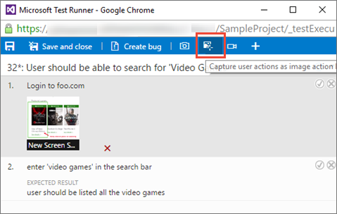
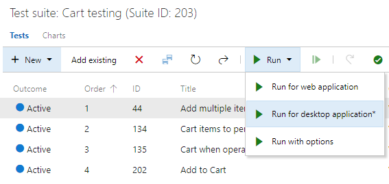

# Collect diagnostic data while testing

[!INCLUDE [version-header-tfs17](_shared/version-header-tfs17.md)] 

Collect diagnostic data while testing your apps.
This data will be included in the bugs you file 
during the test. You can collect diagnostic data from
web apps and from desktop apps, and view it in Team 
Services or Team Foundation Server.

* [Collect diagnostic data from web apps](#collect-web)
* [Collect diagnostic data from desktop apps](#collect-desktop)

[!INCLUDE [feature-availability](_shared/feature-availability.md)] 

## Collect diagnostic data from web apps

For web apps under test, you can use web-based Microsoft Test Runner 
to collect the following data on demand:

* [Screen captures](#web-screenshot)
* [Image action log](#web-log)
* [Screen recordings](#web-recording)

>The following diagnostic data collection features currently 
work only with the web-based Microsoft Test runner. See 
[Exploratory test and submit feedback directly from your browser](perform-exploratory-tests.md)

### Screen capture

Capture annotated screenshots from your web app. 

1. Ensure that the tab of the app from which you want to 
   capture data is the active tab.

1. Open Test Runner and choose the **Capture screenshot** icon. 

    

1. Choose the title of the tab containing the app 
   you are testing.

    

   If the tab title you want is not shown in the list,
   switch to the app and activate it by tapping on the title bar, 
   or on a child window if the app has opened one.
 
1. Drag to select the area of the screen you want to 
   capture, or just capture the full screen.
 
    

1. If required, edit the title of the screenshot and add 
   annotations and text to it using the icons in the toolbar.

    
 
1. Save your screenshot.  

    
 

### Image action log

Capture your interactions with the web app as an image action log that provides context.

1. Ensure that the tab of the app from which you want to 
   capture data is the active tab.

1. Open or switch to the Test Runner and choose the **Capture user actions...** icon. 
 
    

1. Choose the title of the tab containing the app 
   you are testing.
 
    

   If the tab title you want is not shown in the list,
   switch to the app and activate it by tapping on the title bar, 
   or on a child window if the app has opened one.

1. The Test Runner will now record all the actions you take
   on the app's browser tab.
 
    

   If you create a bug while recording your actions, all the 
   data collected up to that point will be included in the bug. 

1. Finish capturing your actions by choosing
   the **Stop** button. The action log is added to the test results 
   as an attachment.

    

1. Choose the **ActionLog...** link at the bottom of the window
   to view the data captured in the action log.

    

   The log opens in your web browser.

    

### Screen recording

Capture screen recordings from your web apps.

1. Ensure that the tab of the app from which you want to 
   capture data is the active tab.

1. Open or switch to the Test Runner and choose the **Record screen** icon. 
 
    

1. Choose the entire screen, or choose an app to start recording.
 
    

   If you create a bug while recording your screen, the 
   recording automatically stops and is added to the bug. 

1. Finish recording your actions by choosing
   the **Stop** button. The recording is added to the test results 
   as an attachment.
 
    

   If you do not stop the recording after ten minutes, it stops
   automatically and is saved as an attachment to your test results.
   Restart the recording the **Record screen** icon if required. 

1. Choose the **ScreenRecording...** link at the bottom of the window
   to view the captured recording.

    

### View the diagnostic data
 
When you create a bug while capturing diagnostic data, all the data captured 
up to that point is included in the bug that is created. You can
view it before you save the bug.

 

[How do I play the video recordings I created with the extension?](reference-qa.md#recording-playback)

## Collect diagnostic data from desktop apps

At present you can collect only screen recordings and system 
information when testing desktop apps using the web-based 
Microsoft Test Runner. Instead, use 
[Microsoft Test Manager client](https://visualstudio.microsoft.com/products/visual-studio-test-professional-with-msdn-vs.aspx)
to collect additional diagnostic from desktop apps.

1. Open the [!INCLUDE [test-hub-include](_shared/test-hub-include.md)], 
   select a test case, test suite, or test plan to execute.

1. Open the **Run** menu and choose **Run with options**.

    

1. In the **Run with options** dialog, select **Microsoft 
   Test Runner 2017 or later** in the first drop-down list. 

    
 
1. Choose the data collectors you want to enable. Options include 
   Event log, Action log, Screen and voice recorder, and System information.

    
 
   By default, the test runner client lets you to capture screenshots of your 
   desktop app during testing.

1. If you wish, select a build to associate with your test run.
   A link to this build will be included automatically in all the 
   bugs you create during the test run.

    

1. Choose **OK** to start testing. 

If you want to collect advanced diagnostic data such as code coverage, 
IntelliTrace, and Test Impact data in addition to the data items listed above,
you must [configure the data collectors](mtm/collect-more-diagnostic-data-in-manual-tests.md)
and other run settings in Microsoft Test Manager and run your 
tests using Microsoft Test Manager. For more details, see 
[Run manual tests with Microsoft Test Manager](mtm/run-manual-tests-with-microsoft-test-manager.md).

> [!NOTE]
> If you have an older version of Microsoft Test Manager, we recommend you upgrade to the latest version.
> However, if you have Microsoft Test Manager 2015 or an earlier version installed, you can choose **Microsoft Test Runner 2015 and earlier** when you launch the test runner using **Run with options**.
> You must [configure the data collectors](mtm/collect-more-diagnostic-data-in-manual-tests.md) and other run settings in Microsoft Test Manager and specify these as the default settings for the test plan.
> For more details, see [Run manual tests with Microsoft Test Manager](mtm/run-manual-tests-with-microsoft-test-manager.md).

## See also

* [Exploratory test and submit feedback directly from your browser](perform-exploratory-tests.md)
* [Overview of manual and exploratory testing](index.md)

[!INCLUDE [help-and-support-footer](_shared/help-and-support-footer.md)] 
