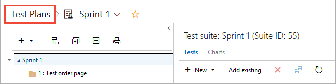
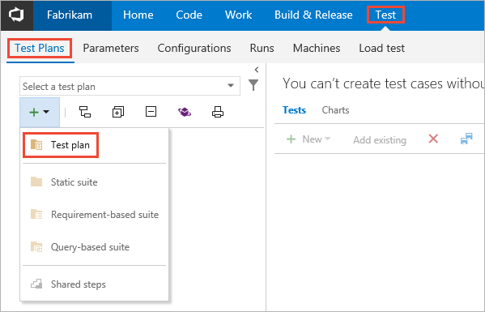
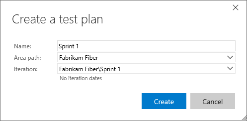
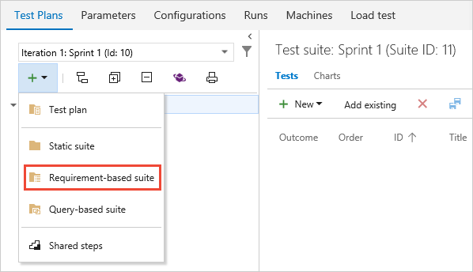
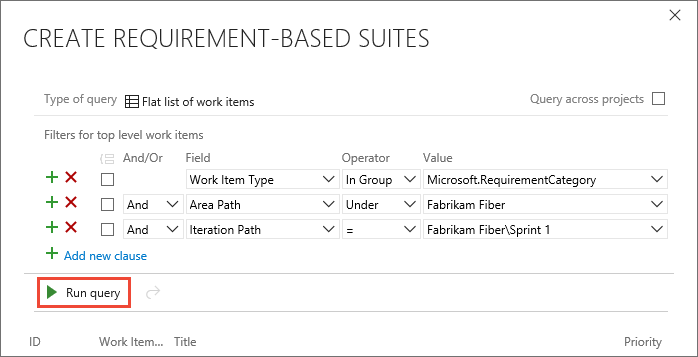
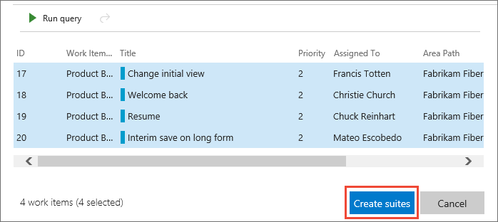
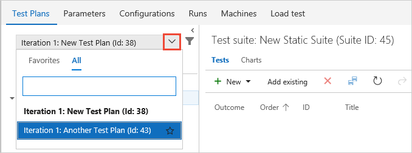

# Create test plans and test suites

[!INCLUDE [version-header](_shared/version-header.md)] 

Create test plans and test suites for your teams to use to track manual testing for sprints or milestones.
That way, you can see when the testing for a specific sprint or milestone is complete.
For more information about manual testing, see [Planned manual testing](overview.md#planned-manual-testing)
and [Automated and Manual Testing with Azure Test Plans](https://www.youtube.com/watch?v=LF0hmSysWCg).

## What are test plans, test suites, and test cases?

[!INCLUDE [test-hub-include](_shared/test-hub-include.md)] provides three main types of 
test management artifact: test plans, test suites, and test cases.
These are stored in your work repository as special types of
work items, allowing you to export and share them with your team,
and benefit from close integration for all of your DevOps tasks. 

* **Test plans** are used to group together test suites and individual test cases.
  This includes static test suites, requirement-based suites, and
  [query-based suites](reference-qa.md#query-based-suites). 

* **Test suites** are used to group test cases into separate testing scenarios within a single test plan.
  This makes it easier to see which scenarios are complete.

* **Test cases** are used to validate individual parts of your code or app deployment to ensure it performs correctly, has no errors, and
  meets business and customer requirements. You can add individual test cases to a test plan without creating
  a test suite if you wish. Test cases can be referenced in more than one test suite and test plan, meaning
  you can effectively reuse them without needing to copy or clone them for each suite or plan.
  See [Create manual test cases](create-test-cases.md).

**For example**:

You are building version 1.* of your product and you might create several **test cases** for that version.
Each of these test cases can be updated, and more added, at any time. For each development cycle and release of
your product you create a **test plan** (a unit of execution) and import the existing test cases into that plan.
You can also, if you wish, divide the test cases into separate **test suites** within the plan to enable easier
management and monitoring of these separate sets of test cases.

After you create your test plan, you [assign test configurations](test-different-configurations.md)
and [assign testers](create-test-cases.md#assign-testers) to cover the required test matrix.
These testers [execute the tests](run-manual-tests.md) to gauge the quality of the product, and continue testing until the required exit criteria is met.
For the next development cycle and release, you can create a new test plan and reuse the same test cases.
You repeat this development-test-release cycle by importing the same test cases into each new test plan.

The great thing is that, because the test cases are _referenced_ in the test plans, updates to a test case are automatically
reflected in all the test plans and test suites that use it.

Then, in the next version of the product, you can reuse the existing test cases. However, a better option may be
to [copy or clone the test cases](reference-qa.md#creating-manual-test-cases) to create a new baseline,
where changes to these new test cases do not affect those referenced in test plans for the previous version of the product.
 
> For more details of the ways you can work with test plans, test suits, and test cases, see the [FAQs for manual testing](reference-qa.md#testplans).

[!INCLUDE [feature-availability](_shared/feature-availability.md)] 

**Note**: Stakeholders cannot create or manage test plans. You must have at least Basic access.
See [Default manual testing permissions and access](manual-test-permissions.md).

## Create a test plan

1. If you want to use Azure DevOps, and haven't done so already, 
   [sign up for Azure DevOps](https://visualstudio.microsoft.com/products/visual-studio-team-services-vs), 
   [create your project](../organizations/accounts/organization-management.md), 
   and [create your backlog](../boards/backlogs/create-your-backlog.md). 

1. In Azure DevOps or TFS, open your project and go to [!INCLUDE [test-hub-include](_shared/test-hub-include.md)].
   If you already have a test plan, choose the **Test Plans** breadcrumb to go to the page that lists all test plans.

   

1. In the **Test Plans** list page, choose **+ New Test Plan** to create a test plan for your current sprint.
 
   

1. In the **New Test Plan** dialog, enter a name for the test plan.
   Check the area path and iteration are set as you require. Then choose **Create**.

    

> You can also create a test plan and a test suite automatically when you create a test from a User Story work item in Azure Boards or TFS.
> Open the shortcut menu for the work item and choose **Add test**.    

## Add a requirement-based test suite and select backlog items to test

1. Now add test suites for the backlog items that need manual tests 
   (these could be user stories, requirements, or other work items based on the setup of your project).
   To add a suite to a test plan, open the **+** (New) list and chose the type of suite you require.

    

   You use requirement-based suites to group your test cases together. 
   That way, you can track the testing status of a backlog item. 
   Each test case that you add to a requirement-based test suite is 
   automatically linked to the backlog item.

1. In the **Create requirement-based suites** dialog, add one or more clauses to filter
   your work items by the iteration path for the sprint. Run the query to view the matching backlog items.

   

1. In the list of work items returned by the query, select the backlog items you want to
   test in this sprint. Choose **Create suites** to create a requirement-based suite for each one.

   

## Find a test case in a test plan

* In the **Test Plans** page for your test plan, use the
   filter icon (**1**) to
  show the search and filter lists (**2**) that help you find the tests you want
  to work with. Or filter the list of tests using the **Outcome**, **Tester**,
  and **Configuration** drop-downs (**3**). 

  
  
## See also

* [FAQs for manual testing](reference-qa.md#testplans)
* [Link test cases to work items](../boards/queries/link-work-items-support-traceability.md)

##  Next step

> [!div class="nextstepaction"]
> [Create manual test cases](create-test-cases.md#test-cases) 
