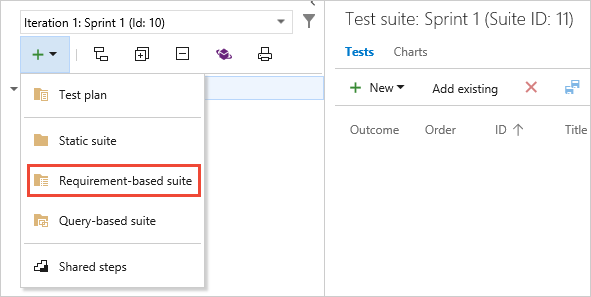
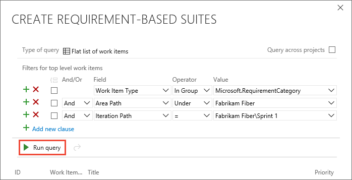
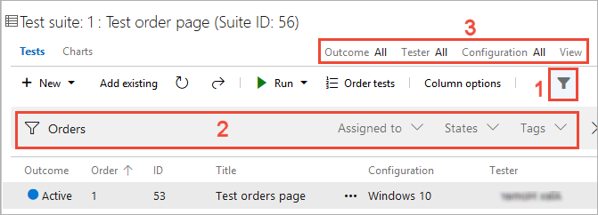

# Create test plans and test suites

[!INCLUDE [version-header](includes/version-header.md)] 

Create test plans and test suites to track manual testing for sprints or milestones.
That way, you can see when the testing for a specific sprint or milestone is complete.
For more information about manual testing, see [Planned manual testing](overview.md#planned-manual-testing) and [Automated and Manual Testing with Azure Test Plans](https://www.youtube.com/watch?v=LF0hmSysWCg).

[!INCLUDE [prerequisites-define](includes/prerequisites-define.md)] 

## Create a test plan

If you want to use Azure Test Plans, and haven't done so already, [sign up for Azure DevOps Services](https://visualstudio.microsoft.com/products/visual-studio-team-services-vs).

You need a project. For more information, see [create your project](../organizations/accounts/organization-management.md). Then [create your backlog](../boards/backlogs/create-your-backlog.md).

1. In Azure DevOps Services or Azure DevOps Server, open your project and go to [!INCLUDE [test-hub-include](includes/test-hub-include.md)].
   If you already have a test plan, choose **Test Plans** to go to the page that lists all test plans.

   

1. In the **Test Plans** page, choose **New Test Plan** to create a test plan for your current sprint.
 
   

1. In **New Test Plan**, enter a name for the test plan.
   Verify that the area path and iteration are set correctly, then choose **Create**.

    

> [!TIP]
> You can also create a test plan and a test suite automatically when you create a test from a User Story work item in Azure Boards or Azure DevOps Server.
> Open the shortcut menu for the work item and choose **Add test**.

## Add a requirement-based test suite and select backlog items to test

Now add test suites for the backlog items that need manual tests. These tests could be user stories, requirements, or other work items based your project.

1. To add a suite to a test plan, select the **+** new drop-down list and choose a type of test suite.

    

   You use requirement-based suites to group your test cases together.
   That way, you can track the testing status of a backlog item.
   Each test case that you add to a requirement-based test suite is automatically linked to the backlog item.

1. In **Create requirement-based suites**, add one or more clauses to filter your work items by the iteration path for the sprint.
   Run the query to view the matching backlog items.

   

1. In the list of work items returned by the query, select the backlog items you want to test in this sprint.
   Choose **Create suites** to create a requirement-based suite for each one.

   

## Find a test case in a test plan

In **Test Plans** for your test plan, use the :::image type="icon" source="media/create-a-test-plan/filter-icon.png" border="false"::: filter icon (**1**) to show the search and filter lists (**2**) that help you find the tests you want to work with.
Or filter the list of tests using **Outcome**, **Tester**, and **Configuration** (**3**).

  
  
##  Next steps

> [!div class="nextstepaction"]
> [Create manual test cases](create-test-cases.md#test-cases) 

## Related articles

* [FAQs for manual testing](reference-qa.md#testplans)
* [Link test cases to work items](../boards/queries/link-work-items-support-traceability.md)
