# Create test plans and test suites

[!INCLUDE [version-lt-eq-azure-devops](../includes/version-lt-eq-azure-devops.md)]

Create test plans and test suites to track manual testing for sprints or milestones.
That way, you can see when the testing for a specific sprint or milestone is complete.
For more information about manual testing, see [What is Azure Test Plans?](overview.md).

## Share work items across your test experience

For example, you're building version 1.* of your product and you might create several test cases for that version.
Each of these test cases can be updated, and more added, at any time.
For each development cycle and release of your product, you create a test plan and import the existing test cases into that plan.
You can also, if you wish, divide the test cases into separate test suites within the plan to enable easier management and monitoring of these separate sets of test cases.

After you create your test plan, you [assign test configurations](test-different-configurations.md) and [assign testers](create-test-cases.md#assign-testers) to cover the required test matrix.
These testers [run the tests](run-manual-tests.md) and gauge the quality of the product.
Testers continue testing until the product meets exit criteria.
For the next development cycle and release, you can create a new test plan and reuse the same test cases.
You repeat this development-test-release cycle by importing the same test cases into each new test plan.

The great thing is that, because test plans refer to test cases, updates to a test case automatically reflect in all the test plans and test suites that use it.

In the next version of the product, you can reuse the existing test cases.
However, a better option may be to [copy or clone the test cases](reference-qa.yml#create-manual-test-cases). A copy creates a new baseline. Changes to these new test cases don't affect your previous test plans.

> [!TIP]
> For more information about the ways you can work with test plans, test suites, and test cases, see the [FAQs for manual testing](reference-qa.yml#testplans).

[!INCLUDE [prerequisites-define](includes/prerequisites-define.md)] 

[!INCLUDE [note-new-ui](includes/note-new-ui.md)] 

## Create a test plan

::: moniker range=">=azure-devops-2020"
In general, you create test plans to test requirements. Before creating a test plan, you may want to [define your backlog of requirements](../boards/backlogs/create-your-backlog.md).

1. From the web portal, open your project and go to **Test Plans**.
   If you already have a test plan, select **Test Plans** to go to the page that lists all test plans.

   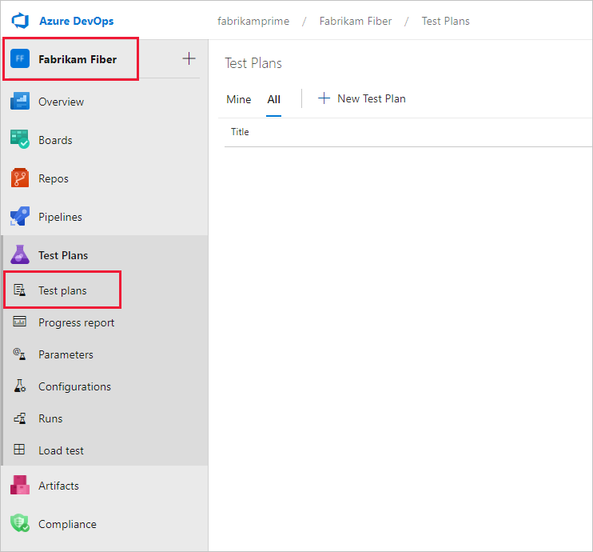

1. In the **Test Plans** page, select **New Test Plan** to create a test plan for your current sprint.

   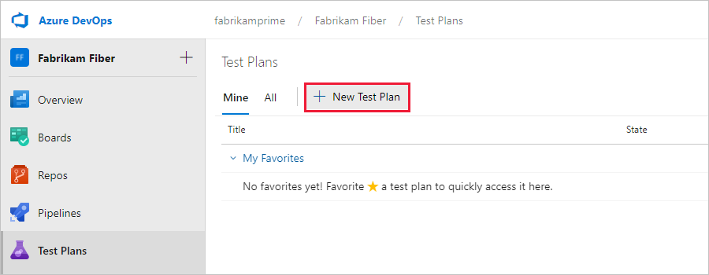

1. In **New Test Plan**, enter a name for the test plan.
   Verify that the area path and iteration are set correctly, then select **Create**.

   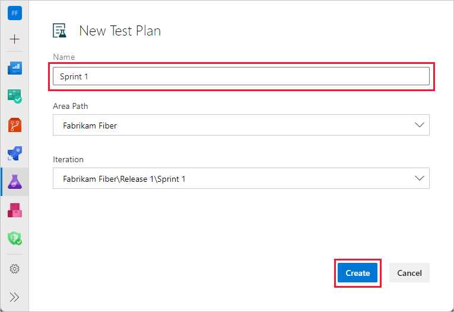

### Rename a test plan

To rename a test plan, use this procedure:

1. Select **Test Plans** to view test plans.

1. Next to the test plan name, select **More Actions** > **Edit**.

   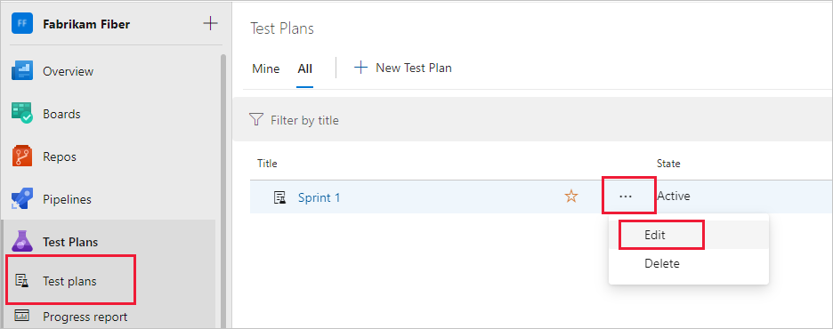

1. Change the name and then select **Save & Close**.

You can make other changes to the test plan here.

### Delete a test plan

To delete a test plan, use this procedure:

1. Select **Test Plans** to view test plans.

1. Next to the test plan name, select **More Actions** > **Delete**.

1. The **Permanently delete test artifacts** dialog box explains exactly what will be deleted. Type the test plan ID to confirm that you want to delete, and then select **Permanently delete**.

   

::: moniker-end

::: moniker range="<=azure-devops-2019"
In general, you create test plans to test requirements. Prior to creating a test plan, therefore, you may want to [define your backlog of requirements](../boards/backlogs/create-your-backlog.md). 

1. From the web portal, open your project and go to **Test Plans**.
   If you already have a test plan, choose **Test Plans** to go to the page that lists all test plans.

   

1. In the **Test Plans** page, choose **New Test Plan** to create a test plan for your current sprint.
 
   

1. In **New Test Plan**, enter a name for the test plan.
   Verify that the area path and iteration are set correctly, then choose **Create**.

    

### Rename a test plan

To rename a test plan, open it from the shortcut menu and rename it.

### Delete a test plan

To delete a test plan, use the shortcut menu for the test plan.

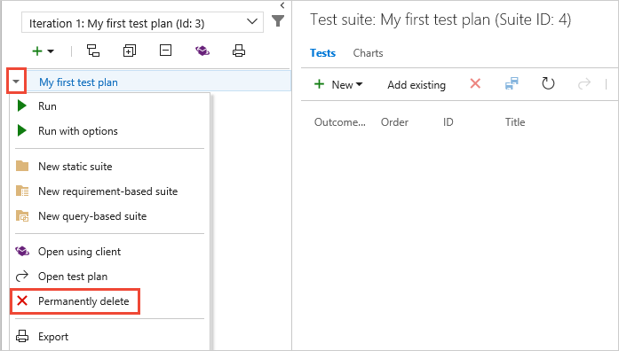

::: moniker-end

## Add a requirement-based test suite

::: moniker range=">=azure-devops-2020"
Now add test suites for the backlog items that need manual tests. These tests could be user stories, requirements, or other work items based your project.

> [!NOTE]
> Requirement tracking is supported only for test cases linked through a **Requirement-based test suite**. Work items include a User Story ([Agile](../boards/work-items/guidance/agile-process.md)), Product Backlog Item ([Scrum](../boards/work-items/guidance/scrum-process.md)), Requirement ([CMMI](../boards/work-items/guidance/cmmi-process.md)), and Issue ([Basic](../boards/get-started/plan-track-work.md)). The association between a requirement work item and manual test execution is only formed when the test case is linked by using a **Requirement-based test suite**.

1. To add a suite to a test plan, select **More options** for the test suite, and then select **New Suite** > **Requirement based suite**.

   

   You use requirement-based suites to group your test cases together.
   That way, you can track the testing status of a backlog item.
   Each test case that you add to a requirement-based test suite is automatically linked to the backlog item.

1. In **Create requirement-based suites**, add one or more clauses to filter your work items by the iteration path for the sprint.
   Run the query to view the matching backlog items.

   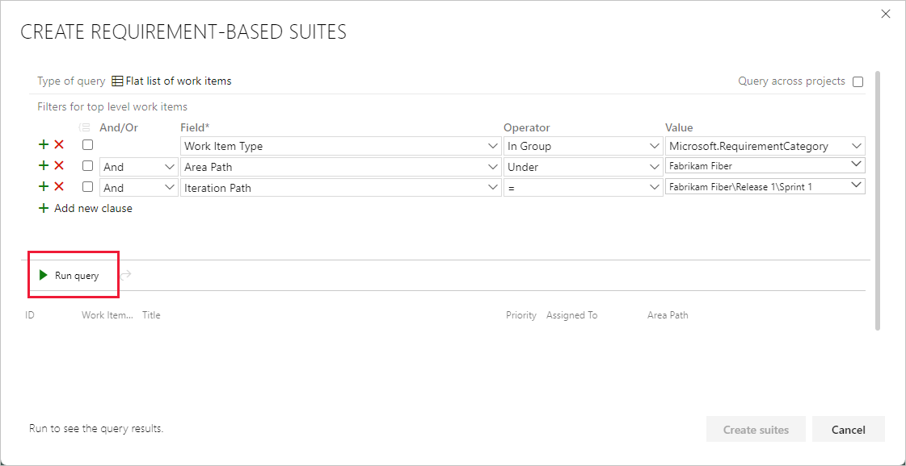

1. In the list of work items returned by the query, select the backlog items you want to test in this sprint.
   Select **Create suites** to create a requirement-based suite for each one.

   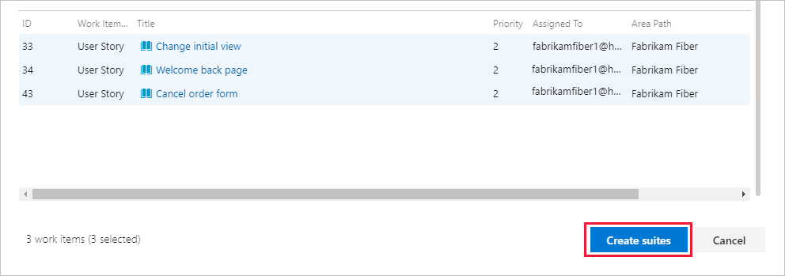

::: moniker-end

::: moniker range="<=azure-devops-2019"
Now add test suites for the backlog items that need manual tests. These tests could be user stories, requirements, or other work items based your project.

> [!NOTE] 
> Requirement tracking is supported only for test cases linked through a **Requirement-based test suite**. The association between a requirement work item&mdash;User Story ([Agile](../boards/work-items/guidance/agile-process.md)), Product Backlog Item ([Scrum](../boards/work-items/guidance/scrum-process.md)), Requirement ([CMMI](../boards/work-items/guidance/cmmi-process.md)), or Issue ([Basic](../boards/get-started/plan-track-work.md)) and manual test execution is only formed when the test case is linked via a **Requirement-based test suite**. 

1. To add a suite to a test plan, select the **+** new drop-down list and choose a type of test suite.

    

   You use requirement-based suites to group your test cases together.
   That way, you can track the testing status of a backlog item.
   Each test case that you add to a requirement-based test suite is automatically linked to the backlog item.

1. In **Create requirement-based suites**, add one or more clauses to filter your work items by the iteration path for the sprint.
   Run the query to view the matching backlog items.

   

1. In the list of work items returned by the query, select the backlog items you want to test in this sprint.
   Choose **Create suites** to create a requirement-based suite for each one.

   

::: moniker-end

## Work with test suites

You can create a static test suite that can contain any type of test suites. Use these test suites like folders. Drag test suites to group them in a static test plan. Drag and drop tests to reorder them.

::: moniker range=">=azure-devops-2020"
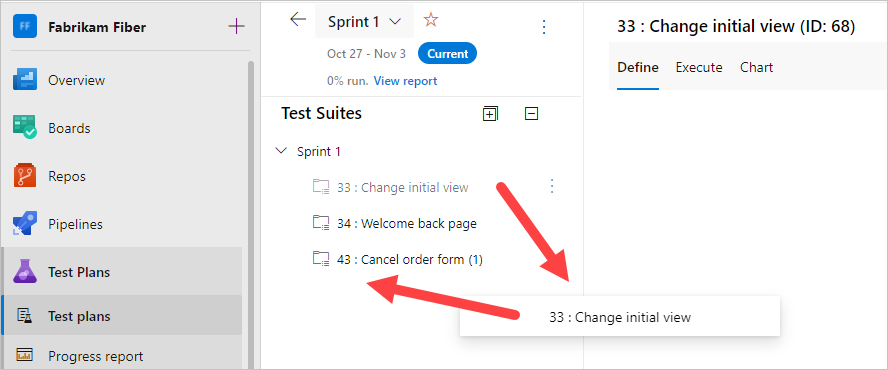

::: moniker-end

::: moniker range="<=azure-devops-2019"
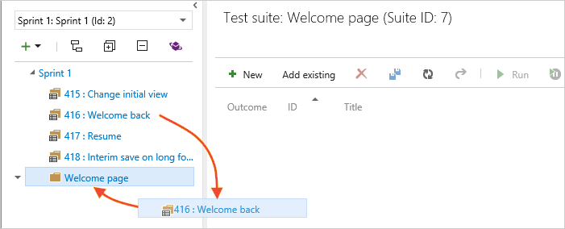
::: moniker-end

You can track changes to test plans and test suites. Open the work item for the test plan or test suite, then view the work item history.

For test suites, other actions are tracked in the **Test Suite Audit** field. For example, adding and removing test cases from a test suite are tracked in this field.

You can export test plans, test suites, and test cases.

::: moniker range=">=azure-devops-2020"
Select **Export test cases to CSV**.

::: moniker-end
::: moniker range="<=azure-devops-2019"
Select the details that you want in the report.
Then email or print this report for review.

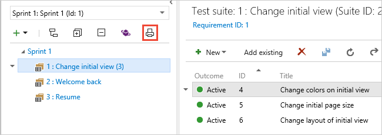
::: moniker-end

Change the test case fields in the report by adding or removing columns from the list view of the test suite.

> [!IMPORTANT]
> You cannot export more than 75 Test Suites in a single operation.
> The email supports up to 1MB of data.

## Find a test case in a test plan

::: moniker range=">=azure-devops-2020"
In **Test Plans** for your test plan, use the :::image type="icon" source="media/create-a-test-plan/filter-icon.png" border="false"::: filter icon to show the search and filter list. It can help find the tests you want.

  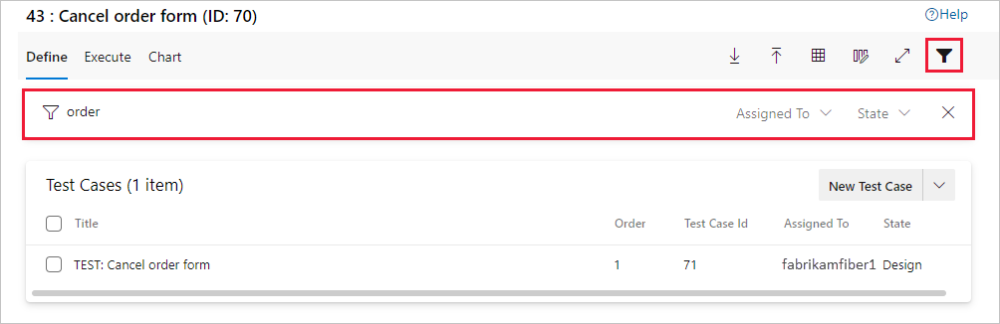
::: moniker-end

::: moniker range="<=azure-devops-2019"

In **Test Plans** for your test plan, use the :::image type="icon" source="media/create-a-test-plan/filter-icon.png" border="false"::: filter icon (**1**) to show the search and filter lists (**2**) that help you find the tests you want to work with.
Or filter the list of tests using **Outcome**, **Tester**, and **Configuration** (**3**).

  
  
::: moniker-end

## Next steps

> [!div class="nextstepaction"]
> [Create manual test cases](create-test-cases.md#test-cases) 

## Related articles

* [Test objects and terms](test-objects-overview.md) 
* [FAQs for manual testing](reference-qa.yml#testplans)
* [End-to-end traceability](../cross-service/end-to-end-traceability.md)
