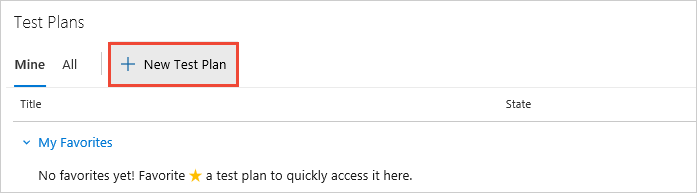
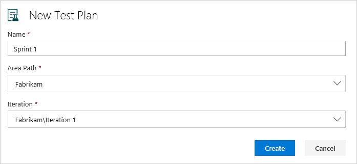

# Create a test plan and test suite

[!INCLUDE [version-header](_shared/version-header.md)] 

Create test plans to track manual testing for sprints or milestones. That way, 
you can see when the testing for a specific sprint or milestone is complete.

Test plans are used to group together test suites and individual test cases.
This includes static test suites, requirement-based suites, and
[query-based suites](reference-qa.md#query-based-suites). You can add individual test cases to a test plan without creating
a test suite if you wish, but using a test suite provides a way to group
test cases for separate testing scenarios within a single test plan.

[!INCLUDE [feature-availability](_shared/feature-availability.md)] 

**Note**: Stakeholders cannot create or manage test plans. You must have at least Basic access.
See [Default manual testing permissions and access](manual-test-permissions.md).

## Create a test plan

1. If you haven't already, 
   [sign up for Azure DevOps](https://visualstudio.microsoft.com/products/visual-studio-team-services-vs), 
   [create your project](../organizations/accounts/organization-management.md), 
   and [create your backlog](../boards/backlogs/create-your-backlog.md). 

1. In Azure DevOps or TFS, open your project.

1. Go to the [!INCLUDE [test-hub-include](_shared/test-hub-include.md)]. Create a test plan for your current sprint.

   

1. Name the test plan. Check the area path and iteration. Then choose **Create**.

    

## Add a test suite and select backlog items to test

1. Now add test suites for the backlog items that need manual tests. 
   (These backlog items could be user stories, requirements, or other 
   work items based on the setup of your project.)

    

   You use requirement-based suites to group your test cases together. 
   That way, you can track the testing status of a backlog item. 
   Each test case that you add to a requirement-based test suite is 
   automatically linked to the backlog item.

1. Add a clause to filter by the iteration path for the sprint. 
   Run the query to view the matching backlog items.

   

1. Select the backlog items that you want to test this sprint. 
   Add them as requirements to your test plan by creating test suites from them.

   

   Now you've created a requirement-based test suite for each backlog item.

## Find a test case

* The **Test Plans** page shows a single test plan. You may use the
   icon to find the tests you want to work with.

  

Test plans, suites, and cases are stored in Azure DevOps and TFS as special types of work items.
   
## See also

* [FAQs for manual testing](reference-qa.md#testplans)
* [Link test cases to work items](../boards/queries/link-work-items-support-traceability.md)

##  Next step

> [!div class="nextstepaction"]
> [Create manual test cases](create-test-cases.md#test-cases) 
