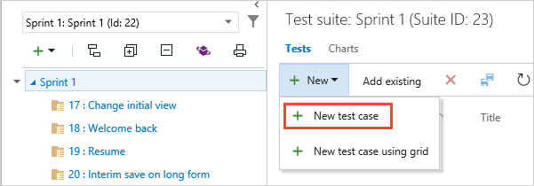
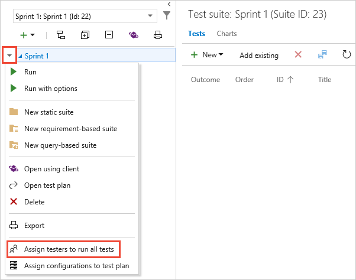

# Create manual test cases

[!INCLUDE [version-header](includes/version-header.md)] 

Create manual test cases to check that each of the deliverables 
meet your users' needs. Organize your test cases by adding them
to test plans and test suites. Then choose which testers you want to run 
the tests.

For an overview of test artifacts, see [Test objects and terms](test-objects-overview.md).

> [!NOTE]
> Test iterations are designed to support data-driven scenarios, not workflow-driven scenarios.
  From a best practice perspective, if you have two test scenarios where the workflows are
  different, consider creating separate test cases. Also see [FAQs for manual testing](reference-qa.md#testcases).

[!INCLUDE [prerequisites-define](includes/prerequisites-define.md)] 

[!INCLUDE [note-new-ui](includes/note-new-ui.md)] 

## Create test cases

1. If you haven't already, [create a test plan and requirement-based test suites](create-a-test-plan.md).

1. Select a requirement-based test suite. In the right-hand pane, choose **+** (New)
   and then choose **New test case**.

   

   > The [test suite](create-a-test-plan.md) shown here was created from a User Story work item in the team's backlog board. 
   > When you add a test case to this kind of suite, the test case is automatically linked to the backlog item.
   > To create test cases this way, open the shortcut menu for the work item and choose **Add test**.    

1. Choose the **Click or type here to add a step** link and add test steps
   with a description of the action required to carry out the test and the
   expected results so that any team member can run the test.
   You can add attachments to a step if you want. Repeat until you have added
   all the steps for the test. Now you've created a test case that you can run.

   

   [How can I find an existing test case within a test plan?](create-a-test-plan.md#findplan)
   
   [How do I add multiple test cases at the same time?](reference-qa.md#add-multiple-test-cases)

> [!TIP]
> You can create a test case that automatically links to a requirement&mdash;User Story ([Agile](../boards/work-items/guidance/agile-process.md)), Product Backlog Item ([Scrum](../boards/work-items/guidance/scrum-process.md)), Requirement ([CMMI](../boards/work-items/guidance/cmmi-process.md)), or Issue ([Basic](../boards/get-started/plan-track-work.md))&mdash;when you create a test from the Kanban board. To learn more, see [Add, run, and update inline tests](../boards/boards/add-run-update-tests.md). 
> 

## Assign testers

1. You can reassign test cases so that another tester can 
   run them. Select the tests that you want to reassign. Then 
   open the shortcut menu (choose the "..." ellipses or right-click) 
   and select the tester you want to run the tests.

   

   Or, you can assign all the test cases in a test suite to multiple testers. 
   This is useful for acceptance testing. Open the shortcut menu for the test plan
   and choose **Assign testers to run all tests**. 
   
   

1. Add or remove testers from the list. After you select the testers, tick the **Send email**
   checkbox and edit the message as required so they know that tests are ready for them to run.

   

   The email contains a link that testers can open to see the list of assigned tests.
   Testers need just [Basic access](../organizations/security/access-levels.md)
   to run tests from Azure Test Plans.

##  Next step

> [!div class="nextstepaction"]
> [Run manual tests](run-manual-tests.md)

## Related articles

* [Test objects and terms](test-objects-overview.md) 
* [FAQs for manual testing](reference-qa.md#testcases)
* [Link test cases to work items](../boards/queries/link-work-items-support-traceability.md)

