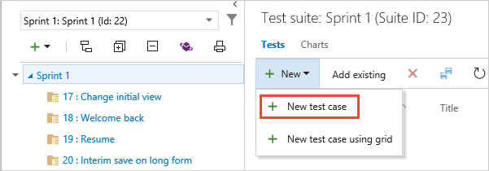
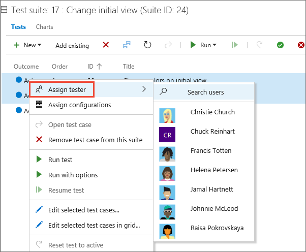

# Create manual test cases

[!INCLUDE [version-header](_shared/version-header.md)] 

Create manual test cases to check that each of the deliverables 
meet your users' needs. Organize your test cases by adding test 
cases to test suites. Then choose which testers you want to run 
the tests.

[!INCLUDE [feature-availability](_shared/feature-availability.md)] 

**Note**: Stakeholders cannot create or manage test cases. You must have at least Basic access.
See [Default manual testing permissions and access](manual-test-permissions.md).

## Create test cases

1. If you haven't already, 
   [create a test plan and requirement-based test suites](create-a-test-plan.md).

1. Select a requirement-based test suite, and then create a 
   test case for that suite.

   

   The test suite that you selected was created from a backlog item. 
   When you add a test case to this kind of suite, the test case is 
   linked automatically to the backlog item.

1. Add test steps with actions and expected results so that 
   any team member can run the test. You can add attachments to 
   a step if you want.

   

   Now you've created a test case that you can run.

> Test iterations are designed to support data-driven scenarios, not workflow-driven scenarios.
  From a best practice perspective, if you have two test scenarios where the workflows are
  different, consider creating separate test cases. 

## Assign testers

1. You can reassign test cases so that another tester can 
   run them. Select the tests that you want to reassign. Then 
   open the shortcut menu (choose the "..." ellipses or right-click) 
   and select the tester you want to run the tests.

   

   Or, you can assign all the test cases in a test suite to multiple testers. 
   This is useful for acceptance testing.
   
   

1. After you select the testers, email them so they
   know the tests are ready for them to run. (You just need 
   [Basic access](https://visualstudio.microsoft.com/products/visual-studio-online-Basic-vs)
   to run tests from Azure DevOps.)

   

## See also

* [FAQs for manual testing](reference-qa.md#testcases)
* [Link test cases to work items](../boards/queries/link-work-items-support-traceability.md)

##  Next step

> [!div class="nextstepaction"]
> [Run manual tests](run-manual-tests.md)
