# Create manual test cases

[!INCLUDE [version-lt-eq-azure-devops](../includes/version-lt-eq-azure-devops.md)] 

Create manual test cases to check that each deliverable meets your users' needs. Manual test cases define individual steps that testers perform, including shared steps across test cases. To test different data, specify parameters for the test steps. Organize your test cases by adding them to [test plans and test suites](create-a-test-plan.md), and then assign testers to run the tests.

For more information, see [Share steps between test cases](share-steps-between-test-cases.md), [Repeat a test with different data](repeat-test-with-different-data.md), and [Test objects and terms](test-objects-overview.md).

> [!NOTE]
> Test iterations support data-driven scenarios, not workflow-driven scenarios. As a best practice, if you have two test scenarios where the workflows differ, create separate test cases. For more information, see [FAQs for manual testing](reference-qa.yml#test-cases).

## Prerequisites

[!INCLUDE [prerequisites-define](includes/prerequisites-define.md)] 

## Create test cases

1. If you haven't already, [create a test plan and requirement-based test suites](create-a-test-plan.md).

2. Select a requirement-based test suite and select **New Test Case**.
		
   > [!div class="mx-imgBorder"]
   > 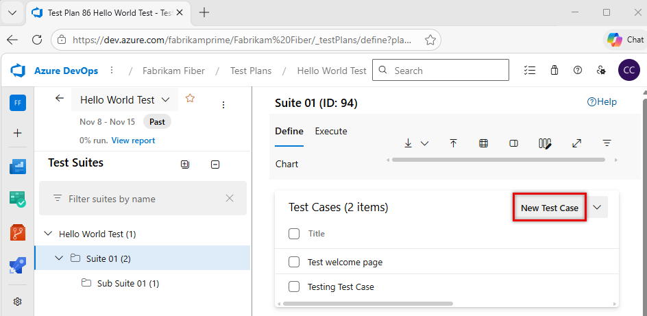

   > [!NOTE]
   > The [test suite](create-a-test-plan.md) shown here comes from a User Story work item in the team's backlog board. When you add a test case to this kind of suite, you automatically link the test case to the backlog item. To create test cases this way, open the context menu for the work item and choose **Add test**.

3. Enter a title and select **Click or type here to add a step**.

   > [!div class="mx-imgBorder"]
   > 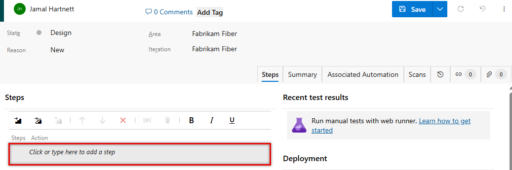

4. Add test steps that describe the action to perform and the expected results. You can add attachments to any step. Repeat until you add all the steps for the test.

   For more information, see [Share steps](share-steps-between-test-cases.md) and [Copy or clone stories, issues, and other work items](../boards/backlogs/copy-clone-work-items.md).

## Assign configurations to test cases

You can specify configurations, such as different operating systems, web browsers, and other variations for your tests.

- Select the test suite, select **More options** > **Assign configurations**, and in the dialog box, select your configurations.

   > [!div class="mx-imgBorder"]
   > 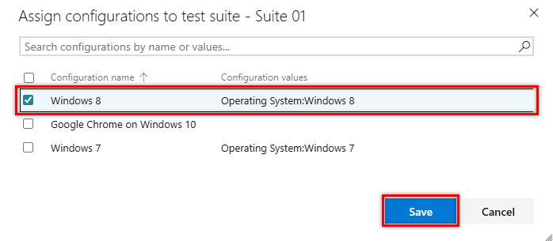

   You can also assign configurations to individual test cases. Select one or more test cases > select **More options** > **Assign configuration**.
   
- Make your changes and then **Save**.

For more information, see [Test different configurations](test-different-configurations.md).

[!INCLUDE [configuration-inheritance-warning](includes/configuration-inheritance-warning.md)]

## Reorder test cases

How you reorder test cases depends on the suite type:

| Suite type | How to reorder |
|---|---|
| **Static suite** | Drag and drop test cases into the desired order in the test case list. |
| **Requirement-based suite** | Backlog priority determines the order. To change it, reorder the backlog items in the [backlog view](../boards/backlogs/create-your-backlog.md). |
| **Query-based suite** | Query sort criteria determine the order. To change it, modify the [query's sort columns](../boards/queries/using-queries.md). |

## Reorder test steps

When you edit a test case, you can reorder test steps to adjust the sequence of actions:

- Select a test step, and then use the **up** and **down** arrows to move it to the desired position.
- You can also select multiple steps and move them together.

> [!div class="mx-imgBorder"]
> 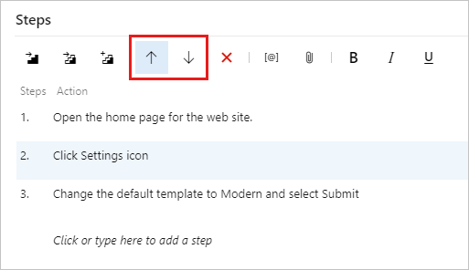

> [!TIP]
> If several test cases share the same steps, consider using [shared steps](share-steps-between-test-cases.md) to keep them in sync. When you update a shared step, the change applies to all test cases that reference it.

## Add existing test cases to a test suite

Add existing test cases to a test suite by using the following steps.

1. Select a test suite. From the **New Test Case** menu, select **Add existing test cases**.

   > [!div class="mx-imgBorder"]
   > 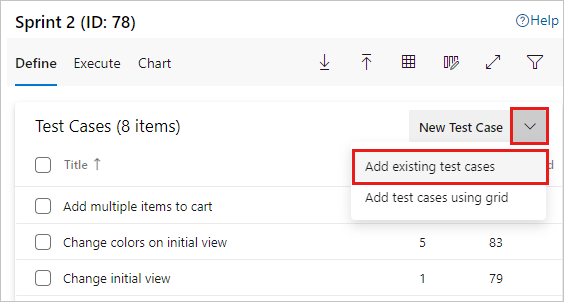

1. Add search clauses, as needed, and then select **Run query**.

   > [!div class="mx-imgBorder"]
   > 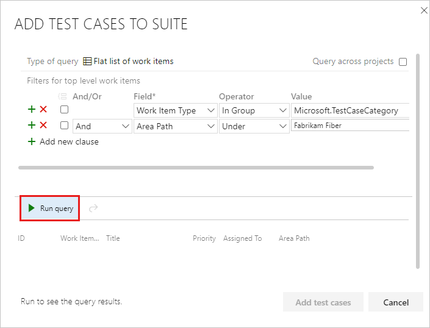

1. When you find the test cases you want, select them and choose **Add test cases**.

> [!TIP]
> You can create a test case that automatically links to a requirement - User Story ([Agile](../boards/work-items/guidance/agile-process.md)), Product Backlog Item ([Scrum](../boards/work-items/guidance/scrum-process.md)), Requirement ([CMMI](../boards/work-items/guidance/cmmi-process.md)), or Issue ([Basic](../boards/get-started/plan-track-work.md)) - when you create a test from the board. For more information, see [Add, run, and update inline tests](../boards/boards/add-run-update-tests.md).

## Use the Grid view to edit test cases
::: moniker range="<=azure-devops"

Follow these steps to copy and paste test cases into the **Grid** view.

1. Select the **Grid View** icon.

   > [!div class="mx-imgBorder"]
   > 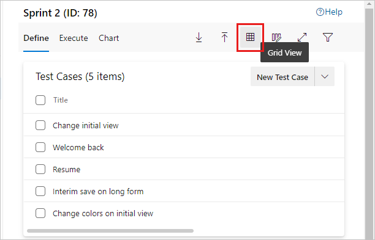

1. Select one to several test cases, and then select **Edit test case(s) in grid**.

   > [!div class="mx-imgBorder"]
   > 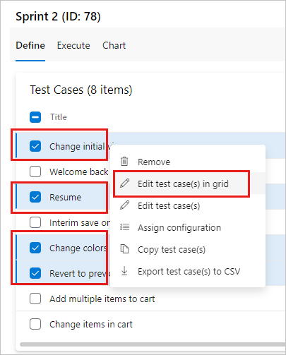

1. Add, delete, or clear rows.

   > [!div class="mx-imgBorder"]
   > 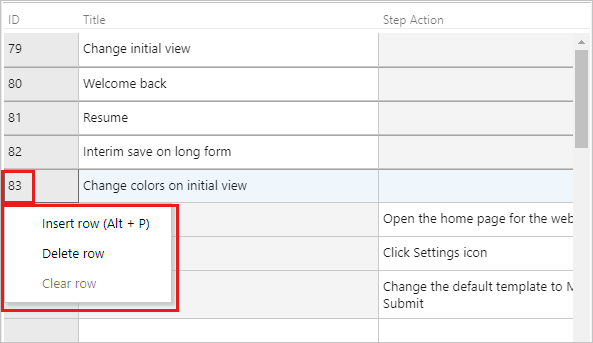

1. To add multiple test cases to the test suite, select **Add test cases using grid**.

   > [!div class="mx-imgBorder"]
   > 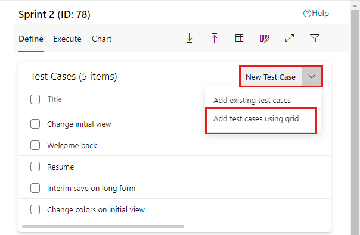
   - In the **List** view, use the column options to select the fields in the test case work item.

   > [!div class="mx-imgBorder"]
   > 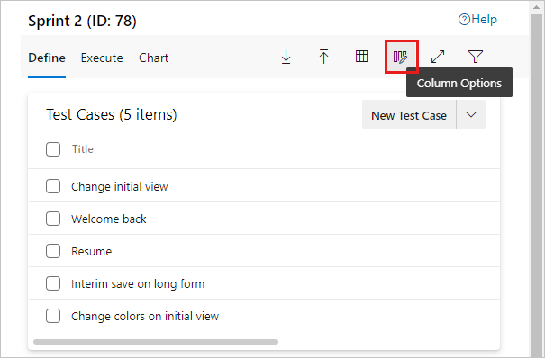

   You can view and edit these fields when you switch to the **Grid** view.
::: moniker-end

### Use Excel to copy information into a Grid view
::: moniker range="<=azure-devops"
You can copy test cases and test steps from an existing Excel worksheet.
Copy the columns from Excel that you want to use for the title, action, and expected results fields.
This action doesn't copy column formatting, other than multiline, from the worksheet.
Paste these columns into the **Grid** view, edit if necessary, and save them.

> [!div class="mx-imgBorder"]
> 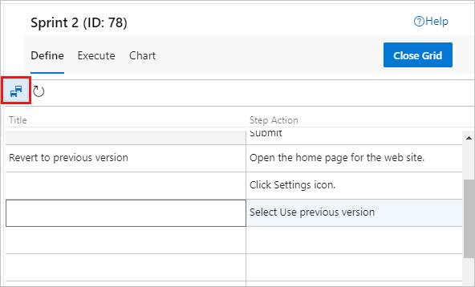

You can copy data from the **Grid** view and paste it into your Excel worksheet.
This action doesn't copy test step formatting, other than multiline, into the worksheet.

> [!NOTE]
> Don't use the Teams plugin for Excel to add or update test case work items.
> Excel can't parse the format that stores test steps, and this limitation can affect test case work item formatting.

::: moniker-end

## Assign testers

::: moniker range="<=azure-devops"
Assign test cases so that different testers can run them. You can assign all test cases in a test suite to multiple testers, which is useful for acceptance testing.

Testers need [Basic + Test Plans access](../organizations/security/access-levels.md) to run tests from Azure Test Plans.

1. In the context menu for a test suite, select **Assign testers to run all tests**.

   > [!div class="mx-imgBorder"]
   > 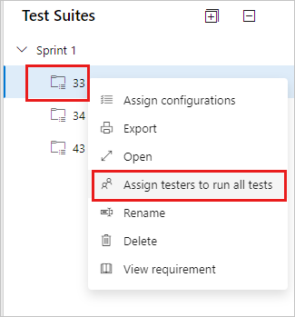

   The **Select testers to run all the tests in suite** dialog box opens.

1. Add or remove testers from the list. After you select the testers, select **Send email**
   and edit the message so they know that tests are ready for them to run.

   > [!div class="mx-imgBorder"]
   > 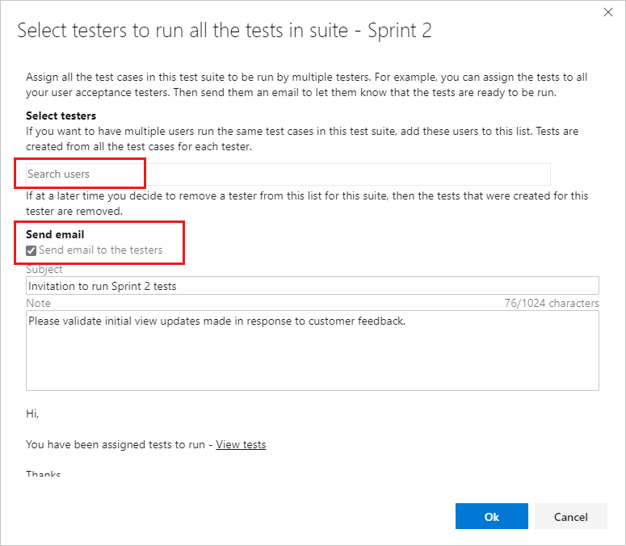

   The email contains a link that testers can open to see the list of assigned tests.

Assign an individual test case to a tester.

1. In the **Execute** tab for a test suite, select a test, and then open the context menu.

   > [!div class="mx-imgBorder"]
   > 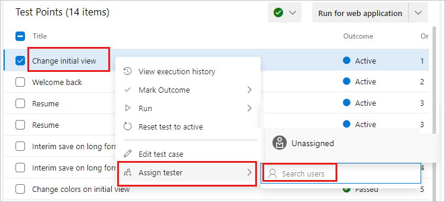

1. Select **Assign tester**. Search for and select a tester.

::: moniker-end

## Manage test cases
::: moniker range="<=azure-devops"

You can open a test case to view it or edit it.

1. To open a test case in a test suite, in the **Define** tab, double-click the name of the test case.
1. In the **Execute** tab, select a test case, open its context menu, and select **Edit test case**.

> [!div class="mx-imgBorder"]
> 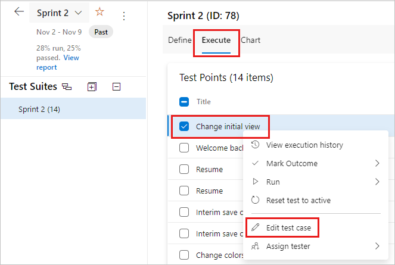

You can link a test case to test suites, requirements, and bugs.
To see linked items, in the **Define** tab, open the context menu for a test case, and select **View Linked Items**.

> [!div class="mx-imgBorder"]
> 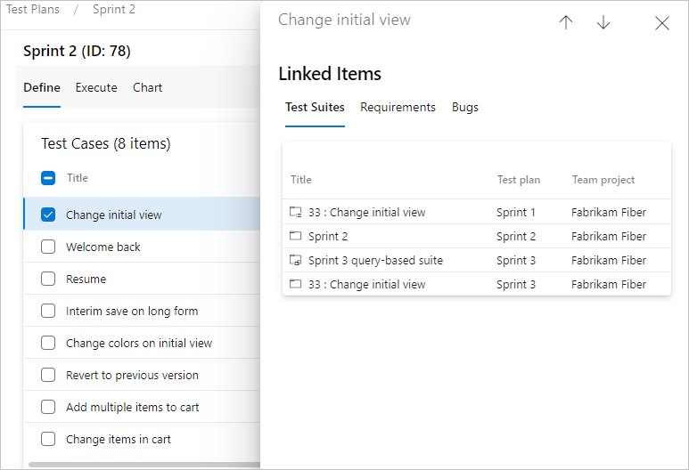

## Bulk edit test cases

You can edit more than one test case at a time. Select several test cases in a test suite and select **Edit test case(s)**.

> [!div class="mx-imgBorder"]
> 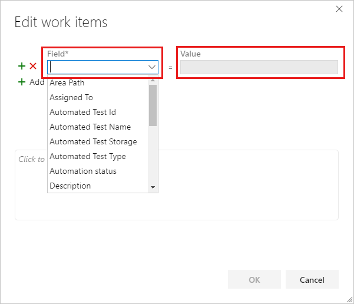

Select a **Field** and enter a **Value**. Select **Add new field** to add another field-value pair.

### Use tags for test cases

You can tag test cases and view only the ones with specific tags.
For example, tag all the tests related to signing in so that you can rerun these tests if a bug is fixed for that page.
You can filter on that tag from the **Test Plans** web portal.

To add new tags to work items, have at least **Basic** access and have the project-level **Create new tag definition** permission set to **Allow**. For more information, see [Add work item tags](../boards/queries/add-tags-to-work-items.md).

You can add and edit tags when you edit a test case, or bulk edit tags in the **Grid** view.
You can also create suites based on queries when you use tags.

> [!div class="mx-imgBorder"]
> 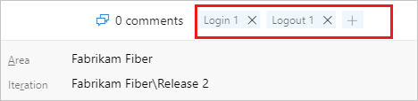

## Rename or remove test cases

You can rename or remove test cases from a test suite.

**Rename a test case**: Open the test case from the context menu, and then edit the name.

> [!div class="mx-imgBorder"]
> 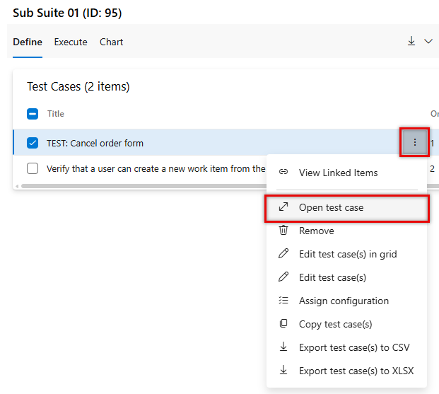

> [!div class="mx-imgBorder"]
> 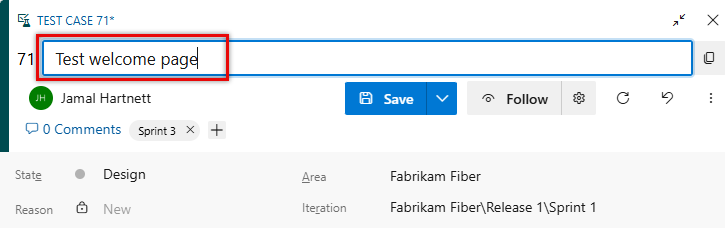

**Remove a test case**: From the context menu for the test case, select **Remove**.

> [!div class="mx-imgBorder"]
> 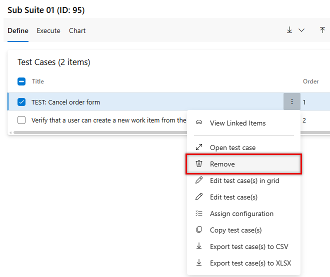

To permanently delete test plans and test suites, be a member of the Project Administrators group or have the Area Path node-level [**Manage test plans** or **Manage test suites**](../organizations/security/set-permissions-access-work-tracking.md#manage-test-artifacts) permission set to **Allow**. To manage or delete test artifacts, you must also have your [access level](../organizations/security/access-levels.md) set to **Basic + Test Plans** or **Visual Studio Enterprise**. For more information, see [Delete test artifacts in Azure Boards](../boards/backlogs/delete-test-artifacts.md).
::: moniker-end

## Next steps

> [!div class="nextstepaction"]
> [Run manual tests](run-manual-tests.md)

## Related content

- [Copy or clone stories, issues and other work items](../boards/backlogs/copy-clone-work-items.md)
- [Delete test artifacts in Azure Boards](../boards/backlogs/delete-test-artifacts.md)
- [FAQs for manual testing](reference-qa.yml#test-cases)
- [Repeat a test with different data](repeat-test-with-different-data.md)
- [Share steps between test cases](share-steps-between-test-cases.md)
- [Test different configurations](test-different-configurations.md)
- [Test objects and terms](test-objects-overview.md)
