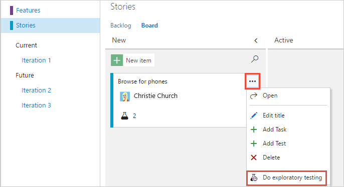
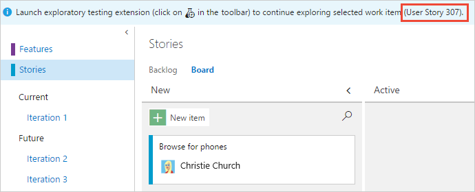
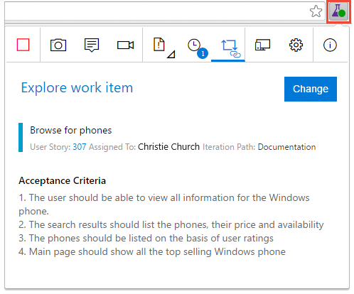
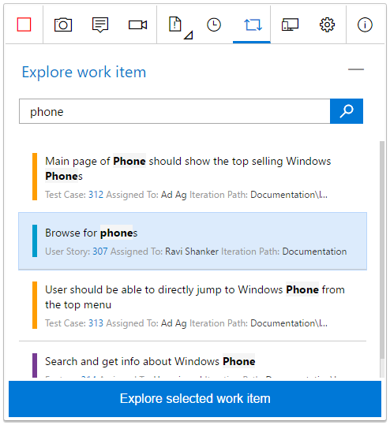
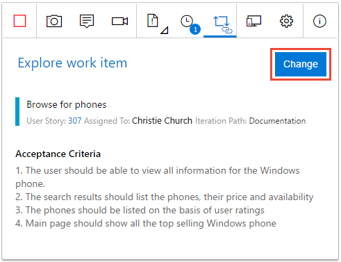

# Explore work items with the Test & Feedback extension

[!INCLUDE [version-lt-eq-azure-devops](../includes/version-lt-eq-azure-devops.md)]

Use the Test & Feedback extension to explore existing work items and associate them with a new or ongoing exploratory session. Once a work item is associated with a session, all new bugs, tasks, and test cases created in that session are automatically linked to the work item. This extension enables end-to-end traceability and simplifies the tracking and management of issues.

Explore the following items:
- Work items in the requirement, feature, or epic categories, and requirements-based test suites and test cases
- A work item from the [board](#kanban) or the [extension](#extension)
- [Multiple work items in the same session](#multipleitems)

## Prerequisites

| Category | Requirements |
|--------------|-------------|
| **Access levels** | - At least **Basic** access, with permissions to view work items under the corresponding Area Path. - To add test plans and test suites, delete test artifacts, and define test configurations: [Basic + Test Plans](https://marketplace.visualstudio.com/items?itemName=ms.vss-testmanager-web) access. Or, one of the following **Visual Studio subscriptions**:  - [Enterprise](https://visualstudio.microsoft.com/vs/enterprise/) - [Test Professional](https://visualstudio.microsoft.com/vs/test-professional/)   - [MSDN Platforms](https://visualstudio.microsoft.com/msdn-platforms/) |
| **Permissions** | - To add or modify test plans, test suites, test cases, or other test-based work item types: **Edit work items in this node** permission set to **Allow** under the corresponding **Area Path**. - To modify test plan properties such as build and test settings: **Manage test plans** permission set to **Allow** under the corresponding **Area Path**. - to create and delete test suites, add and remove test cases from test suites, change test configurations associated with test suites, and modify a test suite hierarchy (move a test suite): **Manage test suites** permission set to **Allow** under the corresponding **Area Path**. |
|**Extensions**| [Test & Feedback](https://marketplace.visualstudio.com/items?itemName=ms.vss-exploratorytesting-web) extension. If the extension isn't installed, the option to explore work items from the board isn't visible.|

## Explore work items from the board

1. On the board, open the shortcut menu for the work item you want to explore and select **Do exploratory testing**.

   
   
   A banner in the Work hub displays the work item associated with your session.

   

2. Launch the Test & Feedback extension. Any acceptance criteria for the work item are shown.

   
 
   If you didn't start a session yet, start one now. The work item automatically associates with the current or new session.

3. All bugs, tasks, and test cases you create automatically link to the current work item.

   

## Explore work items from the Test & Feedback extension

1. Open the **Explore work item** page in the extension and search for the work item you want to explore.

   

   You can search using the work item identifier or keywords in the work item title. The work item types available for search in the extension are: Epic, Feature, Test Case, and Requirement. For more information, see [About work items and work item types](../boards/work-items/about-work-items.md).

   > [!IMPORTANT]
   > The Test & Feedback extension only searches and returns results for work items created in the past 180 days if you search using work item title. If you search using work item ID, there is no 180 day limitation.
  
2. In the search results, select the work item and choose **Explore selected work item**.

   
 
   The work item is now associated with the in-progress session, and the acceptance criteria are shown.

   
 
   All bugs, tasks, and test cases you create automatically link to the current work item.

   
 

## Explore multiple work items in the same session

To explore another work item, first dissociate the current work item from the in-progress session.

1. Open the **Explore work item** page and select **Change**.

   

2. Associate the new work item with the in-progress session as [previously described](#extension).

## View your exploratory session results

After you file bugs, create tasks, or create test cases, they appear on the "Recent exploratory sessions" page in Azure Test Plans.

For more information, see [View your sessions and gain insights](insights-exploratory-testing.md).

## Related articles

* [Find answers to FAQs for manual testing](reference-qa.yml#tandfext)
* [Use the Test & Feedback extension in Connected mode](connected-mode-exploratory-testing.md)
* [Add findings to existing bugs with exploratory testing](add-to-bugs-exploratory-testing.md)
* [Gain insights across your exploratory testing sessions](insights-exploratory-testing.md)
* [Use the Test & Feedback extension in Standalone mode](standalone-mode-exploratory-testing.md)
* [Perform exploratory testing with Microsoft Test Manager](/previous-versions/azure/devops/test/mtm/exploratory-testing-using-microsoft-test-manager)
* [Explore an overview of manual and exploratory testing](index.yml)