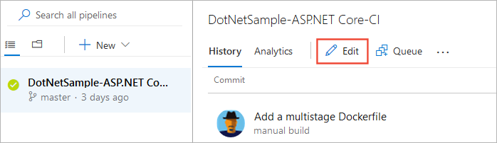

# Control how long to keep test results

[!INCLUDE [version-header](_shared/version-header.md)]

Running tests, especially automated ones, generates lots of data. 
To keep your test system responsive and performing well,
have a policy to clear test results that you don't need anymore. 
Delete automated test results when you delete your builds.
You can keep manual test results while you're still reviewing them, 
for example, up to a year. 

[!INCLUDE [feature-availability](_shared/feature-availability.md)] 

 
## Manual test results 

To delete manual test results after a specific number of days, 
set the retention limit at the project level. 
Azure DevOps keeps manual test results related to builds, 
even after you delete those builds. That way, build policies don't delete 
your test results before you can analyze the data.

1. Sign into Azure DevOps. You'll need at least project administrator permissions.

1. Go to your project and then open the [project settings page](../project/navigation/go-to-service-page.md#open-project-settings).
  
1. In the **Test | Retention** page, select a limit for how long you want to keep manual test data. 

   

## Automated test results 

### Automated test results associated with builds

By default, Azure DevOps keeps automated test results related to builds 
only as long as you keep those builds. To keep test results after you delete your builds, 
edit the build retention policy. If you use Git for version control, 
you can specify how long to keep automated test results based on the branch. 

1. Sign into Azure DevOps. You'll need at least build level permissions to edit build pipelines.

1. Go to your project. Find and edit your build pipeline.

   

1. Open the **Retention** page. Modify the default policies as required, or add new policies.

   

   If you use Git, and have more than one branch, 
   set the branch filter to delete test results and builds
   in specific branches as required. You can keep test results in other branches, 
   even though you delete the builds in these branches.  

### Automated test results not associated with builds or orphaned from deleted builds

To clean up automated test results that are left over from deleted 
builds or test results that aren't related to builds, 
for example, results published from external test systems, 
set the retention limits at the project level as shown [here](#manual-test-results-limits).

## See also

*  [FAQs for manual testing](reference-qa.md#manageresults)

[!INCLUDE [help-and-support-footer](_shared/help-and-support-footer.md)] 
