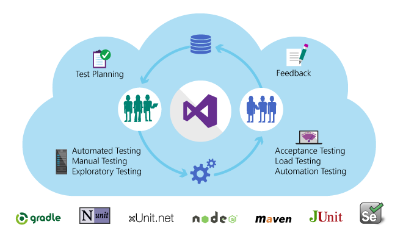

# Test apps early and often

**Team Services** | **TFS 2017** | **TFS 2015** | [**Previous version**](https://msdn.microsoft.com/library/ms182409%28v=vs.120%29.aspx)

Use application testing to test continuously while you code, build, and deploy your app.
Find problems before launching your app or updates into production. 
You can then better assess whether your app meets your customers' needs
and is ready for release. 

Manual and exploratory testing

<ul style="padding-left:30px">
 <li style="margin-bottom:5px">[Overview](manual-exploratory-testing/index.md)</li>
 <li style="margin-bottom:5px">[Get started](../work/kanban/add-run-update-tests.md)</li>
 <li style="margin-bottom:5px">[Test with Visual Studio Team Services](manual-exploratory-testing/getting-started/create-a-test-plan.md)</li>
 <li style="margin-bottom:5px">[Test with Microsoft Test Manager](manual-exploratory-testing/mtm/plan-manual-tests-with-microsoft-test-manager.md)</li>
 <li style="margin-bottom:5px">[Exploratory test web apps](manual-exploratory-testing/getting-started/perform-exploratory-tests.md)</li>
</ul>

Load testing

<ul style="padding-left:30px">
 <li style="margin-bottom:5px">[Overview](performance-testing/index.md)</li>
 <li style="margin-bottom:5px">[Get started](performance-testing/getting-started/getting-started-with-performance-testing.md)</li>
 <li style="margin-bottom:5px">[Load test your app](performance-testing/run-performance-tests-app-before-release.md)</li>
 <li style="margin-bottom:5px">[URL-based load tests](performance-testing/getting-started/get-started-simple-cloud-load-test.md)</li>
 <li style="margin-bottom:5px">[Test Azure web apps](performance-testing/app-service-web-app-performance-test.md)</li>
</ul>

Continuous testing

<ul style="padding-left:30px">
 <li style="margin-bottom:5px">[Overview](continuous-testing/index.md)</li>
 <li style="margin-bottom:5px">[Get started](continuous-testing/getting-started/getting-started-with-continuous-testing.md)</li>
 <li style="margin-bottom:5px">[Run Selenium tests](continuous-testing/getting-started/continuous-test-selenium.md)</li>
 <li style="margin-bottom:5px">[Test Java apps](continuous-testing/getting-started/continuous-test-java.md)</li>
 <li style="margin-bottom:5px">[Review results](continuous-testing/getting-started/review-continuous-test-results-after-build.md)</li>
</ul>

Developer tools and unit testing

<ul style="padding-left:30px">
 <li style="margin-bottom:5px">[Overview](https://docs.microsoft.com/visualstudio/test/developer-testing-scenarios)</li>
 <li style="margin-bottom:5px">[Get started](https://docs.microsoft.com/visualstudio/test/unit-test-your-code)</li>
 <li style="margin-bottom:5px">[Unit test your code](https://docs.microsoft.com/visualstudio/test/unit-test-your-code)</li>
 <li style="margin-bottom:5px">[Perform system tests with Visual Studio](https://msdn.microsoft.com/library/jj620889)</li>
 <li style="margin-bottom:5px">[Automate system tests](https://msdn.microsoft.com/library/ff472576)</li>
</ul>

Set up test environments

<ul style="padding-left:30px">
 <li style="margin-bottom:5px">[Use a lab environment](https://docs.microsoft.com/visualstudio/test/lab-management/using-a-lab-environment-for-your-application-lifecycle)</li>
 <li style="margin-bottom:5px">[Use Build and Release instead](https://docs.microsoft.com/visualstudio/test/lab-management/use-build-or-rm-instead-of-lab-management)</li>
 <li style="margin-bottom:5px">[Administer your test lab](https://msdn.microsoft.com/library/dd936084)</li>
 <li style="margin-bottom:5px">[Troubleshoot lab management](https://msdn.microsoft.com/library/ee853230)</li> 
</ul>

Extend your test tools

<ul style="padding-left:30px">
 <li style="margin-bottom:5px">[API reference for test tools](https://msdn.microsoft.com/library/dd465178)</li>
</ul>

[!INCLUDE [help-and-support-footer](_shared/help-and-support-footer.md)] 
