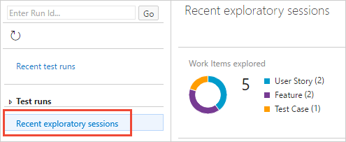
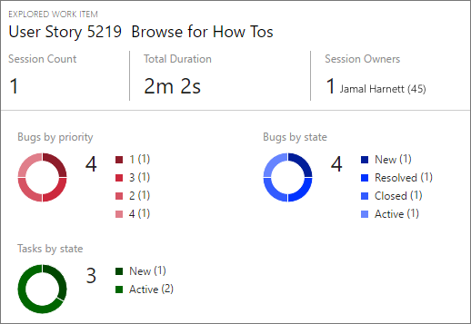
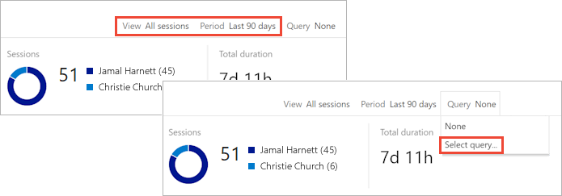

# Get insights across your exploratory testing sessions

[!INCLUDE [version-header](_shared/version-header.md)]
 
View completed exploratory testing sessions and derive meaningful insights
at team or individual level, and for a specific period. 

[!INCLUDE [feature-availability](_shared/feature-availability.md)] 

1. Open the **Recent exploratory sessions** page. You can do this:

   - From the Test &amp; Feedback extension by choosing the "view" icon on 
     the **Session timeline** page.
 
     
 
   - From [!INCLUDE [test-hub-include](_shared/test-hub-include.md)] by opening the **Runs** page and choosing **Recent exploratory sessions**.  

     

1. Explore the **Recent exploratory sessions** page. It contains three main sections:

   **Summary view** - shows a graphical breakdown of the work items explored, work items 
   created, session owners, and the total time for these sessions.
 
   
 
   **Pivot view** - shows a collapsible nested and sortable list of items grouped in different ways. 
 
   
 
   **Details view** - shows the work item selected in the Pivot
   view or a summary of information about a selection of items.
 
   

## Get insights from your exploratory testing sessions:

Use the **Recent exploratory sessions** page to get insights about your
app from the information collected during your exploratory testing sessions.

1. **Set the scope for the data**. 
   Summary view  provides the highest level view of your test results.
   Use it to get insights into the overall effort and results of the 
   exploratory testing sessions. 

   - Use the **View** filter to scope the summary view to all sessions or just your own sessions.
   - Use the **Period** filter to scope the summary view to sessions in the period from the last 7 to the last 90 days.
 
   

1. **Pivot the data on the type of work item**.
   Pivot view lets you to focus on all the work items you created
   in your exploratory testing sessions, or just on bugs, tasks, or test cases; 
   and group the results in different ways. 

   - Use the **Pivot** filter to group the work items as a
     nested list based on those that have been explored, 
     those that have not been explored (requires a [query](#not-explored)), 
     by the session in which they were created, or by session owner.
   - Use the **Show** filter to show all items; or just bugs, tasks, or test cases.
  

   

1. **Get deep insights from Details view**.
   Details view gives insights into the items selected 
   in Pivot view. Depending on the type of item you select,
   you see the work item as an editable form, or a series of charts. 
 
   - Select a row in Pivot view to see a summary of 
     all the related information in Details view. For example, if you have pivoted the
     list based on sessions, select a session to see a 
     summary of all the information from the work items in just that session.
   - Select a child row in Pivot view to display the work item
     form for that individual item. For example, if you have pivoted
     the list based on explored work items, expand a work 
     item and select a child bug, task, or test case to see
     the work item form for just that item.
 

   

## Discover work items not yet explored

Use a query to explore the work items that users have not yet explored.

1. Create a shared query in Azure DevOps or TFS that selects work items
   that can be explored using the Test &amp; Feedback extension, such as
   work items in the epic category, feature category, requirement category, 
   requirement-based suites, or test cases. 

   >You must use a **shared** query. If this query returns a mix of supported
   and unsupported work items, only those in supported categories will be displayed.   

1. Use the **View** and **Period** filters to scope the view to 
   the type of session (all sessions or just your own sessions)
   and the time span (from the last 7 to the last 90 days).
   Then open the **Query** list and choose **Select query**.

   

1. In the **Query selector** dialog, choose the shared query you created earlier.

   

1. View all the work items returned by the query in Summary view. You see
   a breakdown of explored and unexplored work items, work items filed, sessions, 
   and total session duration. 

   

1. Open the **Pivot** list and choose **Unexplored Work Item**.

   

   The view now shows only the unexplored work items.   

   

## See Also

* [Use the Test &amp; Feedback extension in Connected mode](connected-mode-exploratory-testing.md)
* [Add findings to existing bugs with exploratory testing](add-to-bugs-exploratory-testing.md)
* [Explore work items with exploratory testing](explore-workitems-exploratory-testing.md)
* [Use the Test &amp; Feedback extension in Standalone mode](standalone-mode-exploratory-testing.md)
* [Exploratory testing with Microsoft Test Manager](mtm/exploratory-testing-using-microsoft-test-manager.md)
* [Overview of manual and exploratory testing](index.md)

[!INCLUDE [help-and-support-footer](_shared/help-and-support-footer.md)] 
