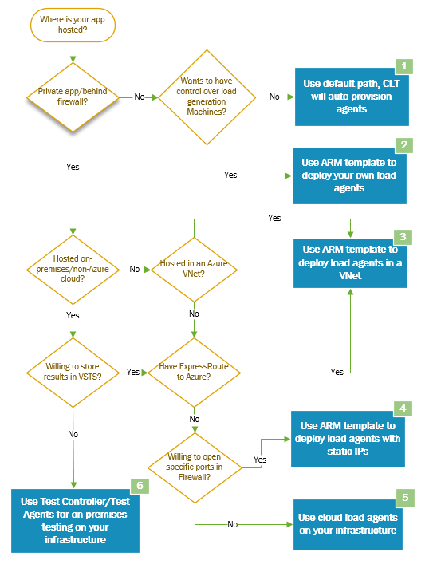
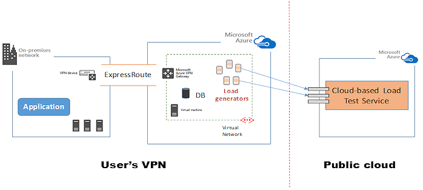
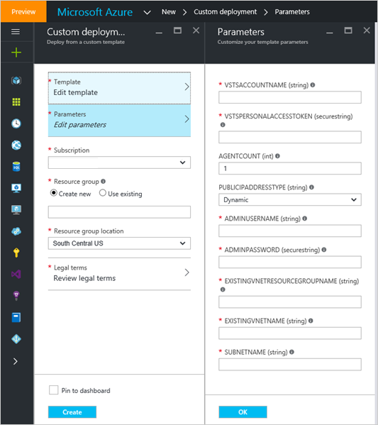
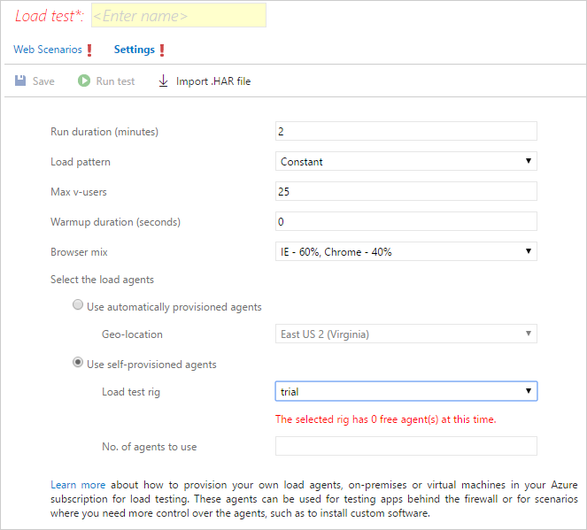
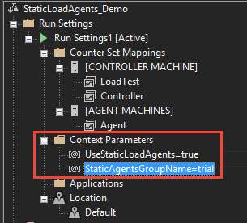
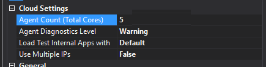
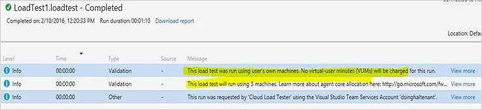
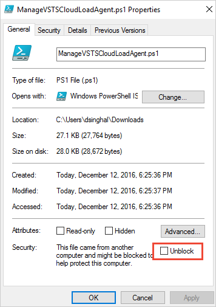

# Test private and intranet apps using cloud-based load testing

[!INCLUDE [version-header-devops-services](../_shared/version-header-devops-services.md)] 

[!INCLUDE [loadtest-deprecated-include](../_shared/loadtest-deprecated-include.md)]

The Cloud-based Load Testing (CLT) service can be used for performance and scale load testing
of an app by generating load from Azure. This type of load generation can only access and
generate load on an Internet-located or publicly accessible app. However, you may want
to load test an app which is not publicly accessible, perhaps to:

* **Test an app that runs only on an internal network**. In many large-scale enterprises
  there are apps and websites that cater for the needs of the whole enterprise and it is
  crucial to test it with peak load to discover any performance or stress-related issues.
* **Test an app internally before releasing it on the Internet** Before going public,
  enterprises typically want to ensure there are no performance issues that may affect
  the app under high user load.

Consider the following decision tree that shows six possible scenarios.
This topic discusses only scenarios **3** and **4**.



1. **The default case; CLT auto-provisions agents**. This is the default scenario for load testing
   using CLT when the app has a publicly-available endpoint. The load testing service automatically
   provisions load agents (in Azure) to simulate the user load. For more details, see
   [Run URL-based load tests with Azure DevOps](get-started-simple-cloud-load-test.md).
1. **Use an ARM template to deploy your own load agents**. Solution 1 above provisions the agents within
   the CLT service boundaries, so you don't have full control. If you want to access and control the
   load generation agents, you can deploy them in your own Azure subscription using an ARM template.
   These machines will be registered with the CLT service and can generate load. For more details, see
   [Structure and syntax of ARM templates](https://azure.microsoft.com/documentation/articles/resource-group-authoring-templates/).
1. **[Use an ARM template to deploy load agents in a VNet](#arm-vnet)**. If the app under test
   is within an Azure VNet, or if there is ExpressRoute connectivity between the app's private network
   and Azure, you can use a pre-defined ARM template deploy IaaS VMs in Azure in a specific VNet to act
   and have these VMs act as load agents. The machines will be provisioned in your Azure subscription
   and registered against your Azure DevOps subscription. The VNet where you create these machines must have line-of-sight
   to the app so that the load generators can reach it.
1. **[Use an ARM template to deploy load agents with static IPs](#static-ip)**. If you don't have
   ExpressRoute connectivity and want to test apps hosted on-premises, you can use an ARM template
   to deploy IaaS VMs in Azure that act as load agents. Create these VMs with static IP addresses
   for which you can configure your firewall to allow inbound traffic from the CLT service.
   The machines will be provisioned in your Azure subscription and registered against your Azure DevOps subscription.
1. **Use cloud load agents on your own infrastructure**. A simple PowerShell script can help you 
   configure physical or virtual machines as load agents. These machines are registered against your own
   Azure DevOps subscription and used for load generation. For more details, see
   [Run cloud-based load tests using your own machines](clt-with-private-machines.md). 
1. **Use the Test Controller and Test Agents for on-premises testing on your own infrastructure**.
   If you want to test apps on-premises and have constraints such as not being able to store results in the cloud (perhaps for regulatory compliance)
   you can use the Test Controller and Test Agents combination for load testing. This requires you to
   use your own infrastructure for load generation and the results are stored in SQL Server.
   See [Configure test agents and test controllers for running load tests](/visualstudio/test/configure-test-agents-and-controllers-for-load-tests) for details.

The following sections describe how you can provision load agents using Azure IaaS VMs
(you will need an Azure subscription). This approach is primarily useful when:

* You want to test a private app that is not accessible through the CLT service or over the Internet.
* You have your own Azure subscription and you want to use it for load testing. You can also use any Azure free credits you may have.

Azure also allows you to spread the load testing across different geographical locations to measure response times from different locations.

<a name="arm-vnet"></a>

## Use an ARM template to deploy load agents in a VNet

The following schematic shows the simple topology where load agents reside in a user's VNet and therefore have line-of-sight
to the app.



Use [this ARM template](https://github.com/Azure/azure-quickstart-templates/tree/master/201-vsts-cloudloadtest-rig-existing-vnet)
on GitHub to provision machines easily and quickly. 

Alternatively, providing you have an existing VNet, you can
[automatically provision load agents](https://portal.azure.com/#create/Microsoft.Template/uri/https%3a%2f%2fraw.githubusercontent.com%2fAzure%2fazure-quickstart-templates%2fmaster%2f201-vsts-cloudloadtest-rig-existing-vnet%2fazuredeploy.json)
into it. This link loads the template in the Azure portal and shows the following page.



You must then fill in the parameters and choose the subscription, resource group, and location to suit your scenario.
VNet identification requires the resource group name.

<a name="static-ip"></a>

## Use an ARM template to deploy load agents with static IP addresses

You can use [this ARM template](https://github.com/Azure/azure-quickstart-templates/tree/master/101-vsts-cloudloadtest-rig)
if you don't want to use a VNet. This may be because:

* You don't have ExpressRoute in Azure but want to perform load testing using your own subscription.
  This ARM template deploys a rig with its own VNet. If you need to test a private app, you can deploy
  the rig with static IP addresses (provided as an option), then open the firewall for these IPs to enable routing for load agents.
* You want to be able to control the load generation agents (CLT auto-provisioned agents can't be accessed by the user).
  You can choose to have static or dynamic IP addresses for these VMs.

Alternatively, you can
[automatically provision load agents in a new VNet](https://portal.azure.com/#create/Microsoft.Template/uri/https%3a%2f%2fraw.githubusercontent.com%2fAzure%2fazure-quickstart-templates%2fmaster%2f101-vsts-cloudloadtest-rig%2fazuredeploy.json).
This link loads the template in the Azure portal and shows the following page.

## Notes on deploying agents to VMs

After you deploy the VMs, it may take 10-15 minutes before the machines are configured with CLT and ready for a load test.
The load test runs on these agents and you will not be charged [VUMs](reference-qa.md#VUM) by the CLT service, but you
will incur the cost of Azure resources consumed under your subscription.

All the VMs in a resource group are registered under an agent group whose name is same as the resource group name.
In order to queue the run on a particular set of agents, you must specify the agent group name when queuing the run.
If you deployed your agents and resource groups before December 14th 2016, all the old agents are available under
an agent group named **default**. We recommend you reconfigure any such agents using the latest script.

If you want to have your agents separated based on some configuration (for example, location, VNet, or capacity) you
should locate these agents in separate resource groups. This allows isolated runs and easier management of machines and agents.

In the ARM templates, the machine size to **Standard_D4_V2**. This size provides 8 CPU cores and 28 GB of memory. You can change
this by editing the template. See
[Sizes for Windows virtual machines in Azure](https://azure.microsoft.com/documentation/articles/virtual-machines-windows-sizes/).

## Queue a run using load agents

You can queue a load test run using the Azure DevOps portal or Visual Studio Enterprise 

### Using the Azure DevOps portal

Open the **Load test** page **Settings** page and select **Use self-provisioned agents**. 
Then select the test rig you have configured with the ARM template, and optionally the number of agents to use.



### Using Visual Studio Enterprise IDE

Add the following context parameters to your Visual Studio Load Test file:

* Context parameter name: **UseStaticLoadAgents**
* Context parameter value: **true**
* Context parameter name: **StaticAgentsGroupName**
* Context parameter value: **[name of your agent group]**



You can specify the number of machines to be used for a load test run by setting the **Agent core count**
property present in the **Run Settings**. Every core is treated as a single machine. For example, shown below,
five machines will be used for the run.



Load test runs performed on your own load agent machines are not charged.
You can confirm this by looking at the status messages for the run.



> Check the FAQs at the end of this topic for more details.

## Manage self-provisioned agents

You can use [this PowerShell script](https://elsprodch2su1.blob.core.windows.net/ets-containerfor-loadagentresources/bootstrap/ManageVSTSCloudLoadAgent.ps1)
to manage self-provisioned agents. Download the script and unblock the file before use.



**Script parameters**

* **TeamServicesAccountName**. The name of your Azure DevOps subscription you want to manage. Specify just the name.

* **PATToken**. Required for authentication. Obtain a PAT token for your Azure DevOps subscription [as described here](../../organizations/accounts/use-personal-access-tokens-to-authenticate.md).
  Ensure the selected scope is **Load Test (read and write)**.

The available operations and the switches for the script are:

* **Get agent groups**. Lists all the registered agent groups within the Azure DevOps subscription. Example:

```PowerShell
.\ManageVSTSCloudLoadAgent.ps1 -TeamServicesAccountName [your-Azure-DevOps-url]
  -PATToken olxpldk2...wi3rbaq -GetAgentGroups
```

* **Get agents**. Lists all the agents and their current status for a specified agent group. Example:

```PowerShell
.\ManageVSTSCloudLoadAgent.ps1 -TeamServicesAccountName [your-Azure-DevOps-url]
  -PATToken olxpldk2...wi3rbaq -AgentGroupName test -GetAgents
```

* **Delete an agent**. Deletes the agent reference from the service. The agent must be in the offline
  state. The agent group name is mandatory. Example:

```PowerShell
.\ManageVSTSCloudLoadAgent.ps1 -TeamServicesAccountName [your-Azure-DevOps-url]
  -PATToken olxpldk2...wi3rbaq -DeleteAgent -AgentGroupName test -AgentName dpk-param
```

Get more help using **get-help** on the script **ManageVSTSCloudLoadAgent.ps1**.

## FAQ

### Q: How do the load agents communicate with CLT?

**A:** The load agents communicate with CLT using the HTTPS protocol.
As these machines or VMs are inside the user's private network (Azure or on-premises),
they can reach the app under test directly. The results are pushed back to the CLT
service so that analysis occurs in similar way to other types of load test runs.

### Q: How I am charged for this?

**A:** You will not incur load testing [VUM](reference-qa.md#VUM) charges for the runs
where you deploy load agents on your premises or in your own Azure subscription.
However, you will be charged the applicable Azure VM costs.

### Q: Can I use these machines for other purposes?

**A:** These machines can be used for other tasks as well, but we recommended not having
anything running while a load test run is in progress.

### Q: Can I shut down the machines where I have configured the load test agent?

**A:** Yes, the machines can be shut down when not in use. The load test agent service will
automatically start to receive commands from CLT after the machine is restarted.
If you are using the Azure ARM template to deploy these agents, you can start or stop the
VMs as required. You can also do this using a PowerShell script. See
[Stop All VMs in Specified Azure Resource Group](https://gallery.technet.microsoft.com/scriptcenter/Stop-All-VMs-in-Specified-40c8531e).
You should delete the Azure resource group after you are done with load testing, and re-create
it later if required. See
[Manage Azure resources through portal](https://azure.microsoft.com/documentation/articles/resource-group-portal/)

### Q: I have proxy settings on my machines, will this work?

**A:** We support only default proxy scenario, when the proxy settings are controlled through your web browser and
it uses the current user's credentials to connect to the proxy server. In other cases, please see our
[help and support forum](https://azure.microsoft.com/support/devops/).

### Q: Where can I find the log files to debug issues?

**A:**  The PowerShell script logs are stored in the **logs** subfolder where the PowerShell script resides.
These logs are also displayed in the PowerShell window. Run execution logs are in the **%windir%\temp\CloudLoadTest\logs** folder.

### Q: How can I discover the outgoing URLs so that I can allow them in my firewall settings?

**A:** There is a REST API for this. You first need to get the target **AgentGroup Id** using the REST API:

`https://<subscription name>.vsclt.visualstudio.com/_apis/clt/agentgroups`

Then use this to get the list of outgoing URLs:

`https://<subscription name>.vsclt.visualstudio.com/_apis/clt/agentgroups?agentGroupId=<Agent Group Id>&outgoingRequestUrls=true`

The output is a list of strings where the first two inputs are the Azure Blob and Table service URLs. 
Another outgoing URL is your Visual Studio subscription URL. Other than these three URLs, you also need to
allow the URL `https://<subscription name>.vsclt.visualstudio.com`.

## See also

* [FAQs for load testing](reference-qa.md#jmeter-tests)
* [Load test with Visual Studio](getting-started-with-performance-testing.md) 
* [Load test with Azure DevOps](get-started-simple-cloud-load-test.md) 
* [Load test with Azure portal](app-service-web-app-performance-test.md) 
* [Tutorial: Run load tests before release](run-performance-tests-app-before-release.md) 
* [Analyze load test results using the Load Test Analyzer](/visualstudio/test/analyze-load-test-results-using-the-load-test-analyzer)

[!INCLUDE [help-and-support-footer](../_shared/help-and-support-footer.md)] 
