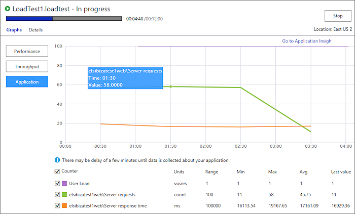

# Get app performance data with your load tests

[!INCLUDE [version-header-devops-services](../_shared/version-header-devops-services.md)] 

[!INCLUDE [loadtest-deprecated-include](../_shared/loadtest-deprecated-include.md)]

When you load test your app in the cloud using Azure DevOps, 
you can compare app performance with virtual user load using 
[Application Insights](https://azure.microsoft.com/documentation/articles/app-insights-overview/).
Then, by doing a quick root cause analysis, you can figure out which code 
is causing performance problems.

1. Download and install 
   [Visual Studio Enterprise](https://visualstudio.microsoft.com/downloads/download-visual-studio-vs), 
   if you haven't already done so.

1. [Enable Azure Active Directory](../../organizations/accounts/access-with-azure-ad.md)
   for your Azure DevOps subscription, if you haven't already done so.

1. [Link Azure DevOps with your Azure subscription](../../organizations/accounts/connect-organization-to-azure-ad.md),
   if you haven't already done so.

1. Sign in to Azure DevOps from your web browser to refresh the Azure Resources Manager access token. 
   The token is valid for 12 hours in the context of Azure DevOps.

   - If you have already signed, you must sign out and then sign in again.

1. [Set up your load test project to run in the cloud](getting-started-with-performance-testing.md#LoadTestVSIDE), 
   if you haven't already done so.

1. With your load test project open in Visual Studio Enterprise, open the 
   **Run Settings** section and select your active run settings. Open the
   shortcut menu and choose **Get Performance Data from Application Insights**.  

   

1. Select the apps you want to monitor and the performance counters 
   you want to view while your load test runs.

   

   The counters you selected are shown in the load test project.
 
   
 
1. Queue a load test run and view the performance data from 
   Application Insights while your load test runs. The data might 
   take a few minutes to appear.

   

   Application counters are correlated with user load so that you can 
   understand which issues might cause performance problems that you find.
 
   >The counter samples have a sampling rate of one minute irrespective of 
   the sampling rate configured in your load test project. 

1. To do a more detailed analysis for any performance issue, or to do a 
   quick root cause analysis, go to Application Insights.

   

[Can I define load tests once and then run them against different hosts?](reference-qa.md#inject-url-variables)

## See also

* [FAQs for load testing](reference-qa.md#qaappinsights)
* [Load test with Visual Studio](getting-started-with-performance-testing.md) 
* [Load test with Azure DevOps](get-started-simple-cloud-load-test.md) 
* [Load test with Azure portal](app-service-web-app-performance-test.md) 
* [Tutorial: Run load tests before release](run-performance-tests-app-before-release.md) 
* [Analyze load test results using the Load Test Analyzer](/visualstudio/test/analyze-load-test-results-using-the-load-test-analyzer)

[!INCLUDE [help-and-support-footer](../_shared/help-and-support-footer.md)] 
