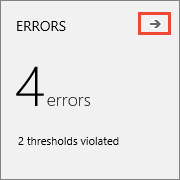

# Run Apache JMeter load tests with Azure DevOps

[!INCLUDE [version-header-devops-services](../_shared/version-header-devops-services.md)] 

[!INCLUDE [loadtest-deprecated-include](../_shared/loadtest-deprecated-include.md)]

Before you start your load testing:

* [Create your Azure DevOps subscription](https://visualstudio.microsoft.com/products/visual-studio-team-services-vs), 
  if you don't have one already.

**To run a JMeter load test:**

1. Sign into Azure DevOps.

1. Go to the **Load Test** section of [!INCLUDE [test-hub-include-adsonly](../_shared/test-hub-include-adsonly.md)], open the **+ New**
   menu and choose **Apache JMeter test**.

   

1. Enter your load test parameters. To run your test near to where your users are located,
   select a closer location for your load test. Then start your test when you're ready.

   

   >For information about the scripts and supporting files used for JMeter
   web tests, see [Build a Web Test Plan](http://jmeter.apache.org/usermanual/build-web-test-plan.html)
   on the Apache JMeter website.
 
1. As the test runs, you see live information about the progress
   of the test. You can stop the test by using the **Abort** link on the
   toolbar.

   

1. When your test is done, look at the results to see how 
   well your app performed. For example, you can see an overview
   of your app's performance in the **Summary** page.
   This page shows all of the main metrics such as average response
   time, user load, requests per second, failed requests, any errors
   that might have occurred, and test usage.

   
 
   The lower section of the **Summary** page shows the settings used
   for the test, and details of the five slowest requests during the test.
   If there are any transaction tests, the page will also show the five slowest of these.
   Use the 
   icon above a column to sort the list based on the contents of that column.

1. Open the **Charts** page to see a graphical representation of 
   the test results over time. The charts show the average
   performance, throughput, errors, and the results of each test 
   request. Hover your mouse pointer over a chart to 
   see more details. 

   

1. Open the **Diagnostics** page to see detailed information such as a list
   of errors and status messages.

   

   You can also use the 
   icon in the **Errors** section of the **Summary** page to go directly to the 
   **Diagnostics** page.

   

1. Open the **Logs** page to see a list of test runs. Choose the link in
   the **Attachment** column to download the detailed log as a text file.

   

1. If you have a favorite listener that you use to analyze results in
   the JMeter IDE, download the test results in .CSV format and the logs
   as a zip file from the **Download Results** link.

   

1. To run the same test again, choose **Rerun**.

   

1. Now see how you can [view and compare your load test runs](performance-reports.md).

## See also

* [FAQs for load testing](reference-qa.md#jmeter-tests)
* [Load test with Visual Studio](getting-started-with-performance-testing.md) 
* [Load test with Azure DevOps](get-started-simple-cloud-load-test.md) 
* [Load test with Azure portal](app-service-web-app-performance-test.md) 
* [Tutorial: Run load tests before release](run-performance-tests-app-before-release.md) 
* [Analyze load test results using the Load Test Analyzer](/visualstudio/test/analyze-load-test-results-using-the-load-test-analyzer)

[!INCLUDE [help-and-support-footer](../_shared/help-and-support-footer.md)] 
