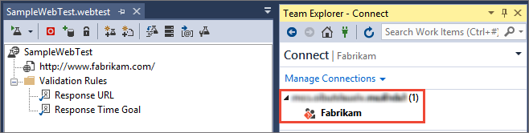

# Load test your app in the cloud using Visual Studio and Azure DevOps

[!INCLUDE [version-header-devops-services](../_shared/version-header-devops-services.md)] 

[!INCLUDE [loadtest-deprecated-include](../_shared/loadtest-deprecated-include.md)]

Check your app or web site's performance before you launch it or deploy updates to production by using load testing.
Find problems before your customers do. Start running 
[cloud-based load tests](https://visualstudio.microsoft.com/features/vso-cloud-load-testing-vs) 
in almost no time with Azure DevOps.

> This example shows how to execute a cloud load test using Visual Studio. You can also
[run cloud-based load tests directly using the Azure DevOps portal](get-started-simple-cloud-load-test.md),
or [run load tests locally with Visual Studio](/visualstudio/test/quickstart-create-a-load-test-project).

## Prepare your environment

* [Download and install Visual Studio Enterprise](https://visualstudio.microsoft.com/downloads/download-visual-studio-vs), 
  if you don't already have it.

* [Create an Azure DevOps subscription](https://visualstudio.microsoft.com/products/visual-studio-team-services-vs), 
  if you don't have one already. You can have any access 
  level assigned to you in Azure DevOps 
  when you use Visual Studio Enterprise to run load tests.

* If you don't have a load test project, 
  use our sample load test project with your web site or app. 
  Just provide the address for the web site that you want to test. 
  Or, if you have a load test project, jump ahead to 
  [connecting to Azure DevOps](#ConnectVSOnline) to run the load tests.

## Get the sample load test project

1. [Download the sample load test project](https://code.msdn.microsoft.com/Getting-started-with-17a52e95), 
   unblock the zip file in its **Properties** dialog,
   and unzip the files into a local folder on your computer.

1. Open the **GettingStartedWithLoadTesting.sln** solution
   in Visual Studio Enterprise.

1. Open the **SampleWebTest.webtest** file. 
   Replace the URL with the URL of your app's web page.

   

## Connect to Azure DevOps

Before you can run load tests in the cloud, 
connect Visual Studio to Azure DevOps.

1. In Team Explorer, connect to Azure DevOps by first choosing the "connect" icon.

   

1. Connect to one of your projects by opening the server name in the list and double-clicking on the project name.
 
   

   - If you haven't connected to Azure DevOps before, add it to the server list.
     Start by choosing the **Manage servers** link to open the connection dialog.

     

   - Enter your Azure DevOps server URL.

     

   - If you're prompted to sign in to Azure DevOps, do that now.

1. Select your Azure DevOps subscription from the list, 
   then choose your project. Now you can connect.
    
   

## Run and analyze your load test

1. In Solution Explorer, open the load test that you want to run.

   

1. To run your test closer to where your users are,
   select a location closer to your users. 

   

   

1. Now run your load test. This will run in the cloud 
   using Azure DevOps.

   

   Your test appears in the queue and waits for its turn to run. 
   When Azure DevOps is ready to run your test, the test status 
   changes to "Acquiring resources".

   

   A large test run might take up to 10 minutes while 
   Azure DevOps sets up virtual machines and agents for you.

1. You can watch your app's performance while the test runs. 
   Look at the details to review errors, warnings, or other information 
   about your test.

   

1. When the test is done, download the report to view the results.

   

   

   The results include performance counter data, threshold violations, and error information.

1. Review your test's details. Find the number of users where your 
   app's performance fails to meet your requirements by examining the 
   step load pattern for virtual users.

   

1. Fix any performance issues that you find in your app's code, 
   then rerun the test. 

1. To [simulate real-world loads](https://msdn.microsoft.com/library/ff406975%28v=vs.140%29.aspx) 
   more closely, you can refine your test by specifying web performance 
   test properties, load test scenario properties, and
   [run settings properties](/visualstudio/test/load-test-run-settings-properties).

## Next step

> [!div class="nextstepaction"]
> [Add app performance data](get-performance-data-for-load-tests.md)
