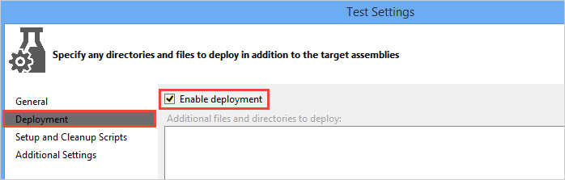
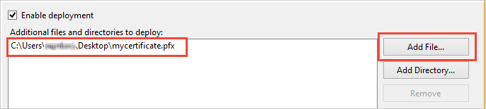
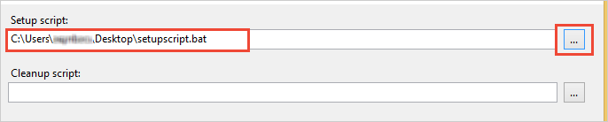

# Install certificates and custom software on agent machines

[!INCLUDE [version-header-devops-services](../_shared/version-header-devops-services.md)] 

[!INCLUDE [loadtest-deprecated-include](../_shared/loadtest-deprecated-include.md)]

In some test scenarios you might need to set up the environment for the test, such as installing certificates
or custom software, and then clean up the environment afterwards (such as removing temporary files or folders created during test execution).
To do this you can include artifact deployments, setup, and cleanup scripts in the Test Settings of your test solution.

Some examples are:

* Install client certificates on agent machines; for example, when you are using HTTP client authentication the web server authenticates the
  client using the client's public key certificate. You can use a setup script to install the relevant certificate on the agent
  machines that run your load tests.

* Install an Azure Management Certificate; for example, if your unit tests must perform operations such as
  creating a new storage subscription or deploying an Azure website by using Windows Azure Management API. You can use a setup script to
  install the certificate.

* Install software on the machines running the load test agents in the cloud to collect data or metrics;
  for example, installing [Network Monitor](http://blogs.technet.com/b/netmon/) to capture network traffic statistics. 
  You can use a setup script to install it on the agent machine and use a cleanup script to save the data to remote storage
  such as Azure Storage (by using a SAS key).

* Change settings on the agent machine before and after running the test; for example, you can use a setup script and a cleanup
  script to modify and reset values such as registry entries or other settings as required.

## Add certificates and scripts to deploy

1. Double-click the active test settings (such as **Local.testsettings**) to open **Test Settings** dialog.

1. Select the **Deployment** page and set the **Enable deployment** checkbox.

   

1. Choose **Add File**, browse to the location of your certificate, and add it to the deployment items list.

   

1. Select the **Setup and Cleanup Scripts** page in left-hand navigation bar.

1. Choose the ellipsis (**...**), browse to the location of the file or other artifact you want to deploy, and add it to the deployment items list.

   

1. Choose **Apply** and then **Close**.

Deployment Items are in a folder named **DeploymentDirectory**, which can be accessed through the environment variable `%DeploymentDirectory%`

## Examples of setup scripts

Script to install a certificate into the Trusted Root Certification Authorities certificate store on the test computer. 
This assumes you have added the Certificate Manager Tool `CertMgr.exe` to the deployment list:  

``` command
%DeploymentDirectory%/CertMgr.exe -add -c %DeploymentDirectory%\mycertificate.cer -s -r localMachine root
```

Script to import a certificate into the Trusted Root Certification Authorities certificate store on the test computer:

``` command
certutil.exe -f -user -p password -importpfx %DeploymentDirectory%\mycertitficate.pfx NoRoot
```

> See [CertMgr](/dotnet/framework/tools/certmgr-exe-certificate-manager-tool)
  and [Certutil](/windows-server/administration/windows-commands/certutil)
  for more information about using these utilities.

You can use the deployment options and a setup script to add **.exe** files or other files you want to deploy to the machines running the agent,
and use a setup script to install software on these machines. For example, a script to install Web Deploy on an agent machine that runs load tests
in the cloud, assuming you have added `WebDeploy_x64_en-US.msi` to the deployment list:

``` command
%DeploymentDirectory%\WebDeploy_x64_en-US.msi /passive.
```

## See also

* [Load test with Visual Studio](getting-started-with-performance-testing.md)
* [Load test with Azure DevOps](get-started-simple-cloud-load-test.md) 
* [Load test with Azure portal](app-service-web-app-performance-test.md) 

[!INCLUDE [help-and-support-footer](../_shared/help-and-support-footer.md)] 
