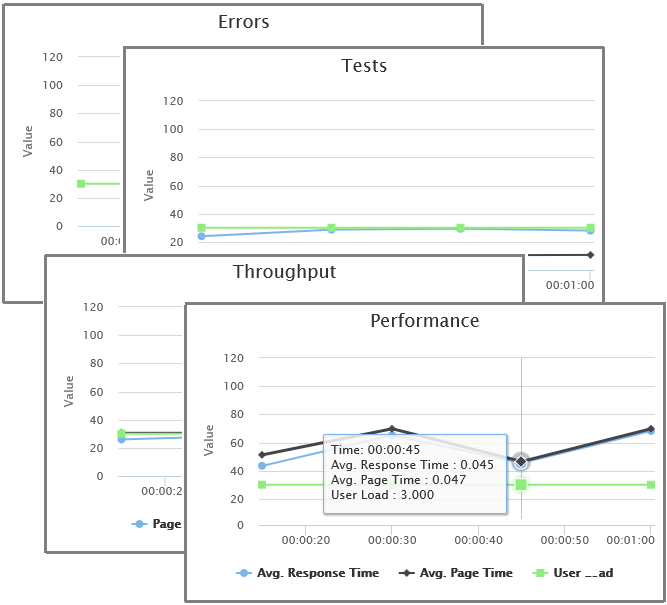

# Load testing scenarios and capabilities

[!INCLUDE [version-header-devops-services](../_shared/version-header-devops-services.md)] 

Load test your app with hundreds of thousands of users using Azure DevOps Test Plans.

## Comprehensive testing capabilities

* Load test web sites, apps, and APIs.

*  Author tests using [Visual Studio](run-performance-tests-app-before-release.md), 
    [Azure](app-service-web-app-performance-test.md), and
    [Azure DevOps](get-started-simple-cloud-load-test.md).

*  Quickly create load tests by specifying a [website](get-started-simple-cloud-load-test.md), referencing a 
    [JMeter test](get-started-jmeter-test.md) file, or
    [recording and replaying your actions](record-and-replay-cloud-load-tests.md).

*  Run tests or customize them using [powerful tools in Visual Studio](run-performance-tests-app-before-release.md).

*  You can even use existing unit or functional tests to generate load.

## Cloud scalable

* Scale to hundreds of thousands of concurrent users, and generate hundreds of thousands of connections in minutes.

* Cloud-based load testing leveraging the power of Azure is like having a whole performance lab at your fingertips.

* Of course you can [run your load test from on-premises agents](/visualstudio/test/lab-management/using-a-lab-environment-for-your-application-lifecycle) too!

## Generate load from multiple regions worldwide

* Run tests from one of many global Azure datacenter locations to minimize latency
  and simulate users' real-world conditions.

## Deep analysis with rich diagnostics

* Includes trace and exception logging.

* View app performance with [real-time charts and graphs](performance-reports.md).

* Go even further with [Application Insights](get-performance-data-for-load-tests.md), 
  and correlate test results with server diagnostics.

## Free allocation and flexible low-cost pricing

* Pricing is per virtual user minute (VUM) - a measure 
  of how long your test is and how many users the test simulates.

* You get a generous allocation of virtual user minutes free each month.
  See the [Azure DevOps Pricing](https://azure.microsoft.com/pricing/details/devops/azure-devops-services/) page.
  
## More information

* [Get started with load testing](getting-started-with-performance-testing.md)

* [Run URL-based load tests with Azure DevOps](get-started-simple-cloud-load-test.md)

* [Run Apache JMeter load tests with Azure DevOps](get-started-jmeter-test.md)

* [Performance test your Azure web app under load](app-service-web-app-performance-test.md)

* [Pricing for Azure DevOps features](https://visualstudio.microsoft.com/team-services/pricing/)

If you prefer to run your tests in a local environment rather than in the cloud, see
[Load test with Visual Studio](/visualstudio/test/quickstart-create-a-load-test-project).

> See also [Manual and exploratory testing](../index.md), [Continuous testing](../../pipelines/index.md), [Unit testing](/visualstudio/test/unit-test-your-code).

[!INCLUDE [help-and-support-footer](../_shared/help-and-support-footer.md)] 

## Videos 

> [!VIDEO https://www.youtube.com/embed/Qqh2OqB0wng?start=0]
