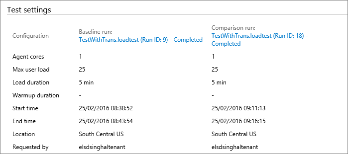

# View and compare your load test runs

[!INCLUDE [version-header-devops-services](../_shared/version-header-devops-services.md)] 

[!INCLUDE [loadtest-deprecated-include](../_shared/loadtest-deprecated-include.md)]

You can review past load test runs or current runs started by 
anyone on your team, at any time. You can also compare two
test runs to see the gain or loss in performance, and other
information.

> [!NOTE]
> You can open load tests in Visual Studio to analyse and compare results.
> See [How to: Access Load Test Results for Analysis](/visualstudio/test/how-to-access-load-test-results-for-analysis)
> and [How to: Create Load Test Performance Reports Using Microsoft Excel](/visualstudio/test/how-to-create-load-test-performance-reports-using-microsoft-excel).

## Open a load test in Azure DevOps

* If you are running URL-based or Apache JMeter load tests, you
  can see the list of all the test runs in the **Load test** list. 

  

## Filter and select a load test

1. Filter the list of  load tests by state, date, or user who created the test run.

   

1. Select a test run and open the shortcut menu (in Azure DevOps you can
   use the  
   icon) to see details of the test run, or stop a running test. 

   

   >You can also open a test run by double-clicking it with your mouse.
   
   [How do I delete load tests?](reference-qa.md#deletetests)   

## Compare two test runs

1. To compare two test runs, select them in the list by
   holding _CTRL_ while clicking with the mouse. Then choose
   the **Compare two runs** icon on the toolbar, or open the shortcut
   menu for one of the test runs and choose **Compare**.

   

1. In the comparison page you see the names of the two tests
   and, at the top of the page, a **Summary** section that lists
   the prime performance factors for each test, then the difference
   from the baseline as a percentage (the color of this text 
   indicates a gain or loss in performance).  

   

   Use the links in the first row, the names and IDs of the test
   runs, to open the detailed view of that test run.

1. The **Charts** section of the page shows a graphical comparison
   of performance for the two test runs. The default is a chart for
   the response time and user load. Choose a different pair of factors
   from the dropdown menu to see more performance comparisons.

   

1. The **Test settings** section lists the primary settings 
   specified for the two test runs. Again, the names and IDs
   of the tests are hyperlinks that open the details of that test.

   

## Next step

> [!div class="nextstepaction"]
> [Record and replay tests](record-and-replay-cloud-load-tests.md)
