# Record and replay cloud-based load tests

[!INCLUDE [version-header-devops-services](../_shared/version-header-devops-services.md)] 

[!INCLUDE [loadtest-deprecated-include](../_shared/loadtest-deprecated-include.md)]

You can record and then replay cloud-based load tests on your web app or website directly
using an HTTP Archive file and Azure DevOps.

Before you start:

* Create an Azure DevOps subscription if you don't have one already. 

* You can use your monthly free 20,000 virtual user minutes (VUM) allowance to try it. 
  If you want to use load testing beyond this, you can
  [set up billing](../../organizations/billing/set-up-billing-for-your-organization-vs.md) for Azure DevOps.

## About HTTP Archive testing

If you have used cloud-based load testing before, you may be 
familiar with the ability to get performance information on your
app when under load by using the Azure DevOps web 
portal. It's a great way to:

* Quickly run a URL-based load test for your app; you just need to enter the app URL.
* Easily learn about the basic load test features such as
  running tests from different locations around the world, 
  viewing and analyzing results in the browser, analyzing 
  the test errors, and more.
 
At the other end of the spectrum is using Visual Studio 
Enterprise to create and run load tests. While you can 
certainly create a URL-based load test using Visual Studio 
Enterprise, the real advantage is the ability to write 
tests that mimic several end-to-end user scenarios. These may
include a distributed mix of tests, the ability to use data
to drive your test, and even use of the rich extensible framework
to create plugins necessary to suit complex testing requirements.

**HTTP Archive testing** also allows you to create load tests
that mimic end-to-end user scenarios, but with fewer 
capabilities than the rich Visual Studio 
Enterprise load tests. However, by using HTTP Archive files
you can represent user scenarios that:

* Support multiple URLs
* Send requests other than just a simple GET
* Simulate a complete user scenario

If you develop or test web apps, you may already be familiar with the
[F12 developer tools](https://docs.microsoft.com/microsoft-edge/devtools-guide)
in your browser. These enable you carry out a range of tasks from 
inspecting the HTML, CSS, and JavaScript, to viewing the traffic between 
the browser and the server. You can use this ability to view traffic 
between the browser and the server to create an HTTP Archive load test 
for your scenario. 

>The example shown here uses the 
[Google Chrome](https://www.google.co.uk/chrome/browser/desktop/index.html)
browser, but you can use the browser of your choice such as 
Edge, Internet Explorer, or 
[Firefox](https://www.mozilla.org/firefox/new/). For example, 
[this video](https://msdnshared.blob.core.windows.net/media/2016/05/HARCreationVideo.mp4)
shows how to create an HTTP Archive with different browsers and with 
[Fiddler](http://www.telerik.com/fiddler).
 
## Create an HTTP Archive file

Follow these steps to create an HTTP Archive (**.har**) file 
using your browser.

1. Launch the browser and press **F12** to open the developer tools. 

1. Ensure that the browser traffic is being recorded. For example, 
   if you are using Chrome, check that: 

   - The recording button is "on" (the round button is red).

   - The **Preserve log** checkbox is set to ensure that the complete 
     sequence of URLs for your scenario is captured. If you do not
     set this option, network activity recordings are discarded whenever 
     you reload the current page or load a different page - which means 
     that an end-to-end scenario may not be captured.

   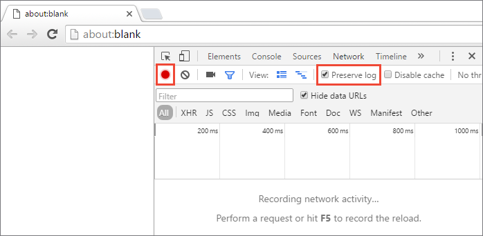

1. Exercise your user scenario. Enter the URL in the address bar 
   and go through the sequence of actions a typical user would 
   follow. For example, in a retail store site, the user would
   browse for a product, enter a product name in the search box, 
   choose links of interest, view the product information, and 
   (hopefully) place an order. 

   >As you go through these steps, you will see that all the 
   traffic between the browser and the server is shown in the 
   **Network** page of the developer tools.

1. After you have finished recording your user scenario, save the 
   URLs as HTTP Archive (**.har**) file. In Chrome, do this by 
   opening the shortcut menu for the URL list and choosing 
   **Save as HAR with content**. Enter a name for the file 
   and save it on your computer.

   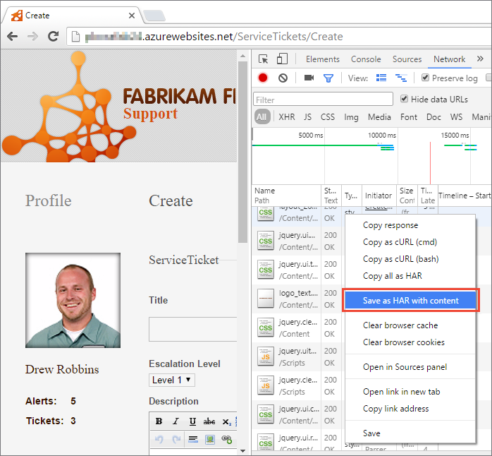

   You can also create an HTTP Archive using tools other
   than a browser. For example, [Fiddler](http://www.telerik.com/fiddler)
   is a popular tool for viewing and troubleshooting traffic. 
   Use Fiddler to record traffic in the same way and export sessions 
   as an HTTP Archive.

   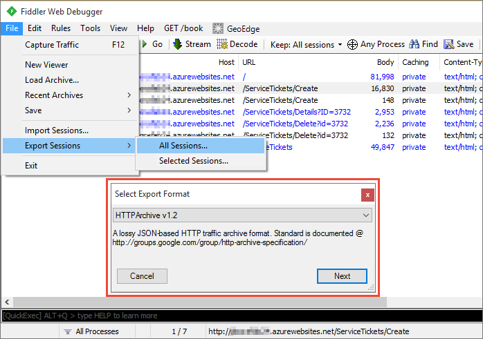
 
## Create a load test using the HTTP Archive file

Follow these steps to create a load test in the Azure DevOps
web portal using an HTTP Archive (**.har**) file.

1. Sign into Azure DevOps.

1. Go to the **Load Test** section of [!INCLUDE [test-hub-include-adsonly](../_shared/test-hub-include-adsonly.md)], open the **+ New**
   menu and choose **HTTP Archive based test**.

   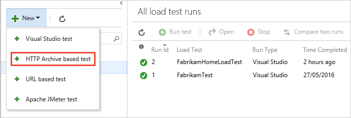

1. In the **Import HTTP Archive file** dialog, select the **.har**
   file that you recorded in the earlier steps and choose **OK**.

   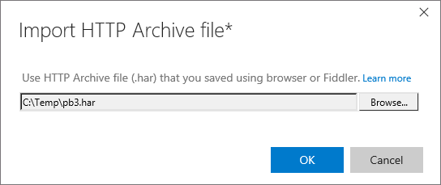

   The HTTP Archive file is uploaded and read, the URLs are 
   extracted, and all the details (the HTTP method, headers, 
   querystring parameters, form post parameters, and more) are 
   displayed. You can add URLs and edit the existing URLs to provide a friendly name 
   for each request in the center **Add URL** pane. This will
   help you easily identify each request.

   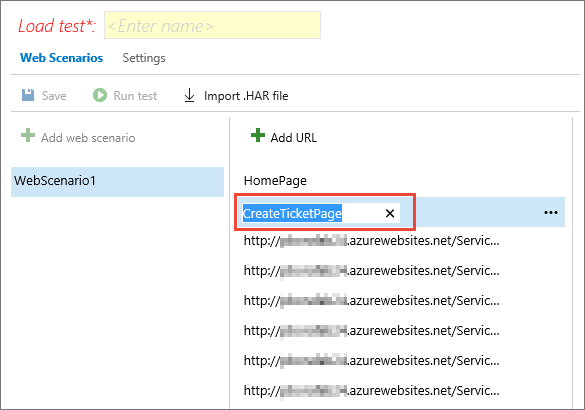

    The right-hand section of this page shows details of the selected 
    request URL. 

   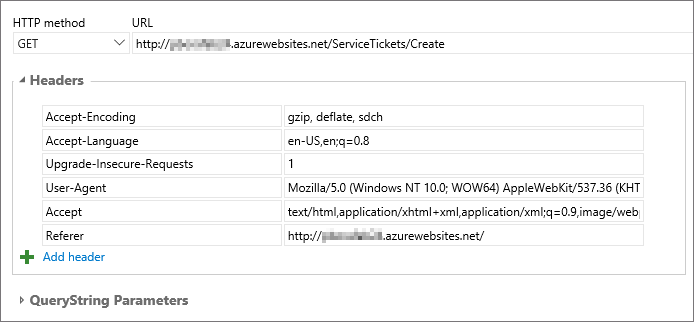

   >Some dynamic information such as ASP.NET viewstate, 
   event validation, and more that varies from session 
   to session, and must be retained in order for a 
   sequence of requests to succeed. These values are automatically 
   identified and extracted from a request and correlated
   in any subsequent requests that use them.

1. Open the **Settings** page to view and change any 
   load test settings.

   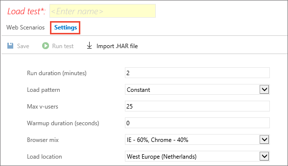

1. Enter a name for your load test, then choose **Save**.

   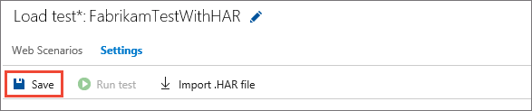

1. Choose the **Run test** link to execute your load test.
   A progress bar shows the current status of the test run. 

   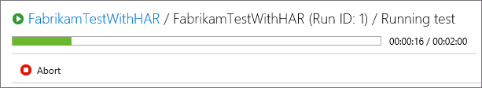

1. As the load test runs, you see a rich set of metrics
   that indicate how your app is performing under load.
   When the test is complete, you can explore the results.

   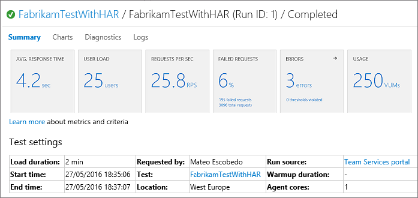

   For more information about the results and reports, see 
   [URL-based load testing with Azure DevOps](get-started-simple-cloud-load-test.md#viewresults).

## Troubleshooting

As you run a load test, requests are sent to your application in the sequence you specified.
Ideally, you want a clean run with all requests succeeding. However, requests may fail because 
of issues in your app or in your test. The load test results view offers two sections to help you 
identify these errors: **Diagnostics** and **Logs**.

The **Diagnostics** section provides insights into any test errors and important status messages 
from the load test service that occurred during the load test run. For failing requests, you can 
see the error type, the specific error subtype, the number of times the failure occurred, and more.

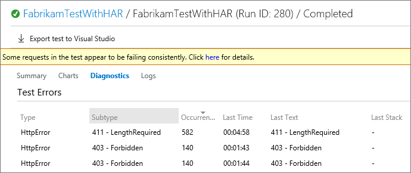

This page also lists the requests that were tested, and 
the test you executed.
 
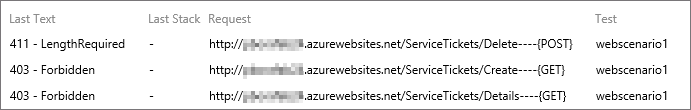

The **Logs** section gives you access to logs from all of the load-generating agents. If requests 
in your test are failing, these logs will help you figure out what went wrong. The test logs are 
available in HTTP Archive (**.har**) format, the same format as you used to record the user scenario 
and create the test. You can download these logs and view them in a HAR viewer such as 
[Fiddler](http://www.telerik.com/fiddler), [HAR Analyzer](https://toolbox.googleapps.com/apps/har_analyzer/),
or any other viewer that you prefer. You can then inspect the details of each request 
and its response in order to troubleshoot any failures in your test.

This screenshot shows how you can import the log into Fiddler.

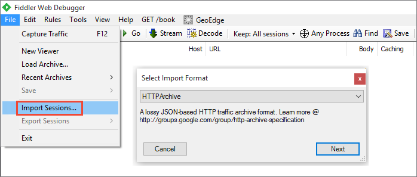

 
### Export the test to Visual Studio

Sometimes, one or more requests will fail every time they are executed. If you have eliminated 
the obvious causes such as correctness of the URL, the target URL not being reachable, or any 
application issues, requests may be failing because the application uses dynamic parameters 
(such as session ID, cookies, values set in hidden fields such as ASP.NET VIEWSTATE, and others)
in these requests. When you create a test using an HTTP Archive, the following cases are handled 
automatically when the test is executed:

* Dynamic parameter values set in cookies.
* Dynamic parameter values set in hidden fields, such as ASP.NET VIEWSTATE and EVENTVALIDATION.

However, dynamic parameters may also appear elsewhere in requests such as query strings or form post 
collections. At present, the load test mechanism does not support these types of dynamic parameters.
If you find that this is the cause of your test failures, you can export and run the test in Visual Studio.
 
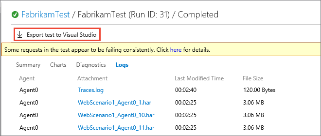

This export mechanism downloads a Visual Studio load test project containing the required web performance 
test and load test for your application. See 
[how to fix dynamic parameters using Visual Studio](/visualstudio/test/fix-non-detectable-dynamic-parameters-in-a-web-performance-test). 
Sean Lumley's [blog post](https://blogs.msdn.microsoft.com/slumley/2007/04/10/how-to-debug-a-web-test/)
has a detailed example of how dynamic parameters can be identified by inspecting the test and test results.

## See also

* [FAQs for load testing](reference-qa.md#recordreplay)
* [Load test with Visual Studio](getting-started-with-performance-testing.md) 
* [Load test with Azure portal](app-service-web-app-performance-test.md) 
* [Tutorial: Run load tests before release](run-performance-tests-app-before-release.md) 
* [Run Apache JMeter load tests with Azure DevOps](get-started-jmeter-test.md)
* [Analyze load test results using the Load Test Analyzer](/visualstudio/test/analyze-load-test-results-using-the-load-test-analyzer)

[!INCLUDE [help-and-support-footer](../_shared/help-and-support-footer.md)] 
