# Tutorial: Load test your app before release

[!INCLUDE [version-header-devops-services](../_shared/version-header-devops-services.md)] 

[!INCLUDE [loadtest-deprecated-include](../_shared/loadtest-deprecated-include.md)]

Find performance issues before you release your app by running load tests with Visual Studio 
Enterprise using [Cloud-based Load Testing](http://go.microsoft.com/fwlink/?LinkID=317257)
to provide virtual machines in the cloud that generate the load of many users accessing your web site at the same time.
All you need is an [Azure DevOps subscription](http://go.microsoft.com/fwlink/?LinkId=307137).

In this tutorial, you'll learn how to:

> [!div class="checklist"]
> * [Create a web performance and load test project](#createtests)
> * [Record a web performance test](#recordtests)
> * [Create a load test](#createload)
> * [Run and analyze your load test](#runanalyze)
> * [Improve your load tests](#improvetests)

## Create a web performance and load test project

You first create web performance tests. These tests are used in your 
load tests to simulate multiple users performing 
actions in your app at the same time.

1. If you don't have Visual Studio Enterprise, get it [here](https://visualstudio.microsoft.com/downloads/).

1. Create a web performance and load test project.

   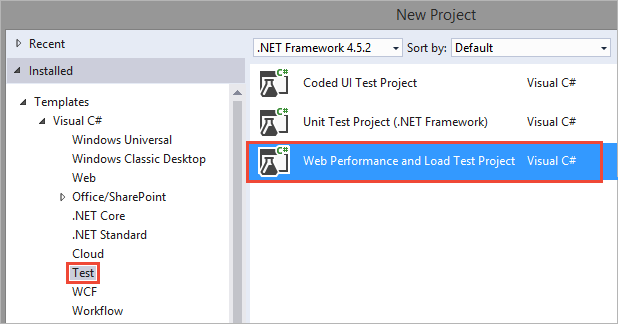

   If you don't see the template for the web performance and load test project type,
   ensure you have installed the required packages during Visual Studio setup.
   You can re-run the installer by choosing **Get tools and features** on the Visual Studio **Tools** menu.

   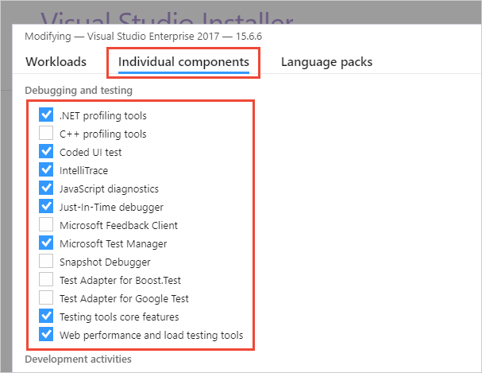

## Record a web performance test

1. Create a web performance test.

   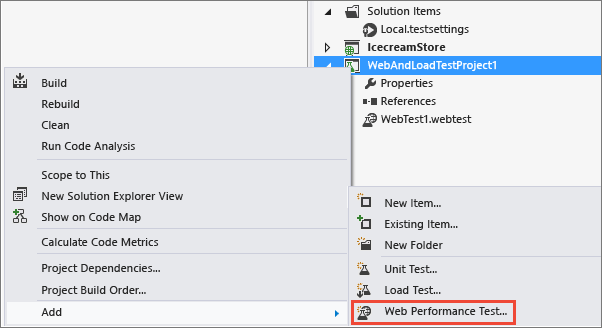

1. Your web browser opens. Enter the URL for the website that you want to test.

   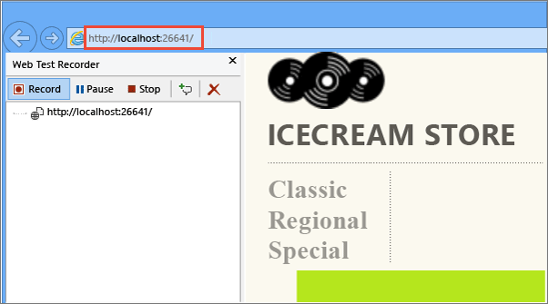

1. Use your application like you expect your customers to use it. For example, search for items and add them to the shopping cart.
   The recorder will capture the HTTP requests and responses.

1. When you're done, stop recording.

   

   Now, Visual Studio looks for dynamic parameters for the HTTP responses to each of your HTTP requests. A progress bar appears while this happens.
   If dynamic parameters are found, a table appears. You can assign constant values to each dynamic parameter.

1. Rename your test. For example, ShoppingCart.webtest.

   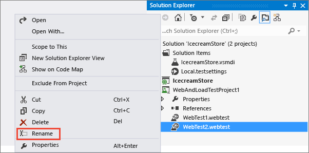

1. Edit test properties to specify performance goals. For example, you can set a page response time goal of one second.

   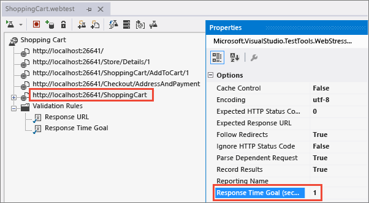

1. Save the test.

## Create a load test

1. Create a new load test in the web performance and load test project.

   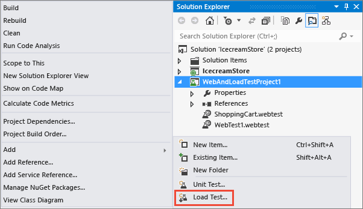

1. When the load test wizard appears, choose the kind of load test that you'd like to run.

   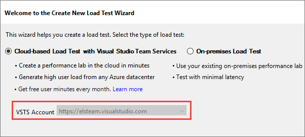

1. Change the load pattern to step load. This gradually adds users over time.
   [How many virtual users can I configure in my load test?](reference-qa.md#howmanyusers)
 
   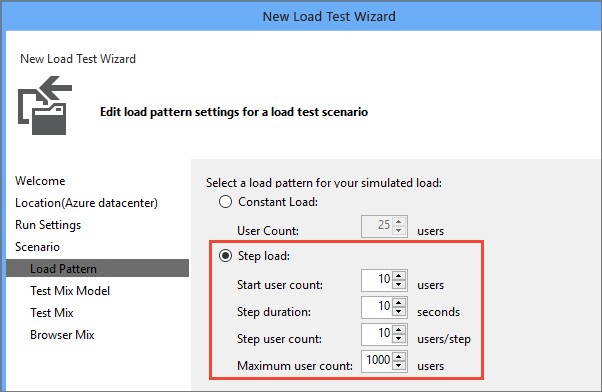

1. Choose the test mix step.

   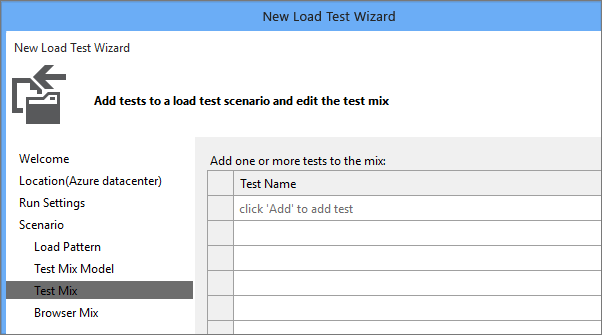

1. Add the web performance test you created.

   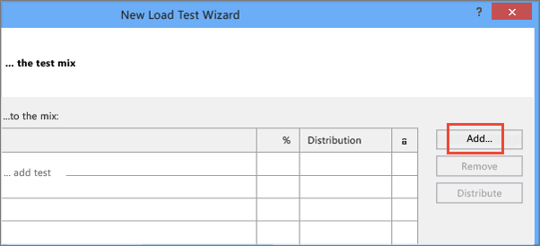

1. Move the web performance test to the list of tests to run.

   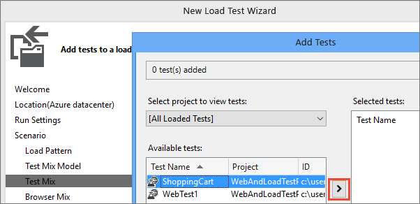

1. When you run cloud-based load tests using Azure DevOps, you can run those tests and generate load in an Azure datacenter that's closer to your users. That way, you reduce latency and simulate local conditions.
   Select the location where you want to run your load test.

   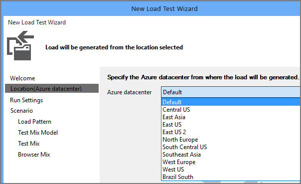

1. After you finish the wizard, the web performance test is added to the load test and appears in the load test editor.

   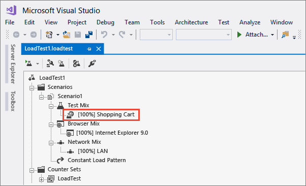

## Run and analyze your load test

You can run your load test locally, or you can run it in the cloud using Azure DevOps. 
All you need is an [Azure DevOps subscription](../../organizations/accounts/set-up-vs.md). 
If you run the load test in the cloud, you can generate more load without setting up test controllers and test agents. 
To learn how easy it is to use Cloud-based Load Testing to run your load tests, go 
[here](getting-started-with-performance-testing.md).

Follow these steps to run your load test on your local machine.

1. Run the load test.

   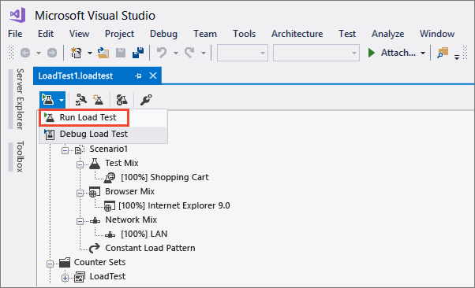

1. While the test runs, you discover that the shopping cart page response time exceeds the value you set.

   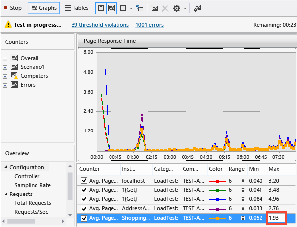

1. Add an analysis note to track the issue.

   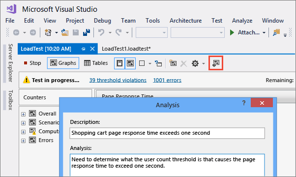

1. After the load test is finished, the summary is displayed.

   The results for the completed test include performance counter data, threshold violations, and error information.

   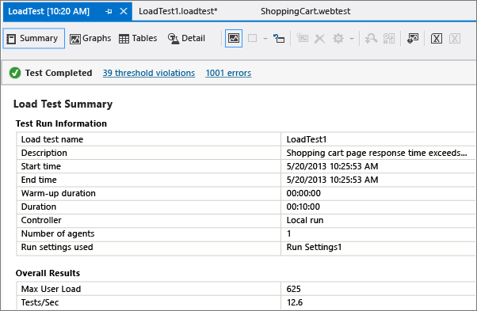

1. Choose the detail view. By analyzing the step load pattern for users, 
   you can identify the user count where your performance fails to meet your requirements.

   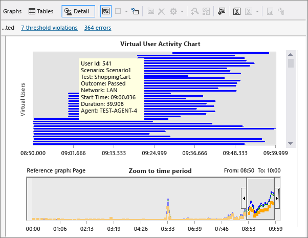

1. Fix any performance issues in your application's code and rerun the test.

## Improve your load tests

You can improve your test to better simulate 
real-world loads by specifying various load test 
[scenario properties](/visualstudio/test/edit-load-test-scenarios)
and [run settings properties](/visualstudio/test/load-test-run-settings-properties).
For example, you can specify the number of new users that will use web cache data in your load test.

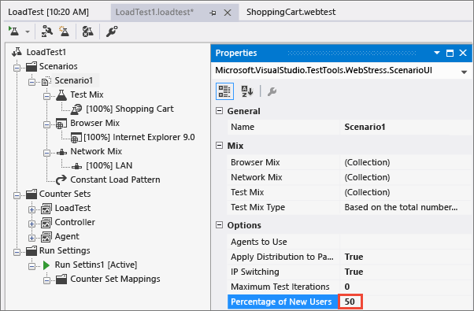

## Next step

> [!div class="nextstepaction"]
> [Run URL-based load tests](get-started-simple-cloud-load-test.md)
