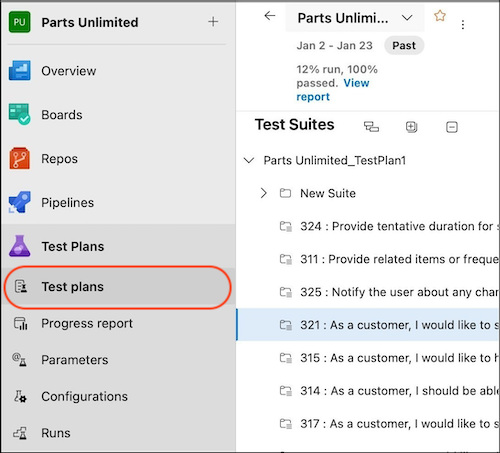
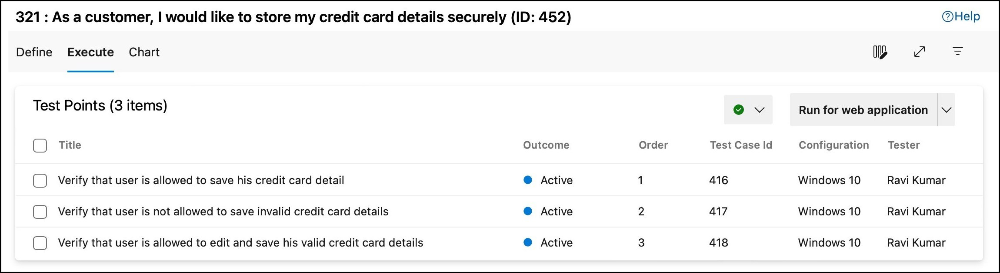
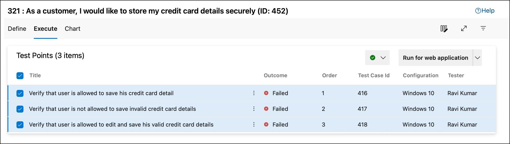
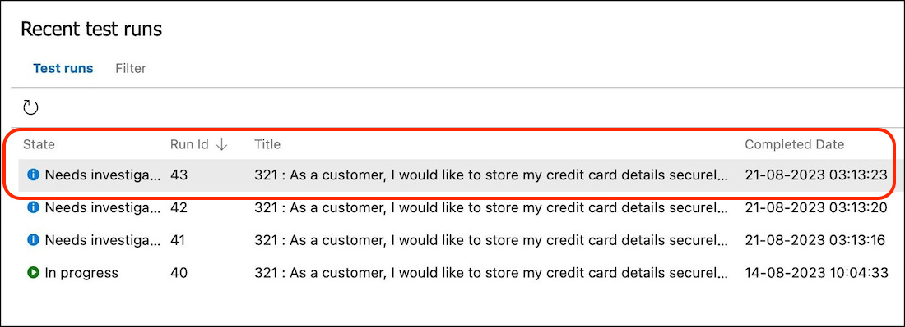
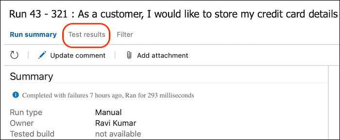
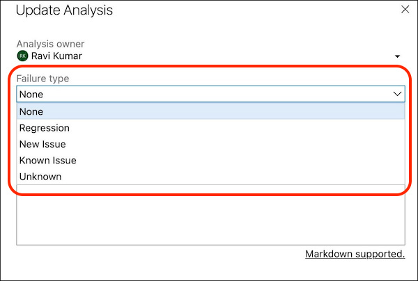

# Manage Test failure type

[!INCLUDE [version-lt-eq-azure-devops](../includes/version-lt-eq-azure-devops.md)] 

Azure Test Plans provides the functionality to customize the failure types of any test case beyond the default values. A 'failure type' is an artefact that helps to mark test case failures into defined categories such as 'regression issue' or 'known issue'. While this categorisation of failure types is helpful, users might want to add their own custom failure type beyond the default values. This creates a more customized experience for specific user needs in the Azure DevOps project. This article walks through the steps of defining a custom failure type using the new REST API provided. 

# How to view the default failure types:
Failure type categorization is part of the post-test run experience in Azure Test Plans. This feature is only applicable to test cases that have been marked as 'Failed'. To mark a test failure using the default failure type, follow the below steps:

1. Navigate to Azure Test Plans from your Azure DevOps project. Open a Test suite containing test cases or create a new test case inside a suite.

2. Navigate to Execute tab of the given test suite.
 

3. Mark a test case as 'Failed'. This creates a new test run for against the test case.
 

4. Goto 'Runs' blade from the Test Plans menu. Click on the respective test run from the list shown. 
 

5. 'Run Summary' tab is shown by defualt. Click on 'Test results' tab.

6. Click on 'Update Analysis' and a dialog box appears. Users can chose the failure type for the test case from the dropdown menu. Refer screenshot for the failure type values shown by default.
 

  
# Add custom values for Failure Type:
A new set of REST APIs has been provided for seamless management of failure types in Azure Test Plans. Users can add new failure types, delete existing ones and view the list of failure types for a given project.
Follow the instructions provided in the links below to explore the various APIs:
1. [Create a new test failure type](https://learn.microsoft.com/en-us/rest/api/azure/devops/testresults/testfailuretype/create)
2. [Delete a test failure type with specified failureTypeId](https://learn.microsoft.com/en-us/rest/api/azure/devops/testresults/testfailuretype/delete)
3. [Get the list of test failure types](https://learn.microsoft.com/en-us/rest/api/azure/devops/testresults/testfailuretype/list)
