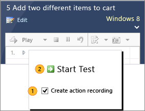
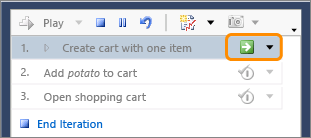

# Record and play back manual tests

**Visual Studio 2017** | **Visual Studio 2015** | [**Previous version**](https://msdn.microsoft.com/library/dd286714%28v=vs.120%29.aspx)

Record keystrokes and mouse actions with Microsoft Test Manager 
while you are testing an app. You can then play back your actions 
quickly and accurately the next time you run the test. 

Playback is very useful for reproducing bugs. You can retrace the 
exact actions that the tester performed to the point where the 
problem was found. Playback also helps you run a test with 
[different data](../repeat-test-with-different-data.md), 
on [multiple configurations](../test-different-configurations.md), 
or where you have [shared steps](../mtm/share-steps-between-test-cases.md) 
that are the same in many test cases. Playback also speeds up 
regression testing - that is, tests that you run from one sprint 
to the next to make sure that everything still works correctly.

You can record and play back tests in a wide range of desktop apps, 
and also web apps that you access through a supported browser. 
For a detailed list, see 
[Supported configurations and platforms for coded UI tests and action recordings](https://msdn.microsoft.com/library/dd380742).

## Run Microsoft Test Manager on your client machine

To record and play back actions, you have to install 
Microsoft Test Manager on the machine where you'll 
run your tests. If you're testing a desktop app, 
install the latest version of the app and Microsoft 
Test Manager on the same machine. If you're testing 
a web-based app, install the app on a test server, 
and run Microsoft Test Manager on the machine where 
you'll run your web browser.

To get Microsoft Test Manager, install Visual Studio Test Professional 
or Visual Studio Enterprise.

### Run a test case

1. [Connect Microsoft Test Manager](../mtm/connect-microsoft-test-manager-to-your-team-project-and-test-plan.md) 
   to your team project, and select your current test plan.

1. [Select a test case and run it](../mtm/run-manual-tests-with-microsoft-test-manager.md).

   

## Record your actions during a test run

1. In the **Start Test** window, 
   select **Create action recording**.

   

1. After each step, make sure to mark that step **Pass** or **Fail**.

1. If you want to pause your test, choose **Pause**.  

   

1. After you finish your test run, choose **End Test**. 
   This makes sure the recording assigns your actions to the correct steps.

**Caution:** All your keystrokes and gestures might be recorded, 
including passwords, emails, chat messages, and other sensitive data.

### Delete mistakes

Open the editing panel at the bottom of the test runner. 
You can delete actions there:

Alternatively, you can run the test again and choose **Overwrite action recording**.

### Keep or re-record shared steps

If you come to a sequence of shared steps, 
you might have already recorded them in an earlier test case. 
You can either keep the earlier recording or record them now, like this:

You have to indicate when you finish recording the shared steps:

### Capture parameter values

If a test step requires a parameter value that you must type as text, 
that text is recognized and bound into the recording. When you play the
recording back with other parameter values, the new values are used instead.

Parameter values aren't bound if they're not typed as text, for example, 
when values are selected instead. When you play the recording back, 
you'll have to manually perform that step.

## Play back an action recording

1. [Select your test and run it](../mtm/run-manual-tests-with-microsoft-test-manager.md).
   Don't select the overwrite option in the **Start Test** dialog box.

   

   You can play the whole test, or play individual steps. 
   The test runner will replay the keystrokes and mouse actions that you recorded.

1. You have to check the result of each step. The recording doesn't check the outputs.

   

## Q & A

<!-- BEGINSECTION class="m-qanda" -->

####Q: Can I record a test in one test plan and play it back in another?
  
A:  Yes, this is a great way to do regression tests quickly and accurately. 
If you want to repeat some tests you did in a previous sprint, 
just add those test cases to the test plan for the current sprint.
The recording is linked to the test case, not to its appearance 
in any particular test plan or suite.

####Q: Can I record a test in one test configuration and play it back in a different configuration? The tests for different configurations show up as separate tests in the Run page.
  
A:  Yes, the recording is linked to the test case, 
so you can play it back from any instance of that test case, even in different 
[test configurations](../test-different-configurations.md), 
test suites, or test plans.

####Q: Some or all of my actions aren't recorded, or the playback doesn’t work properly. Why?
  
A:  Action recording works best for apps in which each user 
interface field has a unique ID, and for basic actions such as keystrokes, 
clicks, and menu selections. It doesn't work for some apps and web browsers.
See [Supported configurations and platforms for coded UI tests and action recordings](https://msdn.microsoft.com/library/dd380742).

To learn how to develop your app so that it's easier to record tests, 
see [Enable coded UI testing of your controls](https://msdn.microsoft.com/library/hh552522).

#### Q: Record and playback is great. But can I completely automate a test, including verifying the results?

A:  Yes, see [Automate system tests](https://msdn.microsoft.com/library/ff472576%28v=vs.140%29.aspx).

<!-- ENDSECTION -->

[!INCLUDE [help-and-support-footer](../../_shared/help-and-support-footer.md)] 
