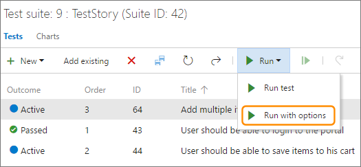
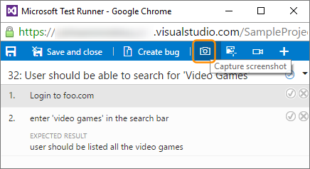
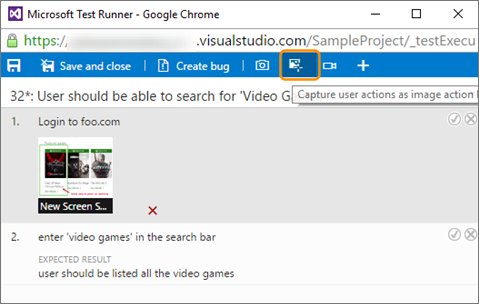
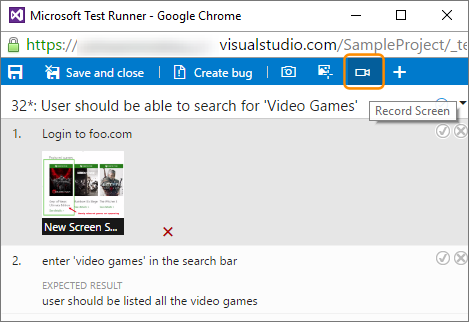

# Run manual tests

[!INCLUDE [version-header-ts-tfs15](../../_shared/version-header-ts-tfs15.md)] 

Run your manual tests and record the test results for each test step 
using Microsoft Test Runner. If you find an issue when testing, 
use Test Runner to create a bug. Test steps, screenshots, and comments 
are automatically included in the bug. 

* [Run tests for web apps](#run-web)
* [Run tests for desktop apps](#run-desktop)

You just need [Basic access](https://www.visualstudio.com/team-services/compare-features/) 
to run tests that have been assigned to you with Visual Studio Team Services. 
Learn more about the
[access](https://www.visualstudio.com/pricing/visual-studio-online-pricing-vs) 
that you need for more advanced testing features.

[Can I run tests offline and then import the results?](#runoffline)

## Run tests for web apps

1. If you haven't already, [create your manual tests](create-test-cases.md#test-cases).

1. Select a test from a test suite and run it.
      
   

   Microsoft Test Runner opens and runs in a new browser.

1. Start the app that you want to test. Your app doesn't have to run on 
   the same computer as Test Runner. You just use Test Runner to record which 
   test steps pass or fail while you manually run a test. For example, you 
   might run Test Runner on a desktop computer and run your Windows 8 store 
   app that you are testing on a Windows 8 tablet.

   

1. Mark each test step as either passed or failed based on the expected results. 
   If a test step fails, you can enter a comment on why it failed.

   

1. Create a bug to describe what failed.

   

   The steps and your comments are automatically added to the bug. Also, 
   the test case is linked to the bug.

   If Test Runner is running in a web browser window, 
   you can copy a screenshot from the clipboard directly into the bug.

1. You can see any bugs that you have reported during your test session.

   

1. When you've run all your tests, save the results and close Test Runner. 
   All the test results are stored in Visual Studio Team Services.
   [How do I resume testing, or run one or more tests again?](#qanda)

1. View the testing status for your test suite.
   You see the most recent results for each test.

   

1. Open a test and choose the test case in the **Related Work** section.
   Then use the **Child** links in the **Related Work** section of that 
   work item to view the bugs filed by the tester.
   
     

## Run tests for desktop apps

If the only data you want to collect from your desktop app
is screen recordings, use the web-based Microsoft Test Runner 
in the same way as [described above](#run-web) for web apps.

However, if you want to collect more types of data, run your tests using
[Microsoft Test Manager client](../mtm/run-manual-tests-with-microsoft-test-manager.md).

1. Launch the test runner 
   client from the **Test** hub by choosing **Run with options**
   from the **Run** menu.

   

1. In the **Run with options** dialog, select **Microsoft 
   Test Runner 2017 or later**, choose the data collectors you 
   want to enable, and optionally select a build to associate 
   with your test run.

   

1. Choose **OK** to start testing. 

For more information, see
[Collect diagnostic data](../collect-diagnostic-data.md#collect-desktop).

## Try this next

* [View your test progress with lightweight charts](track-test-status.md)
* [Control how long to keep test results](how-long-to-keep-test-results.md)

## Q&A

<!-- BEGINSECTION class="md-qanda" -->

#### Q:  How do I rerun a test?

A:  Just select any test and choose **Run**.

#### Q:  Can I run all the tests in a test suite together?

A:  Yes, select a test suite and choose **Run**. This runs all the active 
tests in the test suite. If you haven't run a test yet, its state 
is active. You can reset the state of a test to active if you want to rerun it.  

#### Q: Can I choose a build to run tests against?

A: Yes, Choose **Run** and then select **Run with options**.

 

Select the build you want from the drop-down list.

 

Any bug filed during the run will automatically be associated 
with the selected build, and the test outcome will be published
against that build.

#### Q: Can I fix my test steps while I'm running a test?

A:  Yes, if you have the Test Manager for Visual Studio Team Services. 
You can insert, move, or delete steps. 
Or you can edit the text itself. Use the edit icon next to the test 
step number to do this.
    
 

The tool to edit the test steps is shown.
    
 

#### Q: Can I add a screenshot to the test results when I am running a test?

A: If you are using Google Chrome, you can use 
the web runner to take screenshots of the web 
app while testing. 

 

For more information, see [Collect diagnostic data](../collect-diagnostic-data.md#web-screenshot).

#### Q: Can I capture my actions on the app as a log? 
A: If you are using Google Chrome, you can use 
the web runner capture your actions on the web 
app as image logs while testing.
 
 

For more information, see [Collect diagnostic data](../collect-diagnostic-data.md#web-log).

#### Q: Can I capture screen recordings of my app?
A: If you are using Google Chrome, you can use 
the web runner to capture screen recordings of 
your web and desktop apps while testing. 

 

For more information, see [Collect diagnostic data](../collect-diagnostic-data.md#web-recording).

#### Q:  How do I control how long I keep my test data?

A:  [Learn more here](how-long-to-keep-test-results.md).

#### Q: Can I run tests offline and then import the results?

A: Yes, see the [Offline Test Execution extension](https://marketplace.visualstudio.com/items?itemName=ms-devlabs.OfflineTestExecution).

<!-- ENDSECTION --> 

[!INCLUDE [help-and-support-footer](../../_shared/help-and-support-footer.md)] 
