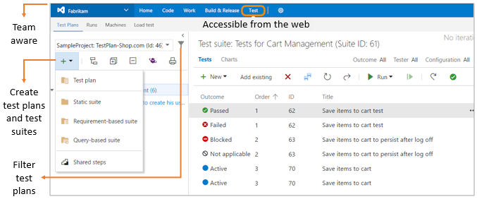
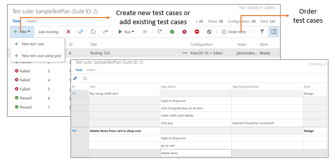
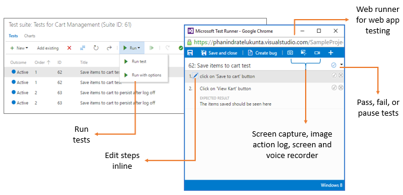
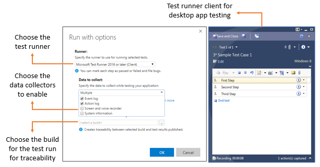
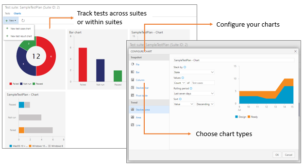
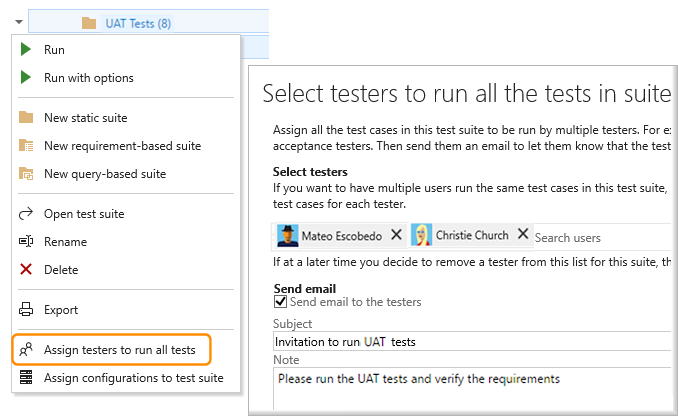

# Manual and exploratory testing scenarios and capabilities
 
[!INCLUDE [version-header-vs-ts-tfs](../_shared/version-header-vs-ts-tfs.md)] 

Quality is a vital aspect of software systems, and manual testing 
and exploratory testing continue to be an important techniques for maximizing this.
In today's software development processes,
everybody in the team owns quality - including developers, managers, 
product owners, user experience advocates, and more.

Team Services and Team Foundation Server provide rich and powerful
tools everyone in the team can use to drive quality and collaboration
throughout the development process. The easy-to-use, browser-based 
test management solution provides all the capabilities required for 
planned manual testing, user acceptance testing, exploratory testing,
and gathering feedback from stakeholders.

* **[Planned manual testing](#manual-testing)**. Manual testing by organizing tests into test plans and test suites by designated testers and test leads.

* **[User acceptance testing](#user-acceptance)**. Testing carried out by designated user acceptance testers to verify the value delivered meets customer requirements, while reusing the test artifacts created by engineering teams. 

* **[Exploratory testing](#exploratory-testing)**. Testing carried out by development teams, including developers, testers, UX teams, product owners and more, by exploring the software systems without using test plans or test suites. 

* **[Stakeholder feedback](#stakeholder-feedback)**. Testing carried out by stakeholders outside the development team, such as users from marketing and sales divisions.  

  
&nbsp; &nbsp; **Holistic approach to manual testing, types of manual testing, and personas involved**

>You must install the [Test Manager extension](https://marketplace.visualstudio.com/items?itemName=ms.vss-testmanager-web)
to use the advanced features of the Test hub.

## Planned manual testing

Manual testing has evolved with the software development process
into a more agile-based approach. Team Services and Team Foundation
Server integrate manual testing into your agile processes; the team
can begin manual testing right from their Kanban boards in the Work
hub. Teams that need more advanced capabilities can use the Test
hub for all their test management needs.

### Manual testing from the Kanban board

Get started with manual testing easily using the Kanban board in 
the Work hub. Add, view, and interact with test cases directly
from the cards on the Kanban board, and then progressively monitor
status directly from the card. Developers and testers can use these
rich capabilities to simplify maximizing quality within their teams.
In Team Services, you need just [Basic access](../../setup-admin/team-services/buy-basic-access-add-team-services-users.md)
to use these features. See more at [Add, run, and update inline tests](../../work/kanban/add-run-update-tests.md).

### Manual testing in the Test hub

The Test hub in Team Services and Team Foundation Server provides
a rich test management solution for teams that need advanced manual
testing capabilities. The Test hub includes all the capabilities
required for the testing lifecycle - including test planning, authoring,
execution, and tracking. Get started using the advanced manual 
testing features with the
[Test Manager extension](https://marketplace.visualstudio.com/items?itemName=ms.vss-testmanager-web).

#### Test planning

Create and manage test plans and test suites for your teams with ease.
Create static suites, requirement-based suites, or query-based suites.
Export and share the test plans and test suites with your team.
See more at [Create test plans](getting-started/create-a-test-plan.md)

#### Test authoring

Create multiple test cases in one operation, or easily add existing
test cases to a test suite. Assign single or multiple testers to 
execute the tests. View test results and references to a test case
across test suites. See more at [Create test cases](getting-started/create-test-cases.md).

#### Testing web applications

The Test hub provides a browser-based test runner to run tests for your 
web apps. Mark test steps and test outcomes as pass or fail, and collect
diagnostic data such as system information, image action logs, 
screen recordings, and screen captures as you test. Bugs filed
during the tests automatically include all the captured diagnostic data
to help your developers reproduce the issues. 
See more at [Run tests for web apps](getting-started/run-manual-tests.md#run-web).

#### Testing desktop apps

Test your desktop apps with Microsoft Test Runner client, which is part
of Microsoft Test Manager. Use the Test Runner client to collect all the
basic diagnostic data such as system information, image action logs,
screen recordings, screen captures, and event logs as you test. 
In addition, use Microsoft Test Manager to collect advanced diagnostic
data such as code coverage, IntelliTrace traces, and test impact data.
See more at [Run tests for desktop apps](getting-started/run-manual-tests.md#run-desktop).

#### Test tracking

Quickly configure lightweight charts to track your manual test results
using the chart types of your choice, and pin the charts to your dashboard to
easily analyze these results. Choose a retention policy to control how
long your manual testing results are retained.
See more at [Track test status](getting-started/track-test-status.md).

## User acceptance testing

User acceptance testing (UAT) is a key factor in software development
that ensures the value requested by customers is being delivered
by the engineering team. Team Services and Team Foundation Server
include capabilities and tools to manage user acceptance testing.
Quickly create UAT plans and suites, and invite multiple testers to
execute these tests using test artifacts provided by the engineering team.
Easily monitor UAT progress and results using lightweight charts.
See more at [User acceptance testing](getting-started/user-acceptance-testing.md).

## Exploratory testing for everyone

Maximizing quality in modern software development processes is a
shared responsibility between developers, managers, product owners,
user experience teams, and more. Collaborative testing processes and
tools are the key factors in driving quality in these scenarios.
Team Services and Team Foundation Server provide a lightweight, 
browser-based extension called the Test &amp; Feedback extension,
which enables everyone to contribute to the quality of your web apps.
See more at [Exploratory test and submit feedback directly from your browser](getting-started/perform-exploratory-tests.md).

## Stakeholder feedback

Seeking feedback from stakeholders outside the development team, such
as marketing and sales teams, is vital to develop good quality software.
Using Team Services and Team Foundation Server, developers can request
feedback on their user stories and features. Stakeholders can respond
to feedback requests using the browser-based Test &amp; Feedback extension -
not just to rate and send comments, but also by capturing rich diagnostic
data and filing bugs and tasks directly.
See more at [Request stakeholder feedback](stakeholder/request-stakeholder-feedback.md) 
and [Provide stakeholder feedback](stakeholder/provide-stakeholder-feedback.md).

## Key benefits

* **Test on any platform**. With the Test hub in Team Services and Team Foundation Server, you can use your browser to access all the manual testing capabilities. The Test hub enables you to [create](getting-started/create-test-cases.md) and [run manual tests](getting-started/run-manual-tests.md) through an easy-to-use, web-based interface that can be accessed from all major browsers on any platform.

* **Rich Diagnostic data collection**. Using the web-based Test Runner and Test Runner client you can [collect rich diagnostic data](collect-diagnostic-data.md) during your tests. This includes screenshots, an image action log, screen recordings, code coverage, IntelliTrace traces, and test impact data for your apps under test. This data is automatically included in all the bugs you create during test, making it easy for developers to reproduce the issues.

* **End to End Traceability**. Team Services and Team Foundation Server provide [end-to-end traceability of your requirements, builds, tests and bugs](../../work/track/link-work-items-support-traceability.md). Users can track their requirement quality from cards on the Kanban board. Bugs created while testing are automatically linked to the requirements and builds being tested, which helps you track the quality of the requirements or builds.

* **Extensible platform**. You can combine the tools and technologies you already know with the development tools that work best for you to integrate with and [extend Team Services and Team Foundation Server](../../../integrate/get-started/overview.md). Use the [REST APIs](../../../integrate/get-started/rest/basics.md) and [contribution model](../../../integrate/extensions/develop/contributions-overview.md) available for the Test platform to create extensions that provide the experience you need for your test management lifecycle.

## Additional resources

* [Get started with manual testing](../../work/kanban/add-run-update-tests.md)
* [Advanced manual testing techniques](getting-started/user-acceptance-testing.md)
* [Get started with exploratory testing](getting-started/perform-exploratory-tests.md)
* [Advanced exploratory testing techniques](explore-workitems-exploratory-testing.md)
* [Manual testing with Microsoft Test Manager](mtm/exploratory-testing-using-microsoft-test-manager.md)
* [Guidance for MTM usage](mtm/guidance-mtm-usage.md) 
* [Get stakeholder feedback with exploratory testing](stakeholder/request-stakeholder-feedback.md)

[!INCLUDE [help-and-support-footer](../_shared/help-and-support-footer.md)] 
