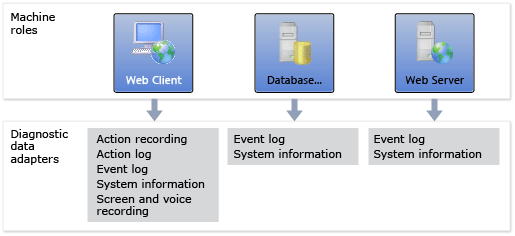
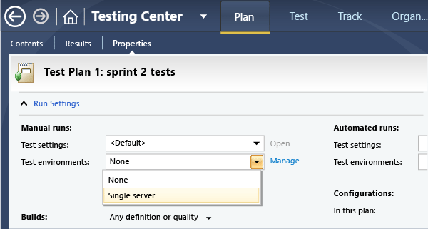
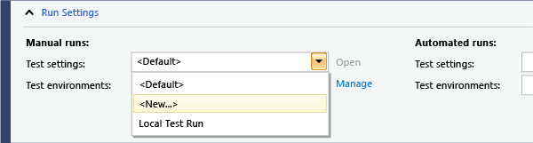
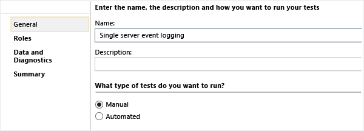
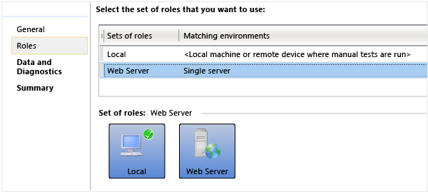
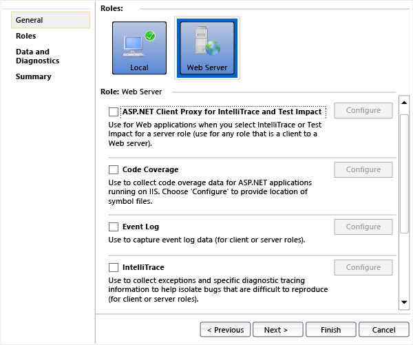
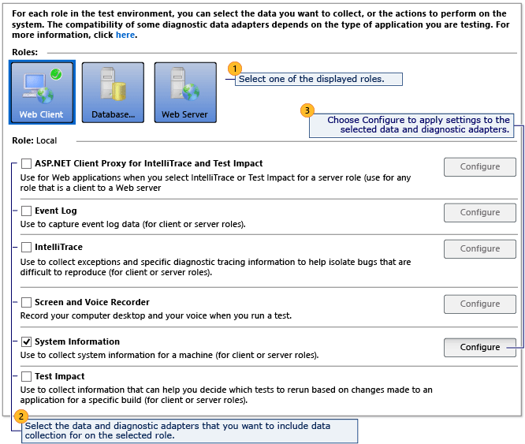

# Collect more diagnostic data in manual tests

[!INCLUDE [version-inc-vs](../_shared/version-inc-vs.md)]

>[!NOTE]
>[!INCLUDE [mtm-deprecate-message](../_shared/mtm-deprecate-message.md)]

**For Azure DevOps and TFS, see [Collect diagnostic data while testing](../collect-diagnostic-data.md).**

While you are testing your application, Microsoft Test Manager can collect data that will help diagnose any fault that you might find. If you create a bug report while you're testing, the data is automatically attached to the bug work item.  
  
  
  
You can decide what kinds of data you want to collect.  

[!INCLUDE [feature-availability](../_shared/feature-availability.md)] 
  
## What diagnostic data can I collect in a test?

The diagnostic data is collected in the test results. It will be added to a bug if you create one while performing the test.  
  
|Data you can collect|How|  
|--------------------------|---------|  
|-   Link to the test case. -   The steps you marked as passed or failed. -   Any comments or attachments that you added.|[Run tests in the web portal.](../run-manual-tests.md)|  
|+   -   Operating system version and other system information. -   Your keystrokes and gestures. -   Screenshots, recorded automatically while you work.|[Run tests with Microsoft Test Manager](run-manual-tests-with-microsoft-test-manager.md).   (Use default test settings.)   Microsoft Test Manager has to be installed on the machine where you run the tests, or on a machine connected to a device where the test runs.|  
|+   Data collected from your client or desktop application:   -   Event logs -   IntelliTrace -   Video recording of the desktop -   Test impact analysis. This allows you to choose tests based on changes since a previous build.|Use [test settings](#testSettings) when you perform the tests with Microsoft Test Manager.   Test settings files configure diagnostic data adapters. You can choose a test settings file when you run tests, or you can set a default test settings file for your test plan.|  
|+   Data collected from your server software:   1. Event logs. 2.  IntelliTrace 3.  Test impact 4.  Virtual machine snapshots of the servers, if you are using an SCVMM lab environment|Use [test settings](#testSettings) to define the data you want to collect.|  
  

## How do I create test settings?

You need test settings only if you want to collect more data than the default. The default setting collects basic system information from each lab machine and your keystrokes and gestures from the local machine.  
  
1. If the application you are testing is a website or has a server component, and you want to collect data from the servers:  
  
   - Create a lab environment. It can be a standard environment or an SCVMM environment.  
  
   - In the Properties of your test plan, set the test environment you want to use for manual tests.  
  
     
  
1. Choose an existing test settings file, or create a new one.  
  
     
  
   This sets the default selection for performing tests in this test plan. You can override the selection when you perform individual test runs.  
  
1. Give the test settings file a name.  
  
     
  
1. Choose the lab environment you want to use for your tests. If you aren't using a lab environment, choose Local.  
  
     
  
   Each test settings file matches one set of machine roles.  
  
1. For each machine role, choose the data you want to collect from that machine.  
  
     
  
   The Local role is the client machine on which you'll perform the tests.  
  

## What are the diagnostic data options?

On the Data and Diagnostics page you can add and configure diagnostic adapters to collect data for each machine role in your lab environment. In most cases the diagnostic data is included with the test results.  
  
  
  
|Diagnostic data adapter|Configuration|  
|-----------------------------|-------------------|  
|**Action Log**: Allows you to record the actions you perform during your test, so that you can play them back rapidly on a subsequent occasion. The actions are also recorded as text descriptions in any bug report that you create.|[Record and play back manual tests](record-play-back-manual-tests.md).   Not all gestures and applications are recorded.|  
|**ASP.NET Client Proxy for IntelliTrace and Test Impact**|Select this adapter in a web client role. It is required if you are testing an ASP.NET application, and you want to collect **Test Impact** or **Intellisense** data on the web server role.|  
|**Event log**   Collects events that your application wrote to the event logs.|Choose **Configure** to select the types of events you want.   Your application has to write events using **WriteEntry**.  
|**IntelliTrace**: Generates an .itrace file that is linked to any bug that you create. From this IntelliTrace file, the local session can be simulated on another computer.|[Using IntelliTrace](/visualstudio/debugger/walkthrough-using-intellitrace).|  
|**System information**: Records information about the machine.|No additional configuration.|  
|**Test impact**: Enables the **Recommended Tests** feature in Testing Center, Track. This determines which tests are affected by the changes since a previous build, based on code coverage.|If you are testing an ASP.NET application:   1. On the role where the IIS server will run, enable **Test Impact** and then choose **Configure**, **Advanced**, **ASP.NET**. 2.  In the web client role, enable **ASP.NET Client Proxy for IntelliTrace and Test Impact**   Restart your server application after enabling this option.|  
|**Video Recorder** records the desktop in real time while you work.|To record audio, choose **Configure**.|
  
[!INCLUDE [help-and-support-footer](../_shared/help-and-support-footer.md)] 
