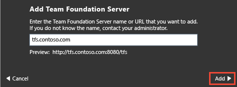
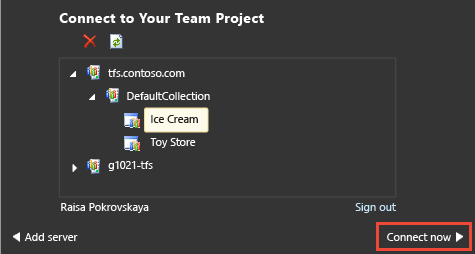
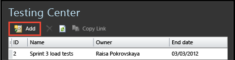
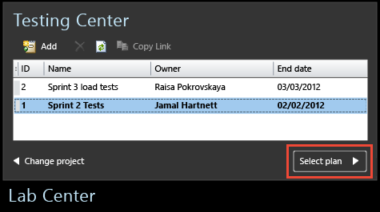

# Connect Microsoft Test Manager to your project and test plan

[!INCLUDE [version-inc-vs](../_shared/version-inc-vs.md)]

>[!NOTE]
>[!INCLUDE [mtm-deprecate-message](../_shared/mtm-deprecate-message.md)]

Use Microsoft Test Manager to help you test the application you built. Microsoft Test Manager stores your test plans and results in Azure DevOps or Team Foundation Server (TFS).  

[!INCLUDE [feature-availability](../_shared/feature-availability.md)] 
  
### Connect Microsoft Test Manager to your project and test plan  
  
1. If you don't have Microsoft Test Manager, download and install [Visual Studio Enterprise](https://visualstudio.microsoft.com/downloads/) or [Visual Studio Test Professional](https://visualstudio.microsoft.com/vs/test-professional/).  
  
   Don't have a project? [Set up a project](../../organizations/projects/create-project.md)  
  
1. Connect to your Azure DevOps or TFS instance and choose your project.  
  
     
  
    
   
   If you don't see your project, choose **Add server** and enter the URL of your Azure DevOps or TFS server. 
  
1. Create a new test plan, unless there's already a plan you want to use. Typically, you create a separate test plan for each sprint.  
  
     
  
1. Select a plan.  
  
     
  
If you want to connect to a different project or test plan later, choose **Home**.   
  
Signed in with the wrong user name? Choose **Home**&nbsp; , **Change project**, **Sign out**.  
  
## Try this next 
 
[Exploratory testing](exploratory-testing-using-microsoft-test-manager.md)  
  
[Plan manual tests with Microsoft Test Manager](plan-manual-tests-with-microsoft-test-manager.md)

[!INCLUDE [help-and-support-footer](../_shared/help-and-support-footer.md)] 
