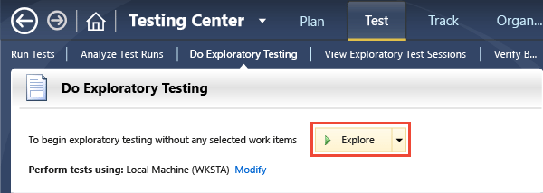
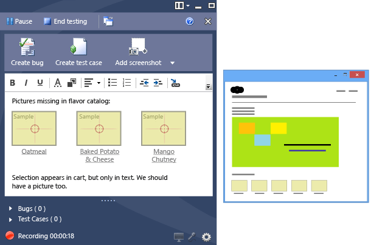
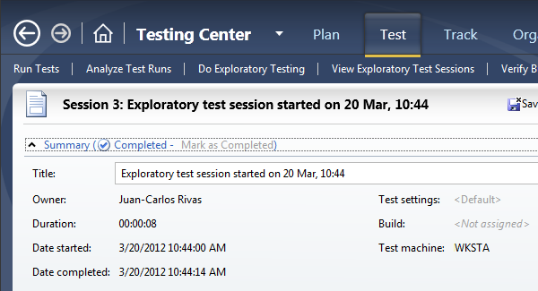

# Exploratory testing using Microsoft Test Manager

[!INCLUDE [version-inc-vs](../_shared/version-inc-vs.md)]

>[!NOTE]
>[!INCLUDE [mtm-deprecate-message](../_shared/mtm-deprecate-message.md)]

**For Azure DevOps and TFS, see [Exploratory testing with the Test &amp; Feedback extension](../connected-mode-exploratory-testing.md).**

While you work with your application, Microsoft Test Manager can record your actions, comments, screenshots and other data. The recording makes it easy to reproduce bugs. And you can quickly play back your tests whenever the application is updated.  

[!INCLUDE [feature-availability](../_shared/feature-availability.md)] 
  
## Explore your app  
  
1. Install [the latest build of your application](../../pipelines/index.md). If it's a desktop application, install it on a machine that has Microsoft Test Manager. If it's a server, you can install it on any other machine, but you'll want to run the browser or client on the same machine where you have Microsoft Test Manager.  
  
1. [Connect Microsoft Test Manager to your test plan](connect-microsoft-test-manager-to-your-team-project-and-test-plan.md) if you haven't already. The test plan stores default settings and test results.  
  
1. Start an exploratory test session in Microsoft Test Manager.  
  
     
  
   Test Runner appears at the side of the screen. It will stay there while you work with your application.  
  
1. Get your app ready to start testing. For example, if it's a website, start the server.  
  
1. When you're ready, start recording.  
  
     
  
1. While you work with the application, add comments and screenshots in the Test Runner window.  
  
     
  
   Double-click a screenshot if you want to edit it.  
  
1. Create a bug if you find a problem. The bug will automatically include a list of your actions and comments.  
  
     
  
1. Create a test case.  
  
   Why? When the application is updated, you'll want to run the test again to make sure everything is still working. With the list of your actions, it's easy for you or someone else to repeat the same test.  
 
     
  
   You'll probably want to use **Change Steps** to set how many recent actions are included.  
  
1. Pause  the recording if you need to attend to something else. You don't want your emails or passwords included in the recording.  
  
1. Complete your test.  
  
     
  
   Give your test run a title that expresses the result, such as "Failed to open account" or "Successfully created an order."  
  
1. Review the exploratory tests in this plan to see how well the sprint is progressing.  
  
     
  
## Enable screen recording during testing  

1. In your test settings, open **Plan**, **Properties**, and - under **Manual runs** - choose **Test settings** = **&lt;New&gt;**.

2. In the test settings wizard, give the new settings a name.

3. On the **Data and Diagnostics** page, scroll down and select **Screen and Voice recorder**.

4. Choose **Configure** if you want to record your voice along with the screen.  
  
5. Close the test settings and **Save and Close** the test plan properties.

When you start a test, a real-time screen recording will be added.  
If you want to run tests without real-time recording, go back to the test plan properties and set **Test Settings = &lt;Default&gt;**.  
  
## Try this next  
  
[Plan manual tests with Microsoft Test Manager](plan-manual-tests-with-microsoft-test-manager.md)  
  
[Collect more diagnostic data](collect-more-diagnostic-data-in-manual-tests.md)  
  
[!INCLUDE [help-and-support-footer](../_shared/help-and-support-footer.md)] 
